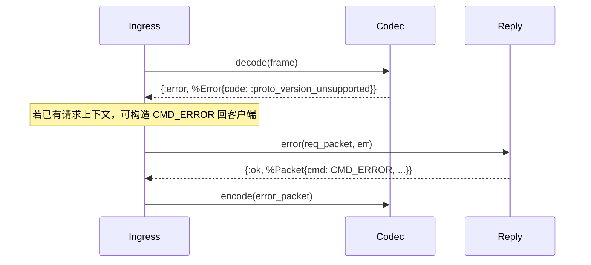

# Design: Phase 1 协议适配层

| 项 | 内容 |
| --- | --- |
| Spec | `phase-1-protocol-adapter` |
| 对应 requirements | [requirements.md](./requirements.md) |
| 代码落位 | `apps/elixir/im/lib/im/protocol/` |

---

## Overview

在已有 P0 骨架与 `Pb.Im.Protocol.*` 生成物之上，实现无 IO 的协议适配层。入口为二进制帧 / `Packet` 结构；出口为二进制帧或构造好的响应/推送 `Packet`。错误统一为 `%IM.Domain.Error{}`，由 `Reply.error/2` 译为 `CMD_ERROR` + `ErrorBody`。

```text
binary frame
    │
    ▼
IM.Protocol.Codec.decode/1 ──► %Packet{}（ver 校验）
    │
    ▼
IM.Protocol.Router.route/1 ──► Commands.*（本 Phase 可为未注册）
    │
    ▼
IM.Protocol.Reply.ok|error 或 IM.Protocol.Push.build
    │
    ▼
IM.Protocol.Codec.encode/1 ──► binary frame
```

---

## Components

| 模块 | 职责 |
|------|------|
| `IM.Protocol.Codec` | `Packet` 编解码；`ver` 门禁；payload 结构体 ↔ bytes 辅助 |
| `IM.Protocol.Cmd` | `CmdType` 原子 ↔ 数值；未知值不崩溃 |
| `IM.Protocol.ErrorCodes` | 原子错误码 → `Pb.Im.Protocol.ErrorCode` |
| `IM.Protocol.Reply` | 成功响应 / `CMD_ERROR` |
| `IM.Protocol.Push` | 推送信封（`seq=0`） |
| `IM.Protocol.Router` | `cmd` → Command 模块；支持测试注入 handlers |

**禁止**：上述模块调用 `Repo`、Redis、Kafka、`IM.Services.*`。

---

## Public APIs

### Codec

```elixir
@spec decode(binary()) :: {:ok, Packet.t()} | {:error, Error.t()}
@spec encode(Packet.t() | map()) :: {:ok, binary()} | {:error, Error.t()}
@spec encode_payload(struct()) :: {:ok, binary()} | {:error, Error.t()}
@spec decode_payload(Packet.t(), module()) :: {:ok, struct()} | {:error, Error.t()}
```

- 支持版本：`ProtoVersion.PROTO_VERSION_V1`（数值 `1`）
- `compression`：`UNSPECIFIED` / `NONE` 原样保留 payload；本 Phase 不解压 GZIP/LZ4（若出现仍原样保留字节，由上层在启用压缩前拒绝或后续解压）

### Reply

```elixir
@spec ok(Packet.t(), atom() | non_neg_integer(), binary() | struct()) ::
        {:ok, Packet.t()} | {:error, Error.t()}
@spec success(Packet.t(), atom() | non_neg_integer(), binary() | struct()) ::
        {:ok, Packet.t()} | {:error, Error.t()}
@spec error(Packet.t(), Error.t()) :: {:ok, Packet.t()} | {:error, Error.t()}
```

- `success/3` 为 `ok/3` 别名（兼容文档草稿中的命名）
- 成功包：`ver=1`，继承 `seq`/`trace_id`/`cid`，`compression=NONE`
- 失败包：`cmd=CMD_ERROR`，payload 为 `ErrorBody` 编码

### Push

```elixir
@spec build(atom() | non_neg_integer(), binary() | struct(), keyword()) ::
        {:ok, Packet.t()} | {:error, Error.t()}
```

opts：`:trace_id`、`:route_key`、`:cid`、`:ts`（默认 `System.system_time(:millisecond)`）

### Router / Cmd

```elixir
@spec route(non_neg_integer()) :: {:ok, module()} | {:error, Error.t()}
@spec to_atom(non_neg_integer()) :: {:ok, atom()} | {:error, Error.t()}
@spec to_value(atom()) :: {:ok, non_neg_integer()} | {:error, Error.t()}
```

Handlers 来源：`Application.get_env(:im, :protocol_command_handlers, %{})` 与模块内默认表合并（测试可注入）。

### ErrorCodes

```elixir
@spec to_proto(atom()) :: atom()   # e.g. :CODE_UNAUTHORIZED
@spec to_int(atom()) :: non_neg_integer()
```

---

## Error Mapping（摘要）

| 原子 | ErrorCode |
|------|-----------|
| `:unauthorized` | `CODE_UNAUTHORIZED` (1001) |
| `:kicked` | `CODE_KICKED` (1002) |
| `:proto_version_unsupported` | `CODE_PROTO_VERSION_UNSUPPORTED` (1003) |
| `:device_limit_exceeded` | `CODE_DEVICE_LIMIT_EXCEEDED` (1004) |
| `:msg_invalid` | `CODE_MSG_INVALID` (2001) |
| `:unknown_cmd` | `CODE_MSG_INVALID` (2001) |
| `:not_implemented` | `CODE_INTERNAL_ERROR` (9000) |
| 其它未列出 | `CODE_INTERNAL_ERROR` (9000) |

好友/群/室等码在本 Phase 一并映射表落地，供后续直接使用。

---

## Sequence（入站失败：版本不支持）



---

## Testing Strategy

| 文件 | 覆盖 |
|------|------|
| `test/im/protocol/codec_test.exs` | round-trip、坏 ver、损坏帧 |
| `test/im/protocol/reply_test.exs` | seq/trace/cid、ErrorBody ref_cmd/ref_cid |
| `test/im/protocol/push_test.exs` | seq=0、PUSH/PUSH_BATCH |
| `test/im/protocol/router_test.exs` | 注册命中、未注册、Cmd 互转 |
| `test/im/protocol/error_codes_test.exs` | 原子→枚举数值；AuthResp/KickNotify 字段烟雾 |

全部 `async: true`，`ExUnit.Case`（无 DB）。

---

## Risks / Trade-offs

| 点 | 处理 |
|----|------|
| 文档中 `Reply.success/2` vs `ok/3` | Phase 1 定稿为 `ok/3` + `success/3`；Dispatch 返回体在 P2 对齐 |
| 空 Command 表 | 符合「协议层无业务」；P2 逐条注册 |
| GZIP/LZ4 | 不解压；与 DD-034 v1 一致 |
