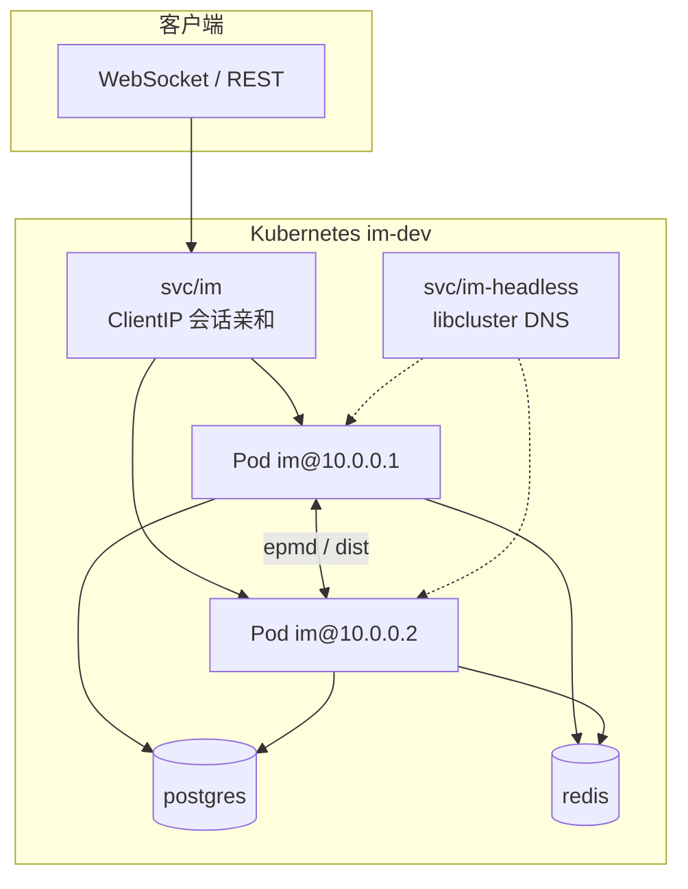

# IM 主服务（Elixir）

Phoenix + OTP 主 IM 服务：WebSocket 二进制协议、REST 双通道、消息持久化、群/室/好友、Kafka 旁路等。

| 项 | 说明 |
| --- | --- |
| Mix 项目 | `apps/elixir/im` |
| 部署产物 | `deploy/elixir/im/`（Dockerfile + K8s） |
| 代码布局 | [project-structure.md](../../../docs/implementation/elixir/project-structure.md) |
| 功能对照 | [module-map.md](../../../docs/module-map.md) |
| 进度 | [PROGRESS.md](../../../docs/implementation/elixir/PROGRESS.md) |
| Kiro Spec | [specs-index.md](../../../docs/specs-index.md)（Phase 1–12） |

---

## 前置条件

- [mise](https://mise.jdx.dev/)（锁定 Erlang 28 / Elixir 1.19）
- PostgreSQL、Redis（本地推荐 OrbStack K8s 依赖栈）
- 仓库根目录执行 `mise install`

---

## 启动

### 本地开发（快速调试）

> 功能验收须走 **Release + K8s**（见下）；`mix phx.server` 仅用于开发。

```bash
# 终端 A：依赖栈 + Postgres 转发
mise run k8s-up
mise run pg-forward          # 常驻，Postgres → localhost:15432

# 终端 B：迁移 + 开发服务器
mise run im:setup            # deps + ecto.create + ecto.migrate（首次）
mise run im:server           # http://localhost:4000  /ws
```

常用命令：

| 命令 | 说明 |
| --- | --- |
| `mise run im:compile` | 编译 |
| `mise run im:test` | ExUnit（自动解析 PGPORT） |
| `mise run im:release` | 本地打 Release 包（`MIX_ENV=prod`） |

### Release + K8s 单副本（与线上一致，推荐日常验收）

```bash
mise run release-deploy      # docker build + overlays/local
mise run k8s-port-forward    # 另开终端 → localhost:4000
mise run release-smoke       # /health/live + /health/ready
mise run im:test-smoke       # 进程内 messaging + auth
```

### Release + K8s 集群模式（多副本）

见下文 **[集群模式部署](#集群模式部署)**，或一键：

```bash
mise run release-deploy-cluster
```

---

## 配置

配置分 **编译期**（`config/config.exs`、`config/dev.exs`、`config/test.exs`）与 **运行时**（`config/runtime.exs`，Release 唯一可读环境变量）。

### 开发环境

| 来源 | 典型项 |
| --- | --- |
| `config/dev.exs` | 本地 Repo 连接（可被 `PGHOST`/`PGPORT` 覆盖） |
| `config/config.exs` | token TTL、心跳间隔、WFQ、Hook、Event Bus 默认值 |

本地 Postgres 端口：`mise run pg-forward` 后 **`15432`**（`mise run test` 会自动选用）。

### 生产 / Release 环境变量

**必填**（缺失则启动失败）：

| 变量 | 说明 |
| --- | --- |
| `DATABASE_URL` | PostgreSQL 连接串 |
| `SECRET_KEY_BASE` | Phoenix 密钥 |
| `PHX_HOST` | 对外主机名（WS URL、链接生成） |
| `PHX_SERVER` | `true` 时监听 HTTP（Release 必设） |

**强烈建议**：

| 变量 | 说明 |
| --- | --- |
| `REDIS_URL` | 多副本 **必须**；序列号、未读、缓存 |
| `RELEASE_COOKIE` | 分布式 Erlang（多节点） |
| `POOL_SIZE` | Ecto 连接池（默认 10） |

**集群与旁路（按需）**：

| 变量 | 说明 |
| --- | --- |
| `CLUSTER_STRATEGY` | `kubernetes` / `epmd`；空=单节点 |
| `CLUSTER_SERVICE` | headless Service 名（默认 `im-headless`） |
| `IM_NODE_ROLE` | `access` / `message` 等 |
| `EVENT_BUS_ENABLED` | `true` 启用 Kafka 旁路 |
| `KAFKA_BROKERS` | 如 `kafka:9092,redpanda:9092` |
| `EVENT_BUS_PRODUCER` | `brod`（生产）/ `memory`（测试） |
| `UNREAD_FLUSH_AUTO` | `true` 注册未读刷库 Cron |
| `TTL_PURGE_AUTO` | `true` 注册消息 TTL 清理 Cron |

K8s 示例见 [`deploy/elixir/im/k8s/im/configmap.yaml`](../../../deploy/elixir/im/k8s/im/configmap.yaml) 与 [`secret.yaml`](../../../deploy/elixir/im/k8s/im/secret.yaml)。

完整说明：[release-deploy-test.md §环境变量](../../../docs/implementation/elixir/release-deploy-test.md)、[deploy-guide.md §6–§7](../../../docs/implementation/elixir/deploy-guide.md)。

---

## 集群模式部署

IM 集群 = **多个 IM Pod（BEAM 节点）** + **libcluster 节点发现** + **共享 PostgreSQL / Redis**。  
单聊/群聊跨节点扇出依赖 `Phoenix.Tracker`（`UserTracker`）与 `IM.Cluster.Router`（`route_key` 分片）。

### 单副本 vs 集群

| 项 | `overlays/local`（单副本） | `overlays/cluster`（集群） |
| --- | --- | --- |
| IM 副本数 | 1 | 2（HPA 2–6） |
| libcluster | 关闭（`CLUSTER_STRATEGY` 空） | `kubernetes` + `im-headless` DNS |
| `RELEASE_NODE` | 固定 `im@127.0.0.1` | **每 Pod** `im@<POD_IP>` |
| `REDIS_URL` | 建议 | **必须**（序列号、未读、跨节点缓存） |
| `RELEASE_COOKIE` | 建议 | **必须**（所有 Pod 相同） |
| PDB / HPA | 无 | `minAvailable: 1`、CPU 70% 扩缩 |
| 适用 | 日常开发、功能冒烟 | 多节点联调、生产、扇出/滚动发布验收 |



### 前置条件

1. **Redis 已部署且可达**（`REDIS_URL` 写入 ConfigMap；多副本无 Redis 会导致发号/未读不一致）
2. **Secret `im-runtime`** 中所有 IM Pod 共用同一 `RELEASE_COOKIE`
3. 镜像已构建（与单副本相同 Dockerfile）
4. 本地 OrbStack / 生产 K8s 均可；namespace 默认 `im-dev`

### 一键部署（推荐）

```bash
# 构建镜像 + 应用 cluster overlay + 等待 rollout
mise run release-deploy-cluster

# 另开终端
mise run k8s-port-forward
mise run release-smoke
```

等价于：

```bash
mise run release-build
IM_K8S_OVERLAY=deploy/elixir/im/k8s/overlays/cluster \
  ./deploy/elixir/im/scripts/release-deploy-local.sh
```

### 手动分步部署

```bash
# 1) 依赖栈（若尚未 apply）
kubectl apply -k deploy/elixir/im/k8s/base/

# 2) 构建 Release 镜像
docker build -f deploy/elixir/im/Dockerfile -t im:local .

# 3) 集群 overlay（= local 全栈 + 多副本补丁 + PDB + HPA）
kubectl apply -k deploy/elixir/im/k8s/overlays/cluster/

# 4) 等待就绪
kubectl -n im-dev rollout status statefulset/redis --timeout=120s
kubectl -n im-dev rollout status statefulset/postgres --timeout=180s
kubectl -n im-dev rollout status deployment/im --timeout=300s

# 5) 迁移（只需一次，任选一 Pod）
kubectl -n im-dev exec deployment/im -- /app/bin/migrate
```

`overlays/cluster` 在 `local` 基础上额外应用：

| 补丁文件 | 作用 |
| --- | --- |
| `deployment-replicas.yaml` | `replicas: 2` |
| `configmap-cluster.yaml` | `RELEASE_NODE_MODE=pod_ip`、`CLUSTER_STRATEGY=kubernetes` |
| `pdb.yaml` | 滚动/驱逐时至少 1 Pod 可用 |
| `hpa.yaml` | CPU 70% 时 2→6 副本 |

### 集群专用环境变量

由 `configmap-cluster.yaml` 注入（**勿**在多副本下保留 `RELEASE_NODE=im@127.0.0.1`）：

| 变量 | 集群值 | 说明 |
| --- | --- | --- |
| `RELEASE_NODE_MODE` | `pod_ip` | `rel/env.sh.eex` 导出 `RELEASE_NODE=im@$POD_IP` |
| `RELEASE_NODE` | `""` | 清空固定节点名，避免冲突 |
| `CLUSTER_STRATEGY` | `kubernetes` | 启用 libcluster |
| `CLUSTER_SERVICE` | `im-headless` | headless Service 名 |
| `CLUSTER_APP_NAME` | `im` | DNS 查询前缀 |
| `RELEASE_COOKIE` | Secret 注入 | **所有 Pod 必须相同** |
| `REDIS_URL` | ConfigMap | **多副本必须** |

Pod 内还有 Deployment 注入的 `POD_IP` / `POD_NAME`（`fieldRef`），供 `rel/env.sh.eex` 使用。

可选分角色（Phase 9，`IM_NODE_ROLE`）：

| 值 | 含义 |
| --- | --- |
| `all`（默认） | 接入 + 业务同进程 |
| `access` | 偏 WS 接入；可 `forward` 到 message 节点 |
| `message` | 偏 `route_key` 归属的业务处理 |

当前 overlay 默认 `access`；混合角色部署需自建 overlay 为不同 Deployment 设不同 `IM_NODE_ROLE`。

### 验证集群是否正常

```bash
# 1) 两副本 Running，IP 不同
kubectl -n im-dev get pods -l app=im -o wide

# 2) 每 Pod 节点名唯一
kubectl -n im-dev exec deploy/im -- printenv RELEASE_NODE POD_IP RELEASE_NODE_MODE CLUSTER_STRATEGY
# 期望 RELEASE_NODE=im@<pod_ip>，CLUSTER_STRATEGY=kubernetes

# 3) BEAM 已互连（在任一 Pod 内）
kubectl -n im-dev exec deploy/im -- bin/im rpc 'IO.inspect({Node.self(), Node.list()})'
# 期望 Node.list() 含对端，如 [:"im@10.1.2.3"]

# 4) 健康与指标
kubectl -n im-dev port-forward svc/im 4000:4000
curl -sf http://localhost:4000/health/ready
curl -sf http://localhost:4000/metrics | head
```

**协议层跨节点 E2E**（需 Postgres 转发）：

```bash
mise run pg-forward    # 终端 A
cd apps/elixir/im && CLUSTER_E2E=1 PGPORT=15432 mix test.cluster
```

### 扩缩容与滚动更新

```bash
# 手动扩容（HPA 存在时 minReplicas=2）
kubectl -n im-dev scale deployment/im --replicas=3

# 查看 HPA
kubectl -n im-dev get hpa im

# 滚动更新（改镜像 tag 后）
kubectl -n im-dev set image deployment/im im=im:v2
kubectl -n im-dev rollout status deployment/im
```

Deployment 策略：`maxUnavailable: 0`、`maxSurge: 1`，配合 `preStop sleep 5` 与 `terminationGracePeriodSeconds: 60`，尽量不断连。

`svc/im` 配置了 **ClientIP 会话亲和**（3h），减轻 WebSocket 重连后的 Tracker 抖动；客户端仍应支持断线重连。

### 与 Kafka 旁路叠加

集群与 Event Bus 可同时开启：

```bash
# 方式 A：先 cluster，再 patch ConfigMap 开启 Kafka（见 deploy-guide §6）
# 方式 B：基于 kafka-event-bus overlay 自行合并 cluster 补丁
kubectl apply -k deploy/elixir/im/k8s/overlays/kafka-event-bus/
# 再 apply cluster 的 deployment-replicas + configmap-cluster 补丁
```

### 生产注意事项

| 项 | 说明 |
| --- | --- |
| Secret | **勿**使用 `im-dev` 占位 Secret；`DATABASE_URL` / `SECRET_KEY_BASE` / `RELEASE_COOKIE` 走外部 Secret 管理 |
| Redis / PG | 使用托管或高可用集群，与 IM 同 VPC |
| 副本数 | 按连接数与 CPU 压测调整 HPA；Tracker 扇出随副本线性扩展 |
| NetworkPolicy | 清单含 `im/networkpolicy.yaml`，限制 4000/4369 入站 |
| StatefulSet 可选 | 大规模生产可用 StatefulSet + 稳定 DNS 替代 `pod_ip` 模式（见 [k8s/README §分布式 Erlang](../../../deploy/elixir/im/k8s/README.md)） |

### 常见问题

| 现象 | 排查 |
| --- | --- |
| `Node.list()` 为空 | 检查 `CLUSTER_STRATEGY`、`im-headless` Service、`RELEASE_COOKIE` 是否一致 |
| 多副本节点名冲突 | 禁止 `replicas>1` 且 `RELEASE_NODE=im@127.0.0.1`；须用 `overlays/cluster` |
| 发号重复 / 未读错乱 | 确认 `REDIS_URL` 已配置且所有 Pod 可达同一 Redis |
| 滚动更新后客户端大量断连 | 正常；客户端应 AUTH + OFFLINE_PULL 重连；检查 `preStop` 与 grace 是否足够 |
| HPA 与 PDB 冲突 | `minReplicas` 不宜低于 PDB `minAvailable` 可满足的值 |

更细操作：[deploy/elixir/im/k8s/README.md §多副本联调](../../../deploy/elixir/im/k8s/README.md)。

---

## 线上部署

### 镜像构建

```bash
docker build -f deploy/elixir/im/Dockerfile -t im:<tag> .
```

多阶段构建：编译 Release → `debian:trixie-slim` 运行时；入口 `bin/im start`。

### Kubernetes

| Overlay | 用途 |
| --- | --- |
| `deploy/elixir/im/k8s/overlays/local/` | 本地全栈（依赖 + IM **单副本**） |
| `deploy/elixir/im/k8s/overlays/cluster/` | **多副本** + libcluster + PDB + HPA（详见 [集群模式部署](#集群模式部署)） |
| `deploy/elixir/im/k8s/overlays/kafka-event-bus/` | 本地 + Redpanda + Event Bus 开启 |

```bash
# 生产等价流程（替换 tag / overlay）
kubectl apply -k deploy/elixir/im/k8s/overlays/local/
kubectl -n im-dev rollout status deployment/im

# 迁移（Release 内无 mix）
kubectl -n im-dev exec deployment/im -- /app/bin/migrate
```

### 上线检查

- 探针：`GET /health/live`、`GET /health/ready`
- 指标：`GET /metrics`
- 清单：[deploy-guide.md §8](../../../docs/implementation/elixir/deploy-guide.md)
- 操作细节：[deploy/elixir/im/k8s/README.md](../../../deploy/elixir/im/k8s/README.md)

---

## 相关文档

- [文档总索引](../../../docs/README.md)
- [功能模块对照表](../../../docs/module-map.md)
- [**HTTP API 参考（逐接口 + 示例）**](../../../docs/implementation/elixir/http-api-reference.md)
- [Elixir 实现索引](../../../docs/implementation/elixir/)
- [Kiro Spec 索引](../../../docs/specs-index.md)
- [Release 验收路径](../../../docs/implementation/elixir/release-deploy-test.md)
- [协议规范](../../../docs/design/protocol/protocol.md)
- [apps 总览](../../README.md)
