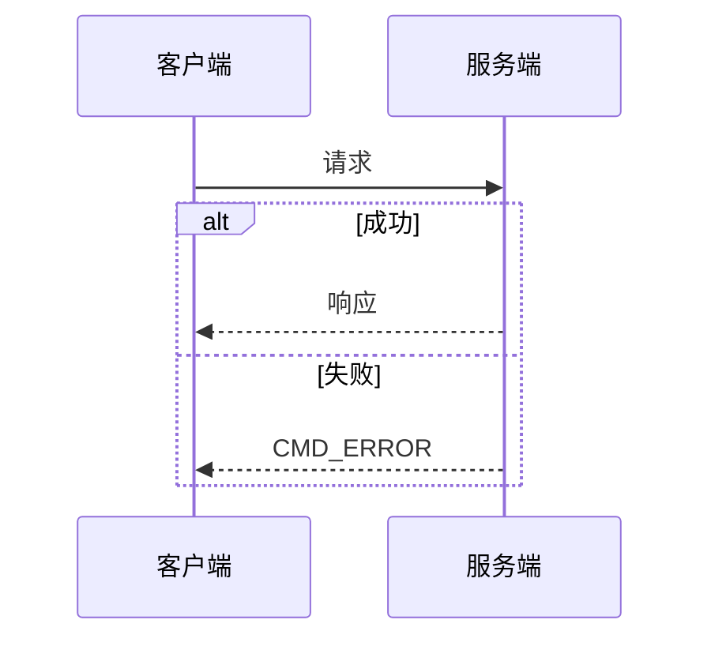

# 设计文档

本目录存放 IM 系统各模块的**设计文档**，记录「为什么这样设计、有什么好处、放弃了什么」。

---

## 文档分类

### 协议设计

| 文档 | 说明 |
|------|------|
| [protocol/protocol.md](protocol/protocol.md) | 完整协议规范：字段约定、命令表、时序、对错行为 |
| [cmd-type.md](cmd-type.md) | 命令字设计意图 |
| [doc-sync-checklist.md](doc-sync-checklist.md) | **文档/协议扇出同步清单**（合入前必跑；历史遗漏复盘） |

### 传输与封包

| 文档 | 说明 |
|------|------|
| [transport.md](transport.md) | 传输与序列化：WebSocket + Protobuf 选型 |
| [packet.md](packet.md) | 通用封包 Packet 设计 |

### 连接管理

| 文档 | 说明 |
|------|------|
| [auth.md](auth.md) | 连接与鉴权设计 |
| [heartbeat.md](heartbeat.md) | 心跳机制设计 |
| [reconnect.md](reconnect.md) | 重连机制设计 |
| [multi-device.md](multi-device.md) | 多端同步设计 |

### 消息收发

| 文档 | 说明 |
|------|------|
| [message-model.md](message-model.md) | 消息模型设计 |
| [message-send-ack.md](message-send-ack.md) | 发消息与 ACK 设计 |
| [read-receipt.md](read-receipt.md) | 已读回执设计 |

### 消息操作

| 文档 | 说明 |
|------|------|
| [recall.md](recall.md) | 撤回消息设计 |
| [edit.md](edit.md) | 编辑消息设计 |
| [burn-after-read.md](burn-after-read.md) | 阅后即焚设计 |
| [stream-message.md](stream-message.md) | 流式消息设计（AI对话等场景） |

### 群组与聊天室

| 文档 | 说明 |
|------|------|
| [friend.md](friend.md) | 好友系统设计 |
| [group.md](group.md) | 群组管理设计 |
| [room.md](room.md) | 聊天室管理设计 |

### 应用通道

| 文档 | 说明 |
|------|------|
| [app-channel.md](app-channel.md) | 业务事件发布/订阅（待评审） |

### 同步与存储

| 文档 | 说明 |
|------|------|
| [offline-pull.md](offline-pull.md) | 离线拉取设计 |
| [unread-count.md](unread-count.md) | 未读数管理设计 |
| [message-context.md](message-context.md) | 消息上下文设计（内部流转） |
| [database/database-design.md](database/database-design.md) | PostgreSQL + Redis 存储设计 |
| [msg-id-snowflake.md](msg-id-snowflake.md) | **`msg_id` Snowflake 发号**（DD-039） |

### 基础设施

| 文档 | 说明 |
|------|------|
| [dependency-abstraction.md](dependency-abstraction.md) | 依赖抽象层设计（Redis/JSON/HTTP 等） |
| [auth-module.md](auth-module.md) | 认证模块架构设计（支持多种认证方式） |
| [observability.md](observability.md) | 可观测性与监控设计（指标、上下行计数、结构化日志） |
| [kafka-event-bus.md](kafka-event-bus.md) | Kafka 五 Topic 事件总线（上行/会话/下行/离线推送/应用通道） |
| [mobile-push.md](mobile-push.md) | 离线设备系统推送（`im.push` → APNs/FCM） |
| [zero-copy-delivery.md](zero-copy-delivery.md) | 热路径少拷贝（预编码扇出、Kafka 透传） |

### 总览

| 文档 | 说明 |
|------|------|
| [architecture-overview.md](architecture-overview.md) | **架构总览（推荐首读）**：整体图、分模块、通俗说明 |
| [system-design.md](system-design.md) | 系统功能清单、详细时序与逐步说明 |
| [modular-architecture.md](modular-architecture.md) | 模块化实现架构（服务端五层） |
| [dual-channel-api.md](dual-channel-api.md) | WebSocket + REST 双通道 API |

### 其他

| 文档 | 说明 |
|------|------|
| [passthrough.md](passthrough.md) | 透传指令设计 |
| [test-client.md](test-client.md) | 自动化测试客户端设计 |
| [web-console.md](web-console.md) | Web 演示控制台（独立前端 SPA，浏览器联调/演示） |

---

## 文档模板

每个设计文档至少包含：

1. **元信息表**（状态、DD 编号、指向 proto / protocol 的链接）
2. **要解决什么问题**
3. **决策是什么**（或「决策摘要」）
4. **完整流程**（**必填**，见下）
5. **为什么这样设计**
6. **有什么好处**（可用表格）
7. **刻意放弃 / 不做的事**（可选但推荐）

### 完整流程（必填）

每个功能文档须有独立章节 **`## 完整流程`**（或 `## N. 完整流程`），用 **Mermaid** 描述端到端路径：

| 要求 | 说明 |
| --- | --- |
| 图表类型 | 客户端参与用 `sequenceDiagram`；服务端内部分支用 `flowchart`；复杂场景可两者并存 |
| 覆盖范围 | 从触发条件 → 主路径成功 → 失败/分支 → 持久化/推送/离线（如适用） |
| 与正文关系 | 决策表写「是什么」；流程图写「怎么跑」；字段细节仍链到 `protocol.md` |
| 维护 | 改协议或行为时 **同步改流程图**；与 [architecture-overview.md](architecture-overview.md) 一并维护 |

示例结构：

```markdown
## 完整流程


```

涉及 **系统级** 变更时，须同步更新 [architecture-overview.md](architecture-overview.md)（见 [agent.md](../../agent.md)）。

