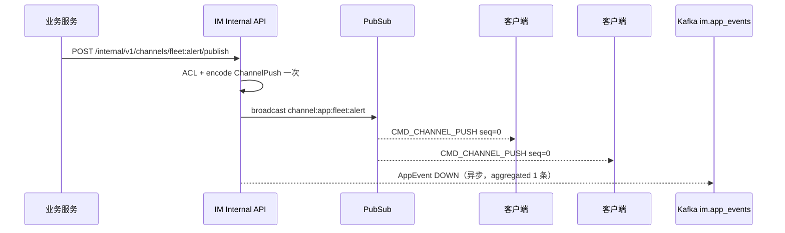
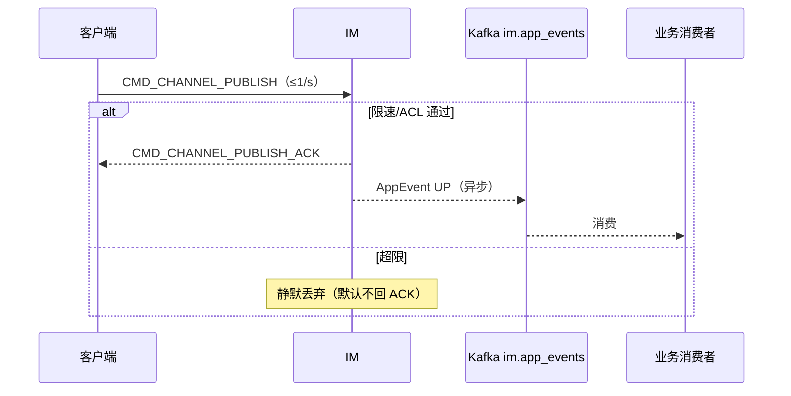
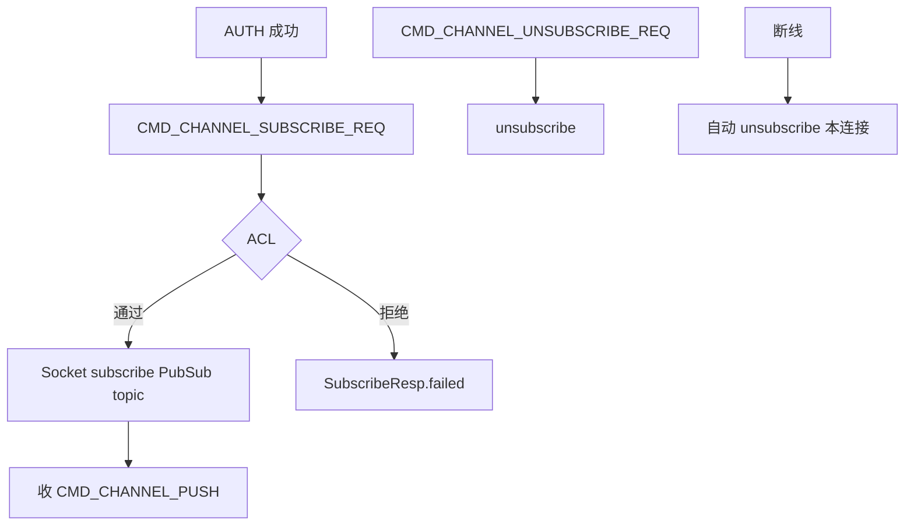
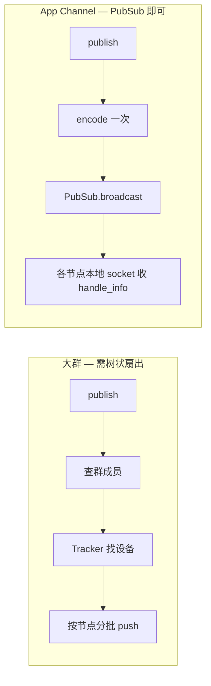

# 设计说明：应用通道（App Channel）

| 项 | 内容 |
|------|------|
| 状态 | **待评审** |
| 决策编号 | DD-035 |
| 规范定义 | [`proto/channel.proto`](../../proto/channel.proto)、[`proto/event.proto`](../../proto/event.proto)（`AppEvent`） |
| 行为约定 | 本文档；[`protocol.md` §27](protocol/protocol.md#27-应用通道app-channel) |
| 索引 | [`design-decisions.md`](../design-decisions.md) |
| 实现文档 | [implementation/elixir/app-channel.md](../implementation/elixir/app-channel.md) |
| 关联 | [kafka-event-bus.md](kafka-event-bus.md)、[room.md](room.md)、[dual-channel-api.md](dual-channel-api.md)、[passthrough.md](passthrough.md) |

---

## 1. 要解决什么问题

业务系统需要：

1. **后端 → 客户端**：向订阅了某类主题的所有在线客户端**广播**业务事件（如订单状态、车队告警）
2. **客户端 → 后端**：客户端上报事件，IM **汇总写入统一 Kafka Topic**，供其它服务消费

与单聊/群聊/聊天室 **不同**：

| 维度 | 聊天 | 应用通道 |
|------|------|----------|
| 语义 | 会话、消息、未读 | 业务 Topic 发布/订阅 |
| QoS | 至少一次、可离线拉取 | **尽力而为、允许丢** |
| UI | 进会话列表 | **不进**会话列表 |
| 谁可下行广播 | 用户发消息 | **仅后端** internal API |
| 谁可上行 | 用户发消息 | **仅客户端** publish（非互广播） |

---

## 2. 已确认产品约束（评审输入）

| # | 约束 |
| --- | --- |
| 1 | 单 Channel 规模约 **10 万**在线订阅 |
| 2 | 单客户端上行 **≤ 1 条/秒**（burst 2） |
| 3 | **允许丢**；**无离线补发** |
| 4 | **仅后端广播** + **客户端上报**（客户端不能向 Channel 内 fan-out） |
| 5 | **不进**聊天会话列表 / `OFFLINE_PULL` |

---

## 3. 决策摘要

| # | 决策 |
| --- | --- |
| 1 | 新增独立能力 **App Channel**，命令字 **900–906**；**不**复用 `ChatMessage` / 聊天室 |
| 2 | Channel ID：`{namespace}:{name}`，租户由连接 `app_key` 隔离；完整键 `channel:{app_key}:{namespace}:{name}` 用于 PubSub |
| 3 | 下行：`POST /internal/v1/channels/{channel_id}/publish` → PubSub → `CMD_CHANNEL_PUSH`（`seq=0`） |
| 4 | 上行：`CMD_CHANNEL_PUBLISH` → 限速/ACL → 异步 `im.app_events`（**不阻塞**）→ `CMD_CHANNEL_PUBLISH_ACK` |
| 5 | Kafka 新增第 5 Topic **`im.app_events`**，与 `im.upstream`（IM 协议镜像）**职责分离** |
| 6 | 无 `CLIENT_RECEIVED`、无 `im.push`、无收件箱持久化 |
| 7 | 复用 Phoenix PubSub 扇出（同聊天室）；单条下行 **预编码一次**（见 [zero-copy-delivery.md](zero-copy-delivery.md)） |

---

## 完整流程

### 下行：后端广播



### 上行：客户端上报



### 订阅生命周期



---

## 4. Channel 标识

| 部分 | 格式 | 示例 |
|------|------|------|
| 业务 ID（API/proto） | `{namespace}:{name}` | `fleet:alert`、`order:status` |
| PubSub topic（内部） | `channel:{app_key}:{namespace}:{name}` | `channel:demo:fleet:alert` |
| `Packet.route_key` | 建议填完整 channel 业务 ID 或 `{namespace}:{name}` | 网关分流 |

**禁止**使用 `conv_id` 或 `g:` / `r:` 前缀；与聊天会话命名空间隔离。

---

## 5. 命令与 REST 对等

| WS Cmd | REST（客户端 `/api/v1`） | 说明 |
|--------|--------------------------|------|
| `CMD_CHANNEL_SUBSCRIBE_REQ` | `PUT /api/v1/channels/subscriptions` | body: channel_ids |
| `CMD_CHANNEL_UNSUBSCRIBE_REQ` | `DELETE /api/v1/channels/subscriptions` | body: channel_ids |
| `CMD_CHANNEL_PUBLISH` | `POST /api/v1/channels/publish` | 客户端上行 |
| — | `POST /internal/v1/channels/{channel_id}/publish` | **仅后端**下行广播 |

WS 与 REST 经 `IM.Application.Dispatch` → `IM.Services.Channel`。

---

## 6. QoS 与丢弃策略

| 场景 | 行为 |
|------|------|
| 客户端离线 | **不**缓存、**不**补发、**不**写 `im.push` |
| 出站队列满 | 丢弃 `CMD_CHANNEL_PUSH`（尽力而为） |
| 上行超 1/s/连接 | **默认静默丢弃**；可选 `CODE_CHANNEL_RATE_LIMITED` |
| Channel 聚合超上限 | 随机丢弃上行，记 `dropped_before_kafka` |
| Kafka 不可用 | IM 主路径仍 ACK/ PUSH；事件丢失可接受 |

---

## 7. 限速与容量

### 7.1 单连接上行

| 配置项 | 默认 |
|--------|------|
| `channel_publish_rate_per_conn` | **1/s** |
| `channel_publish_burst` | **2** |

令牌桶；超出默认**静默丢弃**（避免客户端重试风暴）。

### 7.2 Channel 聚合上限（防 10 万人同时打满 Kafka）

| 配置项 | 默认 |
|--------|------|
| `channel_publish_aggregate_max` | **5000/s**（per channel → Kafka） |

超出：随机丢弃，递增监控计数。

### 7.3 下行 10 万订阅

| 项 | 策略 |
|----|------|
| 扇出 | PubSub **一次 broadcast** / 节点本地写出 |
| 编码 | 全集群 **1 次** `Packet.encode` |
| 多节点 | 与聊天室相同，依赖 Phase 6 PubSub 基础设施 |
| 压测 | Phase 11 专项验收 |

### 7.4 扇出模型：不用树状扇出

App Channel **不**采用 Phase 5 大群的树状扇出（`FanoutBatcher` / `GroupPusher`）。订阅即扇出，发布路径与群聊完全不同：

| 维度 | 大群消息（P5-06） | App Channel |
|------|-------------------|-------------|
| 订阅关系 | 成员列表在 DB/Redis，与连接**解耦** | `SUBSCRIBE` 时 socket **直接** `PubSub.subscribe` |
| 发布路径 | 查成员 → Tracker 找设备 → 逐批写 socket | `PubSub.broadcast` **一次** |
| 编码 | 预编码一次 + 树状/分批投递 | 预编码一次 + PubSub 分发 |
| QoS | 至少一次、有离线 | **尽力而为、允许丢** |



**原因**：

1. **PubSub 已是分发树** — 分布式适配器（PG2 等）先将 `broadcast` 发到各节点，再由各节点投递本地订阅进程；无需业务层再套一层树。
2. **无成员查询瓶颈** — 10 万在线 = 10 万 socket 已挂在 `channel:{app_key}:{id}` topic 上；发布方 **O(1)** 调 `broadcast`，不做 O(N) 查人。
3. **QoS 允许丢** — 出站 `OutboundQueue` 为 LOW 优先级，队列满可丢；不必为大群必达投入树状 + 批次并行复杂度。

**压测不达标时的优化顺序**（仍不走业务树）：

| 优先级 | 手段 |
|--------|------|
| 1 | 水平扩 Access 节点，分散单节点订阅数 |
| 2 | 节点内 PubSub 投递 yield / 小批 `handle_info`（实现细节） |
| 3 | 调大出站 LOW 队列容量或加强丢弃策略 |

**禁止**：复用 `IM.Cluster.GroupPusher` 或按成员列表扇出；`room.md` 实现草图中的大房间树状扇出 **不适用于** App Channel（设计侧聊天室亦以 PubSub `broadcast` 为准，见 [room.md](room.md) §5）。

---

## 8. Kafka `im.app_events`

| 项 | 约定 |
|----|------|
| Topic | `im.app_events`（可配置覆盖） |
| 信封 | `AppEvent`（`proto/event.proto`） |
| 分区键 | `{app_key}:{channel_id}` |
| 写入 | **异步**；失败不影响 WS ACK/PUSH |
| 与 `im.upstream` | **分离**；下游消费业务事件只订本 Topic |

下行广播：每波 **1 条** aggregated `AppEvent`（`direction=DOWN`），不展开 10 万设备。

---

## 9. 权限（ACL）

存储于 `app_configs` 或配置中心（实现期落库）：

| 操作 | 默认策略 |
|------|----------|
| `subscribe` | 租户内已鉴权用户可订白名单 channel |
| `publish`（客户端上行） | per-channel `publish_clients: true` |
| `publish`（后端下行） | 仅 `/internal/v1` + `X-IM-Caller-Service` 白名单 |

客户端 **永远不能** 触发向其他客户端广播。

---

## 10. 与透传 / 聊天室的区别

| | `CMD_PASSTHROUGH` | 聊天室 | App Channel |
|--|-------------------|--------|-------------|
| 订阅模型 | 无 | join room | **subscribe channel** |
| 后端广播 | 无一等 API | 发 MSG | **internal publish** |
| Kafka 业务出口 | 混在 im.upstream | 无专用 | **im.app_events** |
| 典型用途 | typing、流式块 | 万人聊天 | **业务事件总线** |

---

## 11. 模块落位

```text
lib/im/services/channel.ex           # 订阅/发布/ACL
lib/im/delivery/channel_router.ex    # PubSub 扇出
lib/im/event_bus/app_events.ex       # im.app_events
lib/im/websocket/commands/channel_*.ex
lib/im_web/controllers/internal/v1/channel_controller.ex
lib/im_web/controllers/api/v1/channel_controller.ex
```

---

## 12. 可观测性

指标见下表；**日志**遵守 [observability.md](observability.md) §2.6.0 统一 JSON 格式，经 `IM.Log` 输出：

| event | 级别 | 说明 |
|-------|------|------|
| `channel_subscribe_denied` | warning | 订阅鉴权/ACL 拒绝 |
| `channel_publish_dropped` | warning | 限速、Kafka 缓冲满等丢弃（含 `channel_id`、`reason`） |
| `channel_push_failed` | error | 下行扇出写 socket 失败 |

| 指标 | 说明 |
|------|------|
| `im_channel_subscribe_total{result}` | 订阅成功/失败 |
| `im_channel_publish_total{direction,result}` | 上下行计数 |
| `im_channel_publish_dropped_total{reason}` | 限速/聚合/Kafka 缓冲丢弃 |
| `im_channel_push_fanout_recipients` | 下行扇出规模（histogram） |
| `im_app_events_publish_total{result}` | 写 Kafka |

---

## 13. 刻意放弃

| 放弃 | 原因 |
|------|------|
| 离线补发 / `persist` | 产品明确允许丢 |
| 客户端互广播 | 仅后端下行 |
| 并入 `ChatMessage` | 不进会话 UI |
| 用聊天室代替 Channel | 语义与 ACL 污染聊天模型 |
| 大群树状扇出 | 订阅即 PubSub topic，broadcast 已足够；见 §7.4 |
| 客户端重试风暴 | 静默丢 + SDK 不重试 |
