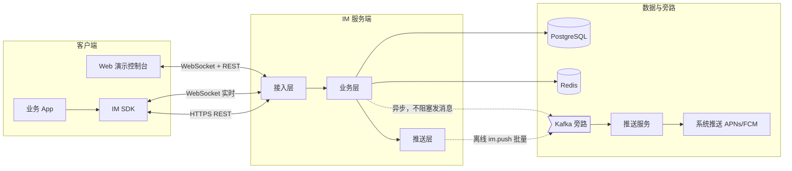
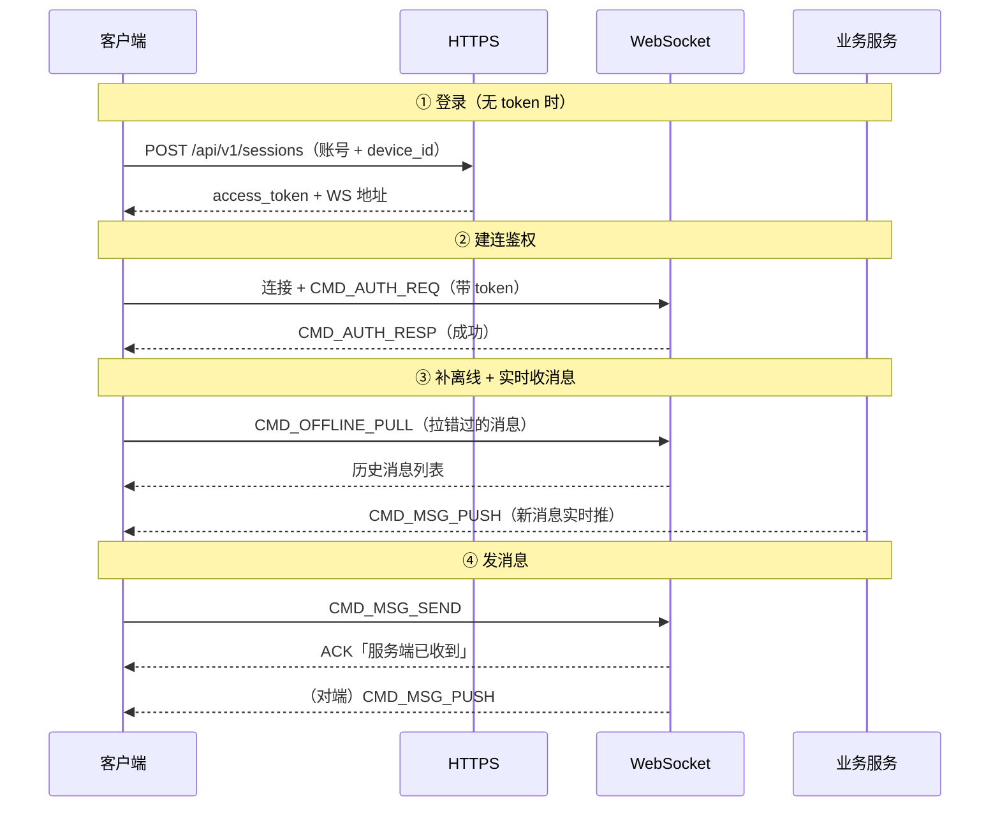
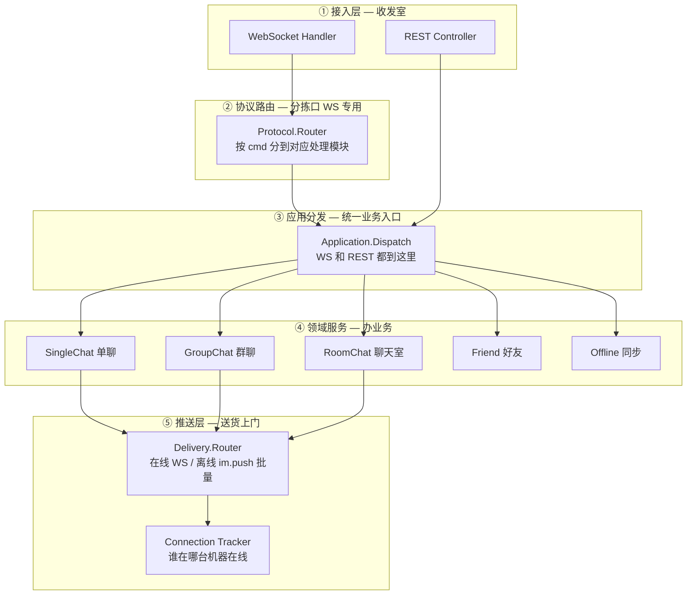
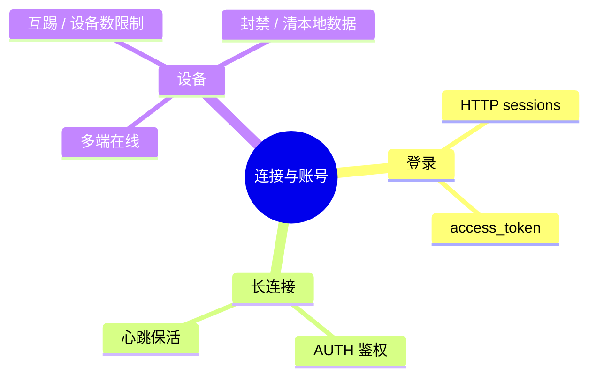
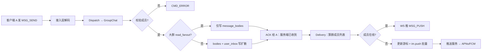
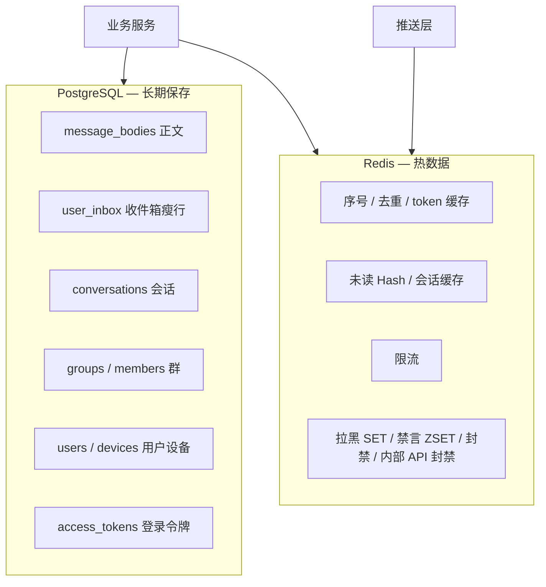

# IM 系统架构总览

> **读这份文档就够了**：用简单图和语言说明「系统由什么组成、消息怎么流动」。细节时序与字段见 [system-design.md](system-design.md)；协议见 [protocol/protocol.md](protocol/protocol.md)。

### 维护约定（必读）

本文档是 **活架构总览**。凡 **系统级** 变更，须与专题设计、`proto`、`protocol.md` **同一 PR / 同一次提交** 内更新本文（见 [agent.md](../../agent.md)「架构总览同步」）。

| 须同步更新本文 | 示例 |
| --- | --- |
| 新增/删除对外能力或 cmd 域 | 好友、流式、REST 路径 |
| 改服务端分层或模块职责 | Dispatch、Delivery、Tracker |
| 改主数据流或客户端旅程 | 登录流程、发消息 ACK 路径 |
| 改存储/旁路在架构中的角色 | Kafka Topic、离线推送 |
| 改单聊/群聊/聊天室边界 | 是否落库、是否离线拉取 |

改完后自检：图中模块名、箭头方向、§6 模块表是否与最新设计一致。

各 **功能设计文档**（`docs/design/*.md`）须有独立 **`## 完整流程`** Mermaid 图；改行为时同步更新（见 [design/README.md](README.md) 文档模板）。

| 项 | 内容 |
|------|------|
| 状态 | **已确认** |
| 受众 | 产品、新同学、跨团队对接 |
| 关联 | [modular-architecture.md](modular-architecture.md)、[dual-channel-api.md](dual-channel-api.md)、[system-design.md](system-design.md) |

---

## 1. 一句话

这是一个 **多租户即时通讯后端**：客户端通过 **长连接收消息、短连接做管理**，服务端负责 **鉴权、存消息、推送给在线用户、离线补拉**；支持 **单聊、群聊、聊天室** 三种场景。

---

## 2. 系统里有哪些角色



| 角色 | 干什么 | 类比 |
|------|--------|------|
| **IM SDK** | 建连、收发 Packet、本地消息库、重连 | 邮局收发员 + 本地信箱 |
| **Web 演示控制台** | 浏览器 SPA，**协议全能力**人工联调与演示（**非**生产 SDK） | 内部试用前台 + 协议走查台 |
| **接入层** | WebSocket / HTTP 入口、鉴权、心跳、编解码 | 前台 + 安检 |
| **业务层** | 发消息、拉历史、群/好友管理等规则 | 后台业务员 |
| **推送层** | 找到谁在线、往哪个设备推 WS；离线设备聚合写 `im.push` | 快递员 |
| **PostgreSQL** | 消息、会话、群成员等持久化 | 档案柜 |
| **Redis** | 在线状态、序号、缓存、限流 | 便签 + 计数器 |
| **Kafka** | 审计、统计、下行镜像、**离线推送任务**（**不挡发消息主路径**） | 复印留底 + 推送任务单 |
| **推送服务** | 消费 `im.push`，按 `targets` 逐设备调 APNs/FCM | 外包快递员 |
| **系统推送** | 手机厂商通道（APNs/FCM） | 短信叫醒 |

---

## 3. 整体架构（鸟瞰）

```text
                    ┌─────────────────────────────────────────┐
                    │              客户端（多设备）               │
                    │   手机 / Web / Desktop — 每设备一条长连接   │
                    └───────────────┬─────────────────────────┘
                                    │
              ┌─────────────────────┼─────────────────────┐
              │ HTTPS               │ WebSocket 二进制       │
              │ 登录、管理 API       │ 实时消息、推送、心跳      │
              ▼                     ▼                       │
     ┌────────────────────────────────────────┐            │
     │           IM 服务端（可水平扩展多副本）      │◄───────────┘
     │  ┌──────────┐  ┌──────────┐  ┌──────────┐ │
     │  │ 接入网关  │→│ 业务服务  │→│ 消息推送  │ │
     │  └──────────┘  └──────────┘  └──────────┘ │
     └───────────────┬───────────────┬────────────┘
                     │               │
         ┌───────────┴───┐       ┌───┴──────────┐
         ▼               ▼       ▼              ▼
    PostgreSQL        Redis    Kafka        推送服务
    消息/群/好友       在线/序号  旁路+im.push   → APNs/FCM
```

**两个通道，一套业务**：

- **WebSocket**：实时收消息、服务端主动推、心跳（见 [dual-channel-api.md](dual-channel-api.md)）
- **REST** `/api/v1`：客户端登录、发消息、拉历史、群管理等 —— 与 WS **共用业务逻辑**，**Bearer 用户鉴权**
- **REST** `/internal/v1`：集群内服务（踢人、封禁、代发等）—— **无用户 token**，须 `X-IM-Caller-Service` + 源 IP 审计（见 [dual-channel-api.md](dual-channel-api.md) §4.4）
- **HTTP 全入口**：**必填** `X-Trace-Id` 请求头（见 [dual-channel-api.md](dual-channel-api.md) §4.2）

---

## 4. 客户端典型旅程（四步）



| 步骤 | 做什么 | 为什么 |
|------|--------|--------|
| 登录 | HTTP 拿 `token` 和 WS 地址 | 密码只走 HTTPS，不进长连接 |
| 鉴权 | WS 首包带 `token` | 确认「这条连接是谁」 |
| 离线拉取 | 按游标补消息 | 断网期间的消息不丢 |
| 发消息 | 先发后推 | 发送方先收到「服务器收到了」再推给接收方 |

---

## 5. 服务端内部分工（五层）

把服务端想成一家快递公司，从外到内五层，**每层只做一件事**：



| 层 | 模块（Elixir 命名） | 通俗说明 |
|----|---------------------|----------|
| 接入 | `UserSocket`、`Api.V1.*Controller` | 拆包、装包，不写业务规则 |
| 协议路由 | `IM.Protocol.Router` | 看 `cmd` 是 AUTH 还是 SEND，分给对应 Handler |
| 分发 | `IM.Application.Dispatch` | **唯一业务入口**，REST 和 WS 走同一条路 |
| 服务 | `IM.Services.*` | 校验权限、写数据库、算「要推给谁」 |
| 推送 | `IM.Delivery.Router` | 查在线设备、编码推送包、**按 priority 调度出站队列（WFQ + 老化）**；离线设备聚合写 **`im.push`**（`PushNotificationBatchEvent`） |

> 完整分层说明：[modular-architecture.md](modular-architecture.md)

---

## 6. 功能模块地图（按场景）

### 6.1 连接与账号



| 能力 | 说明 | 文档 |
|------|------|------|
| 登录 | 账密 → token → 再建 WS | [auth.md](auth.md) §9 |
| 鉴权 / 心跳 | 首包鉴权；定时心跳保活 | [auth.md](auth.md)、[heartbeat.md](heartbeat.md) |
| 踢人 / 封禁 | 内部服务经 `/internal/v1` 踢设备、封禁、可选清 SDK 本地数据 | [auth.md](auth.md) §9.6–9.8、§10 |
| 重连 | 断线后 AUTH + 离线拉取 | [reconnect.md](reconnect.md) |

### 6.2 消息

| 能力 | 说明 | 文档 |
|------|------|------|
| 发消息 | 单聊 / 群 / 室；同步 ACK「服务端已收到」 | [message-send-ack.md](message-send-ack.md) |
| 收推送 | 在线 `CMD_MSG_PUSH`；离线 `OFFLINE_PULL`；可选系统通知栏提醒 | [offline-pull.md](offline-pull.md)、[mobile-push.md](mobile-push.md) |
| 已读 / 撤回 / 编辑 / 阅后即焚 | 双端同步状态 | [read-receipt.md](read-receipt.md)、[recall.md](recall.md)、[edit.md](edit.md)、[burn-after-read.md](burn-after-read.md) |
| 透传 / 流式 | 打字状态、AI 流式等实时信令 | [passthrough.md](passthrough.md)、[stream-message.md](stream-message.md) |

### 6.3 社交与房间

| 能力 | 说明 | 文档 |
|------|------|------|
| 好友 | 加好友、拉黑、备注 | [friend.md](friend.md) |
| 群组 | 建群、成员；小群 **bodies+inbox** 写扩散，大群 **read_fanout** 读扩散 | [group.md](group.md) §6 |
| 聊天室 | 万人广播；默认不存离线历史 | [room.md](room.md) |

### 6.3b 应用通道（业务事件）

| 能力 | 说明 | 文档 |
|------|------|------|
| 订阅 / 上行 | 客户端订 Topic、≤1 条/秒上报 | [app-channel.md](app-channel.md) |
| 后端广播 | internal API → 10 万在线扇出 | 同上 |
| Kafka 出口 | `im.app_events` 统一消费 | [kafka-event-bus.md](kafka-event-bus.md) §2.12 |

### 6.4 基础设施（研发关心）

| 能力 | 说明 | 文档 |
|------|------|------|
| 存储 | PostgreSQL 表设计、分片思路 | [database/database-design.md](database/database-design.md) |
| 可观测 | 上下行包大小/耗时、日志 | [observability.md](observability.md) |
| 多机 | Tracker 跨节点找连接、大群扇出 | [modular-architecture.md](modular-architecture.md)、[zero-copy-delivery.md](zero-copy-delivery.md) |
| 旁路 | Kafka 五 Topic（`upstream` / `session` / `downstream` / **`push`** / `app_events`），不阻塞主路径 | [kafka-event-bus.md](kafka-event-bus.md) |
| 离线推送 | 扇出后按 **`msg_id`** 写 **`im.push` 批量事件**（`targets[]` 含 token）；推送服务逐设备调 APNs/FCM | [mobile-push.md](mobile-push.md) |

---

## 7. 三种聊天，一张表看懂

| | 单聊 | 群聊 | 聊天室 |
|---|------|------|--------|
| **谁在用** | 两个人 | 固定成员群 | 临时房间、活动直播 |
| **消息存库** | ✅ | ✅ 小群写扩散 / **大群读扩散** | ❌（默认不存） |
| **离线能拉** | ✅ | ✅（大群须带 `conv_id`） | ❌ |
| **怎么推** | 查对端设备，点对点推 | 小群直推；大群树状扇出 | PubSub 广播在线成员 |
| **写库成本** | 2 行 inbox/消息 | 小群 N 行；**大群 1 行 bodies** | — |
| **离线系统通知** | 1 条 `im.push` / msg（`targets` 可含多设备） | 同左（群成员离线设备聚合） | 默认不写 `im.push` |
| **阅后即焚** | ✅（v1） | ❌ | ❌ |
| **典型 conv_id** | `p:{uid_lo}:{uid_hi}` | `g:{group_id}` | `r:{room_id}` |

---

## 8. 发一条群消息时发生了什么

用一张流程图串起各模块（简化版）：



要点：

1. **主路径必须快**：A 发消息后，**同步**收到「服务端已收到」ACK，不能等 Kafka 或慢查询。
2. **推送给谁**由 `GroupChat` 算名单，**怎么推**由 `Delivery` 负责。
3. **发送设备**一般不再收自己的 PUSH；**发送者的其他设备**会收到（多端同步）。
4. **离线系统推送**：同一条群消息只写 **1 条**（或分块多条）`PushNotificationBatchEvent` 到 `im.push`，`targets[]` 列出各离线设备；完整消息仍靠 `OFFLINE_PULL`。
5. **大群存储**：成员数大于 threshold（默认 500）走 **读扩散**，只写 `message_bodies`，离线按 **`conv_id` + `conv_seq`** 补拉（见 [group.md](group.md) §6.3）。

---

## 9. 数据放在哪



| 存什么 | 放哪 | 为什么 |
|--------|------|--------|
| 聊天消息、群资料 | PostgreSQL | 要持久、要按会话查询 |
| 登录 token | PostgreSQL + Redis `im:token:{token_hash}` | 可吊销、要过期 |
| 谁在线 | **Phoenix.Tracker**（主）；Redis `im:conn:*` 仅可选辅助 | 推送热路径查 Tracker |
| 消息序号 | Redis `im:{app_key}:seq:*` + PG 兜底 | 离线拉取按序补 |
| 未读数（热路径） | Redis `im:unread:*` + PG `conversations` | 大群写扩散异步刷库 |
| 拉黑 / 群禁言 / 设备封禁 | Redis `im:block` / `im:mute` / `im:device_ban` + PG 权威 | 见 [permission-cache.md](permission-cache.md) |

---

## 10. 多机部署（简化）

生产环境会跑 **多台 IM 实例**（K8s 多 Pod）：

```text
         ┌─────────┐     ┌─────────┐
客户端 ──┤ Access 1├──┬──┤ Access 2├──┐
         └────┬────┘  │  └────┬────┘  │
              │       │       │       │
              └───────┼───────┘       │
                      ▼               │
              Phoenix.Tracker         │
              （记录 user 连在哪台）    │
                      │               │
              ┌───────┴───────┐       │
              ▼               ▼       ▼
         消息处理节点      共享 PG / Redis
```

- 用户 A 连在 Pod-1，用户 B 连在 Pod-2：**Tracker** 能查到 B 的位置，跨 Pod 推送。
- 大群消息：**树状扇出**推送；存储上 **读扩散**（仅 `message_bodies`），离线按 `conv_seq` 补拉（见 [group.md](group.md) §6.3）。

---

## 11. 协议与代码仓库（给研发）

**协议为准（硬约束）**：`proto/` + [`protocol/protocol.md`](protocol/protocol.md) 是所有实现代码的 **唯一行为契约**（含 Elixir 服务端、`im_client`、Web Console、loadtest）。代码与协议不一致时 **改代码**；确需改协议时 **须人工确认** 后再改 `proto` 与文档，最后才改实现。详见 [`agent.md`](../../agent.md)「协议为准」。

```text
proto/*.proto          →  消息结构（语言无关，权威）
docs/design/protocol/  →  协议规范（权威）
docs/design/           →  为什么这样设计（不覆盖协议语义）
docs/implementation/   →  怎么实现（须对齐协议）
apps/elixir/im/        →  服务端代码（实施中）
deploy/elixir/im/      →  Docker + K8s
```

**Packet 信封**（所有 WS 业务包的公共外壳）：

```text
ver | cmd | seq | cid | trace_id | route_key | payload(Protobuf)
```

- `cmd`：做什么（发消息、鉴权、拉离线…）
- `seq`：请求序号，响应原样带回
- `trace_id`：根请求入站确定；**ACK/PUSH/ERROR 等衍生包必须继承**（见 [message-context.md](message-context.md) §7.4）
- `payload`：具体业务内容，按 `cmd` 解析

---

## 12. 进一步阅读

| 想深入了解… | 文档 |
|-------------|------|
| 完整功能清单与时序 | [system-design.md](system-design.md) |
| 命令字与字段 | [protocol/protocol.md](protocol/protocol.md) |
| 模块分层与代码结构 | [modular-architecture.md](modular-architecture.md) |
| WS + REST 怎么对齐 | [dual-channel-api.md](dual-channel-api.md) |
| 怎么落地实现 | [implementation/elixir/roadmap.md](../implementation/elixir/roadmap.md) |
| 仓目录布局 | [implementation/monorepo-layout.md](../implementation/monorepo-layout.md) |
