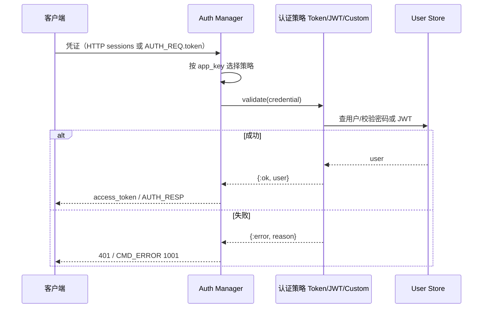

# 设计说明：认证模块架构

| 项 | 内容 |
|------|------|
| 状态 | 已确认 |
| 决策编号 | DD-027 |
| 规范定义 | 本文档 |
| 行为约定 | 本文档 |
| 索引 | [`design-decisions.md`](../design-decisions.md) |
| 相关文档 | [auth.md](auth.md)、[dependency-abstraction.md](dependency-abstraction.md) |
| 实现文档 | [implementation/elixir/auth-module.md](../implementation/elixir/auth-module.md) |

---

## 1. 要解决什么问题

认证模块需要：

- **支持多种认证方式**：Token、JWT、OAuth2、自定义认证等
- **易于扩展**：新增认证方式不需要修改核心代码
- **可配置**：不同租户可使用不同的认证方式
- **可测试**：方便 Mock 认证逻辑进行测试

---

## 完整流程



HTTP 登录与 WS 鉴权共用 `access_tokens` 校验路径，见 [auth.md](auth.md) §9。

---

## 2. 决策是什么

### 2.1 认证模块架构

```
┌─────────────────────────────────────────────────────────┐
│                  Auth Manager（认证管理器）                │
│  职责：选择认证策略、协调认证流程                           │
└────────────────────┬────────────────────────────────────┘
                     │
        ┌────────────┼────────────┐
        │            │            │
        ▼            ▼            ▼
┌─────────────┐ ┌─────────────┐ ┌─────────────┐
│ Token Auth  │ │  JWT Auth   │ │ Custom Auth │
│  (内置)     │ │   (内置)    │ │  (可扩展)   │
└─────────────┘ └─────────────┘ └─────────────┘
        │            │            │
        └────────────┼────────────┘
                     │
                     ▼
              ┌─────────────┐
              │ User Store  │
              │ (用户存储)   │
              └─────────────┘
```

### 2.2 认证策略接口

**认证策略接口**：

```
interface AuthStrategy:
    authenticate(credentials, context) -> {:ok, user_info} | {:error, reason}
    get_strategy_name() -> String
    get_strategy_type() -> AuthType
```

**返回值**：

| 返回 | 说明 |
|------|------|
| `{:ok, user_info}` | 认证成功，返回用户信息 |
| `{:error, :invalid_token}` | Token 无效 |
| `{:error, :token_expired}` | Token 过期 |
| `{:error, :user_not_found}` | 用户不存在 |
| `{:error, :permission_denied}` | 权限不足 |

### 2.3 用户信息结构

```
user_info = {
    user_id: String,           // 用户ID
    app_key: String,           // 应用Key
    nickname: String?,         // 昵称（可选）
    avatar: String?,           // 头像（可选）
    roles: [String],           // 角色列表
    permissions: [String],     // 权限列表
    metadata: Map              // 其他元数据
}
```

---

## 3. 内置认证策略

### 3.1 Token 认证（默认）

**适用场景**：简单应用、快速接入

**认证流程**：

```
1. 客户端发送 AuthReq { token: "xxx" }
2. Auth Manager 选择 TokenStrategy
3. TokenStrategy 验证 token（查库/查缓存）
4. 返回用户信息
```

**配置示例**：

```
auth.strategies = [
    {
        type: "token",
        enabled: true,
        token_expiry_sec: 86400,
        cache_enabled: true
    }
]
```

### 3.2 JWT 认证

**适用场景**：分布式系统、无状态认证

**认证流程**：

```
1. 客户端发送 AuthReq { token: "jwt_xxx" }
2. Auth Manager 选择 JWTStrategy（通过 token 前缀识别）
3. JWTStrategy 验证 JWT 签名、有效期
4. 解析 claims 获取用户信息
```

**配置示例**：

```
auth.strategies = [
    {
        type: "jwt",
        enabled: true,
        secret: "your-secret-key",
        algorithm: "HS256",
        issuer: "your-issuer",
        audience: "your-audience",
        expiry_leeway_sec: 30
    }
]
```

### 3.3 OAuth2 认证

**适用场景**：第三方登录、企业级应用

**认证流程**：

```
1. 客户端发送 AuthReq { token: "oauth_xxx", provider: "google" }
2. Auth Manager 选择 OAuth2Strategy
3. OAuth2Strategy 调用 provider 的用户信息接口
4. 返回用户信息
```

**配置示例**：

```
auth.strategies = [
    {
        type: "oauth2",
        enabled: true,
        providers: [
            {
                name: "google",
                client_id: "xxx",
                client_secret: "xxx",
                user_info_url: "https://www.googleapis.com/oauth2/v2/userinfo"
            }
        ]
    }
]
```

---

## 4. 自定义认证策略

### 4.1 扩展方式

实现 `AuthStrategy` 接口：

```
class CustomAuthStrategy implements AuthStrategy:
    
    get_strategy_name() -> String:
        return "custom"
    
    get_strategy_type() -> AuthType:
        return AuthType.CUSTOM
    
    authenticate(credentials, context) -> Result:
        // 1. 解析 credentials
        // 2. 调用外部认证服务
        // 3. 验证返回结果
        // 4. 返回用户信息或错误
```

### 4.2 注册策略

```
// 配置文件
auth.strategies = [
    {
        type: "custom",
        enabled: true,
        module: "com.example.CustomAuthStrategy",
        config: {
            endpoint: "https://auth.example.com/verify",
            timeout_ms: 5000
        }
    }
]
```

### 4.3 策略选择

**通过 token 前缀识别**：

| 前缀 | 策略 |
|------|------|
| 无前缀 | Token 认证（默认） |
| `jwt_` | JWT 认证 |
| `oauth_` | OAuth2 认证 |
| `custom_` | 自定义认证 |

**通过 app_key 配置识别**：

```
// 不同 app_key 可使用不同的认证策略
app_key_config = {
    "app_001": {
        auth_strategy: "token"
    },
    "app_002": {
        auth_strategy: "jwt"
    },
    "app_003": {
        auth_strategy: "oauth2"
    }
}
```

---

## 5. 认证模块接口

### 5.1 Auth Manager 接口

```
interface AuthManager:
    
    // 认证入口
    authenticate(auth_req, context) -> {:ok, user_info, device} | {:error, reason}
    
    // 注册认证策略
    register_strategy(strategy_name, strategy) -> void
    
    // 获取可用策略
    get_available_strategies() -> [String]
    
    // 选择认证策略
    select_strategy(auth_req) -> AuthStrategy
```

### 5.2 认证流程

```
AuthManager.authenticate(auth_req, context):
    
    // 1. 验证请求参数
    if not validate_auth_request(auth_req):
        return {:error, :invalid_request}
    
    // 2. 选择认证策略
    strategy = select_strategy(auth_req)
    if strategy == null:
        return {:error, :unsupported_auth_method}
    
    // 3. 执行认证
    result = strategy.authenticate(auth_req, context)
    
    // 4. 处理认证结果
    match result:
        case {:ok, user_info}:
            // 生成 session_id
            session_id = generate_session_id()
            
            // 构造 DeviceResource
            device = build_device_resource(auth_req, session_id, context)
            
            // 记录审计日志
            log_auth_success(user_info, device)
            
            return {:ok, user_info, device}
        
        case {:error, reason}:
            // 记录失败日志
            log_auth_failure(auth_req, reason)
            
            return {:error, reason}
```

---

## 6. 多策略组合

### 6.1 顺序尝试

```
// 配置多个策略，按顺序尝试
auth.strategies = [
    { type: "jwt", enabled: true, order: 1 },
    { type: "token", enabled: true, order: 2 }
]

// 认证流程
// 1. 先尝试 JWT 认证
// 2. JWT 失败后尝试 Token 认证
```

### 6.2 回退机制

```
AuthManager.authenticate(auth_req, context):
    
    strategies = get_enabled_strategies_ordered()
    
    for strategy in strategies:
        result = strategy.authenticate(auth_req, context)
        
        if result is {:ok, user_info}:
            return {:ok, user_info, device}
        
        if result is {:error, :invalid_token}:
            // 继续尝试下一个策略
            continue
        
        if result is {:error, :token_expired}:
            // Token 过期，不再尝试其他策略
            return {:error, :token_expired}
    
    // 所有策略都失败
    return {:error, :authentication_failed}
```

---

## 7. 认证缓存

### 7.1 Token 缓存

权威键空间见 [database-design.md](database/database-design.md) §二.7。

```
// 按 token_hash 缓存校验结果，支持多设备独立 token
cache_key = "im:token:{token_hash}"
cache_value = {
    app_key: "...",
    user_id: "alice",
    device_id: "d1",
    expires_at: ...
}
cache_ttl = 剩余有效期
```

### 7.2 缓存失效

| 事件 | 操作 |
|------|------|
| 用户修改密码 | 清除该用户所有 token 缓存 |
| 用户被禁用 | 清除该用户所有 token 缓存 |
| Token 过期 | 自动清除缓存 |
| 用户登出 | 清除对应 token 缓存 |

---

## 8. 审计与监控

### 8.1 审计日志

**记录内容**：

| 字段 | 说明 |
|------|------|
| timestamp | 时间戳 |
| app_key | 应用 Key |
| user_id | 用户 ID |
| device_id | 设备 ID |
| strategy | 认证策略 |
| result | 结果（成功/失败） |
| reason | 失败原因 |
| client_ip | 客户端 IP |
| user_agent | 客户端信息 |

### 8.2 监控指标

| 指标 | 说明 |
|------|------|
| 认证成功率 | 成功认证数 / 总认证请求数 |
| 认证延迟 | 认证请求耗时分布 |
| 认证失败原因分布 | 各类失败原因占比 |
| 策略使用分布 | 各策略使用占比 |

---

## 9. 安全考虑

### 9.1 防暴力破解

| 措施 | 说明 |
|------|------|
| 认证失败计数 | 同一 IP/用户短时间内失败次数限制 |
| 锁定机制 | 失败次数过多临时锁定 |
| 验证码 | 可选，失败次数过多后要求验证码 |

### 9.2 Token 安全

| 措施 | 说明 |
|------|------|
| 短期有效 | Token 有效期建议 24 小时内 |
| 单设备绑定 | Token 可绑定 device_id |
| 使用记录 | 记录 Token 使用日志 |

---

## 10. 模块独立性

### 10.1 设计原则

认证模块遵循模块化原则：

| 原则 | 说明 |
|------|------|
| **单一职责** | 只负责认证，不关心业务逻辑 |
| **可插拔** | 认证策略可配置、可替换 |
| **可测试** | 提供 Mock 策略用于测试 |
| **可扩展** | 新增认证策略无需修改核心代码 |

### 10.2 与其他模块的边界

| 模块 | 认证模块职责 | 其他模块职责 |
|------|--------------|--------------|
| 连接管理 | 认证成功后通知连接管理器 | 管理连接状态 |
| 消息服务 | 提供 user_info | 根据用户信息处理消息 |
| 权限服务 | 提供 roles/permissions | 根据权限控制访问 |

---

## 11. 总结

| 项 | 说明 |
|------|------|
| **架构** | Auth Manager + 多种 AuthStrategy |
| **内置策略** | Token、JWT、OAuth2 |
| **自定义策略** | 实现 AuthStrategy 接口 |
| **策略选择** | 通过 token 前缀或 app_key 配置 |
| **多策略组合** | 顺序尝试、回退机制 |
| **缓存** | Token 缓存提升性能 |
| **审计** | 完整的审计日志和监控 |
| **安全** | 防暴力破解、Token 安全 |

