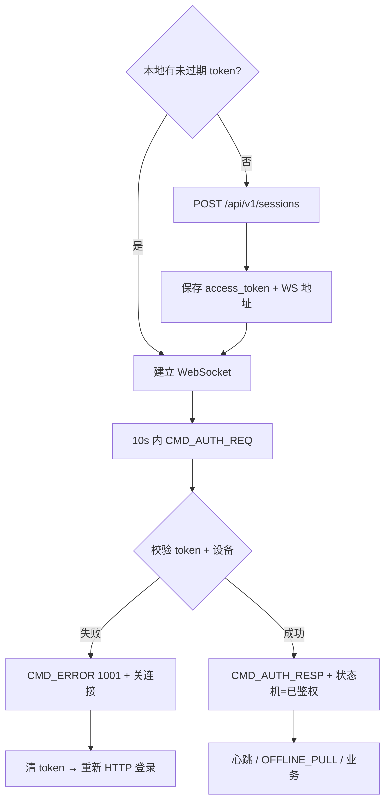
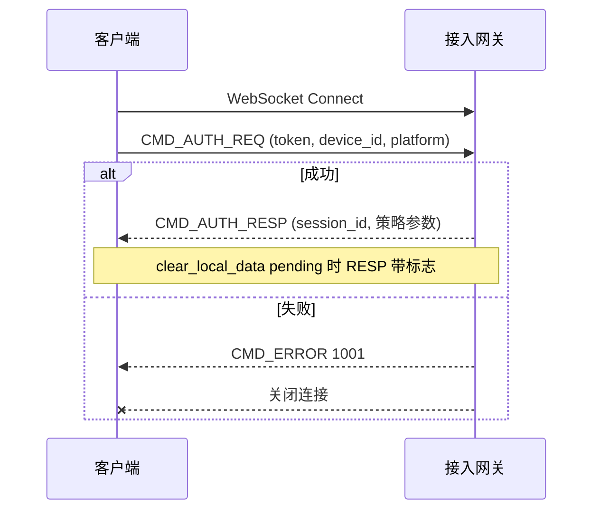
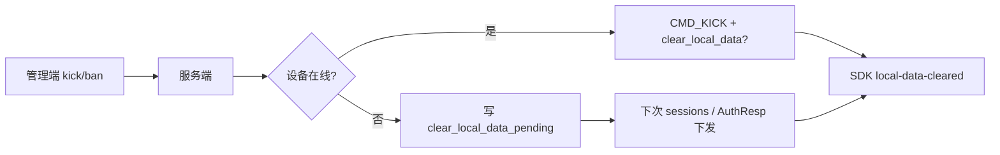

# 设计说明：连接与鉴权

| 项 | 内容 |
| --- | --- |
| 状态 | **已确认** |
| 决策编号 | DD-005 |
| 规范定义 | [`proto/auth.proto`](../../proto/auth.proto)（`AuthReq` / `AuthResp` / `KickNotify`） |
| 行为约定 | [`protocol.md` §5](protocol/protocol.md#5-连接与鉴权) |
| 索引 | [`design-decisions.md`](../design-decisions.md) |
| 实现文档 | [implementation/elixir/auth.md](../implementation/elixir/auth.md) |

---

## 1. 要解决什么问题

WebSocket 建连成功后，连接处于「未鉴权」态。服务端必须在校验凭证通过前：

- 识别租户与用户、绑定设备与平台
- 建立可追踪的 `session_id`
- 下发心跳间隔与服务端时间
- 拒绝或关闭非法连接

---

## 2. 决策摘要（已确认）

| # | 决策 |
| --- | --- |
| 1 | 建连后**首包必须是** `CMD_AUTH_REQ`；未鉴权超时 **10s**（服务端可配置） |
| 2 | `AuthReq.platform` **必填**，用于识别客户端平台 |
| 3 | 同 `user_id` 多 `device_id` 可并存；互踢由服务端策略 + `CMD_KICK` |
| 4 | token 过期：**不**做连接内 refresh；`CMD_KICK` 后重连重新鉴权 |
| 5 | 鉴权失败：`CMD_ERROR` 后**必须关闭连接** |
| 6 | **已鉴权后禁止再次 `AUTH_REQ`**；重复鉴权视为状态非法，断开连接 |
| 7 | **HTTP 登录签发短期 `access_token`**；WS 首包 `AUTH_REQ` 仅携带 token（见 §9） |
| 8 | **服务端 Socket 进程维护连接状态机**；凡不符合当前态允许的 cmd，**必须断开**（见 §7） |
| 9 | **按平台限制在线设备数**；租户可配置每平台上限与超限策略（见 §8） |
| 10 | **鉴权协商 `Packet.payload` 压缩**（`NONE` / `GZIP` / `LZ4`）；v1 仅 `NONE`；见 [payload-compression.md](payload-compression.md) |

---

## 完整流程

### 登录 + 建连 + 鉴权



### WebSocket 鉴权时序



### 踢人 / 封禁 / 清本地数据（摘要）



HTTP 登录、token、封禁细节见 §9。

---

## 3. 为什么这样设计

### 3.1 首包鉴权 + 10s 超时

| 点 | 意图与好处 |
| --- | --- |
| 首包 `AUTH_REQ` | 连接状态机简单：未鉴权 / 已鉴权两态；网关可拒绝业务包 |
| 10s 未鉴权断开 | 防止半开连接占资源；给弱网留足首包时间 |
| token 在 payload 不在 URL | 降低 token 进访问日志、Referer 的风险 |

### 3.2 `platform` 必填

| 点 | 意图与好处 |
| --- | --- |
| 必须上报平台 | 统计、兼容策略、推送通道、按端限流与灰度 |
| 约定取值 | `ios` / `android` / `web` / `desktop`（大小写不敏感，服务端归一化） |
| 与 `device_id` 配合 | 同一用户多平台多设备可区分 |

### 3.3 失败关连接 + 统一 `CMD_ERROR`

| 点 | 意图与好处 |
| --- | --- |
| 不用 `AUTH_RESP` 表达失败 | 与 Packet 错误模型一致 |
| 失败后关连接 | 避免未鉴权连接反复试错；客户端走完整重连流程 |

### 3.4 多端与 `CMD_KICK`

| 点 | 意图与好处 |
| --- | --- |
| 协议不强制互踢 | 产品可选「单端在线」或「多端并存」 |
| `CMD_KICK` 独立 | 主动踢人与请求失败语义分离；可带 `reason` / `device_id` |

### 3.5 不做连接内 token refresh

| 点 | 意图与好处 |
| --- | --- |
| 过期即踢 + 重连 | 实现简单；token 生命周期与 REST 登录对齐 |
| 长连接只带短期 token | 减少 stolen token 在长连接上的有效窗口 |

### 3.6 鉴权与业务顺序

```text
AUTH_RESP 成功
  → OFFLINE_PULL（客户端主动，见 reconnect.md）
  → 实时 PUSH / 发消息等业务
```

离线补拉由客户端控制顺序，避免服务端在鉴权响应里夹带大量历史。

---

## 4. 设备资源（DeviceResource）

### 4.1 设计意图

客户端连接时上传设备信息，服务端生成 `session_id` 后，统一返回 `DeviceResource` 结构，包含：

- **客户端上传的信息**：device_id、platform、os、device_name、device_model、network、sdk_ver
- **服务端生成/检测的信息**：session_id、client_ip、connected_at

### 4.2 字段说明

| 字段 | 来源 | 说明 |
|------|------|------|
| `device_id` | 客户端上传 | 设备唯一标识，用于多端与互踢 |
| `session_id` | 服务端生成 | 本次长连接会话 ID，全局唯一 |
| `platform` | 客户端上传 | 平台：ios / android / web / desktop |
| `os` | 客户端上传 | 操作系统及版本：iOS 15.0 / Android 12 |
| `sdk_ver` | 客户端上传 | SDK 版本号 |
| `device_name` | 客户端上传 | 设备名称：iPhone 14 Pro（可选） |
| `device_model` | 客户端上传 | 设备型号：iPhone14,2（可选） |
| `network` | 客户端上传 | 网络类型：wifi / 4g / 5g（可选） |
| `client_ip` | 服务端检测 | 客户端 IP 地址 |
| `connected_at` | 服务端生成 | 连接建立时间戳 |

### 4.3 好处

| 好处 | 说明 |
|------|------|
| **客户端感知** | 客户端知道自己被服务端识别为什么设备 |
| **调试友好** | 客户端可以记录完整的设备资源信息 |
| **互踢信息** | 被踢时可以看到是新设备的什么设备踢下线 |
| **审计追踪** | 服务端记录完整的设备资源用于审计 |

### 4.4 示例

**AuthReq（客户端上传）**：
```json
{
  "app_key": "test_app",
  "user_id": "alice",
  "token": "xxx",
  "device_id": "device_001",
  "platform": "ios",
  "sdk_ver": "1.0.0",
  "os": "iOS 15.0",
  "device_name": "iPhone 14 Pro",
  "device_model": "iPhone14,2",
  "network": "wifi"
}
```

**AuthResp（服务端返回）**：
```json
{
  "device": {
    "device_id": "device_001",
    "session_id": "session_abc123",
    "platform": "ios",
    "os": "iOS 15.0",
    "sdk_ver": "1.0.0",
    "device_name": "iPhone 14 Pro",
    "device_model": "iPhone14,2",
    "network": "wifi",
    "client_ip": "192.168.1.100",
    "connected_at": 1721808000000
  },
  "server_time": 1721808000100,
  "heartbeat_interval_sec": 30,
  "user_id": "alice"
}
```

---

## 5. 字段意图（摘要）

见 `protocol.md` §5 字段表；`AuthResp.device.session_id` 为本次长连接会话 ID；`user_id` 以服务端校验结果为准。

---

## 6. 刻意放弃

| 放弃 | 原因 |
| --- | --- |
| HTTP Header 预鉴权再 WS | 多一跳；本协议统一首包鉴权 |
| `AUTH_REFRESH` | 本期不做；过期重连 |
| `AuthReq` 带 push_token | 推送注册走 REST，鉴权包保持精简 |
| 鉴权失败保持连接 | 已确认必须断开 |
| 已鉴权连接上重复 AUTH | 本期不支持连接内 refresh；须断开后新建连接再鉴权 |

---

## 7. 服务端 Socket 连接状态机

每个 WebSocket 连接在服务端对应 **一个独立进程**（如 Elixir `UserSocket` / Channel 进程），进程内维护**显式状态**，所有入站 `Packet` 先过状态机再分发。

### 7.1 状态定义

| 状态 | 含义 |
|------|------|
| **`unauthenticated`** | TCP/WS 已建立，尚未 `AUTH` 成功 |
| **`authenticated`** | `AUTH_RESP` 已成功，可处理业务 cmd |
| **`closing`** | 已决定关闭，仅排空发送队列，**不再**处理新业务 cmd |

本期不做 `authenticated` 内降级回 `unauthenticated`；token 过期等一律 **`CMD_KICK` → `closing` → 断连**，客户端**新连接**再 `AUTH`。

### 7.2 状态转移

```text
                    ┌── 10s 无合法 AUTH ──► closing
                    │
WS 建连 ──► unauthenticated ── AUTH 成功 ──► authenticated ──► closing ──► 断开
                    │                              │
                    │                              ├── 空闲超时 / KICK / 对端关闭
                    │                              │
                    ├── 非 AUTH 业务包 ──► closing   ├── 重复 AUTH_REQ ──► closing
                    │                              ├── 非法 cmd ──► closing
                    └── AUTH 失败 ──► CMD_ERROR ──► closing
```

### 7.3 各状态允许的入站 cmd

| 状态 | 允许 | 禁止（一律断开） |
|------|------|------------------|
| `unauthenticated` | **仅** `CMD_AUTH_REQ` | 心跳、发消息、ACK、离线拉取等**任意**业务包 |
| `authenticated` | 心跳、消息、ACK、同步、群/室/好友等**已注册**业务 cmd | **`CMD_AUTH_REQ`（再次登录）**、未实现的 `cmd`、畸形包 |
| `closing` | （忽略入站） | 全部 |

**核心规则（已确认）**：

1. **一旦 `authenticated`，同一连接上不得再收 `CMD_AUTH_REQ`**。要换用户 / 刷新 token → 客户端**断开后重连**。
2. **未鉴权不得发心跳**（`heartbeat.md`）；发了视为非法，断开。
3. 状态非法时：**优先**回 `CMD_ERROR`（`ref_cmd` 填触发包 cmd，`code` 见下表），**随后关闭连接**；未鉴权阶段误发业务包可**静默断开**（与 protocol §5 一致）。

### 7.4 非法状态与错误码

| 场景 | `CMD_ERROR` | 关连接 |
|------|-------------|--------|
| 未鉴权发业务包 | 可不发 | **是**（静默） |
| `AUTH` 失败 | `CODE_UNAUTHORIZED`(1001) | **是** |
| **已鉴权再发 `AUTH_REQ`** | `CODE_UNAUTHORIZED`(1001)，`msg` 建议 `already_authenticated` | **是** |
| 已鉴权未知/未注册 `cmd` | `CODE_MSG_INVALID`(2001) 或协议层错误 | **是** |
| 解码失败 / `ver` 不匹配 | `CODE_PROTO_VERSION_UNSUPPORTED` 等 | **是** |

### 7.5 实现要求

| 要求 | 说明 |
|------|------|
| **单入口校验** | 所有入站二进制帧 → 解码 `Packet` → **`ConnectionState.allow?(state, cmd)`** → 再 `Router` |
| **assigns 与状态一致** | `authenticated` 后才写入 `user_id` / `app_key` / `device_id`；禁止业务 Handler 绕过状态机 |
| **活跃重置** | `authenticated` 下任意合法业务包重置空闲计时（与心跳 §6 一致） |
| **可观测** | 因状态非法断开记 `IM.Log.warning(:connection_state_violation, …)`（生产）+ `im_connection_close_total{reason}` |

### 7.6 与客户端状态机对齐

客户端亦应为 `unauthenticated` → `authenticated` 两态，**不会在已登录态再发 `AUTH_REQ`**。服务端强制断开可防止 SDK bug、恶意重放或中间人重复鉴权。

---

## 8. 按平台在线设备数限制

### 8.1 要解决什么问题

同一用户可在多平台登录（如 2 台 iPhone + 1 台 Web），产品需要 **按 `platform` 限制同时在线的 `device_id` 数量**，防止账号共享、控制连接资源。

### 8.2 决策摘要（已确认）

| # | 决策 |
| --- | --- |
| 1 | 限制维度：**`(app_key, user_id, platform)`** 下的 **在线** `device_id` 个数（非历史注册设备总数） |
| 2 | `platform` 取值与 `AuthReq` 一致，服务端归一化为 `ios` / `android` / `web` / `desktop` |
| 3 | 上限由租户 **`app_configs`** 配置（category=`device`），支持每平台不同值 |
| 4 | **同一 `device_id` 重连**：先按既有策略踢掉旧连接（`reason=duplicate_login`），**不占用新名额** |
| 5 | 超限时策略可配置：`reject`（拒绝新登录）或 `kick_oldest_on_platform`（踢该平台最久未活跃设备） |
| 6 | 拒绝登录：`CMD_ERROR` + `CODE_DEVICE_LIMIT_EXCEEDED`(1004)，随后关连接 |
| 7 | 踢出设备：`CMD_KICK`，`reason=device_limit`，`kicker` 填新登录设备信息 |

### 8.3 配置（`app_configs`）

| category | config_key | value_type | 默认值 | 说明 |
| --- | --- | --- | --- | --- |
| `device` | `max_devices_per_platform` | json | 见下表 | 各平台上限；未列出的平台用 `default` |
| `device` | `device_limit_policy` | string | `kick_oldest_on_platform` | `reject` \| `kick_oldest_on_platform` |

`max_devices_per_platform` 默认 JSON：

```json
{
  "default": 5,
  "ios": 2,
  "android": 2,
  "web": 5,
  "desktop": 3
}
```

- `0` 表示 **禁止** 该平台登录（立即 `reject`）。
- 配置变更后 **不追溯踢人**；下次有新设备登录鉴权时生效。

### 8.4 鉴权时序

```text
AUTH_REQ 校验 token / user_id 通过
  → 若同 device_id 已在线：踢旧连接（duplicate_login）
  → 统计同 platform 在线 device_id 数（不含本 device_id）
  → 若 count >= max：
       policy=reject          → CMD_ERROR 1004，关连接
       policy=kick_oldest…    → CMD_KICK(device_limit) 给最旧设备 → 继续 AUTH_RESP
  → 注册 Tracker / Registry，返回 AuthResp
```

**「最旧设备」**：同平台在线设备中 `connected_at` 最早者；并列时 `device_id` 字典序最小。

### 8.5 与多端同步的关系

- 不同 **platform** 各自计数（iOS 满额不影响 Web）。
- 未超限前，各平台设备仍按 [multi-device.md](multi-device.md) 收 PUSH / 已读同步。
- `user_devices` 表记录设备元数据（推送 token 等），**不参与**在线名额统计。

### 8.6 刻意不做（本期）

| 放弃 | 原因 |
| --- | --- |
| 全平台合计上限 | 与需求「每平台」不符；若需要另加 `max_devices_total` 配置 |
| 连接内动态踢人 | 仅在 `AUTH` 时 enforcement |
| 客户端自选踢哪个设备 | 由服务端按策略决定，简化 SDK |

---

## 9. 客户端登录与长连接建连

### 9.1 总流程（已确认）

```text
┌─────────────────────────────────────────────────────────────────┐
│ 本地无 token 或 token 已失效                                      │
│   POST /api/v1/sessions（用户名+密码 + device_id）                 │
│   → access_token + expires_at + websocket_urls + 连接配置        │
│   → 持久化 token（安全存储）                                        │
└────────────────────────────┬────────────────────────────────────┘
                             ▼
┌─────────────────────────────────────────────────────────────────┐
│ 建立 WebSocket（使用返回的 websocket_urls）                         │
│   首包 CMD_AUTH_REQ { app_key, user_id, token, device_id, ... }  │
│   → 成功：CMD_AUTH_RESP（session_id、server_time、策略参数）        │
│   → 失败：CMD_ERROR(1001) + 关连接 → 清除本地 token → 回 HTTP 登录  │
└────────────────────────────┬────────────────────────────────────┘
                             ▼
                    心跳 / 业务 / OFFLINE_PULL ...
```

| # | 客户端行为 | 服务端 |
| --- | --- | --- |
| 1 | **从未登录**或本地无 token：先 **HTTP** 用户名密码登录 | 校验凭证，签发 **短期 access_token**，返回 **WS 地址** 与连接配置 |
| 2 | **本地有未过期 token**：直接建 WS，首包 `AUTH_REQ` 带 token | 校验 token 有效性、设备未封禁、用户状态正常 |
| 3 | **WS 鉴权失败**或收到 `CMD_KICK`（`token_expired` 等）：清本地 token，**重新 HTTP 登录** | 失败关连接；过期/吊销 token 拒绝 `AUTH` |
| 4 | token **必须有失效时间** `expires_at`；过期后 HTTP 与 WS 均不可用 | `app_configs.security.token_ttl_sec`（默认 86400）；JWT 场景以 claims `exp` 为准 |
| 5 | **封禁设备**：断开 WS、**吊销该设备全部 token**、DB 标记禁止再登录 | 见 §9.6 |
| 6 | **踢人/封禁可要求 SDK 清本地数据**；离线后下次登录仍须下发 | 见 §9.8 |

**原则**：用户名密码 **仅走 HTTPS**，不进 WebSocket；WS 只接受 **HTTP 签发的 access_token**（见 [dual-channel-api.md](dual-channel-api.md)）。

### 9.2 HTTP 登录：`POST /api/v1/sessions`

**请求头**：**必填** `X-Trace-Id`（见 [dual-channel-api.md](dual-channel-api.md) §4.2）。

**请求**（示例 JSON）：

| 字段 | 必填 | 说明 |
| --- | --- | --- |
| `app_key` | 是 | 租户 |
| `user_id` | 是 | 业务用户 ID（或 `username`，由租户用户体系映射为 `user_id`） |
| `password` | 是 | 密码（或租户自定义凭证字段） |
| `device_id` | 是 | 设备唯一 ID，与后续 `AUTH_REQ` 一致 |
| `platform` | 是 | `ios` / `android` / `web` / `desktop` |
| `sdk_ver` | 是 | SDK 版本 |

**成功响应** `200`：

| 字段 | 说明 |
| --- | --- |
| `access_token` | 长连接与 REST 共用的 Bearer token（**不透明字符串**；服务端只存 hash） |
| `expires_at` | token 失效时间（Unix ms 或 ISO8601，与 REST 规范一致） |
| `user_id` | 以服务端为准 |
| `connection.websocket_urls` | 可连接的 WS 地址列表（支持多入口/容灾） |
| `connection.preferred_index` | 建议优先使用的下标，默认 `0` |
| `config` | 连接策略参数，与 `AuthResp` 对齐：`heartbeat_interval_sec`、`push_batch_max`、`recall_window_sec`、`edit_window_sec`、`burn_after_read_enabled`、`burn_ttl_sec_default`、`burn_ttl_sec_max`、`offline_pull_limit`、`payload_compression`（`none` / `gzip` / `lz4`） |
| `clear_local_data` | 是否清除 SDK 本地 IM 数据；见 §9.8；默认 `false` |

客户端应 **缓存** `access_token`、`expires_at`、`websocket_urls` 与 `config`（`config` 以每次登录响应为准，WS `AuthResp` 仍可覆盖运行时值）。若 `clear_local_data=true`，**先清本地数据并 ACK**，再继续建连（§9.8）。

**失败**：

| 场景 | HTTP | 说明 |
| --- | --- | --- |
| 用户名密码错误 | `401` | 不签发 token |
| 设备已封禁 | `403` | `code` 对齐 `ErrorBody`；`msg=device_banned` |
| 用户被禁用 | `403` | `msg=user_disabled` |
| 频率限制 | `429` | 防暴力破解 |

密码校验、用户锁定等由 `IM.Auth` / 租户用户源完成；**签发 token** 由 `IM.Services.Session` 统一实现（REST 与后续 WS 校验共用）。

### 9.3 本地有 token：直连 WebSocket

1. 若 `now >= expires_at`（或本地时钟偏差容忍后仍过期）→ **跳过 WS**，直接 HTTP 登录（§9.2）。
2. 否则连接 `websocket_urls[preferred_index]`（失败可轮询列表）。
3. 连接成功后 **10s 内** 发 `CMD_AUTH_REQ`，`token` 填 `access_token`，`user_id` / `device_id` / `platform` 与登录时一致。
4. `AUTH_RESP` 成功后进入 `authenticated`，可 `OFFLINE_PULL` 与业务。

**不在 URL Query 中带 token**；token 仅出现在 `AuthReq` payload（与 §3.1 一致）。

### 9.4 认证失败：回退 HTTP

| 触发 | 客户端动作 |
| --- | --- |
| `CMD_ERROR` `code=1001`（`AUTH` 失败） | 关闭 WS；**删除本地 token**；重新 `POST /api/v1/sessions` |
| `CMD_KICK` 任意 `reason` | 若 `clear_local_data=true`：**清本地 IM 数据** → ACK → 再按 reason 处理（关连/重登） |
| `CMD_KICK` `reason=token_expired` | 清 token；若 `clear_local_data` 则先清本地数据 |
| `CMD_KICK` `reason=device_banned` / `admin_kick` | 关 WS；删 token；**不得**自动重试密码登录（提示用户） |
| REST `401` | 删 token；重新登录 |

**不做**连接内 `AUTH_REFRESH`；换新 token 必须 **新 WS 连接** + 新 `AUTH_REQ`（§3.5）。

### 9.5 Token 有效期

| 项 | 约定 |
| --- | --- |
| 存储 | PG 表 `access_tokens`（见 [database-design.md](database/database-design.md)）；Redis `im:token:{token_hash}` 校验缓存（§二.7） |
| 默认 TTL | `app_configs.security.token_ttl_sec`，默认 **86400**（24h） |
| 字段 | `expires_at` 绝对时间；HTTP 响应与校验均以此为准 |
| 过期后 | WS：`AUTH` 失败或运行中 `CMD_KICK` `token_expired`；HTTP：`401` |
| 续期 | 本期 **不** 做 refresh_token；客户端在过期前 **重新 HTTP 登录** 获取新 token |
| 绑定 | token 与 `(app_key, user_id, device_id)` 绑定；换设备须重新登录 |

### 9.6 设备封禁与 token 吊销（已确认）

管理端或风控 **禁止某设备** 时，服务端顺序执行：

```text
1. UPDATE user_devices SET banned_at = now(), ban_reason = ...
2. UPDATE access_tokens SET revoked_at = now() WHERE (app_key, user_id, device_id)
3. SET im:device_ban:{app_key}:{device_id}（见 [permission-cache.md](permission-cache.md) §3.3）
4. 若该设备在线：`CMD_KICK { reason: device_banned, clear_local_data? }` → 关连接
5. 清除 `im:token:{token_hash}` 等 Redis token 缓存；PubSub 失效各节点设备封禁 L1 缓存
```

| 检查点 | 行为 |
| --- | --- |
| `POST /api/v1/sessions` | `user_devices.banned_at IS NOT NULL` → **403**，不签发新 token |
| `CMD_AUTH_REQ` | 同上或 token 已 `revoked_at` → `CMD_ERROR` 1001，关连接 |
| REST Bearer | token 吊销或设备封禁 → `401` / `403` |

**解封**：清除 `banned_at`（管理 API）；不自动恢复旧 token，用户须重新 HTTP 登录。

`KickNotify.reason` 增加约定值 **`device_banned`**（与 `admin_kick`、`token_expired` 并列，见 `protocol.md` §5）。

### 9.7 与 `AuthResp` 的配置关系

| 来源 | 内容 |
| --- | --- |
| HTTP `sessions` 响应 `config` | 登录后即可展示/缓存；**含 WS 地址** |
| WS `AuthResp` | `device`、`server_time`、心跳与消息策略参数（含 `burn_after_read_enabled`、`burn_ttl_sec_*`）；**不含** WS URL；含 `clear_local_data`（与 HTTP 一致）；含 `payload_compression` |

两次下发的策略参数 **语义一致**；若不一致以 **WS `AuthResp` 为准**（运行时权威）。

### 9.8 清除 SDK 本地数据（已确认）

管理端踢 **用户** 或 **设备**、封禁设备等操作时，可指定是否要求客户端 **清除本地 IM 数据**（本地消息库、会话列表缓存、草稿等；**不含**系统级 Keychain 凭据，除非同时登出）。

#### 9.8.1 管理端参数

踢人 / 封禁 API 请求体统一支持：

| 字段 | 类型 | 默认 | 说明 |
| --- | --- | --- | --- |
| `clear_local_data` | bool | `false` | `true` 时要求 SDK 清除本地 IM 数据 |

适用 API（示例，**内部服务**调用，见 [dual-channel-api.md](dual-channel-api.md) §4.4）：

| API | 范围 |
| --- | --- |
| `POST /internal/v1/users/{user_id}/kick` | 该用户 **所有设备** |
| `POST /internal/v1/devices/{device_id}/kick` | 单设备 |
| `POST /internal/v1/devices/{device_id}/ban` | 封禁单设备（可与 `clear_local_data` 组合） |

调用方须带 `X-IM-Caller-Service`；**不**使用终端用户 Bearer。

#### 9.8.2 在线：CMD_KICK

设备 **在线** 时，服务端在 `KickNotify` 中带 `clear_local_data`（与 proto 一致）：

```json
{
  "reason": "admin_kick",
  "timestamp": 1721808000000,
  "clear_local_data": true
}
```

| `clear_local_data` | SDK 行为 |
| --- | --- |
| `false` | 仅断连 / 按 `reason` 处理，**保留**本地消息缓存 |
| `true` | **先**执行本地数据清除 → `POST /api/v1/devices/{device_id}/local-data-cleared` ACK → 再断连、删 token 等 |

各 `reason` 默认：`duplicate_login` / `device_limit` / `token_expired` → **`false`**；`admin_kick` / `device_banned` → **由管理端请求指定**（默认建议 `false`，敏感场景显式传 `true`）。

#### 9.8.3 离线：持久化 + 下次登录下发

设备 **不在线** 时无法推送 `CMD_KICK`。服务端在踢人/封禁时：

```text
UPDATE user_devices SET clear_local_data_pending = :clear_local_data
  WHERE 目标设备（单设备或该用户全部 device_id）
```

下次客户端 **HTTP 登录** 或 **WS AUTH 成功** 时，若 `clear_local_data_pending = true`：

| 通道 | 字段 |
| --- | --- |
| `POST /api/v1/sessions` 响应 | `clear_local_data: true` |
| `CMD_AUTH_RESP` | `clear_local_data: true` |
| HTTP `403`（如已封禁但仍尝试登录） | 错误 JSON 可带 `clear_local_data: true`，便于 SDK 清数据后展示提示 |

客户端清完本地数据后调用：

`POST /api/v1/devices/{device_id}/local-data-cleared`

服务端将 `clear_local_data_pending` 置 `false`。**未 ACK 前**，每次登录/`AuthResp` **持续** 返回 `clear_local_data: true`（防止 SDK 漏清）。

#### 9.8.4 SDK 清除范围（约定）

| 清除 | 不自动清除 |
| --- | --- |
| 本地消息 / 会话 / 收件箱缓存 | `access_token`（除非同时登出或 KICK 后客户端删 token） |
| 未发送草稿、附件临时文件 | 应用登录态（由业务 App 决定） |
| SDK 内部 seq / 游标 | 用户偏好设置（非 IM 数据） |

具体文件路径由 SDK 实现；服务端只下发 **布尔指令**。

#### 9.8.5 时序（离线踢人 + 清数据）

```text
管理端 kick(user, clear_local_data=true)，设备离线
  → DB: clear_local_data_pending=true，吊销 token

用户再次打开 App
  → POST /api/v1/sessions
  → 200 { clear_local_data: true, access_token, ... }
  → SDK 清本地库
  → POST .../local-data-cleared
  → 建 WS → AUTH_RESP.clear_local_data 应为 false（pending 已清）
```

---

## 10. 内部 HTTP 调用方标识

集群内其它服务调用 IM **管理/运维类** HTTP 时，**不使用**终端用户 `access_token`（与用户登录鉴权分离）。

| 项 | 约定 |
| --- | --- |
| 路径前缀 | `/internal/v1`（见 [dual-channel-api.md](dual-channel-api.md) §4.4） |
| 必填头 | `X-IM-Caller-Service`：调用方服务名；`X-Trace-Id`：链路追踪（见 §4.2） |
| 自动采集 | 请求源 **IP**（日志与封禁；指标不打 IP 标签） |
| 封禁 | 可按 `caller_service` 或 IP/CIDR 拒绝请求（`403 caller_blocked`） |
| 生产推荐 | `app_configs.internal.allowed_callers` 白名单 |

**与客户端 API 对比**：

| | 客户端 `/api/v1` | 内部 `/internal/v1` |
| --- | --- | --- |
| 证明「谁在调用」 | Bearer `access_token` → `user_id` + `device_id` | `X-IM-Caller-Service` + IP |
| 证明「操作谁」 | 通常即 token 所属用户；越权由业务校验 | path/body 显式传 `user_id` / `device_id` |
| 公网暴露 | 是（经网关） | **否**（仅集群内网 / NetworkPolicy） |

SDK 仅使用 `/api/v1`；`POST /api/v1/sessions` 与 `POST /api/v1/devices/.../local-data-cleared` 仍走 Bearer。

---

