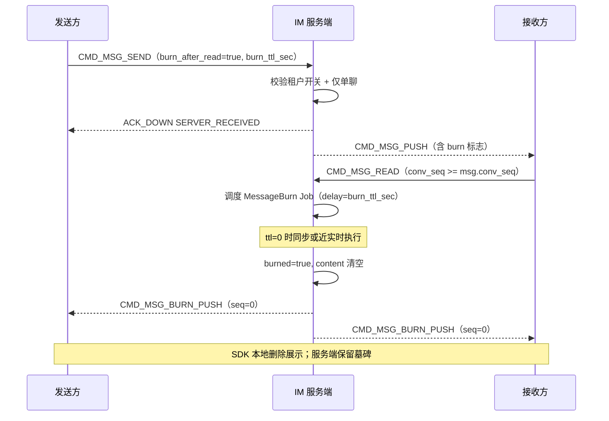
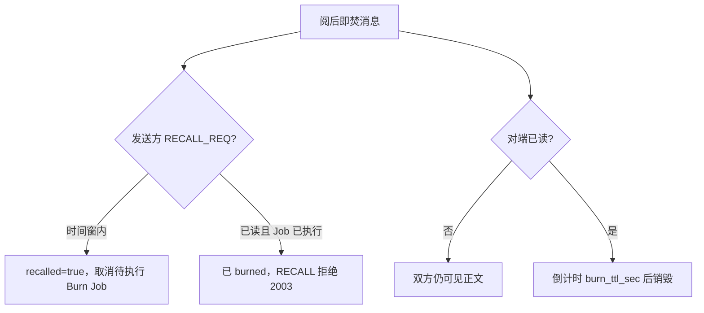

# 设计说明：阅后即焚

| 项 | 内容 |
| --- | --- |
| 状态 | **已确认** |
| 决策编号 | DD-036 |
| 规范定义 | [`proto/message.proto`](../../proto/message.proto)（`ChatMessage.burn_*`、`MsgBurn`）、[`proto/auth.proto`](../../proto/auth.proto)（`burn_*` 配置） |
| 行为约定 | [`protocol.md` §26](protocol/protocol.md#26-阅后即焚) |
| 索引 | [`design-decisions.md`](../design-decisions.md) |
| 实现文档 | [implementation/elixir/burn-after-read.md](../implementation/elixir/burn-after-read.md) |
| 相关 | [read-receipt.md](read-receipt.md)、[recall.md](recall.md)、[offline-pull.md](offline-pull.md) |

---

## 1. 要解决什么问题

用户发送**隐私敏感**单聊消息时，希望接收方**阅读后**消息在双方设备与服务端自动销毁，而非长期留在历史记录中。

与**撤回**的区别：撤回由发送方主动、有时间窗；阅后即焚由**对端已读**触发，销毁后展示「阅后即焚」而非「已撤回」。

---

## 2. 决策摘要（已确认）

| # | 决策 |
| --- | --- |
| 1 | **v1 仅支持单聊**（`CHAT_PRIVATE`）；群聊 / 聊天室发带 `burn_after_read` 的消息返回 `CODE_MSG_BURN_DENIED`（2006） |
| 2 | 发送时 `ChatMessage.burn_after_read=true`；可选 `burn_ttl_sec`（读后延迟销毁秒数，**0=立即**） |
| 3 | **触发**：对端（非发送方）`CMD_MSG_READ` 且 `conv_seq` **覆盖**该消息时，调度销毁任务 |
| 4 | 销毁：`burned=true`、**清空 `content`**、保留 `msg_id`/`conv_seq` 墓碑；`CMD_MSG_BURN_PUSH` 通知双方全设备 |
| 5 | 离线：销毁前可 `OFFLINE_PULL` 拉取正文；销毁后拉取得 `burned=true`、空 `content` |
| 6 | **不可编辑**；**可在撤回时间窗内撤回**（撤回优先，取消焚毁语义） |
| 7 | 租户可关：`burn_after_read_enabled`（默认 **true**）；`burn_ttl_sec` 上限 `burn_ttl_sec_max`（默认 **3600**） |
| 8 | 失败 `CMD_ERROR`（2006），**不关连接**；已销毁重复 `BURN_PUSH` 幂等 |

---

## 完整流程

### 发送 → 已读 → 销毁

### 与撤回并存

---

## 3. 触发规则

| 规则 | 说明 |
| --- | --- |
| 谁触发 | **接收方**（`from != 原消息发送者`）上报 `CMD_MSG_READ` |
| 覆盖判定 | `read.conv_seq >= message.conv_seq`（会话级位点覆盖该条） |
| 发送方已读 | **不**触发销毁（发送方在对方未读前仍可见） |
| 多设备 | 任一接收方设备已读即触发；销毁通知扇出双方**全部设备** |
| 延迟 | `burn_at = now + burn_ttl_sec`；Oban `IM.Jobs.MessageBurn` 幂等执行 |

---

## 4. 存储与离线

| 阶段 | `message_bodies` | `user_inbox` | 客户端展示 |
| --- | --- | --- | --- |
| 未读 | 正文完整 | 正常写扩散 2 行 | 显示「阅后即焚」角标 |
| 已读未销毁 | 正文完整 | 不变 | 倒计时（若 ttl>0） |
| 已销毁 | `burned=true`，`content` 空 | 瘦行保留（墓碑） | 「阅后即焚」占位，不可点开 |

- **不改** `msg_id` / `conv_seq`，离线游标不乱。
- `OFFLINE_PULL` 须返回已销毁消息的 `burned=true`，与 `recalled` 区分渲染。

---

## 5. 与撤回 / 编辑

| 操作 | 阅后即焚消息 |
| --- | --- |
| 编辑 | **拒绝**（`CODE_MSG_EDIT_DENIED`） |
| 撤回 | 时间窗内**允许**；成功后 `recalled=true`，**取消** pending Burn Job |
| 再发 READ | 已 `burned` 或 `recalled` 后忽略 |

---

## 6. 配置（租户 / 鉴权）

| 键 | 默认 | 说明 |
| --- | --- | --- |
| `burn_after_read_enabled` | `true` | Feature Flag：是否允许发阅后即焚消息 |
| `burn_ttl_sec_default` | `0` | 客户端未填 `burn_ttl_sec` 时使用 |
| `burn_ttl_sec_max` | `3600` | 单条消息 `burn_ttl_sec` 上限 |

`AuthResp` 下发 `burn_after_read_enabled`、`burn_ttl_sec_default`、`burn_ttl_sec_max`，供 SDK 展示与校验。

---

## 7. 刻意放弃（v1）

| 放弃 | 原因 |
| --- | --- |
| 群聊 / 聊天室阅后即焚 | 已读语义与成员数复杂；v2 再评估 |
| 客户端主动 BURN_REQ | 销毁仅由已读触发，减少滥用 |
| 截图检测 | 纯客户端能力，协议不涉及 |
| 硬 DELETE 行 | 保留墓碑保障 `conv_seq` 连续与审计 |

---

## 8. 监控

| 指标 | 说明 |
| --- | --- |
| `im_msg_burn_scheduled_total` | 已读触发调度次数 |
| `im_msg_burn_executed_total` | 实际销毁次数 |
| `im_msg_burn_lag_ms` | `burn_at` 与执行时刻差（histogram） |

---
