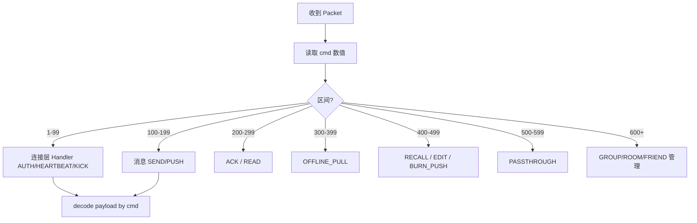

# 设计说明：命令字 CmdType

| 项 | 内容 |
| --- | --- |
| 状态 | **已确认** |
| 决策编号 | DD-004 |
| 规范定义 | [`proto/common.proto`](../../proto/common.proto)（`CmdType`） |
| 行为约定 | [`protocol.md` §4](protocol/protocol.md#4-命令字-cmdtype) |
| 索引 | [`design-decisions.md`](../design-decisions.md) |

本文说明命令字如何分区、为何拆分 ACK/撤回，以及为何增加编辑、透传独立分区。

---

## 1. 要解决什么问题

`Packet.cmd` 是网关与业务的第一分发键。需要同时满足：

- 热路径（心跳、推送、ACK）便宜、可识别
- 不同流量可分队列 / 限流（实时推送 vs 离线拉取 vs 信令）
- 后续加能力时有稳定「占号」规则，不挤占已分配数字

---

## 2. 决策摘要

1. 使用 **数值枚举** 命令字，并按能力 **分区留空**。
2. ACK 拆成 **`CMD_MSG_ACK_UP` / `CMD_MSG_ACK_DOWN`**（方向一眼可辨）。
3. 撤回拆成 **`CMD_MSG_RECALL_REQ` / `CMD_MSG_RECALL_PUSH`**。
4. 透传单独分区 **500–599**（`CMD_PASSTHROUGH = 500`）。
5. 增加编辑：**`CMD_MSG_EDIT_REQ` / `CMD_MSG_EDIT_PUSH`**（与撤回同属 400–499）。
6. 阅后即焚：**`CMD_MSG_BURN_PUSH`**（仅下行；发送仍用 `CMD_MSG_SEND` + `burn_after_read`）。

### 分区表

| 区间 | 用途 |
| --- | --- |
| 1–99 | 连接与会话 |
| 100–199 | 消息收发 |
| 200–299 | ACK / 已读 |
| 300–399 | 离线与同步 |
| 400–499 | 撤回 / 编辑 / 阅后即焚 |
| 500–599 | 透传 |
| 600–699 | 群组管理 |
| 700–799 | 聊天室管理 |
| 800–822 | 好友管理 |
| 900–906 | 应用通道（App Channel） |
| 1000+ | 预留扩展 |

---

## 完整流程



未注册 cmd → `CMD_ERROR` 或协议层拒绝。

---

## 3. 为什么这样设计

### 3.1 数字命令字 + 分区

| 点 | 意图与好处 |
| --- | --- |
| `uint32` cmd | 比较/路由快，包体小，适合心跳与推送热路径 |
| 按区间划分 | 网关可粗分流（如 `cmd/100`）；不同区可不同限流与线程池 |
| 区间内留空 | 同区加命令不必改已有数字，降低兼容风险 |

### 3.2 ACK_UP / ACK_DOWN

| 点 | 意图与好处 |
| --- | --- |
| 按方向拆 cmd | 上行「我已收到」、下行「服务端已收 / 对端已收」语义分离；单聊/群聊两档 ACK **均必达**（聊天室见 [message-model.md](message-model.md)） |
| 共用 `MsgAck` payload | 字段仍统一，只是 cmd 表达方向，实现简单 |
| 与 `CMD_MSG_READ` 分离 | 投递回执 ≠ 会话已读，语义与字段都不同 |

典型流向（**单聊/群聊：两档均必达**）：

```text
发送方 ← ACK_DOWN(SERVER_RECEIVED) ← 服务端     （第 1 档）
接收方 → ACK_UP(CLIENT_RECEIVED)   → 服务端     （接收方必须上报）
发送方 ← ACK_DOWN(CLIENT_RECEIVED) ← 服务端     （第 2 档，必须通知发送方）
```

聊天室：仅第 1 档 `SERVER_RECEIVED` 必达，不要求 `CLIENT_RECEIVED`。

### 3.3 RECALL_REQ + RECALL_PUSH

| 点 | 意图与好处 |
| --- | --- |
| 请求与推送分 cmd | 避免用 `seq==0` 才能区分「我发起的撤回」和「别人撤回通知」 |
| 共用 `MsgRecall` | 结构一致，减少两套字段 |
| 成功确认 | 对发起方：可用 `RECALL_PUSH` 且 `seq` 回传原请求作成功响应；对其他端：`seq=0` 广播 |

### 3.4 透传独立 500 段

| 点 | 意图与好处 |
| --- | --- |
| 与撤回/编辑分开 | 透传默认不进会话历史、不计未读，流量特征不同，宜单独限流与监控 |
| 预留 501–599 | 后续可加「仅在线透传 / 可持久透传」等变体命令而不挤占 400 段 |

### 3.5 编辑消息 EDIT_REQ + EDIT_PUSH

| 点 | 意图与好处 |
| --- | --- |
| 与撤回并列 | 都是「改历史」类控制面，同属 400 段 |
| REQ/PUSH 分离 | 同撤回，方向与角色清晰 |
| `edit_version` | 多端展示「已编辑」、冲突检测（旧版本覆盖拒绝） |
| 不新占 `msg_id` | 编辑的是同一条消息；排序位点仍用原 `conv_seq`（除非产品要求另发系统提示） |

### 3.6 阅后即焚 BURN_PUSH

| 点 | 意图与好处 |
| --- | --- |
| **仅下行** | 销毁由对端 `CMD_MSG_READ` 触发，无客户端 `BURN_REQ` |
| 与撤回/编辑并列 | 同属 400 段消息生命周期；`MsgBurn` 独立 payload |
| 发送仍用 `MSG_SEND` | `burn_after_read` 为 `ChatMessage` 标志，双通道与发消息一致 |

---

## 4. 刻意放弃

| 放弃 | 原因 |
| --- | --- |
| 单 cmd `MSG_ACK` + 只靠 status | 方向不直观，网关/客户端分支易错 |
| 单 cmd `MSG_RECALL` 请求推送复用 | `seq` 约定负担重，可读性差 |
| 透传与撤回同区 | 流量与落库策略差异大，观测与限流易搅在一起 |
| 编辑走普通 `MSG_SEND` 再发一条 | 会变成两条消息，会话语义与未读都被破坏 |

---

