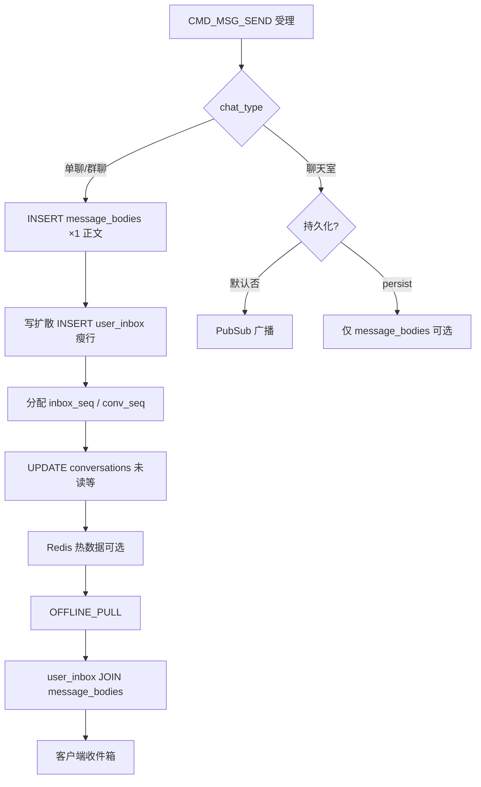

# 数据库设计

基于 WebSocket + Protobuf IM 协议的存储设计。

- 数据库：PostgreSQL
- 缓存：Redis
- Elixir 实现：[database.md](../../implementation/elixir/database.md)

---

## 完整流程（消息写入）



**单聊与群聊统一模型**（逻辑一致）：

1. `message_bodies`：**每条消息 1 行**（含 `content`）。
2. `user_inbox`：写扩散 **瘦行**（`msg_id` + `inbox_seq` + `conv_seq`）。
   - 单聊：**2 行**（发送方 + 接收方，与群聊相同语义）。
   - 群聊：**N 行**（每成员 1 行，含发送方）。
3. 离线拉取 / 会话内拉取：统一 **`user_inbox` JOIN `message_bodies`**。
4. 撤回/编辑/阅后即焚：只 `UPDATE message_bodies` 一处（阅后即焚另清空 `content`）。

分片键：`user_inbox` 按 `(app_key, user_id)`；`message_bodies` 按 `(app_key, msg_id)` JOIN。

---

## 通用约定

### 审计时间字段（`created_at` / `updated_at`）

所有**可变更**的业务表必须包含：

| 字段 | 写入时机 | 说明 |
|------|----------|------|
| `created_at` | **INSERT** | 记录创建时间，**创建后不得修改** |
| `updated_at` | **INSERT** 与 **每次 UPDATE** | 记录最后变更时间；任意字段更新时必须同步刷新 |

**规则（已确认）**：

1. **创建**：`created_at`、`updated_at` 均写入当前时间（DB `DEFAULT NOW()` 或应用层显式赋值，二者一致）。
2. **更新**：**必须**刷新 `updated_at`；禁止只改业务字段而不动 `updated_at`。
3. **禁止**在 UPDATE 中修改 `created_at`（纠错场景须走数据修复流程并留审计）。
4. **纯追加、永不 UPDATE** 的表（如审计日志）可仅保留 `created_at`；`message_bodies` 因撤回/编辑/阅后即焚会 UPDATE，仍保留两列。
5. 时间类型统一 **`TIMESTAMPTZ`**（UTC 存储）；应用层使用 `DateTime`（`utc_datetime_usec`），禁止混用 naive 本地时间。

**业务时间戳 vs 审计时间**（混用约定）：

| 用途 | 类型 | 示例字段 |
|------|------|----------|
| 审计 / 行生命周期 | `TIMESTAMPTZ` | `created_at`、`updated_at`、`burn_at`、`expires_at` |
| 消息排序 / 展示 / 禁言截止 | `BIGINT`（Unix **毫秒**） | `server_time`、`last_msg_time`、`muted_until` |

禁止在好友等业务表使用无时区 `TIMESTAMP`；与上表不一致的存量文档以本约定为准。

**引用完整性**：表间**不设外键**（便于分片与多库）；`app_key` + 业务 ID 由应用层保证一致性，删除/归档须走显式级联任务。

**典型场景**：

| 操作 | `created_at` | `updated_at` |
|------|--------------|--------------|
| `INSERT` 新用户 / 新会话 | 设当前时间 | 设当前时间 |
| `UPDATE` 群名称 | 不变 | **刷新** |
| 消息撤回 `recalled=true` | 不变 | **刷新** |
| `Repo.update_all` / 原生 SQL | 不变 | **必须** `SET updated_at = NOW()` |
| `INSERT ... ON CONFLICT DO UPDATE` | 不变（保留首次） | **刷新** |

实现细节见 [database.md §2](../../implementation/elixir/database.md#2-审计时间字段)。

---

## 一、数据库表设计

### 0. 分片策略

IM 消息数据具有「时间增长快、冷热分明、按用户/会话查询」的特点，需要合理的分片策略。

#### 分片原则

| 表 | 是否分片 | 分片键 | 说明 |
|---|--------|-------|------|
| `apps` | 否 | - | 租户配置表，数据量小 |
| `users` | 否 | - | 用户表，可按 app_key 分库 |
| `user_devices` | 否 | - | 设备表，数据量可控 |
| `groups` | 否 | - | 群组表，数据量可控 |
| `group_members` | 可选 | `(app_key, group_id)` | 群成员表，大群场景需分片 |
| `rooms` | 否 | - | 聊天室表，数据量可控 |
| `room_members` | 可选 | `(app_key, room_id)` | 聊天室成员表，大聊天室需分片 |
| `conversations` | 是 | `(app_key, user_id)` | 会话表，按用户分片 |
| `message_bodies` | 可选 | `(app_key, msg_id)` | 消息正文，全局 1 行/msg；可按时间分区 |
| `user_inbox` | **是** | `(app_key, user_id)` | 收件箱瘦行，按用户分片 + 时间分区 |
| `passthrough_messages` | 是 | `(app_key, user_id)` | 透传消息表，按用户分片 |
| `friendships` / `friend_requests` | 否 | - | 好友关系，按 app_key 分库即可 |
| `msg_sequences` | 否 | - | 序列号表，Redis 故障时的 PG 兜底 |

#### 消息表分片方案

**方案一：按用户分片（推荐）**

```sql
-- 分片键：(app_key, user_id)
-- 优点：离线拉取单用户消息无需跨分片
-- 适用：用户数为主要维度

-- 物理表命名：user_inbox_{shard_id}
-- shard_id = hash(app_key, user_id) % N
```

**方案二：按会话分片**

```sql
-- 分片键：(app_key, conv_id)
-- 优点：同一会话消息在同一分片，会话内排序高效
-- 缺点：大群消息集中在单分片，热点问题

-- shard_id = hash(app_key, conv_id) % N
```

**推荐方案一**，原因：

- 离线拉取按用户收件箱，**`user_inbox` 按 `user_id` 分片**最自然
- 单聊（2 行）与群聊（N 行）写扩散形态一致，仅行数不同
- `message_bodies` 按 `msg_id` 全局唯一，JOIN 按主键

#### 消息表时间分区

**注意**：离线拉取主路径按 **`inbox_seq`** 排序，不按 `created_at`。时间分区仅用于**归档 / 冷热分离**，不能替代 `(app_key, user_id)` 分片；异步 fanout 时 `inbox_seq` 与 `created_at` 可能跨月不对齐，跨分区拉取需扫多子表或放弃时间分区、改按 `inbox_seq` 范围归档。

```sql
-- 可选：在 (app_key, user_id) 分片之上，按月 RANGE 分区做冷数据卸载
-- 主查询仍走 idx_user_inbox_seq (app_key, user_id, inbox_seq)

CREATE TABLE user_inbox (
    ...
) PARTITION BY RANGE (created_at);

CREATE TABLE user_inbox_yyyy_mm PARTITION OF user_inbox
    FOR VALUES FROM ('<month-start>') TO ('<next-month-start>');
```

#### 冷热分离策略

| 数据状态 | 存储位置 | 访问方式 |
|---------|---------|---------|
| 热数据（7天内） | PostgreSQL 主库 | 实时查询 |
| 温数据（7-30天） | PostgreSQL 只读副本 | 离线拉取 |
| 冷数据（30天+） | 对象存储 / 归档库 | 按需恢复 |

```
数据流转：
PostgreSQL(热) → PostgreSQL只读(温) → 对象存储(冷) → 删除(过期)
```

**TTL 清理 Job（MVP）**：热数据超过租户 `msg_ttl_days`（默认 7）后由 Oban **硬删除**；温/冷归档为可选扩展。权威规格见 [message-ttl-cleanup.md](../message-ttl-cleanup.md)（DD-040）。

#### 中间件选择

| 方案 | 说明 |
|-----|------|
| 应用层分片 | 代码中计算 shard_id，灵活但侵入性强 |
| PostgreSQL FDW | 使用 postgres_fdw 实现透明分片 |
| Citus | PostgreSQL 分布式扩展，透明分片 |
| ShardingSphere | 代理层分片，对应用透明 |

**推荐**：初期应用层分片或 Citus，后期可迁移到 ShardingSphere。

---


### 1. 应用表 (apps)

租户级别的应用配置表。

```sql
CREATE TABLE apps (
    id              BIGSERIAL PRIMARY KEY,
    
    -- 应用标识
    app_key         VARCHAR(64) NOT NULL UNIQUE,       -- 应用唯一标识
    
    -- 应用信息
    name            VARCHAR(256) NOT NULL,             -- 应用名称
    description     TEXT,                              -- 应用描述
    owner_uid       VARCHAR(64),                       -- 应用所有者（业务侧用户 ID）
    
    -- 应用配置（默认值，可被 app_configs 覆盖）
    max_users       INTEGER NOT NULL DEFAULT 100000,   -- 最大用户数
    max_groups      INTEGER NOT NULL DEFAULT 1000,     -- 最大群组数
    max_rooms       INTEGER NOT NULL DEFAULT 100,      -- 最大聊天室数
    max_group_members INTEGER NOT NULL DEFAULT 5000,   -- 群最大成员数（上限 10000）
    max_room_members  INTEGER NOT NULL DEFAULT 10000,  -- 聊天室最大成员数（上限 50000）
    
    -- 消息配置（默认值）
    msg_ttl_days    INTEGER NOT NULL DEFAULT 7,        -- 消息保留天数
    push_batch_max  INTEGER NOT NULL DEFAULT 50,       -- 批量推送上限
    recall_window_sec  INTEGER NOT NULL DEFAULT 120,   -- 撤回时间窗（秒）
    edit_window_sec    INTEGER NOT NULL DEFAULT 120,   -- 编辑时间窗（秒）
    burn_after_read_enabled BOOLEAN NOT NULL DEFAULT TRUE,  -- 是否允许阅后即焚；见 burn-after-read.md
    burn_ttl_sec_default    INTEGER NOT NULL DEFAULT 0,     -- 阅后默认延迟销毁（秒）；0=立即
    burn_ttl_sec_max        INTEGER NOT NULL DEFAULT 3600,  -- burn_ttl_sec 上限
    offline_pull_limit INTEGER NOT NULL DEFAULT 50,    -- 离线拉取单页上限
    
    -- 心跳配置
    heartbeat_interval_sec INTEGER NOT NULL DEFAULT 30, -- 心跳间隔（秒）
    
    -- 状态
    status          SMALLINT NOT NULL DEFAULT 1,       -- 0=禁用, 1=启用
    
    -- 统计（冗余，可选）
    user_count      INTEGER NOT NULL DEFAULT 0,        -- 当前用户数
    daily_active_users INTEGER NOT NULL DEFAULT 0,     -- 日活用户数
    
    -- 元数据
    created_at      TIMESTAMPTZ NOT NULL DEFAULT NOW(),
    updated_at      TIMESTAMPTZ NOT NULL DEFAULT NOW()
);

-- 索引
CREATE INDEX idx_apps_owner ON apps (owner_uid);
CREATE INDEX idx_apps_status ON apps (status);
```

**设计说明**：

| 场景 | 说明 |
|------|------|
| 创建应用 | 注册 app_key，配置配额和参数 |
| 用户注册 | 校验 app_key 存在且启用 |
| 鉴权 | 从 app_key 获取配置（心跳间隔、撤回时间窗等） |
| 配额限制 | 检查 user_count、max_users 等 |

---

### 2. 应用配置表 (app_configs)

存储应用的可扩展配置项，支持运行时动态调整。

```sql
CREATE TABLE app_configs (
    id              BIGSERIAL PRIMARY KEY,
    
    -- 应用
    app_key         VARCHAR(64) NOT NULL,              -- 关联 apps.app_key
    
    -- 配置分类
    category        VARCHAR(64) NOT NULL,              -- 配置分类：message / group / room / push / security
    
    -- 配置项
    config_key      VARCHAR(128) NOT NULL,             -- 配置键
    config_value    TEXT NOT NULL,                     -- 配置值（JSON 或字符串）
    value_type      VARCHAR(32) NOT NULL DEFAULT 'string', -- 值类型：string / integer / boolean / json
    
    -- 描述
    description     TEXT,                              -- 配置说明
    
    -- 元数据
    created_at      TIMESTAMPTZ NOT NULL DEFAULT NOW(),
    updated_at      TIMESTAMPTZ NOT NULL DEFAULT NOW(),
    
    UNIQUE (app_key, category, config_key)
);

-- 索引
CREATE INDEX idx_app_configs_app ON app_configs (app_key);
CREATE INDEX idx_app_configs_category ON app_configs (app_key, category);
```

**配置分类示例**：

| category | config_key | value_type | 说明 |
|----------|-----------|------------|------|
| `message` | `msg_ttl_days` | integer | 消息保留天数 |
| `message` | `push_batch_max` | integer | 批量推送上限 |
| `message` | `recall_window_sec` | integer | 撤回时间窗 |
| `message` | `edit_window_sec` | integer | 编辑时间窗 |
| `message` | `burn_after_read_enabled` | boolean | 是否允许阅后即焚（Feature Flag） |
| `message` | `burn_ttl_sec_default` | integer | 阅后即焚默认读后延迟（秒） |
| `message` | `burn_ttl_sec_max` | integer | `burn_ttl_sec` 上限 |
| `message` | `offline_pull_limit` | integer | 离线拉取上限 |
| `message` | `msg_size_max` | integer | 消息大小上限（bytes） |
| `group` | `max_members` | integer | 群最大成员数（默认 5000，上限 10000） |
| `group` | `max_groups_per_user` | integer | 用户最大创建群数 |
| `room` | `max_members` | integer | 聊天室最大成员数（默认 10000，上限 50000） |
| `room` | `max_rooms_per_user` | integer | 用户最大创建聊天室数 |
| `push` | `apns_enabled` | boolean | 是否启用 APNs |
| `push` | `fcm_enabled` | boolean | 是否启用 FCM |
| `security` | `token_ttl_sec` | integer | Token 有效期 |
| `security` | `rate_limit_send` | integer | 发消息频率限制（次/分钟） |
| `friend` | `require_friend_to_send` | boolean | 须为好友才能单聊（默认 false，P8-09） |
| `device` | `max_devices_per_platform` | json | 各平台最大同时在线设备数，见 [auth.md](../auth.md) §8 |
| `device` | `device_limit_policy` | string | `reject` \| `kick_oldest_on_platform`（默认） |

**配置优先级**：

```
app_configs（特定配置） > apps（默认配置） > 系统默认值
```

**群成员数限制说明**：

| 配置项 | 默认值 | 上限 | 说明 |
|--------|--------|------|------|
| `max_group_members` | 5000 | 10000 | 群最大成员数；大群默认 `read_fanout` 控制 inbox 膨胀 |
| `group_read_fanout_enabled` | true | — | Feature Flag：是否允许超 threshold 自动读扩散 |
| `group_read_fanout_threshold` | 500 | — | 大于此人数且 Flag 开启时 `groups.storage_mode = read_fanout` |
| `max_room_members` | 10000 | 50000 | 聊天室最大成员数；PubSub 广播性能考量 |

**写扩散 inbox 行数估算**（`message_bodies` 恒为 **1 行/消息**）：

| 场景 | 每消息 `user_inbox` 行数 | 1 万条消息 inbox 行数 |
|------|--------------------------|----------------------|
| 单聊 | 2 | 2 万 |
| 100人群 | 100 | 100 万 |
| 5000人群（read_fanout） | 0 | 0（仅 bodies） |

正文 `BYTEA` 仅 **1 份/消息**；小群瓶颈在 inbox 行数，大群读扩散将写库降为 **1 INSERT/msg**，见 [group.md](../group.md) §6.3。

**大群写优化**（异步 fanout、读扩散等）见 [group.md](../group.md) §6、[database-design.md](database-design.md) §3。

---

### 3. 消息存储（`message_bodies` + `user_inbox`）

| `chat_type` | `message_bodies` | `user_inbox` 写扩散 | 离线拉取 |
|-------------|------------------|---------------------|----------|
| **单聊** | 1 行/消息 | **2 行**（双方各 1） | JOIN |
| **群聊** | 1 行/消息 | **小群**：N 行（写扩散）｜**大群**：0 行（读扩散，见 §3.1） | JOIN 或 `conv_seq` 直查 |
| **聊天室** | 默认不落库 | — | 不支持 `OFFLINE_PULL` |

单聊与群聊 **共用同一套** `MessageStore` / `OFFLINE_PULL` / 撤回编辑路径；小群（`write_fanout`）为写扩散，大群（`read_fanout`）为读扩散（见 [group.md](../group.md) §6.3）。

#### 3.1 大群读扩散（`read_fanout`）

当 `groups.storage_mode = read_fanout`（由 `FanoutPolicy` 按 Feature Flag + threshold 晋升，见 [group.md](../group.md) §6.3.1）时：

1. **仅** `INSERT message_bodies` 一行；**不**写 `user_inbox`。
2. 离线拉取：**必须** `OFFLINE_PULL` 带 `conv_id = g:{group_id}`，按 `conv_seq` 增量查 `message_bodies`。
3. 全局拉取（`conv_id` 空）**不包含**读扩散群消息；客户端须按会话列表逐群补拉。

```sql
-- groups 表存储模式（迁移时加列）
-- storage_mode: 'write_fanout' | 'read_fanout'（自动晋升后持久化，降员不回退）
-- storage_mode_override: NULL | 'write_fanout' | 'read_fanout'（管理端强制覆盖，审计留痕）

-- 每用户每群已同步游标（读扩散离线补拉）
CREATE TABLE group_read_cursors (
    app_key         VARCHAR(64) NOT NULL,
    user_id         VARCHAR(64) NOT NULL,
    group_id        VARCHAR(64) NOT NULL,
    last_conv_seq   BIGINT NOT NULL DEFAULT 0,
    updated_at      TIMESTAMPTZ NOT NULL DEFAULT NOW(),
    PRIMARY KEY (app_key, user_id, group_id)
);
```

**读扩散群 — 会话内拉取**（`conv_id` 非空）：

```sql
SELECT b.*
FROM message_bodies b
WHERE b.app_key = $1 AND b.conv_id = $2 AND b.conv_seq > $3
  AND (
    b.target_users IS NULL
    OR b.target_users @> jsonb_build_array($4::text)  -- 定向目标
    OR b.from_uid = $4                                 -- 发送方多端可见
  )
ORDER BY b.conv_seq ASC
LIMIT 50;
```

写扩散小群仍用 §3 原有 `user_inbox` JOIN 路径。

流程：

1. `INSERT message_bodies` 一行（`msg_id`、`content`、`conv_seq`、`chat_type`、…）。
2. 写扩散：`INSERT user_inbox` 每个收件人一行（`user_id`、`msg_id`、`inbox_seq`、`conv_seq`），**不含** `content`。
3. 撤回/编辑/阅后即焚：只 `UPDATE message_bodies` 一处（阅后即焚另清空 `content`）。

```sql
-- 每条消息 1 行（正文只存一份；单聊/群聊共用）
CREATE TABLE message_bodies (
    app_key         VARCHAR(64) NOT NULL,
    msg_id          VARCHAR(64) NOT NULL,
    chat_type       SMALLINT NOT NULL,
    conv_id         VARCHAR(128) NOT NULL,
    from_uid        VARCHAR(64) NOT NULL,
    to_id           VARCHAR(64) NOT NULL,
    msg_type        SMALLINT NOT NULL,
    content         BYTEA NOT NULL,
    server_time     BIGINT NOT NULL,
    conv_seq        BIGINT NOT NULL,
    client_msg_id   VARCHAR(64),
    target_users    JSONB,
    recalled        BOOLEAN NOT NULL DEFAULT FALSE,
    edit_version    INTEGER NOT NULL DEFAULT 0,
    burn_after_read BOOLEAN NOT NULL DEFAULT FALSE,
    burn_ttl_sec    INTEGER NOT NULL DEFAULT 0,
    burned          BOOLEAN NOT NULL DEFAULT FALSE,
    burn_at         TIMESTAMPTZ,                    -- 计划销毁时间；Oban Job 依据
    ext             JSONB,
    created_at      TIMESTAMPTZ NOT NULL DEFAULT NOW(),
    updated_at      TIMESTAMPTZ NOT NULL DEFAULT NOW(),
    PRIMARY KEY (app_key, msg_id)
);

CREATE UNIQUE INDEX idx_message_bodies_conv ON message_bodies (app_key, conv_id, conv_seq);
CREATE UNIQUE INDEX idx_message_bodies_client_msg
  ON message_bodies (app_key, from_uid, client_msg_id)
  WHERE client_msg_id IS NOT NULL;
CREATE INDEX idx_message_bodies_burn_pending
  ON message_bodies (burn_at)
  WHERE burned = FALSE AND burn_at IS NOT NULL;

-- 每个收件人 1 行（瘦行，仅引用 msg_id）
CREATE TABLE user_inbox (
    app_key         VARCHAR(64) NOT NULL,
    user_id         VARCHAR(64) NOT NULL,
    msg_id          VARCHAR(64) NOT NULL,
    conv_id         VARCHAR(128) NOT NULL,
    inbox_seq       BIGINT NOT NULL,
    conv_seq        BIGINT NOT NULL,
    created_at      TIMESTAMPTZ NOT NULL DEFAULT NOW(),
    PRIMARY KEY (app_key, user_id, msg_id)
);

CREATE UNIQUE INDEX idx_user_inbox_seq ON user_inbox (app_key, user_id, inbox_seq);
CREATE INDEX idx_user_inbox_conv ON user_inbox (app_key, user_id, conv_id, conv_seq);
```

`target_users` 为 **JSON 字符串数组**（如 `["u1","u2"]`）；判断可见性用 `@>` / `jsonb_build_array`，**禁止**对数组使用 `?`（`?` 仅用于 object 的 key）。

**定向消息写扩散**（`target_users` 非空，与 [protocol.md](../protocol/protocol.md) / [group.md](../group.md) §6.1 一致）：
- `message_bodies` 仍只写 1 行（记录 `target_users`）
- `user_inbox` **只插入** `target_users` ∪ {发送方}；非目标成员无行，故全局 `OFFLINE_PULL` 自然不可见
- 会话内拉取 / 读扩散 SQL 仍须带 `@>` 过滤（防御性；也覆盖发送方不在 `target_users` 数组里、但应可见的情况——此时过滤条件应为「在 `target_users` 中 **或** `from = 当前用户`」）

**离线拉取（全量收件箱，`conv_id` 空）**：

```sql
SELECT b.*, i.inbox_seq
FROM user_inbox i
JOIN message_bodies b ON b.app_key = i.app_key AND b.msg_id = i.msg_id
WHERE i.app_key = $1 AND i.user_id = $2 AND i.inbox_seq > $3
ORDER BY i.inbox_seq ASC
LIMIT 50;
```

**会话内拉取（`conv_id` 非空）**：

```sql
SELECT b.*, i.inbox_seq
FROM user_inbox i
JOIN message_bodies b ON b.app_key = i.app_key AND b.msg_id = i.msg_id
WHERE i.app_key = $1 AND i.user_id = $2 AND i.conv_id = $3 AND i.conv_seq > $4
  AND (
    b.target_users IS NULL
    OR b.target_users @> jsonb_build_array($2::text)
    OR b.from_uid = $2
  )
ORDER BY i.conv_seq ASC
LIMIT 50;
```

**读扩散大群**：仅 `message_bodies`；`group_read_cursors` 记录 `last_conv_seq`，不写 `user_inbox`。见 §3.1、[group.md](../group.md) §6.3。

**聊天室消息存储规则**（不走 `user_inbox`）：

| 条件 | 存储方式 | user_id | inbox_seq | 离线拉取 |
|------|---------|---------|-----------|---------|
| `persist_msg=false`（默认） | 不存储 | - | - | 不支持 |
| `persist_msg=true` | `message_bodies` 单条 | — | 不填 | REST 查历史 |

---

### 4. 会话表 (conversations)

存储用户会话列表。

```sql
CREATE TABLE conversations (
    id              BIGSERIAL PRIMARY KEY,
    
    -- 租户与用户
    app_key         VARCHAR(64) NOT NULL,
    user_id         VARCHAR(64) NOT NULL,              -- 会话所属用户
    
    -- 会话信息
    chat_type       SMALLINT NOT NULL,
    conv_id         VARCHAR(128) NOT NULL,
    peer_id         VARCHAR(64),                       -- 单聊对端 uid；群/聊天室为 to_id
    
    -- 最新消息（冗余，用于会话列表展示）
    last_msg_id     VARCHAR(64),
    last_msg_type   SMALLINT,
    last_msg_preview VARCHAR(256),                     -- 消息预览（文本截断或类型描述）
    last_msg_time   BIGINT,                            -- 最新消息时间
    last_msg_seq    BIGINT,                            -- 最新消息 conv_seq
    
    -- 未读与已读位点（见 unread-count.md、read-receipt.md）
    unread_count    INTEGER NOT NULL DEFAULT 0,
    last_read_conv_seq BIGINT NOT NULL DEFAULT 0,      -- 已读到的最大 conv_seq；CMD_MSG_READ 更新
    
    -- 置顶与免打扰
    pinned          BOOLEAN NOT NULL DEFAULT FALSE,    -- 是否置顶
    muted           BOOLEAN NOT NULL DEFAULT FALSE,    -- 是否免打扰
    
    -- 元数据
    created_at      TIMESTAMPTZ NOT NULL DEFAULT NOW(),
    updated_at      TIMESTAMPTZ NOT NULL DEFAULT NOW(),
    
    UNIQUE (app_key, user_id, conv_id)
);

-- 索引
CREATE INDEX idx_conversations_user ON conversations (app_key, user_id, updated_at DESC);
CREATE INDEX idx_conversations_unread ON conversations (app_key, user_id, unread_count) WHERE unread_count > 0;
```

---

### 5. 群组表 (groups)

```sql
CREATE TABLE groups (
    id              BIGSERIAL PRIMARY KEY,
    
    -- 租户
    app_key         VARCHAR(64) NOT NULL,
    
    -- 群信息
    group_id        VARCHAR(64) NOT NULL,              -- 群 ID
    name            VARCHAR(256) NOT NULL,             -- 群名
    owner_uid       VARCHAR(64) NOT NULL,              -- 群主 user_id
    announcement    TEXT,                              -- 群公告
    
    -- 群配置
    max_members     INTEGER NOT NULL DEFAULT 5000,     -- 最大成员数；建群时从 apps.max_group_members 写入
    member_count    INTEGER NOT NULL DEFAULT 0,        -- 当前成员数
    
    -- 消息配置
    persist_msg     BOOLEAN NOT NULL DEFAULT TRUE,     -- 是否持久化消息
    storage_mode    VARCHAR(32) NOT NULL DEFAULT 'write_fanout',  -- write_fanout | read_fanout
    storage_mode_override VARCHAR(32),                 -- 可选强制覆盖；NULL 表示走 FanoutPolicy
    
    -- 元数据
    created_at      TIMESTAMPTZ NOT NULL DEFAULT NOW(),
    updated_at      TIMESTAMPTZ NOT NULL DEFAULT NOW(),
    
    UNIQUE (app_key, group_id)
);

CREATE INDEX idx_groups_owner ON groups (app_key, owner_uid);
```

---

### 6. 群成员表 (group_members)

```sql
CREATE TABLE group_members (
    id              BIGSERIAL PRIMARY KEY,
    
    -- 租户与群
    app_key         VARCHAR(64) NOT NULL,
    group_id        VARCHAR(64) NOT NULL,
    
    -- 成员
    user_id         VARCHAR(64) NOT NULL,
    role            SMALLINT NOT NULL DEFAULT 0,       -- 角色：0=普通成员, 1=管理员, 2=群主
    
    -- 成员状态
    muted_until     BIGINT NOT NULL DEFAULT 0,         -- 禁言截止时间（ms）；0=未禁言
    
    -- 元数据
    joined_at       TIMESTAMPTZ NOT NULL DEFAULT NOW(),
    
    UNIQUE (app_key, group_id, user_id)
);

CREATE INDEX idx_group_members_user ON group_members (app_key, user_id);
```

---

### 7. 聊天室表 (rooms)

```sql
CREATE TABLE rooms (
    id              BIGSERIAL PRIMARY KEY,
    
    -- 租户
    app_key         VARCHAR(64) NOT NULL,
    
    -- 聊天室信息
    room_id         VARCHAR(64) NOT NULL,
    name            VARCHAR(256) NOT NULL,
    owner_uid       VARCHAR(64) NOT NULL,
    
    -- 聊天室配置
    max_members     INTEGER NOT NULL DEFAULT 10000,
    member_count    INTEGER NOT NULL DEFAULT 0,
    
    -- 消息配置
    persist_msg     BOOLEAN NOT NULL DEFAULT FALSE,    -- 聊天室默认不持久化
    msg_ttl_sec     INTEGER NOT NULL DEFAULT 300,      -- 消息短时缓存 TTL（秒）；默认 300；仅 persist_msg=true 时有效
    
    -- 元数据
    created_at      TIMESTAMPTZ NOT NULL DEFAULT NOW(),
    updated_at      TIMESTAMPTZ NOT NULL DEFAULT NOW(),
    
    UNIQUE (app_key, room_id)
);

CREATE INDEX idx_rooms_owner ON rooms (app_key, owner_uid);
```

**聊天室消息持久化说明**：

| 字段 | 说明 |
|------|------|
| `persist_msg` | 是否持久化到 `message_bodies`；默认 false |
| `msg_ttl_sec` | 消息短时缓存 TTL，默认 **300** 秒；过期后自动清理；与 `protocol.md` / `room.proto` 一致 |

**持久化行为**（`persist_msg=true`）：
- 消息仅写入 `message_bodies`（**不写** `user_inbox`、不写扩散）
- **不进离线拉取主路径**（用户需通过 REST API 主动查询历史）
- 设置 TTL，过期后由 `IM.Jobs.RoomMessageTtlPurge` 分批移除（见 [message-ttl-cleanup.md](../message-ttl-cleanup.md) §5.2）
- 查询历史消息：REST API `GET /rooms/{room_id}/messages?start_time=&end_time=`

**不持久化行为**（`persist_msg=false`，默认）：
- 消息仅实时广播在线成员
- 不写入数据库，无历史消息
- 成员离线后无法找回

---

### 8. 聊天室成员表 (room_members)

```sql
CREATE TABLE room_members (
    id              BIGSERIAL PRIMARY KEY,
    
    -- 租户与聊天室
    app_key         VARCHAR(64) NOT NULL,
    room_id         VARCHAR(64) NOT NULL,
    
    -- 成员
    user_id         VARCHAR(64) NOT NULL,
    
    -- 元数据
    joined_at       TIMESTAMPTZ NOT NULL DEFAULT NOW(),
    
    UNIQUE (app_key, room_id, user_id)
);

CREATE INDEX idx_room_members_user ON room_members (app_key, user_id);
```

---

### 9. 用户表 (users)

```sql
CREATE TABLE users (
    id              BIGSERIAL PRIMARY KEY,
    
    -- 租户与用户
    app_key         VARCHAR(64) NOT NULL,
    user_id         VARCHAR(64) NOT NULL,              -- 业务用户 ID
    nickname        VARCHAR(256),                      -- 昵称
    avatar_url      VARCHAR(512),                      -- 头像 URL
    
    -- 用户配置
    muted           BOOLEAN NOT NULL DEFAULT FALSE,    -- 全局免打扰
    
    -- 元数据
    created_at      TIMESTAMPTZ NOT NULL DEFAULT NOW(),
    updated_at      TIMESTAMPTZ NOT NULL DEFAULT NOW(),
    
    UNIQUE (app_key, user_id)
);
```

---

### 10. 用户设备表 (user_devices)

```sql
CREATE TABLE user_devices (
    id              BIGSERIAL PRIMARY KEY,
    
    -- 租户与用户
    app_key         VARCHAR(64) NOT NULL,
    user_id         VARCHAR(64) NOT NULL,
    device_id       VARCHAR(64) NOT NULL,
    
    -- 设备信息
    platform        VARCHAR(32) NOT NULL,              -- ios / android / web / desktop
    push_token      VARCHAR(256),                      -- 推送 Token（APNs/FCM 等）
    sdk_ver         VARCHAR(32),
    
    -- 状态
    online          BOOLEAN NOT NULL DEFAULT FALSE,
    last_active_at  TIMESTAMPTZ,
    banned_at       TIMESTAMPTZ,                       -- 非 NULL 表示设备被封禁，禁止 HTTP 登录与 WS 鉴权
    ban_reason      VARCHAR(64),                       -- admin / risk / ...
    clear_local_data_pending BOOLEAN NOT NULL DEFAULT FALSE,  -- 待 SDK 清除本地数据（见 auth.md §9.8）
    
    -- 元数据
    created_at      TIMESTAMPTZ NOT NULL DEFAULT NOW(),
    updated_at      TIMESTAMPTZ NOT NULL DEFAULT NOW(),
    
    UNIQUE (app_key, user_id, device_id)
);

CREATE INDEX idx_user_devices_user ON user_devices (app_key, user_id);
```

**封禁**：`banned_at IS NOT NULL` 时拒绝 `POST /api/v1/sessions` 与 `CMD_AUTH_REQ`；封禁时吊销该设备 token 并 `CMD_KICK`（见 [auth.md](../auth.md) §9.6）。

**清除本地数据**：`clear_local_data_pending = true` 时，HTTP 登录与 `AuthResp` 返回 `clear_local_data: true`；SDK 调用 `POST /api/v1/devices/{device_id}/local-data-cleared` 后清零（见 §9.8）。

---

### 10.1 访问令牌表 (access_tokens)

HTTP 登录签发的 **长连接 / REST 共用** access token（仅存 hash，不明文落库）。

```sql
CREATE TABLE access_tokens (
    id              BIGSERIAL PRIMARY KEY,

    app_key         VARCHAR(64) NOT NULL,
    user_id         VARCHAR(64) NOT NULL,
    device_id       VARCHAR(64) NOT NULL,

    token_hash      VARCHAR(64) NOT NULL,              -- SHA-256 等；唯一
    expires_at      TIMESTAMPTZ NOT NULL,
    revoked_at      TIMESTAMPTZ,                       -- 登出、封禁、改密时设置

    created_at      TIMESTAMPTZ NOT NULL DEFAULT NOW(),
    updated_at      TIMESTAMPTZ NOT NULL DEFAULT NOW(),

    UNIQUE (token_hash)
);

CREATE INDEX idx_access_tokens_user_device
    ON access_tokens (app_key, user_id, device_id)
    WHERE revoked_at IS NULL;

CREATE INDEX idx_access_tokens_expires
    ON access_tokens (expires_at)
    WHERE revoked_at IS NULL;
```

校验顺序：`revoked_at` → `expires_at` → `user_devices.banned_at` → 用户状态。

---

### 10.2 审计日志表 (audit_logs)

鉴权等审计事件（append-only，仅 `created_at`；见 observability DD-028 / auth-module §8）。由 `IM.Audit` 异步写入，**不**走 stdout 高频日志。

```sql
CREATE TABLE audit_logs (
    id              BIGSERIAL PRIMARY KEY,
    event           VARCHAR(64) NOT NULL,              -- auth_login / auth_failed …
    app_key         VARCHAR(64),
    user_id         VARCHAR(64),
    device_id       VARCHAR(64),
    strategy        VARCHAR(32),
    result          VARCHAR(16) NOT NULL,              -- success / failure
    reason          VARCHAR(256),
    client_ip       VARCHAR(64),
    user_agent      VARCHAR(256),
    created_at      TIMESTAMPTZ NOT NULL DEFAULT NOW()
);

CREATE INDEX idx_audit_logs_app_created ON audit_logs (app_key, created_at);
CREATE INDEX idx_audit_logs_event_created ON audit_logs (event, created_at);
```

---

### 11. 透传消息暂存表 (passthrough_messages)

用于 `persist=true` 的透传消息离线暂存。

```sql
CREATE TABLE passthrough_messages (
    id              BIGSERIAL PRIMARY KEY,
    
    -- 租户与用户
    app_key         VARCHAR(64) NOT NULL,
    user_id         VARCHAR(64) NOT NULL,              -- 目标用户
    
    -- 透传信息
    chat_type       SMALLINT NOT NULL,
    conv_id         VARCHAR(128) NOT NULL,
    from_uid        VARCHAR(64) NOT NULL,
    to_id           VARCHAR(64) NOT NULL,
    action          VARCHAR(64) NOT NULL,              -- 业务动作名
    data            BYTEA NOT NULL,                    -- 业务自定义载荷
    ttl_sec         INTEGER NOT NULL DEFAULT 604800,   -- 持久化 TTL（秒）；默认 7 天；上限 7 天
    
    -- 元数据
    created_at      TIMESTAMPTZ NOT NULL DEFAULT NOW(),
    expires_at      TIMESTAMPTZ NOT NULL               -- 过期时间 = created_at + ttl_sec
);

CREATE INDEX idx_passthrough_user ON passthrough_messages (app_key, user_id, created_at);
CREATE INDEX idx_passthrough_expires ON passthrough_messages (expires_at);
```

**过期清理**：`IM.Jobs.PassthroughTtlPurge` 每小时分批 `DELETE ... WHERE expires_at < NOW()`（见 [message-ttl-cleanup.md](../message-ttl-cleanup.md) §5.3）。**禁止**在 partial index 谓词中使用 `NOW()`（volatile，建索引会失败）。

**TTL 管理说明**：

| 字段 | 说明 |
|------|------|
| `ttl_sec` | 客户端指定的 TTL（秒）；默认 604800（7 天）；上限 604800 |
| `expires_at` | 计算字段：`created_at + ttl_sec`；用于过期清理 |

**业务场景示例**：

| action | 建议 ttl_sec | 说明 |
|--------|-------------|------|
| typing / typing_stop | 30 | 打字提示短期有效 |
| stream_signal | 300 | 信令 5 分钟有效 |
| 其他业务 | 604800 | 默认 7 天 |

---

### 12. 消息序列号表 (msg_sequences)

Redis 为 **`conv_seq` / `inbox_seq` 发号的权威源**（低延迟 `INCR`）；本表为 **Redis 不可用时的 PG 兜底** 与 **对账回填**，二者不得长期双写不同步。

**`msg_id`** 不走本表主路径，见 [msg-id-snowflake.md](../msg-id-snowflake.md)（DD-039）：Snowflake 本机 + `seq_type='msg_id_fallback'` PG 兜底。

| 场景 | 行为 |
|------|------|
| 正常（conv/inbox） | `IM.Services.Sequence` → Redis `INCR`；可选异步刷写 `msg_sequences.current_val` |
| 正常（msg_id） | `IM.Services.MsgId` → Snowflake；worker 租约见 `id_workers` / Redis `im:id:worker:*` |
| Redis 故障（conv/inbox） | `INSERT ... ON CONFLICT` 或 `SELECT ... FOR UPDATE` 递增 `msg_sequences` |
| 降级（msg_id） | `msg_sequences` `seq_type='msg_id_fallback'` 递增，bit 62=1 命名空间 |
| 恢复 | conv/inbox：Redis 与 PG 较大值合并；msg_id 兜底计数器与 `message_bodies` 对账（Oban） |

用于分配 `conv_seq`、`inbox_seq`；以及 **`msg_id` 仅兜底路径**。

```sql
CREATE TABLE msg_sequences (
    id              BIGSERIAL PRIMARY KEY,
    
    -- 序列类型
    app_key         VARCHAR(64) NOT NULL,
    seq_type        VARCHAR(32) NOT NULL,              -- 'conv_seq' / 'inbox_seq' / 'msg_id_fallback'
    seq_key         VARCHAR(128) NOT NULL,             -- 具体键值（如 conv_id / user_id）；兜底为 '__global__'
    
    -- 序列值
    current_val     BIGINT NOT NULL DEFAULT 0,
    
    -- 元数据
    updated_at      TIMESTAMPTZ NOT NULL DEFAULT NOW(),
    
    UNIQUE (app_key, seq_type, seq_key)
);

-- Snowflake worker 租约镜像（见 msg-id-snowflake.md §2.2）
CREATE TABLE id_workers (
    worker_id       SMALLINT PRIMARY KEY,           -- 0..1023
    node_name       VARCHAR(255) NOT NULL,
    lease_until     TIMESTAMPTZ NOT NULL,
    updated_at      TIMESTAMPTZ NOT NULL DEFAULT NOW()
);
```

---

### 13. 好友关系表 (friendships)

与 [friend.md](../friend.md) §5 对齐；拉黑状态 `status = 'blocked'`，权威源经 [permission-cache.md](../permission-cache.md) 同步 Redis。

```sql
CREATE TABLE friendships (
    id              BIGSERIAL PRIMARY KEY,

    app_key         VARCHAR(64) NOT NULL,
    user_id         VARCHAR(64) NOT NULL,
    friend_user_id  VARCHAR(64) NOT NULL,
    status          VARCHAR(20) NOT NULL,              -- pending / accepted / blocked / deleted
    remark          VARCHAR(100),

    created_at      TIMESTAMPTZ NOT NULL DEFAULT NOW(),
    updated_at      TIMESTAMPTZ NOT NULL DEFAULT NOW(),

    UNIQUE (app_key, user_id, friend_user_id)
);

CREATE INDEX idx_friendships_user ON friendships (app_key, user_id);
CREATE INDEX idx_friendships_friend ON friendships (app_key, friend_user_id);
CREATE INDEX idx_friendships_status ON friendships (app_key, user_id, status);
```

---

### 14. 好友请求表 (friend_requests)

```sql
CREATE TABLE friend_requests (
    id              BIGSERIAL PRIMARY KEY,

    app_key         VARCHAR(64) NOT NULL,
    request_id      VARCHAR(64) NOT NULL,
    from_user_id    VARCHAR(64) NOT NULL,
    to_user_id      VARCHAR(64) NOT NULL,
    message         VARCHAR(500),
    status          VARCHAR(20) NOT NULL,              -- pending / accepted / rejected / expired

    created_at      TIMESTAMPTZ NOT NULL DEFAULT NOW(),
    updated_at      TIMESTAMPTZ NOT NULL DEFAULT NOW(),
    expires_at      TIMESTAMPTZ NOT NULL,

    UNIQUE (request_id),
    UNIQUE (app_key, from_user_id, to_user_id, created_at)
);

CREATE INDEX idx_friend_requests_to ON friend_requests (app_key, to_user_id, status);
CREATE INDEX idx_friend_requests_from ON friend_requests (app_key, from_user_id);
```

---

## 二、Redis 缓存设计

> **Agent Skill**：通用 Redis 建模见上游 [`redis/agent-skills`](https://github.com/redis/agent-skills)（[`.agents/skills/`](../../../.agents/skills/README.md)）；**本节为 IM 业务键空间权威定义**，冲突时以本节为准。

### 键名约定

| 规则 | 说明 |
|------|------|
| **前缀** | 业务键一律 `im:` 开头，冒号分层 |
| **租户** | 多租户键含 `{app_key}` |
| **Cluster** | 需同槽多键操作用 hash tag：`im:{app_key}:seq:inbox:{user_id}`（`{app_key}` 为 tag） |
| **在线定位** | **主路径** `Phoenix.Tracker`（进程内）；Redis **不**存连接真相，见 §1 |
| **离线消息** | **仅 PostgreSQL** `user_inbox` + `OFFLINE_PULL`；**无** Redis 离线消息队列 |
| **透传暂存** | `persist=true` **仅** `passthrough_messages` 表；**无** Redis 透传队列 |

**权限热缓存**（拉黑 / 禁言 / 设备封禁 / 内部 API 封禁）见 §13 与 [permission-cache.md](../permission-cache.md)。

---

### 0. 应用配置缓存

```
Key:   im:app_config:{app_key}
Type:  Hash
Value:
  name, max_users, msg_ttl_days, push_batch_max,
  recall_window_sec, edit_window_sec,
  burn_after_read_enabled, burn_ttl_sec_default, burn_ttl_sec_max,
  offline_pull_limit, heartbeat_interval_sec, status
TTL:   5 分钟（配置变更时主动 DEL）

Key:   im:app_stats:{app_key}
Type:  Hash
Value: user_count, daily_active_users
TTL:   1 小时
```

---

### 1. 连接辅助（可选，非权威）

**权威在线状态**：`Phoenix.Tracker` / 本节点 `Registry`（见 [modular-architecture.md](../modular-architecture.md)、[architecture-overview.md](../architecture-overview.md)）。

下列键 **仅** 用于跨网关统计、运维看板等非推送热路径；**推送投递不得依赖** Redis `conn` 键。

```
Key:   im:conn:{app_key}:{user_id}:devices
Type:  Set — device_id；连接建立 SADD / 断开 SREM

Key:   im:conn:{app_key}:{user_id}:{device_id}
Type:  Hash — session_id, gateway_addr, platform, connected_at
TTL:   无（断开时 DEL）
```

---

### 2. 序列号（发号）

Redis **权威**；PG `msg_sequences` 兜底，见 §一.12 与 §三.2。

```
Key:   im:{app_key}:seq:inbox:{user_id}     # INCR → inbox_seq
Key:   im:{app_key}:seq:conv:{conv_id}      # INCR → conv_seq
Key:   im:id:worker:{worker_id}             # Snowflake worker 租约（DD-039）
TTL:   租约 key EX 30s，进程每 10s 续期
```

**`msg_id`**：Snowflake 本机发号，**无** `im:{app_key}:seq:msg_id`（见 [msg-id-snowflake.md](../msg-id-snowflake.md)）。

**冷启动**：conv/inbox Redis key 不存在时，从 PG `msg_sequences` / `MAX(inbox_seq)` 取较大值 `SET` 后再 `INCR`；`msg_id` 兜底计数器见 Snowflake 文档 §3.2。

---

### 3. 消息去重（幂等）

```
# 请求级（Packet.cid）— 同 WebSocket 连接内去重
Key:   im:dedup:cid:{conn_id}:{cid}
Type:  String — 处理结果（msg_id 等）
TTL:   5 分钟
说明:  conn_id 为网关分配的连接标识；重连换新 conn_id，业务幂等靠 client_msg_id

# 消息级（client_msg_id）
Key:   im:dedup:msg:{app_key}:{from_uid}:{client_msg_id}
Type:  String — msg_id
TTL:   24 小时
说明:  DB UNIQUE (app_key, from_uid, client_msg_id) 为最终保障
```

---

### 4. 群组成员缓存

```
Key:   im:group_members:{app_key}:{group_id}
Type:  Set — user_id
TTL:   1 小时（成员变更时 DEL）

Key:   im:group_member_count:{app_key}:{group_id}
Type:  String
TTL:   1 小时
```

---

### 5. 聊天室成员缓存

```
Key:   im:room_online:{app_key}:{room_id}
Type:  Set — user_id（在线；离开 SREM）

Key:   im:room_member_count:{app_key}:{room_id}
Type:  String
TTL:   5 分钟
```

---

### 6. 会话与未读数缓存

```
# 会话列表（首页）
Key:   im:user_conversations:{app_key}:{user_id}
Type:  ZSet — score: last_msg_time；member: conv_id
TTL:   5 分钟

# 单会话详情
Key:   im:conversation:{app_key}:{user_id}:{conv_id}
Type:  Hash
Value: chat_type, peer_id, last_msg_id, last_msg_time,
       unread_count, last_read_conv_seq, pinned, muted
TTL:   5 分钟

# 未读数热路径（大群写扩散等；见 unread-count.md §11.1）
Key:   im:unread:{app_key}:{user_id}
Type:  Hash — field: conv_id；value: 未读计数
更新:  收消息 HINCRBY；已读 HSET field 0；异步刷 conversations.unread_count
TTL:   5 分钟（读 miss 回源 PG）
```

`last_read_conv_seq` **权威在 PG** `conversations`；Redis 为读加速，已读须先写 PG 再更新 Redis。

---

### 7. Token 校验缓存

Token 绑定 `(app_key, user_id, device_id)`（见 [auth.md](../auth.md) §9.5）；校验时先 hash 再查缓存。

```
Key:   im:token:{token_hash}
Type:  String（JSON）— app_key, user_id, device_id, expires_at, revoked
TTL:   min(剩余有效期, 配置上限)
```

吊销 / 登出 / 封禁：`DEL im:token:{token_hash}`；按用户批量吊销时扫 `access_tokens` 表逐条 DEL（或维护 `im:user_token_hashes:{app_key}:{user_id}` SET 辅助，可选）。

---

### 8. 限流计数器

```
Key:   im:ratelimit:{app_key}:{user_id}:{action}
Type:  ZSet — score: 时间戳；member: 请求 ID
TTL:   窗口时长

Key:   im:ratelimit:count:{app_key}:{user_id}:{action}:{minute}
Type:  String
TTL:   1 分钟
```

---

### 9. 权限与内部 API 封禁（摘要）

完整语义见 [permission-cache.md](../permission-cache.md) §3。

| Key | 类型 | 用途 |
|-----|------|------|
| `im:block:{app_key}:{blocker_user_id}` | SET | 拉黑列表；`SISMEMBER` |
| `im:mute:{app_key}:{group_id}` | ZSET | 禁言；score=`muted_until` ms |
| `im:device_ban:{app_key}:{device_id}` | STRING | 设备封禁 |
| `im:internal_caller_block:{app_key}` | SET | 内部 API 调用方封禁 |
| `im:internal_ip_block:{app_key}` | SET | 封禁 IP（单 IP）；CIDR 规则见 PG + 启动加载 |

---

### 10. 刻意不设 Redis 的结构

| 原草案 | 决策 |
|--------|------|
| `offline_queue`（List） | **删除**；离线消息真相在 `user_inbox`，上线 `OFFLINE_PULL` |
| `passthrough_queue`（List） | **删除**；`persist=true` 仅 `passthrough_messages` 表，上线后 PG 扫描 PUSH |

推送失败：消息已落 PG inbox 时，用户上线拉取；未落库前失败按业务重试，**不写** Redis 消息队列。

---

## 三、关键设计说明

**设计说明**：

| 条件 | 存储方式 | user_id | inbox_seq | 离线拉取 |
|------|---------|---------|-----------|---------|
| **单聊 / 群聊** | `message_bodies` 1 行 + `user_inbox` 写扩散 | `user_inbox.user_id` | 分配 | **JOIN** `message_bodies` |
| 聊天室 `persist_msg=false`（默认） | 不存储 | - | - | 不支持 |
| 聊天室 `persist_msg=true` | `message_bodies` 单条 | — | 不填 | REST 查历史 |

### 2. 序列号生成

| 序列类型 | 作用 | 权威源 | PG 兜底 |
|---------|------|--------|---------|
| `msg_id` | 全局唯一消息 ID | [Snowflake 本机发号](msg-id-snowflake.md)（DD-039）；worker 租约 Redis | `msg_sequences` `seq_type='msg_id_fallback'` |
| `conv_seq` | 会话内排序位点 | Redis `INCR im:{app_key}:seq:conv:{conv_id}` | `msg_sequences` `seq_type='conv_seq'` |
| `inbox_seq` | 用户收件箱位点 | Redis `INCR im:{app_key}:seq:inbox:{user_id}` | `msg_sequences` `seq_type='inbox_seq'` |

Redis 与 `msg_sequences` 的切换、冷启动与对账见 §一.12 与 §二.2。`msg_id` Snowflake 与 PG 兜底对账见 [msg-id-snowflake.md](../msg-id-snowflake.md) §3。

### 3. 幂等性保障

| 层级 | 键 | TTL | 说明 |
|-----|-----|-----|------|
| 请求级 | `im:dedup:cid:{conn_id}:{cid}` | 5 分钟 | 网关同连接去重；见 [message-send-ack.md](../message-send-ack.md) §4.1 |
| 消息级 | `im:dedup:msg:{app_key}:{from_uid}:{client_msg_id}` | 24 小时 | 业务层去重；**DB UNIQUE** 为最终保障 |

### 4. 缓存失效策略

- **主动失效**：数据变更时主动删除/更新缓存
- **被动失效**：设置合理 TTL，避免脏数据
- **双写策略**：先写 DB，再删缓存（Cache-Aside）

### 5. 审计时间字段

与 §通用约定一致：所有经 `UPDATE` 变更的业务行必须刷新 `updated_at`；`created_at` 仅在 `INSERT` 时写入。Ecto 实现见 [database.md §2](../../implementation/elixir/database.md#2-审计时间字段)。

---


## 四、扩展能力规划

### 1. 消息搜索

**当前状态**: 本期不支持消息内容搜索。

**后续方案**: 集成 Elasticsearch 实现全文搜索。

**设计要点**:

| 项 | 说明 |
|---|------|
| **索引时机** | 消息落库后异步写入 ES（不阻塞主路径） |
| **索引字段** | `msg_id`、`app_key`、`user_id`、`conv_id`、`content_text`、`server_time` |
| **搜索接口** | REST API `GET /messages/search?q={keyword}&conv_id={conv_id}` |
| **权限控制** | 仅搜索用户有权限访问的消息（单聊/群聊） |

**ES 索引结构示例**:

```json
{
  "mappings": {
    "properties": {
      "msg_id": { "type": "keyword" },
      "app_key": { "type": "keyword" },
      "user_id": { "type": "keyword" },
      "conv_id": { "type": "keyword" },
      "content_text": { 
        "type": "text",
        "analyzer": "ik_max_word"
      },
      "server_time": { "type": "date" }
    }
  }
}
```

**实现路线**:

1. 部署 Elasticsearch 集群
2. 实现消息写入 ES 的异步任务（Broadway/Kafka 消费）
3. 提供搜索 REST API
4. 前端集成搜索功能

**适用场景**:

- 用户搜索历史消息
- 合规审计（敏感词检索）
- 数据分析

---

### 2. 其他扩展能力（待规划）

| 能力 | 说明 |
|------|------|
| 消息撤回审计日志 | 记录撤回操作，供合规审计 |
| 消息已读详情 | 群聊场景展示已读/未读成员列表 |
| 消息引用回复 | 支持「回复某条消息」功能 |
| 富媒体消息扩展 | 支持卡片、位置、文件等更多类型 |
