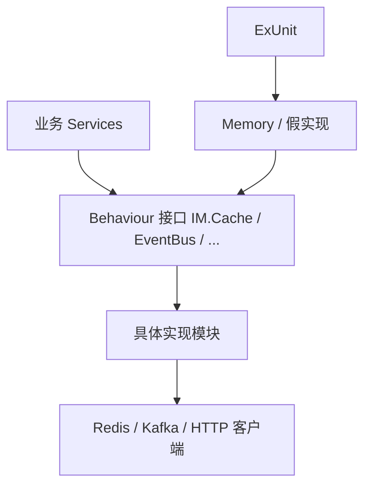

# 设计说明：依赖抽象层

| 项 | 内容 |
|------|------|
| 状态 | 已确认 |
| 决策编号 | DD-021 |
| 规范定义 | 本文档 |
| 行为约定 | 本文档 |
| 索引 | [`design-decisions.md`](../design-decisions.md) |
| 实现文档 | [implementation/elixir/dependency-abstraction.md](../implementation/elixir/dependency-abstraction.md) |

---

## 1. 要解决什么问题

项目中会使用很多第三方库：
- **缓存客户端**：Redis、Memcached 等
- **JSON 编解码**：各种 JSON 库
- **HTTP 客户端**：各种 HTTP 客户端库
- **数据库客户端**：各种数据库驱动
- **消息队列**：Kafka、RabbitMQ 等
- **日志框架**：各种日志库

**问题**：如果直接在业务代码中使用这些库，更换库时需要修改所有使用的地方。

**示例问题**：

```
业务代码直接调用 Redis 客户端 API
如果要换成其他 Redis 客户端，需要修改所有调用点
```

---

## 完整流程



配置 `config :im, :cache, IM.Cache.Redis` 切换实现，业务代码无感知。

---

## 2. 决策是什么

### 2.1 核心原则

**所有外部依赖必须通过抽象层访问，不直接依赖具体实现。**

```
业务代码 ──调用──► 抽象层（接口定义） ──实现──► 具体库
                               │
                               ├── 缓存抽象
                               ├── JSON 抽象
                               ├── HTTP 抽象
                               └── 其他抽象
```

### 2.2 抽象层设计

每个外部依赖定义：
1. **接口定义**：定义统一接口
2. **具体实现**：实现接口
3. **配置选择**：通过配置选择具体实现

---

## 3. 为什么这样设计

### 3.1 为什么需要抽象层

| 原因 | 说明 |
|------|------|
| **可替换** | 更换库时只需修改配置，不影响业务代码 |
| **可测试** | 可以使用 Mock 实现进行测试 |
| **解耦** | 业务代码不依赖具体的库 |
| **灵活性** | 不同环境可以使用不同实现 |

### 3.2 为什么每个依赖都要抽象

| 依赖 | 更换场景 | 抽象好处 |
|------|----------|----------|
| 缓存 | 从 Redis 换到 Memcached | 只需修改缓存抽象层实现 |
| JSON | 从一个 JSON 库换到另一个 | 只需修改 JSON 抽象层实现 |
| HTTP | 从一个 HTTP 客户端换到另一个 | 只需修改 HTTP 抽象层实现 |
| 数据库 | 从 PostgreSQL 换到 MySQL | 只需修改数据库抽象层实现 |

---

## 4. 有什么好处

### 4.1 易于更换实现

通过配置文件切换实现，无需修改业务代码。

### 4.2 易于测试

测试时使用可替换实现，不依赖真实外部服务。IM 服务端细则见 [`agent.md`](../../agent.md)「测试驱动开发」：

- **DI 优先**：内存实现 / `config/test.exs` 切换；**仅**外部边界用 Mox。
- **禁止 ExMachina**；用手写工厂或 Context 辅助造数。
- **禁止 sleep 同步**；用 `assert_receive` / `GenServer.call`（真实时间流逝例外须注释）。

### 4.3 统一接口

所有业务代码使用统一接口，风格一致。

---

## 5. 抽象层清单

| 抽象层 | 接口定义 | 默认实现 | Mock 实现 |
|--------|----------|----------|-----------|
| **缓存** | Cache 接口 | Redis 实现 | Mock 实现 |
| **JSON** | Json 接口 | 主流 JSON 库实现 | - |
| **HTTP** | Http 接口 | 主流 HTTP 客户端实现 | Mock 实现 |
| **数据库** | Repository 接口 | ORM 实现 | Mock 实现 |
| **消息队列** | MessageQueue 接口 | Kafka 实现 | Mock 实现 |
| **日志** | Logger 接口 | 主流日志库实现 | Mock 实现 |

---

## 6. 实现原则

### 6.1 必须遵循

| 原则 | 说明 |
|------|------|
| **业务代码不直接使用第三方库** | 必须通过抽象层 |
| **每个依赖定义接口** | 明确接口契约 |
| **提供默认实现和 Mock 实现** | 支持生产和测试环境 |
| **通过配置选择实现** | 不硬编码具体实现 |

### 6.2 不要做的事

| 禁止 | 原因 |
|------|------|
| 直接在业务代码中调用第三方库 API | 耦合具体实现 |
| 硬编码具体实现模块名 | 无法通过配置切换 |

### 6.3 分阶段实施（Elixir）

并非所有依赖都需在 Phase 0 抽象。按实施阶段区分：

| 阶段 | 必须抽象 | 可直接使用 |
|------|----------|------------|
| Phase 0–3 | 认证（`IM.Auth` Behaviour）、消息存储（`IM.Stores.*`）、连接定位 | Ecto、Jason、Logger、Telemetry |
| Phase 4–6 | 序列号/缓存（`IM.Cache` Behaviour） | Redix（经 `IM.Cache` 封装后业务层不直接调用） |
| Phase 9+ | Kafka 旁路（`IM.EventBus`） | Broadway（消费侧，实现模块内） |

**原则**：业务模块（`IM.Services.*`）不直接 `use Redix` / `use Broadway`；基础设施库可在抽象层实现模块内直接使用。

---

## 7. 总结

| 项 | 说明 |
|------|------|
| **抽象层** | 为所有外部依赖定义抽象层 |
| **接口定义** | 定义接口契约 |
| **Facade** | 提供统一调用入口 |
| **多实现** | 默认实现 + Mock 实现 |
| **配置化** | 通过配置选择具体实现 |
| **可测试** | 使用 Mock 实现测试 |

---

## 附录：各语言实现

| 语言 | 实现文档 |
|------|----------|
| **Elixir** | [dependency-abstraction.md](../implementation/elixir/dependency-abstraction.md)、[kafka-event-bus.md](../implementation/elixir/kafka-event-bus.md) |
| **Java** | 待实现 |

