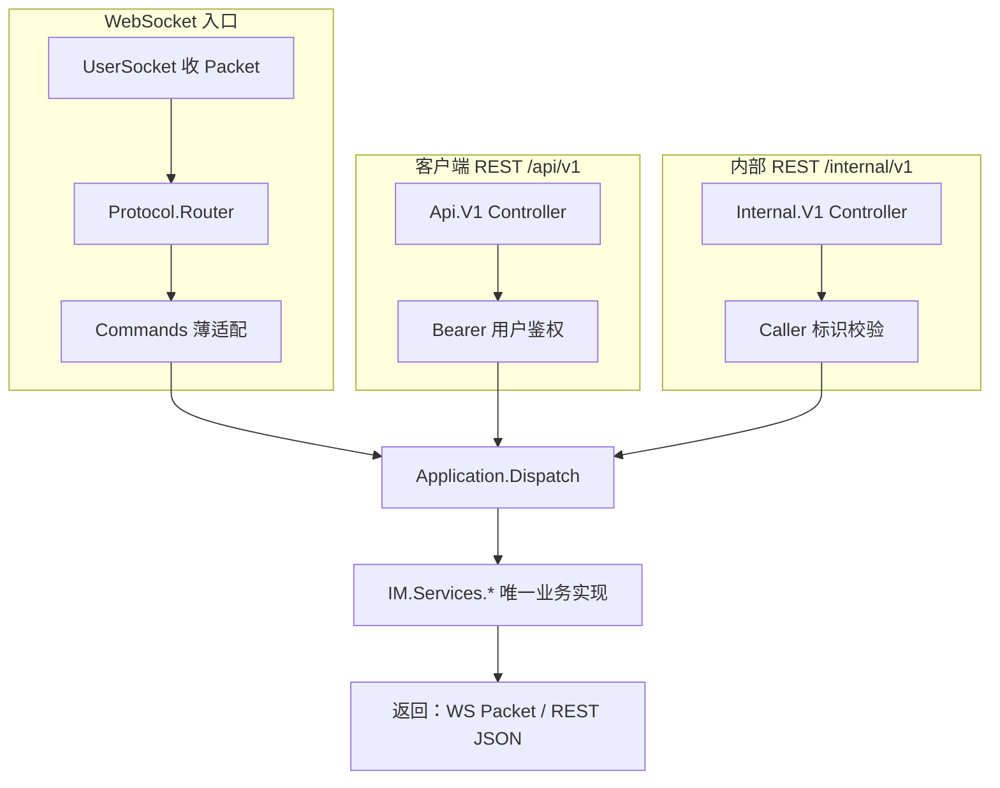
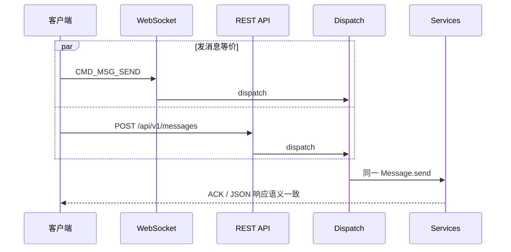
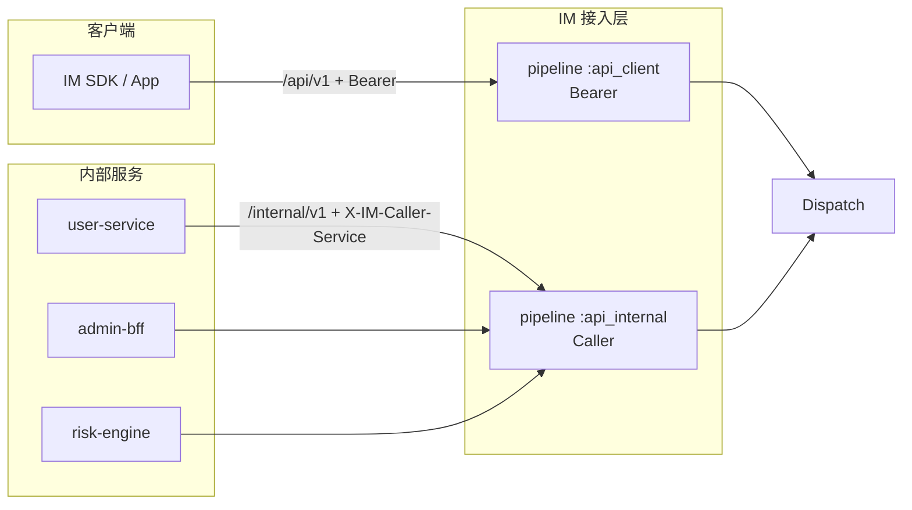

# 设计说明：双通道 API（WebSocket + REST）

| 项 | 内容 |
|------|------|
| 状态 | **已确认** |
| 决策编号 | DD-031 |
| 规范定义 | WebSocket：[`protocol.md`](protocol/protocol.md) + `proto/`；REST：本文 §4 |
| 行为约定 | 本文档 |
| 索引 | [`design-decisions.md`](../design-decisions.md) |
| 实现文档 | [implementation/elixir/dual-channel-api.md](../implementation/elixir/dual-channel-api.md) |
| 关联 | [message-context.md](message-context.md)、[modular-architecture.md](modular-architecture.md) |

---

## 1. 要解决什么问题

客户端与服务端集成场景多样：移动端 SDK 倾向 **WebSocket 长连接**；Web 后台、运维脚本、第三方系统倾向 **HTTP REST**。

若两套实现分叉，会出现：

- 权限、幂等、限额策略不一致
- 单聊/群聊/好友等行为在 WS 与 REST 结果不同
- 修复 bug 需改两处，回归成本翻倍

**目标**：IM **已支持的业务能力**，客户端应能通过 **WebSocket 或 REST 任选其一** 完成同等操作；服务端 **只实现一次** 业务逻辑。

---

## 2. 决策摘要（已确认）

| # | 决策 |
| --- | --- |
| 1 | **双通道对等**：好友、发消息（单聊/群/室）、离线/历史拉取、群/室/好友管理等 **客户端可操作能力** 均提供 WS + REST |
| 2 | **单一业务层**：WS Handler 与 REST Controller **不得** 各写一套业务；统一调用 `IM.Application.Dispatch` → `IM.Services.*` |
| 3 | **同一数据契约**：REST 请求/响应体与对应 `proto` message **字段语义一致**（JSON 或 `application/x-protobuf`） |
| 4 | **同一错误模型**：REST 失败映射 `ErrorCode` + 人类可读 `msg`（与 `ErrorBody` 对齐） |
| 5 | **同一上下文**：经 `MessageContext` 注入 `source: :websocket \| :http_client \| :http_internal` 等（见 [message-context.md](message-context.md)） |
| 6 | **客户端 REST**：`Authorization: Bearer <access_token>`（登录见 [auth.md](auth.md) §9） |
| 6b | **HTTP 全入口**：**必填** `X-Trace-Id`（见 §4.2）；缺失或非法 → `400` |
| 6c | **内部 REST**：**不走用户 token**；调用方须标识 `X-IM-Caller-Service`（见 §4.4） |
| 7 | **例外清单** 见 §3 — 仅连接态/下行推送类能力可 WS 独占，须在文档标明 |

---

## 完整流程





---

## 3. 通道能力与例外

### 3.1 必须双通道的能力

| 能力域 | WebSocket（cmd） | REST（示例路径） |
| --- | --- | --- |
| 发消息 | `CMD_MSG_SEND` | `POST /api/v1/messages` |
| 阅后即焚 | `CMD_MSG_SEND`（`burn_after_read=true`）；销毁通知 `CMD_MSG_BURN_PUSH`（仅下行） | `POST /api/v1/messages`（body 含 `burn_after_read`） |
| 离线/历史拉取 | `CMD_OFFLINE_PULL_*` | `GET /api/v1/messages/inbox` |
| 会话内历史 | `CMD_OFFLINE_PULL_*`（`conv_id` 游标） | `GET /api/v1/conversations/{conv_id}/messages` |
| 消息 ACK / 已读 | `CMD_MSG_ACK_*` / `CMD_MSG_READ` | `POST /api/v1/messages/ack` 等 |
| 撤回 / 编辑 | `CMD_MSG_RECALL_*` / `CMD_MSG_EDIT_*` | `POST /api/v1/messages/{msg_id}/recall` 等 |
| 透传 | `CMD_PASSTHROUGH` | `POST /api/v1/passthrough` |
| 好友 | `CMD_FRIEND_*` | `/api/v1/friends/*` |
| 群组 | `CMD_GROUP_*` | `/api/v1/groups/*` |
| 聊天室 | `CMD_ROOM_*` | `/api/v1/rooms/*` |
| 聊天室发消息 | `CMD_MSG_SEND`（`CHAT_ROOM`） | `POST /api/v1/rooms/{room_id}/messages` |
| 应用通道 | `CMD_CHANNEL_SUBSCRIBE_*` / `CMD_CHANNEL_PUBLISH` | `PUT/DELETE /api/v1/channels/subscriptions`、`POST /api/v1/channels/publish` |

### 3.2 允许仅 WebSocket 的能力

| 能力 | 原因 |
| --- | --- |
| `CMD_HEARTBEAT_*` | 长连接保活，无 REST 等价 |
| `CMD_KICK`（下行） | 服务端主动推送，非客户端请求 |
| `CMD_MSG_PUSH` / `PUSH_BATCH`（下行） | 实时下行；REST 客户端用拉取接口补偿 |
| `CMD_MSG_BURN_PUSH`（下行） | 阅后即焚销毁通知；由已读触发，无 REST 等价 |
| `CMD_CHANNEL_PUSH`（下行） | 应用通道服务端广播；无 REST 长轮询等价 |
| `CMD_AUTH_REQ`（连接内） | REST 用每请求 Bearer，不走 Packet 鉴权包 |

### 3.3 REST 发消息后的实时性

- REST `POST` 发消息：走与 WS **相同** `MessageService` 路径（落库、ACK 语义、扇出）。
- 在线用户仍通过 **WebSocket PUSH** 收消息；纯 REST 客户端通过 **轮询拉取** 或后续建立 WS 收实时推送。
- `MessageContext.push_online` 对 REST 来源仍为 `true`（不因入口关闭推送）。

---

## 4. 架构：适配器 + 协议路由 + 统一分发

```text
┌─────────────────────┐     ┌─────────────────────┐
│ IM.WebSocket.*      │     │ IMWeb.Api.V1.*      │
│ Commands (按 cmd)   │     │ Controller (按路由) │
└──────────┬──────────┘     └──────────┬──────────┘
           │ decode Packet              │ parse JSON/Proto + Bearer
           ▼                            │
┌─────────────────────┐                 │
│ IM.Protocol.Router  │  （仅 WS）       │
│ 按 cmd → Handler    │                 │
└──────────┬──────────┘                 │
           │ build MessageContext       │ build MessageContext
           └────────────┬───────────────┘
                        ▼
           ┌────────────────────────────┐
           │ IM.Application.Dispatch    │
           │ execute(cmd, payload, ctx) │
           └────────────┬───────────────┘
                        ▼
           ┌────────────────────────────┐
           │ IM.Services.* (唯一实现)    │
           └────────────┬───────────────┘
                        │ 需下行时
                        ▼
           ┌────────────────────────────┐
           │ IM.Delivery.Router         │
           └────────────────────────────┘
```

### 4.1 与 `IM.Protocol.Router` 的分工

| 模块 | 何时调用 | 做什么 | 不做什么 |
| --- | --- | --- | --- |
| `IM.Protocol.Router` | 每个入站 WS `Packet` | 选 `Commands.*`、鉴权态门禁、telemetry span | 业务校验、落库、扇出 |
| `Commands.*` | Router 回调 | 解 payload、组 `MessageContext`、调 `Dispatch`、编码响应 | 复制 Service 逻辑 |
| `IM.Application.Dispatch` | WS / REST / 内部入口 | `cmd` → `IM.Services.*` | 设备定位、WS 写帧 |
| `IM.Delivery.Router` | Service 需推送时 | recipients → 在线 PUSH / PG inbox 离线拉取 | 好友/群权限判断 |

详见 [modular-architecture.md](modular-architecture.md) §1.3、[protocol.md](protocol/protocol.md) §2.1。

### 4.2 HTTP 链路追踪（`X-Trace-Id`，全入口必填）

**所有 HTTP 请求**（客户端 `/api/v1` 与内部 `/internal/v1`，**含** `POST /api/v1/sessions` 登录）必须在请求头携带：

```http
X-Trace-Id: 6789abcd12345678fedcba9876543210
```

| 项 | 约定 |
| --- | --- |
| 头名称 | `X-Trace-Id`（大小写不敏感） |
| 必填 | **是**；缺失、空字符串、仅空白 → `400` + `missing_trace_id` |
| 格式 | 非空字符串，长度 **8–64**，字符集 `[A-Za-z0-9_-]`；推荐 [message-context.md](message-context.md) §7.1（32 位十六进制） |
| 非法格式 | `400` + `invalid_trace_id` |
| 服务端 | 写入 `conn.assigns.trace_id` → `MessageContext.trace_id`；**禁止**服务端代为生成 |
| 继承 | 由该请求触发的 ACK/PUSH/ERROR/Kafka/日志 **必须**继承同一 `trace_id`（见 [message-context.md](message-context.md) §7.4） |
| Plug | `IM.Plug.RequireTraceId`（置于 `:api_client` / `:api_internal` pipeline **最前**） |

与 WebSocket 对比：`Packet.trace_id` 仍为**建议**填写（为空则服务端生成）；**仅 HTTP 强制**。

失败响应示例：

```json
{ "code": 2001, "msg": "missing_trace_id" }
```

```json
{ "code": 2001, "msg": "invalid_trace_id" }
```

### 4.3 登录与会话（HTTP → WebSocket）

客户端建连流程见 [auth.md](auth.md) §9。REST 约定：

| 方法 | 路径 | 说明 |
| --- | --- | --- |
| `POST` | `/api/v1/sessions` | 用户名密码登录；签发 `access_token`、`expires_at`、`connection`、`config` |
| `DELETE` | `/api/v1/sessions/current` | 登出：吊销当前 token、断开该设备 WS（可选） |

**`POST /api/v1/sessions` 响应字段**（与 auth §9.2 一致）：

| 字段 | 说明 |
| --- | --- |
| `access_token` | Bearer token；后续 WS `AuthReq.token` 与 REST `Authorization` 共用 |
| `expires_at` | 失效时间（ms） |
| `user_id` | 服务端校验后的用户 ID |
| `connection.websocket_urls` | WebSocket 地址列表（`wss://...`） |
| `connection.preferred_index` | 首选下标 |
| `config` | `heartbeat_interval_sec`、`push_batch_max`、`recall_window_sec`、`edit_window_sec`、`offline_pull_limit` |
| `clear_local_data` | 是否清除 SDK 本地 IM 数据；见 [auth.md](auth.md) §9.8 |

设备封禁、token 吊销语义见 [auth.md](auth.md) §9.6。**清除本地数据**见 §9.8。

**内部服务接口**（踢人、封禁、代发等）见 §4.4，路径前缀 **`/internal/v1`**，**不使用**客户端 Bearer。

**禁止**：

```text
Controller 内直接 Repo.insert / 手写扇出   ❌
Handler  内复制一份与 Service 不同的校验   ❌
```

---

### 4.4 HTTP 两类入口（客户端 vs 内部服务）

IM 对外 HTTP 分为 **两类**，路由、鉴权 Plug、可观测性标签 **不得混用**。

| 类别 | 路径前缀 | 调用方 | 身份验证 | 典型用途 |
| --- | --- | --- | --- | --- |
| **客户端 API** | `/api/v1` | SDK、App、第三方集成 | `Authorization: Bearer <access_token>` | 登录、发消息、拉历史、好友/群/室 |
| **内部 API** | `/internal/v1` | 集群内其它服务（用户中心、风控、推送、运营后台 BFF 等） | **无用户 token**；须 **调用方标识**（见下表） | 踢人、封禁、代发、租户配置、运维 |



#### 4.4.1 客户端 API（`/api/v1`）

| 项 | 约定 |
| --- | --- |
| 链路追踪 | **必填** `X-Trace-Id`（见 §4.2） |
| 认证 | `Authorization: Bearer <access_token>`（`POST /api/v1/sessions` 登录除外） |
| 身份 | 从 token 解析 `(app_key, user_id, device_id)` 写入 `conn.assigns` |
| `MessageContext.source` | `:http_client` |
| 限流 | 按 `(app_key, user_id)` 或设备维度 |

#### 4.4.2 内部 API（`/internal/v1`）

内部接口 **不校验** 终端用户 `access_token`；调用方在 **集群内网** 可达（部署上由 NetworkPolicy / Ingress 限制，不暴露公网）。

**调用方标识（必填其一，推荐同时带）**：

| 头 / 字段 | 必填 | 说明 |
| --- | --- | --- |
| `X-Trace-Id` | **是** | 链路追踪；格式见 §4.2 |
| `X-IM-Caller-Service` | **是** | 调用方服务名，如 `user-service`、`admin-bff`、`risk-engine`；用于日志、指标、封禁 |
| 客户端 IP | 自动 | 从连接 / `X-Forwarded-For` 取 **最左可信** 一跳；记入日志与审计 |

| 项 | 约定 |
| --- | --- |
| `MessageContext.source` | `:http_internal` |
| `MessageContext.caller_service` | `X-IM-Caller-Service` 归一化值 |
| `MessageContext.client_ip` | 请求源 IP（字符串） |
| 业务 `user_id` | 由 **请求 path/body** 指定（如踢谁），**不**从 Bearer 推断 |
| 限流 | 按 `caller_service`；异常 IP 可单独封禁 |

**校验顺序**（Plug `IM.Plug.InternalCaller`）：

```text
0. X-Trace-Id 非空且格式合法（§4.2；Plug RequireTraceId）
1. caller_service 非空且格式合法（小写字母数字 + 连字符，1–64 字符）
2. caller_service 不在封禁名单（Redis / 配置）
3. client_ip 不在 IP 封禁名单（CIDR 支持）
4. （生产推荐）caller_service 在允许名单 app_configs.internal.allowed_callers
5. 写入 assigns → 进入 Controller → Dispatch
```

失败响应：

| 场景 | HTTP | body.msg 示例 |
| --- | --- | --- |
| 缺少 / 空 `X-Trace-Id` | `400` | `missing_trace_id` |
| `X-Trace-Id` 格式非法 | `400` | `invalid_trace_id` |
| 缺少 `X-IM-Caller-Service` | `400` | `missing_caller_service` |
| 服务名非法 | `400` | `invalid_caller_service` |
| 服务或 IP 被封禁 | `403` | `caller_blocked` |
| 不在允许名单（启用时） | `403` | `caller_not_allowed` |

**封禁与审计**：

- 封禁维度：`caller_service` 和/或 `client_ip`（CIDR）；运维 API 或配置热更新
- Redis 键：`im:internal_caller_block:{app_key}`、`im:internal_ip_block:{app_key}`（见 [permission-cache.md](permission-cache.md) §3.4、[database-design.md](database/database-design.md) §二.9）
- 所有内部写操作记 **结构化审计日志**：`caller_service`、`client_ip`、`trace_id`、操作类型、目标 `user_id`/`device_id`
- 指标：`im_internal_request_total{caller_service, route, status}`（**不打 IP 标签**，防基数爆炸；IP 仅日志）

#### 4.4.3 内部 API 路径示例

| 方法 | 路径 | 说明 |
| --- | --- | --- |
| `POST` | `/internal/v1/users/{user_id}/kick` | 踢用户全部设备；body 可选 `clear_local_data` |
| `POST` | `/internal/v1/devices/{device_id}/kick` | 踢单设备 |
| `POST` | `/internal/v1/devices/{device_id}/ban` | 封禁设备 |
| `POST` | `/internal/v1/users/{user_id}/messages` | 服务端代发（`MessageContext.run_hooks` 可配置） |
| `POST` | `/internal/v1/channels/{channel_id}/publish` | 应用通道下行广播（见 [app-channel.md](app-channel.md)） |

客户端 SDK **不得**调用 `/internal/v1`；该前缀不写入公开 OpenAPI。

#### 4.4.4 与 WS / Kafka 入口的关系

| 入口 | `MessageContext.source` | 用户身份 |
| --- | --- | --- |
| WebSocket | `:websocket` | `AUTH` 后的 `user_id` / `device_id` |
| 客户端 REST | `:http_client` | Bearer token |
| 内部 REST | `:http_internal` | 请求体/路径；`caller_service` 仅标识调用方 |
| Kafka 消费 | `:kafka` | 事件 payload |
| 定时任务 | `:system` | 无 |

业务仍只实现于 `IM.Services.*`；差异仅在 Ingress 层鉴权与 Context 构造。

---

## 5. REST 规范约定

### 5.1 客户端 API（`/api/v1`）

| 项 | 约定 |
| --- | --- |
| 前缀 | `/api/v1` |
| 链路追踪 | **必填** `X-Trace-Id`（§4.2；含登录 `POST /sessions`） |
| 认证 | `Authorization: Bearer <token>`；`app_key` 来自 token claims 或 `X-App-Key` |
| 请求体 | 默认 `application/json`（字段与 proto 驼峰/JSON 映射一致）；可选 `application/x-protobuf` |
| 成功 | HTTP 2xx + 与对应 `*_RESP` 同结构的 JSON |
| 失败 | HTTP 4xx/5xx + `{ "code": 2001, "msg": "...", "ref_cmd": 100 }`（`ref_cmd` 为逻辑 CmdType 值） |
| 幂等 | 支持 `Idempotency-Key` 头或 body `client_msg_id` / `cid`（与 WS 一致） |
| 分页 | 与 `OFFLINE_PULL` 相同游标语义（`inbox_seq` / `conv_seq` / `has_more`） |

### 5.2 内部 API（`/internal/v1`）

| 项 | 约定 |
| --- | --- |
| 前缀 | `/internal/v1` |
| 链路追踪 | **必填** `X-Trace-Id`（§4.2） |
| 认证 | **无 Bearer**；必填 `X-IM-Caller-Service`；见 §4.4.2 |
| 请求体 | 同客户端 JSON 约定 |
| 失败 | 同 `ErrorBody` 风格；`ref_cmd` 可省略 |
| 幂等 | 写操作建议带 `Idempotency-Key` |

---

## 6. 与 Kafka / 其它内部入口

Kafka 消费、定时任务等 **内部入口** 同样调用 `Dispatch` / `Services`，`MessageContext.source` 为 `:kafka` / `:system`。  
见 [kafka-event-bus.md](kafka-event-bus.md)、[message-context.md](message-context.md)。

---

## 7. 测试要求

- 同一业务场景须有 **WS 集成测试 + REST 集成测试**，断言落库、推送、错误码一致。
- 新增 cmd 时 **同步** 增加 REST 路由与映射表（本文 §3.1）。
