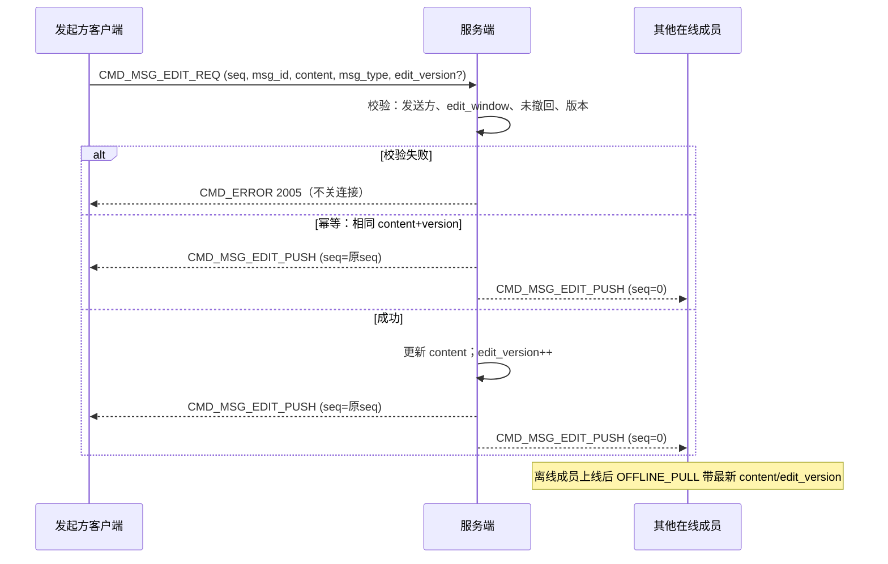

# 设计说明：编辑消息

| 项 | 内容 |
| --- | --- |
| 状态 | **已确认** |
| 决策编号 | DD-010 |
| 规范定义 | [`proto/message.proto`](../../proto/message.proto)（`MsgEdit`、`ChatMessage.edit_version`）、[`proto/auth.proto`](../../proto/auth.proto)（`edit_window_sec`） |
| 行为约定 | [`protocol.md` §10](protocol/protocol.md#10-编辑消息) |
| 索引 | [`design-decisions.md`](../design-decisions.md) |
| 实现文档 | [implementation/elixir/edit.md](../implementation/elixir/edit.md) |

---

## 1. 要解决什么问题

发送方在限定时间内修改已发消息内容，各方看到更新后的内容与「已编辑」标记，且不破坏 `msg_id` / `conv_seq`。

---

## 2. 决策摘要（已确认）

| # | 决策 |
| --- | --- |
| 1 | **仅原发送方**可编辑 |
| 2 | 编辑时间窗单独配置：`AuthResp.edit_window_sec`，默认 **120s** |
| 3 | **全部 `MsgType`** 均可编辑（非仅文本） |
| 4 | **聊天室**允许短窗内编辑 |
| 5 | 离线经 `OFFLINE_PULL` 同步新 `content` + `edit_version` |
| 6 | **已读消息**在时间窗内仍可编辑 |
| 7 | 失败 `CMD_ERROR`（2005），**不关连接**；相同内容+版本 **幂等成功** |
| 8 | `ChatMessage.edit_version`：0=未编辑，≥1=已编辑 |

---

## 完整流程



---

## 3. 流程（文字摘要）

```text
发起方 → EDIT_REQ (seq, msg_id, content, msg_type, edit_version?, conv_id, …)
服务端 → 校验：发送方、时间窗(edit_window_sec)、未撤回、edit_version 冲突
  成功：
    → 更新库表 content、edit_version++
    → EDIT_PUSH (seq=原seq) → 发起方
    → EDIT_PUSH (seq=0)     → 其他在线成员
  失败：
    → CMD_ERROR CODE_MSG_EDIT_DENIED
```

---

## 4. 为什么这样设计

### 与撤回对称的 REQ/PUSH

成功确认与广播分离，与 [recall.md](recall.md) 一致，SDK 可复用模式。

### 单独 edit_window_sec

撤回与编辑产品策略可能不同（如编辑窗更短），独立配置更灵活。

### 全部 MsgType 可编辑

统一规则简化实现；媒体类编辑即更新元数据 URL 等，由业务校验 content 合法性。

### edit_version 乐观锁

| 点 | 好处 |
| --- | --- |
| REQ 带已知 `edit_version` | 多端同时编辑时拒绝覆盖（2005） |
| PUSH 带新版本 | 各方对齐展示 |
| `ChatMessage.edit_version` | 离线拉取与 PUSH 同一模型 |

### 已撤回不可编辑

`recalled=true` 或 `burn_after_read=true`（阅后即焚）或 `burned=true` 时拒绝 EDIT，避免状态冲突。

### 不改 msg_id / conv_seq

编辑是原消息内容更新，会话时间线位置不变。

---

## 5. 规则摘要

| 规则 | 说明 |
| --- | --- |
| 权限 | `from` = 原消息发送者 |
| 时间窗 | `now - message.server_time ≤ edit_window_sec` |
| 撤回 | `recalled=true` → 2005 |
| 阅后即焚 | `burn_after_read=true` 或 `burned=true` → 2005 |
| 版本冲突 | REQ.`edit_version` ≠ 服务端当前版本 → 2005 |
| 幂等 | 相同 `content` + 当前 `edit_version` 重复 REQ → 成功 PUSH |

---

## 6. 刻意放弃

| 放弃 | 原因 |
| --- | --- |
| 编辑产生新 msg_id | 破坏排序与离线 |
| 仅 TEXT 可编辑 | 已确认全类型 |
| 与撤回共用时间窗配置 | 已确认单独 `edit_window_sec` |

---

