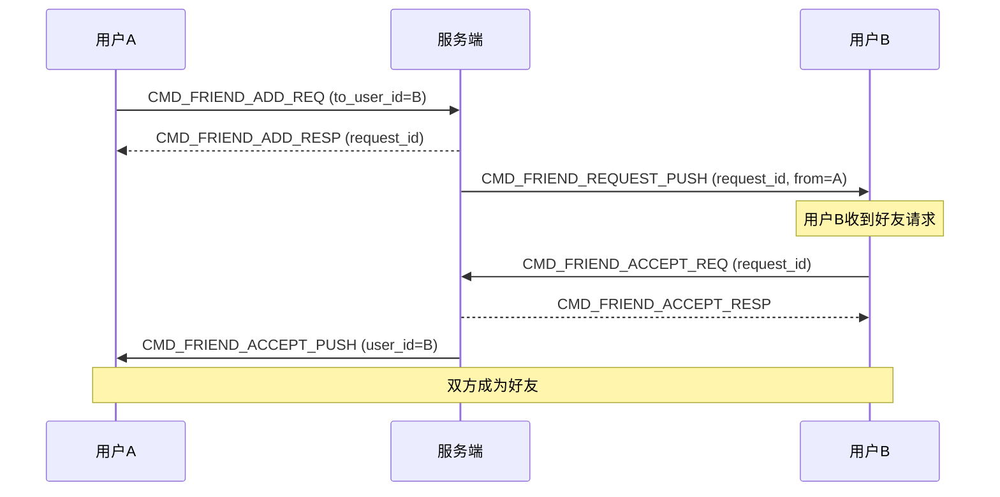
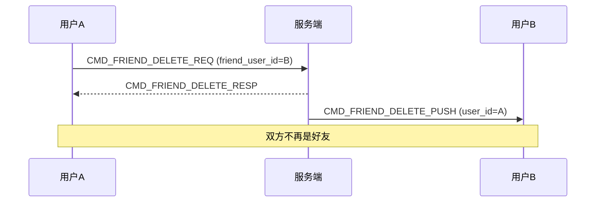
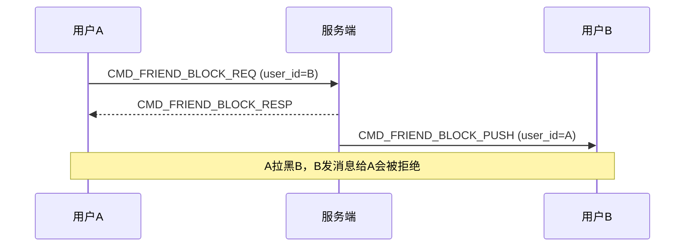

# 设计说明：好友系统

| 项 | 内容 |
|------|------|
| 状态 | 已确认 |
| 决策编号 | DD-020 |
| 规范定义 | [`proto/friend.proto`](../../proto/friend.proto) |
| 行为约定 | 本文档 |
| 索引 | [`design-decisions.md`](../design-decisions.md) |
| 实现文档 | [implementation/elixir/friend.md](../implementation/elixir/friend.md) |

---

## 1. 要解决什么问题

IM 系统需要好友关系管理功能：

| 功能 | 说明 |
|------|------|
| **添加好友** | 发送好友请求，等待对方同意 |
| **接受/拒绝** | 处理好友请求 |
| **删除好友** | 删除好友关系 |
| **拉黑用户** | 拉黑后不再收到对方消息 |
| **好友备注** | 为好友设置备注名 |
| **好友列表** | 获取好友列表 |
| **请求列表** | 获取好友请求列表 |

---

## 完整流程

好友关系状态与核心命令流程见下文 §2.1–§2.2（含 Mermaid 时序图）。拉黑后发消息拦截见 §7.2，接入 `CMD_MSG_SEND` 校验。

---

## 2. 决策是什么

### 2.1 好友关系状态

```
陌生人 ──添加好友──► 待处理 ──接受──► 好友
   │                   │
   │                   └──拒绝──► 陌生人
   │
   └──拉黑──► 已拉黑
```

| 状态 | 说明 |
|------|------|
| `NONE` | 无关系（陌生人） |
| `PENDING` | 待处理（等待对方同意） |
| `ACCEPTED` | 已是好友 |
| `BLOCKED` | 已拉黑 |
| `DELETED` | 已删除 |

### 2.2 核心流程

> 本节即 **完整流程**（添加/接受/拒绝/删除/拉黑等分项时序图）。

#### 添加好友流程



#### 删除好友流程



#### 拉黑流程



---

## 3. 为什么这样设计

### 3.1 双向确认机制

**为什么添加好友需要对方同意？**

| 原因 | 说明 |
|------|------|
| **隐私保护** | 避免陌生人随意添加 |
| **用户意愿** | 尊重用户选择 |
| **垃圾信息** | 减少垃圾好友请求 |

### 3.2 拉黑与删除的区别

| 操作 | 效果 | 消息投递 |
|------|------|----------|
| **删除好友** | 双方不再是好友 | 可以继续发消息（变为陌生人） |
| **拉黑** | 单方面屏蔽 | 被拉黑方发消息会被拒绝 |

### 3.3 好友请求过期

**为什么需要过期机制？**

- 避免长期未处理的好友请求堆积
- 默认过期时间：**7 天**
- 过期后状态变为 `EXPIRED`

---

## 4. 有什么好处

### 4.1 完整的好友管理

| 好处 | 说明 |
|------|------|
| **完整的生命周期** | 添加→接受→删除→拉黑 |
| **双向确认** | 保护用户隐私 |
| **实时通知** | 好友操作实时推送 |

### 4.2 灵活的关系管理

| 好处 | 说明 |
|------|------|
| **备注功能** | 为好友设置易记的备注名 |
| **拉黑机制** | 阻止骚扰用户 |
| **请求管理** | 查看历史好友请求 |

---

## 5. 数据库设计

**权威定义**：[database-design.md](../database/database-design.md) §13–§14。以下为摘要，变更须同步主库设计文档。

### 5.1 好友关系表

```sql
CREATE TABLE friendships (
  id BIGSERIAL PRIMARY KEY,
  app_key VARCHAR(64) NOT NULL,
  user_id VARCHAR(64) NOT NULL,
  friend_user_id VARCHAR(64) NOT NULL,
  status VARCHAR(20) NOT NULL,  -- pending/accepted/blocked/deleted
  remark VARCHAR(100),          -- 备注名
  created_at TIMESTAMPTZ NOT NULL DEFAULT NOW(),
  updated_at TIMESTAMPTZ NOT NULL DEFAULT NOW(),
  
  UNIQUE(app_key, user_id, friend_user_id)
);

-- 索引
CREATE INDEX idx_friendships_user ON friendships(app_key, user_id);
CREATE INDEX idx_friendships_friend ON friendships(app_key, friend_user_id);
CREATE INDEX idx_friendships_status ON friendships(app_key, user_id, status);
```

### 5.2 好友请求表

```sql
CREATE TABLE friend_requests (
  id BIGSERIAL PRIMARY KEY,
  app_key VARCHAR(64) NOT NULL,
  request_id VARCHAR(64) NOT NULL UNIQUE,
  from_user_id VARCHAR(64) NOT NULL,
  to_user_id VARCHAR(64) NOT NULL,
  message VARCHAR(500),         -- 申请消息
  status VARCHAR(20) NOT NULL,  -- pending/accepted/rejected/expired
  created_at TIMESTAMPTZ NOT NULL DEFAULT NOW(),
  updated_at TIMESTAMPTZ NOT NULL DEFAULT NOW(),
  expires_at TIMESTAMPTZ NOT NULL,  -- 过期时间
  
  UNIQUE(app_key, from_user_id, to_user_id, created_at)
);

-- 索引
CREATE INDEX idx_friend_requests_to ON friend_requests(app_key, to_user_id, status);
CREATE INDEX idx_friend_requests_from ON friend_requests(app_key, from_user_id);
```

---

## 6. API 设计

### 6.1 添加好友

**请求**：
```
CMD_FRIEND_ADD_REQ
{
  "to_user_id": "bob",
  "message": "你好，我是Alice",
  "remark": "Bob"
}
```

**响应**：
```
CMD_FRIEND_ADD_RESP
{
  "request_id": "req_001",
  "status": "PENDING"
}
```

**推送（给接收方）**：
```
CMD_FRIEND_REQUEST_PUSH
{
  "request_id": "req_001",
  "from_user_id": "alice",
  "from_nickname": "Alice",
  "from_avatar": "https://...",
  "message": "你好，我是Alice",
  "timestamp": 1721808000000
}
```

### 6.2 接受好友

**请求**：
```
CMD_FRIEND_ACCEPT_REQ
{
  "request_id": "req_001",
  "from_user_id": "alice",
  "remark": "我的朋友Alice"
}
```

**响应**：
```
CMD_FRIEND_ACCEPT_RESP
{
  "friend_user_id": "alice",
  "status": "ACCEPTED"
}
```

**推送（给发起方）**：
```
CMD_FRIEND_ACCEPT_PUSH
{
  "user_id": "bob",
  "nickname": "Bob",
  "avatar": "https://...",
  "remark": "我的朋友Bob",
  "timestamp": 1721808100000
}
```

### 6.3 获取好友列表

**请求**：
```
CMD_FRIEND_LIST_REQ
{
  "limit": 100,
  "cursor": ""
}
```

**响应**：
```
CMD_FRIEND_LIST_RESP
{
  "friends": [
    {
      "user_id": "bob",
      "nickname": "Bob",
      "avatar": "https://...",
      "remark": "我的朋友Bob",
      "status": "ACCEPTED",
      "created_at": 1721808100000
    }
  ],
  "next_cursor": "",
  "has_more": false
}
```

---

## 7. 业务规则

### 7.1 添加好友规则

| 规则 | 说明 |
|------|------|
| **不能添加自己** | 返回错误 |
| **已是好友** | 返回错误 |
| **已拉黑对方** | 返回错误 |
| **对方已拉黑你** | 返回错误 |
| **重复请求** | 返回已有请求 |

### 7.2 发消息权限检查

**热路径**：不直查 PostgreSQL；经 [permission-cache.md](permission-cache.md) 的 Redis `SET` 判断 `blocked?(接收方, 发送方)`。PostgreSQL `friendships` 为权威源，拉黑/取消拉黑时同步 `SADD` / `SREM`。

```elixir
def check_send_permission(app_key, from_user_id, to_user_id) do
  if IM.Permission.BlockCache.blocked?(app_key, to_user_id, from_user_id) do
    {:error, :blocked}
  else
    if require_friend_to_send?() and not friends?(from_user_id, to_user_id) do
      {:error, :not_friend}
    else
      :ok
    end
  end
end
```

### 7.3 好友请求过期清理

```elixir
# 定时任务清理过期请求
def cleanup_expired_requests do
  expired = Repo.all(
    from r in FriendRequest,
    where: r.status == :pending and r.expires_at < ^DateTime.utc_now()
  )
  
  Enum.each(expired, fn request ->
    Repo.update!(%{request | status: :expired})
  end)
end
```

---

## 8. 架构与模块边界（当前：单体 + Dispatch）

**当前实现**：好友逻辑在 IM 单体进程内，与单聊/群聊一致，经 **双通道 + Dispatch** 统一入口；**不提供** `POST /api/v1/deliver` 类跨服务投递 API。

```text
CMD_FRIEND_* / POST /api/v1/friends/*
        │
        ▼
Commands.* / Api.V1.FriendsController（薄）
        │
        ▼
IM.Application.Dispatch
        │
        ▼
IM.Services.Friend（及 *Handler 子模块）
        │
        ├── 落库：friendships / friend_requests / blocks
        └── 需通知时 → IM.Delivery.Router（CMD_FRIEND_*_PUSH）
```

| 模块 | 职责 |
| --- | --- |
| `IM.Services.Friend` | 好友增删改查、请求处理、拉黑；**唯一业务实现** |
| `IM.Delivery.Router` | 将 `*_PUSH` 扇出到目标用户在线设备；不关心好友业务 |
| `IM.Services.SingleChat`（可选） | 发消息前调用 `Friend.check_send_permission/2`（P8-08 拉黑；P8-09 deferred） |

### 8.1 接受好友请求（示例）

```elixir
defmodule IM.Services.Friend.AcceptHandler do
  @moduledoc """
  接受好友请求。由 Dispatch 调用，WS 与 REST 共用。
  """

  alias IM.Delivery.Router
  alias IM.Stores.{FriendshipStore, FriendRequestStore}

  def handle(req, context) do
    with {:ok, request} <- get_request(req.request_id),
         :ok <- validate_request(request, context),
         {:ok, _} <- create_friendship(request, req) do
      notify = build_accept_notify(context)
      Router.deliver(notify, [{request.from_user_id, :all}], cmd: :CMD_FRIEND_ACCEPT_PUSH)
      {:ok, %{friend_user_id: request.from_user_id, status: :accepted}}
    end
  end

  defp create_friendship(request, req) do
    with {:ok, _} <- FriendshipStore.create(%{user_id: request.to_user_id, friend_user_id: request.from_user_id, remark: req.remark}),
         {:ok, _} <- FriendshipStore.create(%{user_id: request.from_user_id, friend_user_id: request.to_user_id}) do
      :ok
    end
  end
end
```

### 8.2 Facade 模块

```elixir
defmodule IM.Services.Friend do
  alias IM.Services.Friend.{AddHandler, AcceptHandler, RejectHandler, DeleteHandler, BlockHandler, ListHandler}

  def add_friend(req, ctx), do: AddHandler.handle(req, ctx)
  def accept_friend(req, ctx), do: AcceptHandler.handle(req, ctx)
  def reject_friend(req, ctx), do: RejectHandler.handle(req, ctx)
  def delete_friend(req, ctx), do: DeleteHandler.handle(req, ctx)
  def block_user(req, ctx), do: BlockHandler.handle(req, ctx)
  def list_friends(req, ctx), do: ListHandler.handle(req, ctx)

  def check_send_permission(from_user_id, to_user_id) do
    # P8-08：拉黑拦截；P8-09「须好友才能单聊」为 deferred
    if blocked?(to_user_id, from_user_id), do: {:error, :blocked}, else: :ok
  end
end
```

### 8.3 演进：未来可拆分（非当前实现）

模块化边界（`IM.Services.Friend` 独立、投递仍走 `IM.Delivery.Router` 或集群内 RPC）保留演进空间；**当前 roadmap 不实现**独立 Friend Service 与 HTTP deliver 网关。若未来拆分，REST 仍暴露 `/api/v1/friends/*`，由好友服务实现后与 IM 共享存储或通过内部 API 同步关系表。

---

## 9. 权限校验的位置

**发消息时是否检查好友关系**：默认 **不强制好友**（P8-09 deferred）；**拉黑**在 P8-08 由 `IM.Services.Friend.check_send_permission/2` 在 `IM.Services.SingleChat` 发消息路径调用。

```elixir
# IM.Services.SingleChat.send/2（示意）
with :ok <- IM.Services.Friend.check_send_permission(from, to),
     {:ok, message, recipients} <- do_send(message, context) do
  IM.Delivery.Router.deliver(message, recipients)
  {:ok, message}
end
```

---

## 10. 刻意放弃 / 不做的事

| 放弃项 | 原因 |
|--------|------|
| 好友分组 | 业务层扩展，本期不做 |
| 好友推荐 | 业务层扩展，本期不做 |
| 批量添加好友 | 业务层扩展，本期不做 |

---

## 11. 总结

| 项 | 说明 |
|------|------|
| **完整的生命周期** | 添加→接受→删除→拉黑 |
| **双向确认** | 添加好友需对方同意 |
| **实时通知** | 好友操作实时推送 |
| **权限控制** | 拉黑后无法发消息 |
| **请求管理** | 好友请求列表、过期清理 |

---

## 附录：命令字列表

| 命令 | 范围 | 说明 |
|------|------|------|
| 800-822 | 好友管理 | 添加、接受、拒绝、删除、拉黑、列表 |
