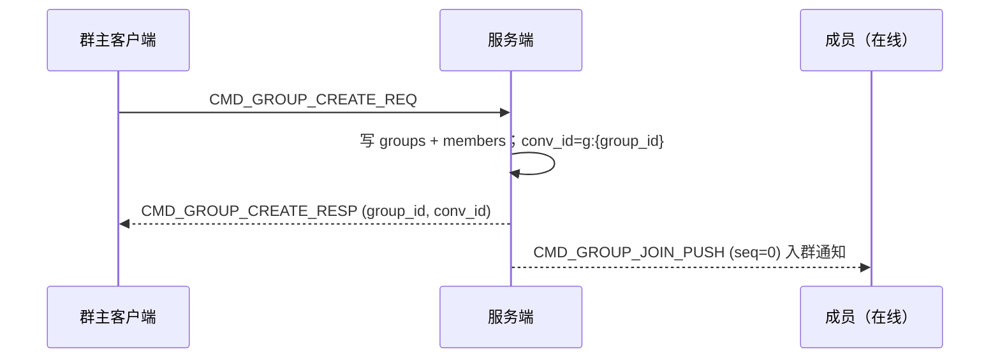
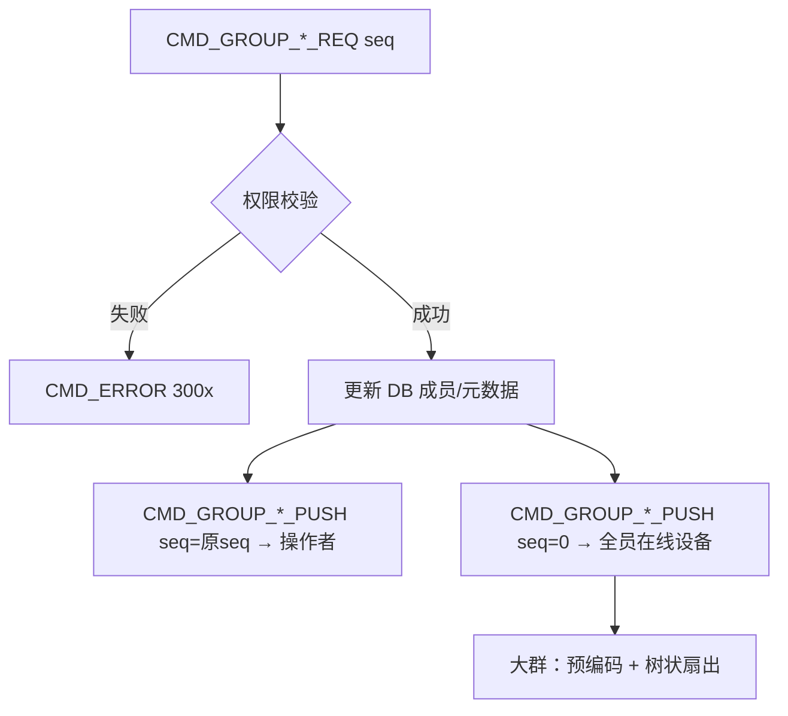
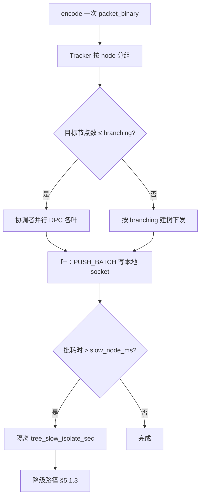
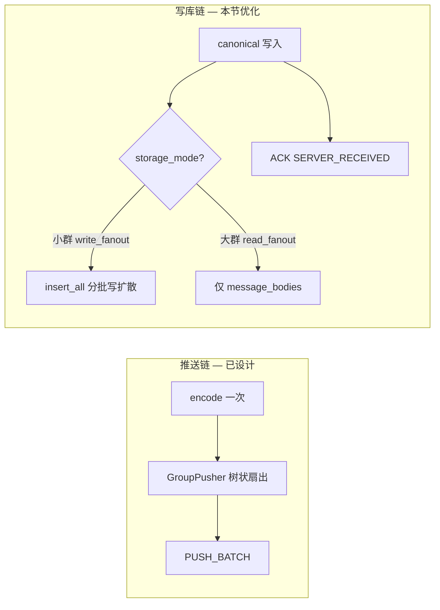
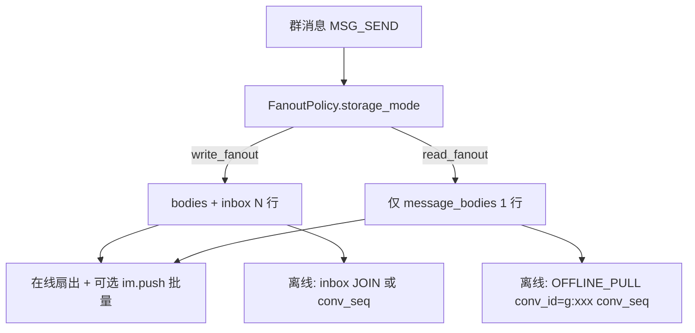

# 设计说明：群组管理

| 项 | 内容 |
| --- | --- |
| 状态 | **已确认** |
| 决策编号 | DD-017 |
| 规范定义 | [`proto/group.proto`](../../proto/group.proto) |
| 行为约定 | [`protocol.md` §18](protocol/protocol.md#18-群组管理) |
| 索引 | [`design-decisions.md`](../design-decisions.md) |
| 实现文档 | [implementation/elixir/group.md](../implementation/elixir/group.md) |

---

## 1. 要解决什么问题

在 IM 长连接上管理群生命周期（创建、解散、入退、踢人、角色、元数据），并与 `CHAT_GROUP` 消息、`conv_id = g:{group_id}`、离线拉取链路对齐。

---

## 2. 决策摘要（已确认）

| # | 决策 |
| --- | --- |
| 1 | 命令段 **600–619**；`route_key` 建议填 `group_id` |
| 2 | **仅 CREATE** 有独立 `RESP`；其余操作用 `*_PUSH` 作成功确认（回传 `seq`） |
| 3 | 成员变更向**全员在线设备**广播 `*_PUSH`（`seq=0`） |
| 4 | 角色：群主 / 管理员 / 普通成员；权限见 protocol §18 |
| 5 | `conv_id` 服务端权威：`g:{group_id}` |
| 6 | 失败 `CMD_ERROR`（3001–3005），**不关连接** |
| 7 | 成员变更 PUSH **不**自动插入系统聊天消息（业务可自行发消息） |
| 8 | **大群读扩散**：成员数大于 `group_read_fanout_threshold`（默认 **500**）时，`storage_mode = read_fanout`，**仅写** `message_bodies`，不写全员 `user_inbox`；离线按 **`conv_seq`** 拉取（见 §6.3） |
| 9 | **大群在线推送**：树状扇出参数见 §5.1（扇出度 8、RPC 2s、慢节点隔离 30s）；**仅群聊** |

---

## 完整流程

### 创建群



### 典型管理操作（邀请 / 踢人）



群消息 `MSG_SEND` 走 [message-send-ack.md](message-send-ack.md)；`conv_id` 固定 `g:{group_id}`。

---

## 3. 为什么这样设计

### CREATE 用 RESP，其余用 PUSH

| 点 | 好处 |
| --- | --- |
| CREATE 需返回 `group_id` / `conv_id` | 独立 `GroupCreateResp` 语义清晰 |
| 与撤回/编辑一致 | 操作成功用回传 `seq` 的 PUSH 确认；广播用 `seq=0` |
| 减少命令字 | 不必为每个操作再占一个 RESP 号 |

### 长连接管理 vs REST

| 点 | 好处 |
| --- | --- |
| 入群/踢人等实时通知在线成员 | 客户端即时更新群列表与成员态 |
| 与 `MSG_SEND` 同通道 | SDK 一套连接状态机；网关按 `group_id` 分流 |

群元数据大批量查询、历史成员列表等仍建议 REST；长连接侧重**变更通知 + 轻量操作**。

### 角色模型

三档角色覆盖常见 IM 产品；`GroupAdminPush.new_role` 统一表达设管/撤管，避免重复 payload。

### 与消息模型解耦

成员变更不强制系统消息，避免污染 `conv_seq`、未读与离线游标；业务需要「xxx 加入群」可自行 `MSG_SEND` 或 REST 模板消息。

---

## 4. 权限矩阵（默认）

| 操作 | 群主 | 管理员 | 成员 |
| --- | --- | --- | --- |
| 创建群 | ✓ | — | — |
| 解散群 | ✓ | ✗ | ✗ |
| 主动加入 | 策略 | 策略 | 策略（开放群） |
| 邀请入群 | ✓ | ✓ | 可配置 |
| 退群 | ✓ | ✓ | ✓（本人） |
| 踢人 | ✓ | ✓（仅普通成员） | ✗ |
| 设/撤管理员 | ✓ | ✗ | ✗ |
| 转让群主 | ✓ | ✗ | ✗ |
| 更新群信息 | ✓ | ✓ | ✗ |

「策略」指应用配置（如是否允许自由加群）。

---

## 5. 规模化注意点

| 点 | 说明 |
| --- | --- |
| 大群广播 | 大群广播走预编码 + 树状扇出（§5.1；[modular-architecture.md](modular-architecture.md) §7.2） |
| `route_key` | Message 节点按 `group_id` 分片，避免单点 |
| 成员列表 | 不随每次 PUSH 携带全量成员；客户端按需 REST 拉取 |
| **群禁言检查** | `group_members.muted_until` 权威在 PG；发消息热路径用 Redis `ZSET`（`im:mute:{app}:{group_id}`），见 [permission-cache.md](permission-cache.md) §3.2 |
| **范围** | 树状扇出 **仅群聊**；聊天室一律 PubSub（见 [room.md](room.md) §5） |

### 5.1 大群树状扇出参数（已确认）

当在线投递目标节点数（或在线成员规模）触发大群路径时，由 `IM.Cluster.GroupPusher` 执行树状扇出。成员数阈值与读扩散一致：大于 `group_read_fanout_threshold`（默认 **500**）走树状；小群可 Tracker 直推（见 roadmap P5-05/P5-06）。

#### 5.1.1 可配置参数

| 参数 | 默认 | 说明 |
|------|------|------|
| `group_push_tree_threshold` | **500** | 在线成员数（或等价规模信号）大于此值走树状；可与 `group_read_fanout_threshold` 同值 |
| `tree_branching_factor` | **8** | 每个树节点最多扇出的子节点数 |
| `tree_max_depth` | **4** | 深度上限；`8^4 = 4096` 节点覆盖，超出则加宽首层而非加深 |
| `tree_rpc_timeout_ms` | **2000** | 父→子节点 RPC（`:erpc` / 本地 call）超时 |
| `tree_recipients_chunk` | **200** | 单次 RPC 携带的收件人（user_id 或本地 pid 引用）上限 |
| `push_batch_max` | **50** | 叶节点对本机 socket 使用 `CMD_MSG_PUSH_BATCH` 的条数上限（既有配置） |
| `tree_coordinator_parallelism` | **8** | 协调者首层并发 Task 数（通常 = branching_factor） |
| `tree_slow_node_ms` | **500** | 叶节点本机写出 P99 或单批耗时超过此值 → 记慢节点 |
| `tree_slow_isolate_sec` | **30** | 慢节点隔离时长；期内不再作为树中继，其本地连接改走 §5.1.3 降级 |
| `tree_retry_max` | **1** | RPC 超时/失败时换父或直连叶节点的重试次数（不含首次） |

租户可用 `app_configs` 覆盖阈值类参数；超时/隔离类建议 **全局**（`runtime` / env），避免租户误配拖垮集群。

#### 5.1.2 算法步骤

```text
1. 预编码：整包 Packet 二进制只生成一份（packet_binary），全树共享（见 zero-copy-delivery.md）
2. 在线成员 → Tracker 解析 → 按 BEAM node 分组：%{node => [presence...]}
3. 若目标节点数 ≤ tree_branching_factor：
     协调者并行 RPC 各叶节点（深度 1）
   否则：
     将节点集按 branching_factor 切块，选中继节点构成树；递归下发
     「节点子集 + packet_binary + 该 subset 内的 recipients」
4. 叶节点：按 push_batch_max 对本机连接写出 PUSH / PUSH_BATCH；禁止再 encode
5. 任一层 RPC 超时：按 tree_retry_max 重试；仍失败 → 该节点收件人计入 missed，走降级
```



#### 5.1.3 慢节点与失败降级

| 情况 | 行为 |
|------|------|
| RPC 超时 / 节点不可达 | 计入 `im_group_tree_fanout_miss_total`；**不**阻塞发送方已得的 `SERVER_RECEIVED` |
| 节点在隔离窗内 | 不选作中继；若收件人只在该节点：本轮跳过在线推送 |
| 漏推的在线用户 | 依赖客户端会话同步 / `OFFLINE_PULL`（`inbox_seq` 或 `conv_seq`）补齐；与异步 inbox 窗口同一补拉纪律 |
| 优先级 | 高优先消息可对 missed 做 **1 次** 协调者直连叶节点补推；普通/低优先不补推 |

**监控**（验收必有）：

| 指标 | 含义 |
|------|------|
| `im_group_tree_fanout_duration_ms` | 端到端扇出耗时 |
| `im_group_tree_fanout_nodes` | 参与节点数 |
| `im_group_tree_fanout_depth` | 实际树深 |
| `im_group_tree_fanout_miss_total` | 漏推/超时收件人次数 |
| `im_group_tree_slow_node_total` | 进入隔离的次数 |

**压测锚点**：5000 人群发消息 P99 **< 200ms**（roadmap P10-02 / LT-30），树状路径必须启用上述参数默认值可复现。

---

## 6. 群聊存储与规模化（5000 人）

群聊采用 **`message_bodies` + `user_inbox` 拆表**（见 [database-design.md](database/database-design.md) §3）。**单聊与群聊共用同一模型**：

- **正文 1 份**：`message_bodies` 存 `content`（每 `msg_id` 一行）。
- **写扩散瘦行**：每收件人 `user_inbox` 一行（`msg_id` + `inbox_seq`）；单聊 **2 行**，群聊 **N 行**。
- **离线拉取**：统一 `user_inbox` **JOIN** `message_bodies`。

单聊无独立扁平 `messages` 表，与群聊共用 `MessageStore` 路径。

**瓶颈拆分**：

| 链路 | 5000 人压力 | 现有设计 |
|------|-------------|----------|
| **在线推送** | 5000 socket 写出 | 树状扇出 + `PUSH_BATCH` + 预编码一次（§5、[modular-architecture.md](modular-architecture.md) §7.2） |
| **入库写扩散** | ~5000 INSERT；若同步完成再 ACK 则发送 P99 崩 | 主瓶颈；§6.2 异步解耦（已确认） |



### 6.1 P0：写扩散模型内优化（不改语义）

| # | 手段 | 说明 |
|---|------|------|
| 1 | **`Repo.insert_all` 分批** | 按 `chunk_size`（建议 200–500）批量 INSERT；按 `(app_key, user_id)` 分片并行 Task |
| 2 | **拆表（群聊默认）** | `message_bodies` 1 行 + `user_inbox` N 瘦行；`insert_all` 分批写 inbox |
| 3 | **发号走 Redis** | `conv_seq` / `inbox_seq` 用 `INCR`，避免 PG 序列热点（见 database-design §序列号） |
| 4 | **成员列表缓存** | 发消息读 `im:group_members:{app_key}:{group_id}`（Redis），不查 PG |
| 5 | **未读数热路径** | 写消息 `HINCRBY im:unread:{app_key}:{user_id}`；`conversations.unread_count` 异步批量刷库（见 [unread-count.md](unread-count.md) §11.1） |
| 6 | **`target_users` 减量（协议语义）** | 定向消息 inbox **只写** `target_users` ∪ {发送方}，不全员 5000 行；非目标成员离线/REST 也不可见（见 [protocol.md](protocol/protocol.md) §定向消息、[message-model.md](message-model.md) §6） |

**验收**：5000 人群单条消息写库 P99 可测；存储量随正文拆表显著下降；定向 @3 人时 inbox 行数 ≈ 4（3 目标 + 发送方）。

### 6.2 P1：ACK 与写扩散解耦（**已确认**）

降低「5000 行写完才 ACK」对发送方延迟的影响。权威语义见 [message-send-ack.md](message-send-ack.md) §3.2、[offline-pull.md](offline-pull.md) §3.2。

| 阶段 | 同步/异步 | 动作 |
|------|-----------|------|
| **A** | **同步**（阻塞 `SERVER_RECEIVED`） | 写 canonical（`message_bodies` + 发送方 `user_inbox` 或锚点行）；分配 `msg_id` / `conv_seq` |
| **B** | **异步**（Oban `IM.Jobs.GroupInboxFanout`） | 批量写扩散：**普通消息**写其余全员；**定向消息**只写其余 `target_users`（发送方已在 A）；更新 Redis 未读 |

| 角色 | 行为 |
|------|------|
| 在线目标成员 | 阶段 A 后即可 **PUSH**（不等待 B） |
| 离线目标成员 | 上线后：全局 `OFFLINE_PULL` + 对本群 **`conv_seq` 补拉**（`conv_seq > 本地 watermark`）；补拉是 SDK **必做**，不是可选优化 |
| 非目标成员 | 无 inbox、无 PUSH；不参与补拉 |
| 幂等 | `msg_id` + `user_id` 唯一约束；Job 可安全重试 |

**监控**：`im_group_inbox_fanout_lag_ms`（写扩散滞后）、`im_group_inbox_fanout_pending`。

`SERVER_RECEIVED` =「canonical 已落库、发送方可检索」；**不等于**「全体成员 inbox 已写完」。成员 inbox 最终一致窗口须 **< 可配置阈值**（建议默认 **5s**，压测标定；超时告警而非阻塞 ACK）。

### 6.3 大群读扩散（`read_fanout`，已确认）

当群 `member_count` **大于** `group_read_fanout_threshold`（默认 **500**，可配置）时，自动（或建群时）标记 `groups.storage_mode = read_fanout`，**不再**为每成员写 `user_inbox` 行。

| | 小群 `write_fanout`（默认） | 大群 `read_fanout` |
|--|----------------------|-------------------|
| 成员数 | ≤ threshold（默认 500） | 大于 threshold |
| 入库 | `message_bodies` 1 行 + `user_inbox` N 瘦行 | **仅** `message_bodies` 1 行 |
| 在线推送 | 树状扇出 + `PUSH_BATCH`（§5） | **同左**（推送链不变） |
| 离线拉取 | `user_inbox` JOIN；支持全局 `inbox_seq` | **必须**带 `conv_id`，按 `conv_seq` 大于 cursor 查 `message_bodies` |
| 跨会话排序 | 天然（用户级 `inbox_seq`） | 读扩散群**不进**全局 `inbox_seq` 拉取；客户端按会话列表逐群补拉 |
| 未读数 | `user_inbox` + Redis | `conv_seq` 与 `group_read_cursors` / `conversations.last_conv_seq` 差值估算 |



**启用规则**（须同时满足）：

| 条件 | 说明 |
|------|------|
| Feature Flag | `group_read_fanout_enabled = true`（租户级，默认 **true**；见 §6.3.1） |
| 成员数 | `member_count > group_read_fanout_threshold`（默认 **500**） |
| 群标记 | `groups.storage_mode = read_fanout`（超阈值**自动切换**；降员后**不**自动回退，避免 inbox 语义抖动） |

### 6.3.1 Feature Flag 与灰度

读扩散切换**必须**经统一策略模块判定（实现：`IM.Group.FanoutPolicy`），禁止在 Handler / Store 内散落 `if member_count > 500`。

| 层级 | 键 | 默认 | 作用 |
|------|-----|------|------|
| **全局** | `IM_GROUP_READ_FANOUT_ENABLED`（环境变量） | 未设 = 不覆盖 | 紧急全站关闭读扩散；所有群强制 `write_fanout` 路径 |
| **租户** | `app_configs.group_read_fanout_enabled` | `true` | 按 `app_key` 灰度：先对部分租户 `false`，验证后再全开 |
| **租户** | `app_configs.group_read_fanout_threshold` | `500` | 成员数超过此值**且** Flag 开启时，扩员/建群触发 `read_fanout` |
| **群** | `groups.storage_mode` | `write_fanout` | 持久化模式；`read_fanout` 为**单向升级**（不自动回退） |
| **群** | `groups.storage_mode_override` | `null` | 可选：管理端强制 `write_fanout` \| `read_fanout`（覆盖自动规则，审计留痕） |

**判定顺序**（`FanoutPolicy.storage_mode/2`）：

1. 全局 env `IM_GROUP_READ_FANOUT_ENABLED=false` → 一律 `write_fanout`
2. 群有 `storage_mode_override` → 用覆盖值
3. 群已 `read_fanout` → **保持**（即使降员至 ≤ threshold）
4. 租户 `group_read_fanout_enabled=false` → `write_fanout`
5. `member_count > group_read_fanout_threshold` → 晋升 `read_fanout` 并写库
6. 否则 → `write_fanout`

**晋升时机**：建群、邀请入群、扫码入群等**成员数变更**成功后调用 `GroupStore.maybe_promote_read_fanout/1`；发消息路径**只读** `storage_mode`，不在热路径重复计数。

**灰度建议**：

| 阶段 | 配置 | 目标 |
|------|------|------|
| 内测 | `group_read_fanout_enabled=false`（默认租户） | 仅写扩散，对照基线 |
| 小流量 | 指定 `app_key` 开启 + threshold=500 | 观察 `im_group_storage_mode`、离线补拉错误率 |
| 全量 | 默认 `true` | 大群写库降为 1 INSERT/msg |
| 回滚 | env `IM_GROUP_READ_FANOUT_ENABLED=false` | 秒级全站回写扩散（已 `read_fanout` 群仍按 conv_seq 拉历史，不丢数据） |

**监控**：`im_group_storage_mode{mode,app_key}`、`im_group_read_fanout_promote_total`、`im_group_read_pull_total`；晋升事件打结构化日志（`event=group_read_fanout_promote`）。

**`group_read_cursors` 表**（每用户每群一条）：记录该用户在该群已同步到的 `last_conv_seq`；`OFFLINE_PULL` 带 `conv_id` 时以客户端 cursor 或服务端游标二者较大值为准。表结构见 [database-design.md](database/database-design.md) §3。

**与 §6.2 异步写扩散的关系**：`read_fanout` 群**不走** `GroupInboxFanout` Job（无 inbox 可写）；小群仍可用 §6.2 解耦 ACK 与 inbox 写入。

**定向群消息**（`target_users`）：`read_fanout` 下仍只写一条 `message_bodies`（含 `target_users`）；按 `conv_seq` 拉取与 REST 历史须在 SQL 侧过滤，**仅** `target_users` ∪ {发送方} 可见（与 [offline-pull.md](offline-pull.md)、[protocol.md](protocol/protocol.md) 一致）。

**监控**：`im_group_storage_mode{mode}`、`im_group_read_pull_total`；读扩散群写库 QPS 应接近单聊量级（1 INSERT/msg）。

### 6.4 产品分流（避免误用群聊）

| 场景 | 应用能力 | 原因 |
|------|----------|------|
| 5000 人讨论、要历史离线 | 群聊 + §6.1–6.2 优化 | 写扩散语义完整 |
| 万人通知、允许丢 | **聊天室** 或 **App Channel** | 无写扩散（见 [room.md](room.md)、[app-channel.md](app-channel.md)） |
| 单人业务推送 | App Channel `personal:{user_id}` | 单 topic 单点下发 |

### 6.5 落地顺序与 Roadmap

| 优先级 | 内容 | Roadmap |
|--------|------|---------|
| P0 | 推送链（树状扇出、批量、零拷贝） | P5-04 ~ P5-08 |
| P0 | `insert_all` 分批 + 成员缓存 + Redis 发号 | P5-10 |
| P1 | 正文/收件箱拆表 | P5-10 |
| P1 | ACK 与写扩散解耦 + `conv_seq` 补拉 | P5-11 |
| P1 | 大群读扩散 `read_fanout` + `group_read_cursors` | P5-12 |
| 压测 | 5000 人群发消息 P99 小于 200ms | P10-02 |

实现细节见 [implementation/elixir/group.md](../implementation/elixir/group.md) §6。

---

## 7. 刻意放弃

| 放弃 | 原因 |
| --- | --- |
| 每个操作独立 RESP | 命令字膨胀；PUSH 回传 `seq` 已够用 |
| 成员变更自动系统消息 | 污染会话序；交给业务 |
| 群列表全量长连接同步 | 数据量大，走 REST + 变更 PUSH |

---
