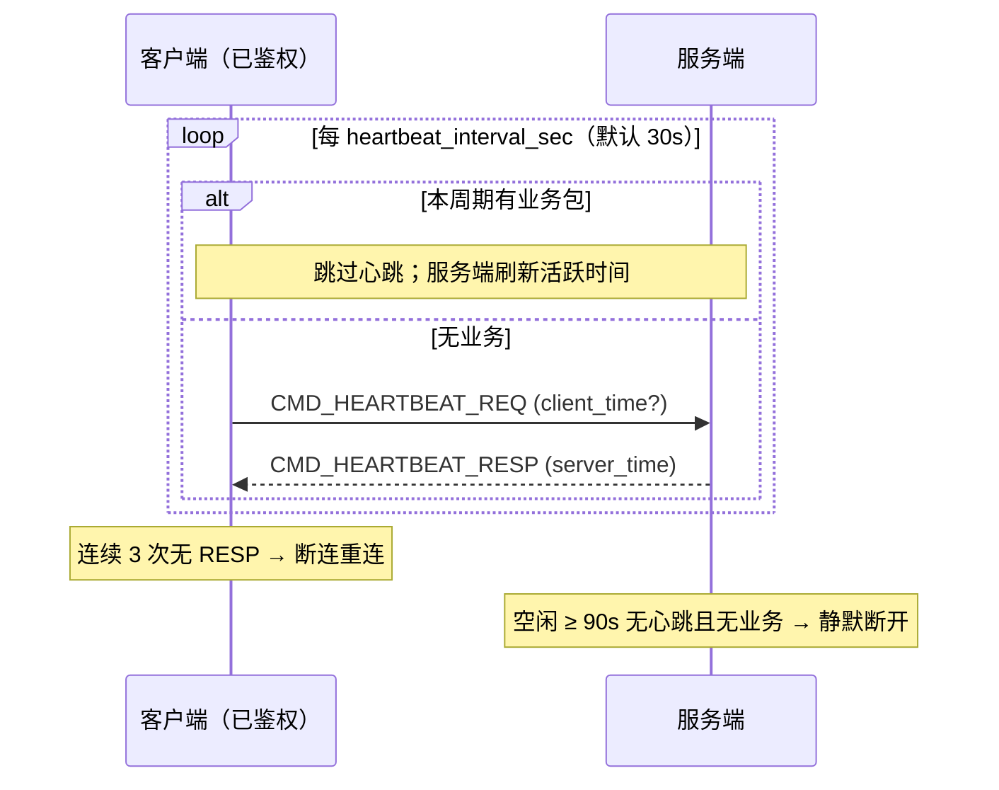

# 设计说明：心跳

| 项 | 内容 |
| --- | --- |
| 状态 | **已确认** |
| 决策编号 | DD-006 |
| 规范定义 | [`proto/auth.proto`](../../proto/auth.proto)（`HeartbeatReq` / `HeartbeatResp`） |
| 行为约定 | [`protocol.md` §6](protocol/protocol.md#6-心跳) |
| 索引 | [`design-decisions.md`](../design-decisions.md) |
| 实现文档 | [implementation/elixir/heartbeat.md](../implementation/elixir/heartbeat.md) |

---

## 1. 要解决什么问题

长连接在 NAT、代理、负载均衡下会被静默断开；客户端崩溃时服务端需回收连接。心跳用于：

- 维持连接活跃、探测对端是否存活
- 客户端及时发现断线并重连
- 服务端清理僵尸连接

---

## 2. 决策摘要（已确认）

| # | 决策 |
| --- | --- |
| 1 | 间隔 **`heartbeat_interval_sec = 30`**（由 `AuthResp` 下发）；连续 **N=3** 次无 RESP 则客户端重连 |
| 2 | 服务端空闲超时 **≥ 3×interval（默认 90s）**：无心跳且无业务则断开 |
| 3 | **任意业务包**（发消息、ACK、拉离线等）重置心跳计时，有业务时可不发本周期心跳 |
| 4 | `HeartbeatReq.client_time` **保留**，用于 RTT / 对时 |
| 5 | 心跳失败**不走** `CMD_ERROR`：客户端本地超时重连；服务端静默断开 |

---

## 完整流程

未鉴权阶段 **不发** 心跳，仅受 10s 鉴权超时约束（见 [auth.md](auth.md)）。

---

## 3. 为什么这样设计

### 3.1 间隔由服务端下发

| 点 | 意图与好处 |
| --- | --- |
| 在 `AuthResp` 中带 `heartbeat_interval_sec` | 鉴权成功即获得参数，无需额外配置接口 |
| 默认 30s | 低于常见 NAT 空闲断开（60–120s），又不过于频繁 |

### 3.2 客户端发 REQ、服务端 RESP

| 点 | 意图与好处 |
| --- | --- |
| 与鉴权相同的请求-响应模型 | SDK 实现一致，易做超时检测 |
| `HeartbeatResp.server_time` | 对时、粗算 RTT（与 `client_time` 配合） |

### 3.3 N=3 再重连

| 点 | 意图与好处 |
| --- | --- |
| 抗单次丢包 | 避免弱网下一丢包就重连 |
| 最坏感知断连 ≈ 90s | 3 × 30s，与服务端空闲策略对齐 |

### 3.4 业务包重置心跳计时

| 点 | 意图与好处 |
| --- | --- |
| 有业务即视为活跃 | 聊天频繁时减少无意义心跳包 |
| 服务端以「最后活跃时间」判空闲 | 心跳与业务包均更新活跃时间戳 |

### 3.5 失败不走 CMD_ERROR

| 点 | 意图与好处 |
| --- | --- |
| 心跳是连接层保活，不是业务 RPC | 超时 = 连接不可用，直接重连即可 |
| 服务端静默断开 | 无需额外错误包，简化客户端状态机 |

### 3.6 与鉴权阶段的关系

| 阶段 | 行为 |
| --- | --- |
| 未鉴权 | **不发**心跳；仅受鉴权 10s 超时 |
| 已鉴权 | 按 interval 发心跳 |
| 重连 | 重新 `AUTH_REQ` → 再取新的 `heartbeat_interval_sec` |

---

## 4. 默认参数

| 参数 | 默认值 | 说明 |
| --- | --- | --- |
| `heartbeat_interval_sec` | 30 | 客户端发包周期；单次 REQ 等待 RESP 超时同此值 |
| 客户端重连阈值 N | 3 | 连续 N 次无 RESP |
| 服务端空闲超时 | 90 | 建议 `3 × heartbeat_interval_sec` |
| `HeartbeatReq.client_time` | 可选填 | 填则服务端可在 RESP 中辅助 RTT |

---

## 5. 刻意放弃

| 放弃 | 原因 |
| --- | --- |
| 仅用 WebSocket Ping/Pong | 应用层心跳可带时间、统一走 Packet 观测 |
| 服务端主动 HEARTBEAT_REQ | 客户端驱动模型更简单 |
| 心跳失败 CMD_ERROR | 已确认：连接层问题走重连，不走业务错误 |

---

