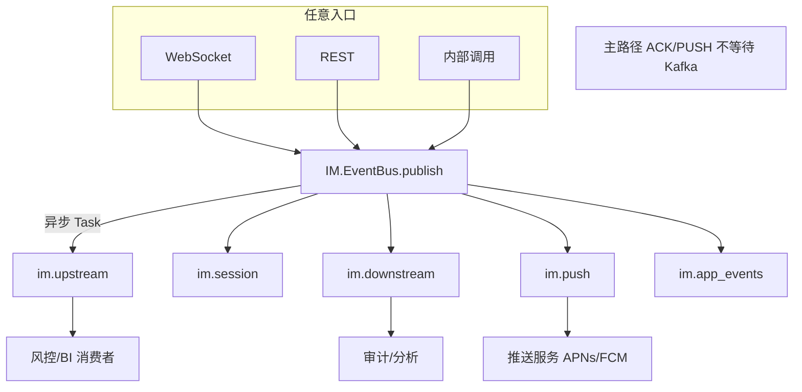
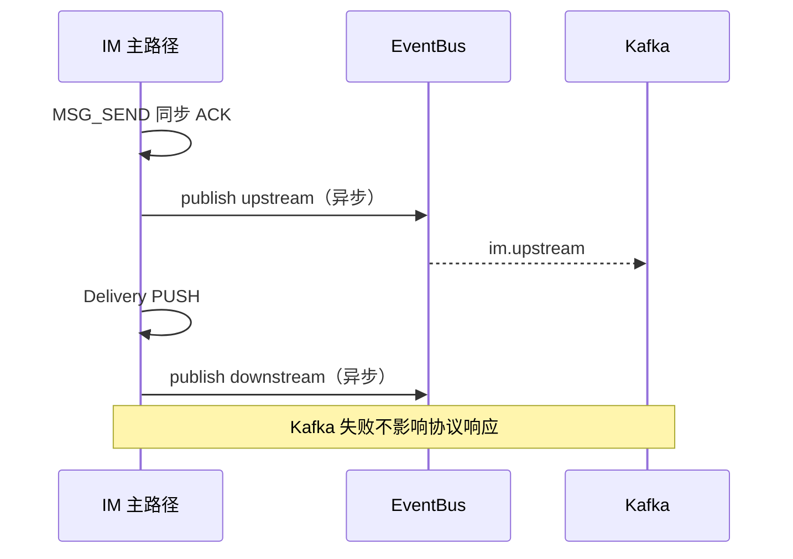

# 设计说明：Kafka 事件总线

| 项 | 内容 |
|------|------|
| 状态 | **已确认** |
| 决策编号 | DD-029 |
| 规范定义 | 本文档；[`proto/event.proto`](../../proto/event.proto) |
| 行为约定 | 本文档 |
| 索引 | [`design-decisions.md`](../design-decisions.md) |
| 实现文档 | [implementation/elixir/kafka-event-bus.md](../implementation/elixir/kafka-event-bus.md) |
| 相关 | [message-context.md](message-context.md)、[observability.md](observability.md)、[dependency-abstraction.md](dependency-abstraction.md) |

---

## 1. 要解决什么问题

其它业务系统（风控、数据分析、审计、搜索、BI）需要订阅 IM 的**全量上下行与连接事件**，但不能：

- 侵入 IM 主路径（`CMD_MSG_SEND` 同步 ACK）
- 为每个群成员 / 设备各写一条 Kafka（大群、聊天室会打爆 Topic）
- 与入口耦合（WebSocket、REST、内部调用须统一出口）

**决策**：IM 作为 **Kafka Producer**，按职责拆为 **5 个 Topic**（上行 / 会话 / 下行 / 离线推送 / **应用通道**），异步旁路写入；消费方自行订阅。

---

## 完整流程





---

## 2. 决策是什么

### 2.1 五个 Topic

| Topic（默认名） | 职责 | 写入时机 |
|-----------------|------|----------|
| **`im.upstream`** | 所有**上行** IM 协议事件 | 客户端/REST → IM 的请求被受理后（见 §2.3） |
| **`im.session`** | **连接生命周期** | 登录成功、退出、心跳（见 §2.5） |
| **`im.downstream`** | 所有**下行** IM 协议事件 | IM → 客户端的推送/响应旁路（见 §2.4） |
| **`im.push`** | **离线设备系统推送** | 设备离线且需 APNs/FCM 时（见 §2.11） |
| **`im.app_events`** | **应用通道**业务事件 | `CMD_CHANNEL_PUBLISH` / internal channel publish（见 §2.12） |

Topic 名通过配置覆盖，默认上表。五个 Topic **相互独立**，消费者按需订阅。

### 2.2 硬约束

| 约束 | 说明 |
|------|------|
| **不阻塞主路径** | Kafka 写入 **异步**；失败不影响协议 ACK/PUSH |
| **统一出口** | 仅 `IM.EventBus` 写 Kafka；业务经 `publish/3` |
| **全入口覆盖** | WebSocket、HTTP REST、内部系统调用均走同一套 EventBus |
| **可关闭** | `write_kafka: false`（如 Kafka 消费回灌，防循环） |
| **与日志分离** | Kafka 供下游系统；运行日志仍遵守 [observability.md](observability.md) 生产 `:warning` 策略 |
| **`trace_id` 继承** | 事件 `trace_id` **必须** = 触发请求的 `MessageContext.trace_id`（见 [message-context.md](message-context.md) §7.4） |

### 2.3 上行 Topic `im.upstream`

**定义**：凡由**客户端或外部系统发起、进入 IM 业务处理**的请求，归上行。

| 来源 | 示例 |
|------|------|
| WebSocket | `AUTH_REQ`、`MSG_SEND`、`ACK_UP`、`OFFLINE_PULL`、`GROUP_*`、`ROOM_*`、`FRIEND_*`、`PASSTHROUGH`、`RECALL`、`EDIT`、`BURN_PUSH`… |
| HTTP REST | 管理端发消息、REST 发消息、OpenAPI 等价操作 |
| 内部 | 定时任务、管理接口触发的「伪上行」（`source: :internal`） |

**不写入**：纯下行推送（走 `im.downstream`）；连接层 TCP 建连（无业务 Packet）。

**写入时点**：请求 **通过网关解码/鉴权后、进入 Handler 前或 Handler 成功后**（可配置 `upstream_on: :received | :accepted`）。默认 **`:accepted`**（业务校验通过后），减少垃圾流量。

**分区键**：`{app_key}:{user_id}` 或 `route_key`（保证同用户有序）。

#### 上行事件信封

Protobuf：`UpstreamEvent`（见 `proto/event.proto`）。`payload` 为 **原始 `Packet.payload` 字节**，`cmd` 为 `CmdType` 枚举值。

开发调试可转 JSON 查看，线上不写 JSON：

```json
{
  "event_id": "uuid",
  "cmd": 100,
  "payload": "<base64 protobuf bytes>",
  "app_key": "app_001",
  "trace_id": "trace-abc"
}
```

### 2.4 下行 Topic `im.downstream`

**定义**：凡由 **IM 发往客户端** 的业务数据，归下行。

| 类型 | 示例 |
|------|------|
| 响应 | `AUTH_RESP`、`OFFLINE_PULL_RESP`、`GROUP_CREATE_RESP`… |
| 推送 | `CMD_MSG_PUSH`、`CMD_MSG_PUSH_BATCH`、`CMD_KICK`、`*_PUSH` 通知 |
| 错误 | `CMD_ERROR`（可选写入，默认 **开启**） |

**写入时点**：Packet **编码完成、写入 Socket 之前**（旁路）；批量推送可合并为 **一条** Kafka 事件（见 §2.6）。

**分区键**：`{app_key}:{msg_id}` 或 `{app_key}:{conv_id}`。

#### 下行事件信封

Protobuf：`DownstreamEvent`。大群/聊天室 `fanout.mode` 为 `GROUP_AGGREGATED` / `ROOM_AGGREGATED` 时 **`targets`（设备级）为空**，受众见 `fanout.audience`（用户级列表，见 §2.6.1）。

### 2.5 会话 Topic `im.session`

**定义**：连接级生命周期，**非**业务消息内容。

| event_subtype | 触发 | 说明 |
|---------------|------|------|
| `login` | `AUTH` 成功 | 含 `user_id`、`device_id`、`platform`、`session_id` |
| `logout` | 正常断连、踢人、进程 DOWN | 含 `reason` |
| `heartbeat` | `HEARTBEAT_REQ` 成功 | 见 §2.5.1 |

Protobuf：`SessionEvent`（`event_type` = `SESSION_LOGIN` / `SESSION_LOGOUT` / `SESSION_HEARTBEAT`）。

#### 2.5.1 心跳写入策略（规模前提）

百万在线下全量心跳写 Kafka 会产生极高吞吐（~数万条/秒级）。**默认**：

| 配置 | 默认 | 说明 |
|------|------|------|
| `session_heartbeat_mode` | `:sampled` | `:all` / `:sampled` / `:off` |
| `session_heartbeat_sample_rate` | `0.01` | 采样率 1% |
| `session_heartbeat_min_interval_ms` | `300_000` | 每设备至少间隔 5min 才写一条 |

`login` / `logout` **始终全量写入**。运维可临时调 `:all` 用于排障。

### 2.6 群聊 / 聊天室下行减量

**问题**：群 5000 人、聊天室 10 万人在线时，「每设备一条 Kafka」不可接受。

**策略**（可组合，配置化）：

| 模式 | 适用 | Kafka 条数 / 次推送 |
|------|------|---------------------|
| **`direct`** | 单聊、小群（成员 ≤ `fanout_direct_max`，默认 100） | 每目标设备 1 条（或按 `PUSH_BATCH` 1 条含多 msg） |
| **`aggregated`** | 大群、聊天室 | **每波扇出 1 条**；含 `fanout` 统计 + `audience` 用户列表（见 §2.6.1） |
| **`target_users`** | 定向群/室消息 | 1 条；`target_users` 填列表（≤ 配置上限） |
| **`sampled`** | 超大聊天室（可选） | 在 `aggregated` 基础上 Kafka 写入采样（协议推送仍全量） |

```text
                    ┌─ direct ────────► N 条（小群，含 targets 设备列表）
推送扇出 ──判定──► ├─ aggregated ───► 1 条（室/大群，含 audience 用户列表）
                    └─ push_batch ───► 1 条（批量 Packet）
```

**原则**：**协议层仍按设计推送给每个在线设备**；减量 **仅作用于 Kafka 旁路**，不影响客户端收消息。

#### 2.6.1 聊天室 aggregated：一条 Kafka + 用户列表

聊天室一次 `CMD_MSG_PUSH` 扇出时，**写 1 条** `im.downstream`，在 `FanoutAudience` 中携带：

| 字段 | 说明 |
|------|------|
| `from_user_id` | **上行**发送方（谁发的） |
| `from_device_id` | 发送设备（对应「发送设备不收 PUSH」） |
| `recipient_user_ids` | **下行**实际推送到的 `user_id` 列表（在线成员，已排除发送设备；去重） |
| `online_count` | 与列表长度一致（未截断时） |
| `recipient_list_truncated` | 是否因超限截断 |

**不包含**设备级 `device_id` 列表（除非 `direct` 模式小范围）；消费方只需知道「哪些用户收到了」，设备级明细用 `targets`（仅 direct）。

示例（概念）：

```text
DownstreamEvent {
  cmd: CMD_MSG_PUSH
  chat_type: CHAT_ROOM
  conv_id: "r:room_001"
  fanout: {
    mode: ROOM_AGGREGATED
    online_count: 1200
    audience: {
      from_user_id: "alice"
      from_device_id: "d1"
      recipient_user_ids: ["bob", "carol", ...]  // ≤ 上限
      recipient_list_truncated: false
    }
  }
  payload: <ChatMessage bytes>
}
```

##### 用户列表上限（必配）

十万人在线聊天室若全量 listing，单条 Kafka 可达数 MB。

| 配置 | 默认 | 说明 |
|------|------|------|
| `downstream_room_recipient_list_max` | `2000` | 聊天室 `recipient_user_ids` 最多写入条数 |
| `downstream_group_recipient_list_max` | `500` | 大群 aggregated 列表上限 |
| 超限行为 | `truncate` | 写前 N 个 + `recipient_list_truncated=true`；`online_count` 仍为真实值 |

消费方：若 `truncated=true`，用 `online_count` 做统计，**不可**假设列表完整；需全量成员请查群/室服务或独立同步 Topic。

##### 与 `targets` 的分工

| 字段 | 粒度 | 何时填充 |
|------|------|----------|
| `targets[]` | user + device | `direct` 模式（单聊、小群） |
| `fanout.audience.recipient_user_ids` | 仅 user | `ROOM_AGGREGATED` / `GROUP_AGGREGATED` |
| `fanout.target_users` | 定向显式列表 | `MSG` 带 `target_users` 时 |

##### 写入时点

在 **Delivery 扇出完成、已知实际推送用户集合后**、Socket `write` 之前，异步 cast 一条 `DownstreamEvent`（与 Socket 写出并行，不等待 Kafka）。

| 配置项 | 默认 |
|--------|------|
| `downstream_fanout_direct_max` | `100` |
| `downstream_room_mode` | `:aggregated` |
| `downstream_group_large_threshold` | `500` |
| `downstream_room_recipient_list_max` | `2000` |
| `downstream_group_recipient_list_max` | `500` |

### 2.11 离线推送 Topic `im.push`

**定义**：消息扇出时，将本条 `msg_id` 的全部**离线**且具备有效 `push_token` 的设备，聚合为 **`PushNotificationBatchEvent`** 写入 Kafka；推送服务展开 `targets` 后 **per-device** 调 APNs/FCM。

**与 `im.downstream` 分离的原因**：下行镜像可无 token；系统推送必须在 `targets[]` 中带设备级 `push_token`，消费者与语义均不同。

**写入时点**：Delivery 扇出**结束后**（在线设备已 WS 推送），异步 cast 批量事件；**不**等待推送服务 ACK。

**分区键**：`{app_key}:{msg_id}`。

**信封**：Protobuf `PushNotificationBatchEvent`（见 `proto/event.proto`）。

详细规则（写入条件、免打扰、分块）见 [mobile-push.md](mobile-push.md)。

```text
Delivery 扇出
  ├─ device 在线 → WebSocket CMD_MSG_PUSH
  └─ 扇出结束 → 收集离线 targets
        → im.push（PushNotificationBatchEvent，超 push_batch_targets_max 则分块）
```

| 配置项 | 默认 |
|--------|------|
| `push_enabled` | `true` |
| `push_room_enabled` | `false` |
| `push_display_body_max` | `100` |
| `push_batch_targets_max` | `500` |

### 2.12 应用通道 Topic `im.app_events`

**定义**：[应用通道](app-channel.md)（App Channel）上下行业务载荷的统一出口；与 `im.upstream`（IM 协议 cmd 镜像）**职责分离**。

| 方向 | 触发 | `AppEvent.direction` |
|------|------|---------------------|
| 上行 | 客户端 `CMD_CHANNEL_PUBLISH` 通过限速/ACL | `APP_EVENT_UP` |
| 下行 | `POST /internal/v1/channels/{id}/publish` 扇出前 | `APP_EVENT_DOWN` |

**写入时点**：异步 cast；**不**阻塞 `CMD_CHANNEL_PUBLISH_ACK` 或 PubSub 广播。

**分区键**：`{app_key}:{channel_id}`。

**信封**：Protobuf `AppEvent`（见 `proto/event.proto`）。

**QoS**：允许丢；Kafka 失败不影响 WS；无离线补发。

| 配置项 | 默认 |
|--------|------|
| `app_events_enabled` | `true` |
| `app_events_topic` | `im.app_events` |
| `channel_publish_aggregate_max` | `5000`（/s per channel，见 app-channel.md） |

### 2.7 架构

```text
 WebSocket ──┐
 HTTP REST ──┼──► IM 业务 Handler ──► 主路径（ACK/PUSH/落库）
 内部调用 ───┘              │
                            │ cast 异步
                            ▼
                    IM.EventBus.Buffer
                            │
                            ▼
                    IM.EventBus.KafkaProducer
                            │
            ┌───────────────┼───────────────┬───────────┐
            ▼               ▼               ▼           ▼
      im.upstream    im.session    im.downstream   im.push
```

- **Buffer**：进程内队列 + 批量 `produce`；背压时丢弃计数打 Telemetry（**不**反压主路径）
- **失败**：本地重试 → 仍失败则 `im.dlq`（可选第四 Topic，见 §2.9）

### 2.8 与 MessageContext 的关系

| 字段 | 说明 |
|------|------|
| `write_kafka` | 默认 `true`；Kafka 消费入口设 `false` |
| `source` | `:websocket` / `:http` / `:kafka` / `:internal` |

见 [message-context.md](message-context.md)。

### 2.9 DLQ（可选）

Kafka 持续不可用时，事件写入 `im.dlq` 或本地 PG 表 `failed_events`，供管理端重放。不阻塞主路径。

### 2.10 序列化格式：Protobuf 二进制（默认）

Kafka **value 默认使用 Protobuf 二进制**，定义见 [`proto/event.proto`](../../proto/event.proto)。**不用 JSON 作为线上默认格式**。

#### 2.10.1 对比（编解码与资源）

| 维度 | Protobuf 二进制 | JSON |
|------|-----------------|------|
| **编码 CPU** | 低；结构体 → bytes，无中间 map | 高；struct → map → `Jason.encode` 分配多 |
| **解码 CPU** | 低 | 高；全字符串解析 |
| **消息体积** | 小（约为 JSON 的 30%–60%） | 大；字段名重复、数字/枚举为文本 |
| **与 IM 协议一致** | **可直接透传 `Packet.payload` 字节**，无需解开再编码 | 须 PB 解码 → 转 map → JSON，**双重成本** |
| **Schema 演进** | `proto/event.proto` 与 `proto/*.proto` 统一版本管理 | 无强约束，易漂移 |
| **消费方接入** | 需 `proto` 文件或代码生成 | 任意语言 `json` 即可 |
| **排障可读性** | 需 `protoc --decode` 或消费侧工具 | `kcat` 直接可读 |

百万在线、五 Topic 高吞吐下，**Buffer 进程 CPU 与 Kafka 磁盘/网络**是主要成本；JSON 在旁路虽/async，仍会占用整集群算力。

#### 2.10.2 决策

| 项 | 选择 |
|----|------|
| **生产默认** | `serialization: :protobuf` |
| **Kafka 消息体** | `UpstreamEvent` / `SessionEvent` / `DownstreamEvent`（`proto/event.proto`） |
| **业务 payload** | 字段 `bytes payload` = **线上 `Packet.payload` 原样**，不再 JSON 化 |
| **Kafka Record Header** | `content-type: application/x-protobuf`；`schema: im.event.UpstreamEvent`（或 Schema Registry id） |
| **开发/调试** | 配置 `serialization: :json` 或 CLI 工具 PB→JSON；**不用于生产默认** |

#### 2.10.3 编码路径（最低 CPU）

```text
WebSocket 收包
  → Codec 解码 Packet（一次 PB decode）
  → 业务 Handler 处理
  → EventBus：组装 UpstreamEvent { meta字段 + payload = packet.payload }  // 内层不再 decode
  → Buffer 进程：UpstreamEvent.encode()（一次 PB encode）
  → Kafka
```

**避免**：`packet.payload` → decode ChatMessage → `Jason.encode!` → Kafka（多一次 decode + JSON encode）。

REST 入口无现成 `payload` 字节时：由 REST body **直接 encode 为对应 proto message bytes** 写入 `payload`，仍不走 JSON。

#### 2.10.4 JSON 适用场景（非默认）

| 场景 | 说明 |
|------|------|
| 本地开发 | `IM_EVENT_BUS_SERIALIZATION=json` 便于 `kcat` 肉眼查看 |
| 一次性脚本 / 数据探查 | 消费后转 JSON 落盘 |
| 无法引入 proto 的临时消费方 | 可在 **消费侧** 用独立转码服务 PB→JSON，**不在 IM 写入侧统一转 JSON** |

#### 2.10.5 Schema Registry（可选 Phase 9+）

生产建议使用 Confluent Schema Registry 注册 `im.event.*` message，值为 **protobuf** schema。与现有 `proto/` 仓库同步发布。

#### 2.10.6 「JSON 索引 + PB 完整体」是否更合适？

**思路正确**：Kafka 消息应拆成两层——

| 层 | 内容 | 消费方 |
|----|------|--------|
| **索引 / 过滤层** | `app_key`、`trace_id`、`cmd`、`user_id`、`msg_id`… | 路由、过滤、监控、轻量订阅 |
| **完整业务层** | `Packet.payload` 对应 proto bytes | 风控、归档、搜索等需要全文时 **按需 decode** |

但 **「JSON 包一层 + PB」作为 Kafka value 体** 不是最优实现，原因如下。

##### 三种实现对比

| 方案 | 形态 | 索引可读 | 编解码成本 | 体积 | 推荐 |
|------|------|----------|------------|------|------|
| **A. 纯 PB 信封**（当前默认） | value = `UpstreamEvent{meta…, bytes payload}` | 需 proto 工具 | **最低**；信封一次 encode；payload 透传 | **最小** | ✅ 生产默认 |
| **B. JSON + base64(payload)** | value = `{"cmd":100,"payload":"<b64>"}` | kcat 可读 | JSON encode + **base64 膨胀 ~33%** on body | 较大 | 仅开发 |
| **C. Kafka Headers + PB value** | headers 放索引字段；value = 同 A | headers 可直接读 | 与 A 相当；多写几条 header | 与 A 相当 | ✅ 生产可选增强 |

##### 为什么 A 已经满足「按需解码」

Protobuf **天然支持**只解析部分字段：

```text
UpstreamEvent 二进制
  → 解析字段 1–10（event_id / app_key / cmd / …）  ← 轻量
  → 字段 11 payload：保留为 bytes，不 decode 内层 ChatMessage  ← 按需
```

消费方用 `proto` 的 merge/parse 可跳过 `payload` 内层，**不必**为了「少解码」再套一层 JSON。

全量 JSON 化 `ChatMessage` 才是应避免的（CPU + 体积）；**不是** PB 信封本身的问题。

##### JSON + PB 混合体的额外代价（方案 B）

```json
{
  "event_id": "…",
  "app_key": "…",
  "cmd": 100,
  "user_id": "alice",
  "payload": "<base64 protobuf bytes>"
}
```

| 问题 | 说明 |
|------|------|
| 仍要 JSON encode | 索引层虽小，百万 QPS 下仍有成本 |
| base64 | `payload` 体积 +33%，Kafka 磁盘/网络变差 |
| 双格式 | 消费方既要 JSON 又要 proto 定义 |
| 与 A 功能重复 | 索引字段与 `UpstreamEvent` 字段 1–10 重复 |

因此：**不推荐**生产默认用 JSON 包裹 PB；概念上对的，实现上劣于纯 PB 信封。

##### 推荐生产形态（A + 可选 C）

```text
Kafka Record
  Headers（可选，UTF-8 字符串，便于 Flink / kcat 过滤）:
    x-im-app-key: app_001
    x-im-trace-id: abc
    x-im-cmd: 100
    x-im-user-id: alice
    x-im-event-id: uuid
    content-type: application/x-protobuf
  Value（二进制）:
    UpstreamEvent { …meta, payload = raw Packet.payload }
```

- **IM 写入侧**：一次 `UpstreamEvent.encode()`；headers 从 struct 填字符串，**无 JSON、无 base64**
- **轻量消费方**：只读 headers，不碰 value
- **重量消费方**：decode `UpstreamEvent`，仅在需要时 decode `payload` 内层 proto

配置：`kafka_record_headers: true`（默认 **开启**）。

##### 何时用 JSON 包裹（方案 B）

| 场景 | 配置 |
|------|------|
| 本地 `kcat` 肉眼排查 | `serialization: :json_envelope`（`payload` 为 base64） |
| 无 proto 的临时脚本 | 消费侧转码服务，或短期开 `json_envelope` |

**生产默认**：`serialization: :protobuf` + `kafka_record_headers: true`。

---

## 3. 为什么这样设计

| 原因 | 说明 |
|------|------|
| **四 Topic 清晰** | 消费者按关注点订阅：消息流 / 在线状态 / 下行镜像 / **离线推送** |
| **上行统一** | REST 与 WS 同一 Topic，下游无需关心入口 |
| **下行可减量** | 大群/聊天室 aggregated，避免 Kafka 成为瓶颈 |
| **异步** | 满足百万在线与 SEND 同步 ACK 约束 |
| **可演进** | 信封 `event_type` + `cmd` 可扩展新命令 |
| **PB 透传 payload** | 避免 PB→JSON 双重编解码，降低 Buffer CPU |

---

## 4. 有什么好处

| 好处 | 说明 |
|------|------|
| 解耦 | 风控/BI/搜索独立演进 |
| 可观测 | 全链路镜像供离线分析 |
| 有序 | 分区键保证同用户/会话顺序 |
| 安全降级 | Kafka 挂掉 IM 仍可收发消息 |

---

## 5. 刻意不做

| 不做 | 原因 |
|------|------|
| Kafka 参与 SEND 决策 | 违反主路径时序；拦截走同步 Hook |
| 下行每设备必写（大群） | 量级不可承受 |
| 同步 `produce` 在热路径 | 延迟与可用性风险 |
| 心跳全量写（默认） | 规模下打爆 Kafka；默认采样 |
| 生产 Kafka value 用全量 JSON | CPU 与体积差；与线上 Packet 不一致 |
| 生产 Kafka value 用 JSON 包 PB（base64） | 比纯 PB 信封更慢、更大；索引用 Headers 替代 |

---

## 6. 监控

| 指标 | 说明 |
|------|------|
| `im_eventbus_publish_total{topic,result}` | 发布成功/失败 |
| `im_eventbus_buffer_depth` | 缓冲队列深度 |
| `im_eventbus_dropped_total` | 背压丢弃 |
| `im_eventbus_fanout_mode{mode}` | aggregated/direct 分布 |

Kafka 写入 **不打** 生产 info 日志；失败 `warning` + 指标。

---

## 附录：命令与 Topic 映射速查

| 方向 | cmd 示例 | Topic |
|------|----------|-------|
| 上行 | `CMD_MSG_SEND`、`CMD_AUTH_REQ`（若 `upstream_on: :accepted` 则仅成功路径） | `im.upstream` |
| 上行 | REST `POST /messages` | `im.upstream` |
| 会话 | `AUTH` 成功 | `im.session`（login） |
| 会话 | 断连 / `CMD_KICK` | `im.session`（logout） |
| 会话 | `HEARTBEAT_REQ` | `im.session`（heartbeat，可采样） |
| 下行 | `CMD_MSG_PUSH`、`CMD_AUTH_RESP`、`CMD_MSG_BURN_PUSH` | `im.downstream` |
| 离线推送 | 设备离线 + 有 `push_token` | `im.push`（`PushNotificationBatchEvent`，按 `msg_id` 聚合） |

`CMD_AUTH_REQ` 本身可作为上行（可选）；`login` 会话事件在鉴权成功后 **额外** 写 `im.session`。
