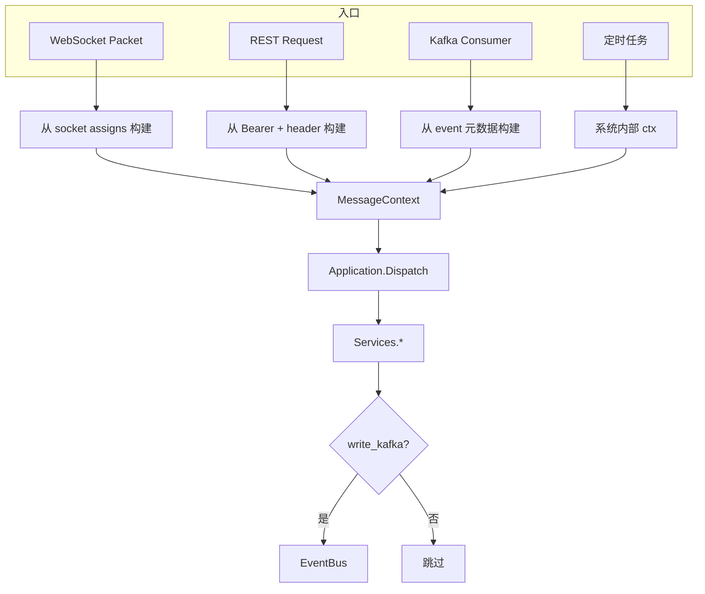

# 设计说明：消息上下文（MessageContext）

| 项 | 内容 |
|------|------|
| 状态 | 已确认 |
| 决策编号 | DD-022 |
| 规范定义 | 本文档（内部结构定义） |
| 行为约定 | 本文档 |
| 索引 | [`design-decisions.md`](../design-decisions.md) |
| 实现文档 | [implementation/elixir/message-context.md](../implementation/elixir/message-context.md) |
| 双通道 | [dual-channel-api.md](dual-channel-api.md) |
| Kafka | [kafka-event-bus.md](kafka-event-bus.md) |

---

## 1. 要解决什么问题

系统支持多种消息入口：
- **WebSocket 长连接**：客户端 SDK 通过 Packet 发送
- **HTTP REST API**：服务端调用
- **Kafka 消费**：异步处理
- **定时任务**：系统内部触发

这些入口在处理消息时，需要：
- 追踪消息来源（用于审计、差异化逻辑）
- 传递租户信息（app_key）
- 传递用户身份（user_id、device_id）
- 传递链路追踪信息（trace_id）
- 传递控制项（是否写 Kafka、是否推送、是否存储等）

**问题**：这些信息散落在各处，缺乏统一的结构化传递机制。

---

## 完整流程



---

## 2. 决策是什么

### 2.1 统一 MessageContext 结构

在系统内部，所有消息处理函数都接收一个 `MessageContext` 结构，包含：

```elixir
%{
  # ----- 来源标识 -----
  source: :websocket | :http | :kafka | :system,
  
  # ----- 租户信息 -----
  app_key: String.t(),
  
  # ----- 用户身份 -----
  user_id: String.t() | nil,        # 发起用户（WebSocket/HTTP 时必填）
  device_id: String.t() | nil,      # 设备 ID（WebSocket 时必填）
  
  # ----- 链路追踪 -----
  trace_id: String.t(),             # 全链路追踪 ID
  
  # ----- 请求级信息 -----
  packet_cid: String.t() | nil,     # Packet.cid（仅 WebSocket）
  route_key: String.t() | nil,      # 路由键（用于分流）
  
  # ----- 连接信息 -----
  socket: pid() | nil,              # WebSocket 进程 pid（仅 WebSocket）
  
  # ----- 设备资源 -----
  device: DeviceResource.t() | nil, # 设备资源信息（鉴权后填充）
  
  # ----- 控制项 -----
  write_kafka: boolean(),           # 是否写 Kafka 事件（默认 true）
  run_hooks: boolean(),             # 是否运行 Hooks（默认 true）
  push_online: boolean(),           # 是否推送在线用户（默认 true）
  store_offline: boolean(),         # 是否存储离线消息（默认 true）
  
  # ----- 时间信息 -----
  started_at: integer(),            # 请求开始时间（ms）
  
  # ----- 扩展字段 -----
  metadata: map()                   # 业务自定义扩展
}
```

**DeviceResource 结构**（来自 `proto/auth.proto`）：

```elixir
%{
  device_id: String.t(),     # 设备唯一标识
  session_id: String.t(),    # 会话 ID（服务端生成）
  platform: String.t(),      # 平台：ios / android / web / desktop
  os: String.t(),            # 操作系统：iOS 15.0 / Android 12
  sdk_ver: String.t(),       # SDK 版本号
  device_name: String.t(),   # 设备名称（可选）
  device_model: String.t(),  # 设备型号（可选）
  network: String.t(),       # 网络类型（可选）
  client_ip: String.t(),     # 客户端 IP（服务端检测）
  connected_at: integer()    # 连接时间（服务端生成）
}
```

### 2.2 字段分类

| 分类 | 字段 | 说明 |
|------|------|------|
| **来源标识** | `source` | 区分消息入口，用于审计和差异化逻辑 |
| **租户信息** | `app_key` | 多租户隔离，**必填** |
| **用户身份** | `user_id` | 发起者身份（从 device 中获取） |
| **设备资源** | `device` | 完整的设备资源信息 |
| **链路追踪** | `trace_id` | 全链路追踪，日志、存储、下游调用透传 |
| **请求级信息** | `packet_cid`, `route_key` | 请求级幂等、路由分流 |
| **连接信息** | `socket` | WebSocket 进程 pid |
| **控制项** | `write_kafka`, `run_hooks` 等 | 控制处理流程 |
| **扩展字段** | `metadata` | 业务自定义 |

---

## 3. 为什么这样设计

### 3.1 为什么需要统一的 Context

**问题**：不同入口的消息处理逻辑相同，但需要不同的上下文信息。

| 入口 | 需要的信息 | 差异化逻辑 |
|------|-----------|-----------|
| WebSocket | `app_key`, `user_id`, `device_id`, `trace_id`, `socket` | 实时推送、连接级限流 |
| HTTP REST | `app_key`, `user_id`, `trace_id` | Bearer 鉴权；`source: :http_client` |
| HTTP 内部 | `app_key`, `trace_id`, `caller_service`, `client_ip` | 无用户 token；`source: :http_internal` |
| Kafka | `app_key`, `trace_id` | 不写 Kafka（避免循环） |
| 系统内部 | `app_key`, `trace_id` | 跳过 Hooks、直接处理 |

**解决方案**：统一 `MessageContext` 结构，所有入口构造相同格式的上下文。

### 3.2 为什么使用 Map 而非 Struct

**优点**：
- 灵活扩展：新字段无需修改结构定义
- 易于测试：构造简单
- 模式匹配友好：支持部分字段匹配

**缺点**：
- 类型安全性弱于 Struct
- 编译时无法检查字段是否存在

**权衡**：在服务层内部使用 Map，在边界层（协议解析）使用 Struct。

### 3.3 为什么需要控制项

**场景**：
- **Kafka 消费**：不需要再写 Kafka，避免循环
- **系统内部调用**：可能跳过 Hooks（如管理员操作）
- **降级场景**：关闭某些功能以保核心服务

**实现**：通过控制项开关，无需修改业务逻辑代码。

---

## 4. 有什么好处

### 4.1 统一的消息处理逻辑

| 好处 | 说明 |
|------|------|
| 代码复用 | 所有入口调用相同的服务函数 |
| 逻辑一致 | 权限校验、消息校验、存储、推送等逻辑统一 |
| 易于测试 | 构造 Context 即可测试，无需模拟完整请求 |

### 4.2 完整的链路追踪

| 好处 | 说明 |
|------|------|
| trace_id 透传 | 日志、存储、下游调用、Kafka 事件全链路关联 |
| 问题排查 | 通过 trace_id 快速定位问题 |
| 性能分析 | 统计各环节耗时 |

### 4.3 灵活的控制能力

| 好处 | 说明 |
|------|------|
| 功能开关 | 通过控制项动态开启/关闭功能 |
| 降级能力 | 紧急情况下关闭非核心功能 |
| 差异化逻辑 | 根据 `source` 执行不同逻辑 |

---

## 5. 使用示例

### 5.1 WebSocket 入口

```elixir
defmodule IM.WebSocket.Handler do
  def handle_msg_send(packet, socket) do
    {:ok, req} = IM.Protocol.decode_payload(packet, :MsgSendReq)
    
    # 从 socket.assigns 中获取鉴权时填充的 device 资源
    context = %{
      source: :websocket,
      app_key: socket.assigns.app_key,
      user_id: socket.assigns.user_id,
      device: socket.assigns.device,  # DeviceResource 结构
      trace_id: packet.trace_id || generate_trace_id(),
      packet_cid: packet.cid,
      route_key: packet.route_key,
      socket: socket,
      write_kafka: true,
      run_hooks: true,
      push_online: true,
      store_offline: true,
      started_at: System.system_time(:millisecond),
      metadata: %{}
    }
    
    case IM.Services.Message.send_message(req.message, context) do
      {:ok, msg_id} -> {:ok, socket}
      {:error, code, msg} -> IM.Protocol.Reply.error(socket, packet, code, msg)
    end
  end
end
```

### 5.2 HTTP REST 入口

```elixir
defmodule IMWeb.Api.MessageController do
  def send(conn, params) do
    # HTTP REST 入口，设备信息从 HTTP Header 或 token 中解析
    context = %{

      source: :http,
      app_key: conn.assigns.app_key,
      user_id: conn.assigns.user_id,
      device_id: nil,
      trace_id: conn.assigns.trace_id,
      packet_cid: nil,
      route_key: nil,
      socket: nil,
      remote_ip: conn.remote_ip,
      remote_port: nil,
      platform: nil,
      sdk_ver: nil,
      write_kafka: true,
      run_hooks: true,
      push_online: true,
      store_offline: true,
      started_at: System.system_time(:millisecond),
      metadata: %{"admin" => conn.assigns.is_admin}
    }
    
    case IM.Services.Message.send_message(params, context) do
      {:ok, msg_id} -> json(conn, %{code: 0, data: %{msg_id: msg_id}})
      {:error, code, msg} -> json(conn, %{code: code, message: msg})
    end
  end
end
```

### 5.3 Kafka 消费入口

```elixir
defmodule IM.Consumers.Message do
  def handle_message(%{key: _key, value: message}) do
    context = %{
      source: :kafka,
      app_key: message["app_key"],
      user_id: nil,
      device_id: nil,
      trace_id: message["trace_id"] || generate_trace_id(),
      packet_cid: nil,
      route_key: nil,
      socket: nil,
      remote_ip: nil,
      remote_port: nil,
      platform: nil,
      sdk_ver: nil,
      write_kafka: false,  # 避免循环
      run_hooks: true,
      push_online: true,
      store_offline: true,
      started_at: System.system_time(:millisecond),
      metadata: %{}
    }
    
    IM.Services.Message.send_message(message, context)
  end
end
```

### 5.4 系统内部调用

```elixir
defmodule IM.Services.System do
  def send_system_message(app_key, to_user_id, content) do
    message = %{
      chat_type: :CHAT_PRIVATE,
      from: "system",
      to: to_user_id,
      msg_type: :MSG_TEXT,
      content: content
    }
    
    context = %{
      source: :system,
      app_key: app_key,
      user_id: nil,
      device_id: nil,
      trace_id: generate_trace_id(),
      packet_cid: nil,
      route_key: nil,
      socket: nil,
      remote_ip: nil,
      remote_port: nil,
      platform: nil,
      sdk_ver: nil,
      write_kafka: true,
      run_hooks: false,  # 系统消息跳过 Hooks
      push_online: true,
      store_offline: true,
      started_at: System.system_time(:millisecond),
      metadata: %{"system_message" => true}
    }
    
    IM.Services.Message.send_message(message, context)
  end
end
```

---

## 6. Context 构造工具函数

### 6.1 构造函数

```elixir
defmodule IM.Context do
  @moduledoc """
  消息上下文构造与管理。
  """
  
  @doc """
  从 WebSocket 连接构造 Context。
  """
  def from_socket(socket, packet, opts \\ []) do
    %{
      source: :websocket,
      app_key: socket.assigns.app_key,
      user_id: socket.assigns.user_id,
      device_id: socket.assigns.device_id,
      trace_id: packet.trace_id || generate_trace_id(),
      packet_cid: packet.cid,
      route_key: packet.route_key,
      socket: socket,
      remote_ip: socket.assigns.remote_ip,
      remote_port: socket.assigns.remote_port,
      platform: socket.assigns.platform,
      sdk_ver: socket.assigns.sdk_ver,
      write_kafka: Keyword.get(opts, :write_kafka, true),
      run_hooks: Keyword.get(opts, :run_hooks, true),
      push_online: Keyword.get(opts, :push_online, true),
      store_offline: Keyword.get(opts, :store_offline, true),
      started_at: System.system_time(:millisecond),
      metadata: Keyword.get(opts, :metadata, %{})
    }
  end
  
  @doc """
  从 HTTP 连接构造 Context。
  """
  def from_http(conn, opts \\ []) do
    %{
      source: :http,
      app_key: conn.assigns.app_key,
      user_id: conn.assigns.user_id,
      device_id: nil,
      trace_id: conn.assigns.trace_id,
      packet_cid: nil,
      route_key: nil,
      socket: nil,
      remote_ip: conn.remote_ip,
      remote_port: nil,
      platform: nil,
      sdk_ver: nil,
      write_kafka: Keyword.get(opts, :write_kafka, true),
      run_hooks: Keyword.get(opts, :run_hooks, true),
      push_online: Keyword.get(opts, :push_online, true),
      store_offline: Keyword.get(opts, :store_offline, true),
      started_at: System.system_time(:millisecond),
      metadata: Keyword.get(opts, :metadata, %{})
    }
  end
  
  @doc """
  从 Kafka 消息构造 Context。
  """
  def from_kafka(message, opts \\ []) do
    %{
      source: :kafka,
      app_key: message["app_key"],
      user_id: nil,
      device_id: nil,
      trace_id: message["trace_id"] || generate_trace_id(),
      packet_cid: nil,
      route_key: nil,
      socket: nil,
      remote_ip: nil,
      remote_port: nil,
      platform: nil,
      sdk_ver: nil,
      write_kafka: false,  # Kafka 消费不写 Kafka
      run_hooks: Keyword.get(opts, :run_hooks, true),
      push_online: Keyword.get(opts, :push_online, true),
      store_offline: Keyword.get(opts, :store_offline, true),
      started_at: System.system_time(:millisecond),
      metadata: Keyword.get(opts, :metadata, %{})
    }
  end
  
  @doc """
  构造系统内部 Context。
  """
  def new(app_key, opts \\ []) do
    %{
      source: :system,
      app_key: app_key,
      user_id: Keyword.get(opts, :user_id),
      device_id: Keyword.get(opts, :device_id),
      trace_id: Keyword.get(opts, :trace_id) || generate_trace_id(),
      packet_cid: nil,
      route_key: nil,
      socket: nil,
      remote_ip: nil,
      remote_port: nil,
      platform: nil,
      sdk_ver: nil,
      write_kafka: Keyword.get(opts, :write_kafka, true),
      run_hooks: Keyword.get(opts, :run_hooks, false),
      push_online: Keyword.get(opts, :push_online, true),
      store_offline: Keyword.get(opts, :store_offline, true),
      started_at: System.system_time(:millisecond),
      metadata: Keyword.get(opts, :metadata, %{})
    }
  end
  
  @doc """
  生成 trace_id。
  """
  def generate_trace_id do
    :crypto.strong_rand_bytes(16) |> Base.encode16(case: :lower)
  end
  
  @doc """
  更新 Context 的扩展字段。
  """
  def put_metadata(context, key, value) do
    update_in(context, [:metadata], &Map.put(&1, key, value))
  end
  
  @doc """
  计算已耗时（ms）。
  """
  def elapsed_ms(context) do
    System.system_time(:millisecond) - context.started_at
  end
end
```

### 6.2 使用示例

```elixir
# WebSocket 入口
context = IM.Context.from_socket(socket, packet)
IM.Services.Message.send_message(message, context)

# HTTP 入口
context = IM.Context.from_http(conn)
IM.Services.Message.send_message(params, context)

# Kafka 入口
context = IM.Context.from_kafka(message)
IM.Services.Message.send_message(message, context)

# 系统内部调用
context = IM.Context.new("app_001", user_id: "admin", run_hooks: false)
IM.Services.Message.send_message(message, context)

# 添加扩展字段
context = IM.Context.put_metadata(context, "priority", "high")
```

---

## 7. trace_id 生成规则

### 7.1 格式

```
{timestamp_hex}{random_hex}
```

- 长度：32 字符（16 字节）
- 前 8 字节：时间戳（微秒级）
- 后 8 字节：随机数

### 7.2 示例

```
6789abcd12345678fedcba9876543210
```

### 7.3 根 trace（入站）

| 场景 | 规则 |
|------|------|
| WebSocket | 客户端**建议**生成；`Packet.trace_id` **为空则服务端生成根 trace** |
| HTTP | 客户端**必须** `X-Trace-Id`；缺失或非法 → `400`（见 [dual-channel-api.md](dual-channel-api.md) §4.2） |
| Kafka 消费 | 从事件读取；为空则生成 |
| 定时任务 / 无上游 | 服务端生成 |

入站构造 `MessageContext` 时确定 **唯一** `context.trace_id`；后续处理不得替换。

### 7.4 因果链继承（出站与旁路，硬约束）

**凡由当前 `MessageContext` 触发的出站包、旁路写、下游 HTTP，必须继承 `context.trace_id`。**

| 必须继承 | 说明 |
|----------|------|
| `ACK_DOWN` / `*_RESP` / `CMD_ERROR` | 与触发请求同 trace |
| `CMD_MSG_PUSH` / `PUSH_BATCH` 及撤回、编辑、阅后即焚、群/室通知 PUSH | 含群扇出 N 路，**同一 trace** |
| Kafka `im.*` 事件 | `trace_id` 字段 = `context.trace_id` |
| `Logger` / 审计日志 | `Logger.metadata(trace_id: ...)` |
| 内部 HTTP 调用 | `X-Trace-Id: context.trace_id` |

| 禁止 | 说明 |
|------|------|
| 在 Delivery / Push 编码时 `generate_trace_id()` | 破坏因果链 |
| 扇出时为每个设备生成不同 trace | 无法一次搜索定位整次发送 |

| 新 trace（非继承） | 说明 |
|-------------------|------|
| 客户端下一次独立请求 | 新 SEND、新 HTTP 调用 |
| 心跳 | 可不关联业务 trace |
| `ACK_UP` 的例外 | **应**继承所响应 PUSH 的 `trace_id`（接回投递链） |

实现：`IM.Protocol.Push` / `Reply` 编码时 **只读** `context.trace_id`；单元测试断言 SEND → ACK → PUSH 三者 `trace_id` 相同。

### 7.5 日志记录

所有日志 **必须**经 `IM.Log` 输出，并遵守 [observability.md](observability.md) **§2.6.0 统一 JSON 格式**（`event` 固定枚举 + 顶层字段，禁止自由文案）。`trace_id` 从 context 继承：

```elixir
IM.Log.warning(:packet_error, code: 2004, ref_cmd: :CMD_MSG_SEND)
# 输出 JSON: {"event":"packet_error","message":"packet_error","trace_id":...,"code":2004,...}
```

---

## 8. 控制项说明

### 8.1 write_kafka

**作用**：是否旁路写入 Kafka 五个 Topic（`im.upstream` / `im.session` / `im.downstream` / `im.push` / `im.app_events`，见 [kafka-event-bus.md](kafka-event-bus.md)）。

**默认值**：`true`

**场景**：
- Kafka 消费：设为 `false`，避免循环
- 降级场景：Kafka 故障时可全局关闭，不影响 IM 主路径

### 8.2 run_hooks

**作用**：是否运行 Pre-Hooks（权限校验、内容审核、风控检查等）。

**默认值**：`true`（WebSocket/HTTP），`false`（系统内部）

**场景**：
- 系统消息：设为 `false`，跳过审核
- 管理员操作：设为 `false`，跳过权限校验

### 8.3 push_online

**作用**：是否推送在线用户。

**默认值**：`true`

**场景**：
- 离线消息处理：设为 `false`，仅存储
- 消息撤回同步：设为 `true`

### 8.4 store_offline

**作用**：是否存储离线消息。

**默认值**：`true`

**场景**：
- 聊天室消息：通常设为 `false`（不持久化）
- 透传消息：设为 `false`（persist=true 时单独存储）

---

## 9. 日志与审计

### 9.1 日志记录

关键操作经 **`IM.Log`** 记录（格式见 [observability.md](observability.md) §2.6.0）。开发环境可对里程碑打 `info`；**生产**仅 warning/error 白名单事件：

```elixir
# 开发：里程碑（生产静默，改走指标）
IM.Log.info(:msg_send_received,
  app_key: context.app_key,
  user_id: context.user_id,
  device_id: context.device_id,
  source: context.source
)

# 生产：失败现场
IM.Log.warning(:msg_send_failed,
  msg_id: msg_id,
  code: error_code,
  reason: reason
)
```

`trace_id`、`app_key` 等由 `IM.Log.Metadata` 在入口注入，调用处无需重复传递。

### 9.2 审计记录

敏感操作（登录、登出、管理操作）需记录审计日志：

```elixir
IM.Audit.log(%{
  trace_id: context.trace_id,
  app_key: context.app_key,
  user_id: context.user_id,
  action: "message.send",
  resource: "message:#{msg_id}",
  ip: context.remote_ip,
  timestamp: System.system_time(:millisecond)
})
```

---

## 10. 性能考虑

### 10.1 Context 构造开销

Context 构造非常轻量（仅 Map 创建），性能影响可忽略。

### 10.2 trace_id 继承

出站 `Packet` 与 Kafka 事件复用 `MessageContext.trace_id` 字符串引用，无额外序列化开销。禁止在热路径重复生成 ID。

### 10.3 控制项判断

控制项判断是简单的布尔检查，无性能影响。

---

## 11. 刻意放弃 / 不做的事

| 放弃项 | 原因 |
|--------|------|
| 将 Context 序列化到数据库 | Context 是运行时概念，不持久化 |
| 将 Context 传递给客户端 | Context 是服务端内部概念，不暴露给客户端 |
| Context 继承机制 | 当前需求简单，不需要复杂的继承机制 |

---

## 12. 总结

| 项 | 说明 |
|------|------|
| **统一结构** | 所有消息处理函数接收 `MessageContext` |
| **来源标识** | 通过 `source` 区分入口 |
| **链路追踪** | 根 trace 入站确定；**因果链全继承** `context.trace_id`（§7.4） |
| **控制项** | 灵活开关功能 |
| **构造工具** | `IM.Context` 模块提供构造函数 |
| **日志审计** | 所有关键操作记录 `trace_id` |

---

## 附录：完整字段列表

| 字段 | 类型 | 必填 | 说明 |
|------|------|------|------|
| `source` | atom | 是 | 消息来源：`:websocket` / `:http` / `:kafka` / `:system` |
| `app_key` | String | 是 | 租户标识 |
| `user_id` | String | 否 | 发起用户（WebSocket/HTTP 时必填） |
| `device` | DeviceResource | 否 | 设备资源信息（包含 device_id、session_id、platform、os 等） |
| `trace_id` | String | 是 | 全链路追踪 ID |
| `packet_cid` | String | 否 | Packet.cid（仅 WebSocket） |
| `route_key` | String | 否 | 路由键 |
| `socket` | pid | 否 | WebSocket 进程 pid |
| `write_kafka` | boolean | 是 | 是否写 Kafka |
| `run_hooks` | boolean | 是 | 是否运行 Hooks |
| `push_online` | boolean | 是 | 是否推送在线用户 |
| `store_offline` | boolean | 是 | 是否存储离线消息 |
| `started_at` | integer | 是 | 请求开始时间（ms） |
| `metadata` | map | 是 | 业务扩展字段 |

**DeviceResource 字段**（见 `proto/auth.proto`）：

| 字段 | 类型 | 来源 | 说明 |
|------|------|------|------|
| `device_id` | String | 客户端上传 | 设备唯一标识 |
| `session_id` | String | 服务端生成 | 会话 ID |
| `platform` | String | 客户端上传 | 平台：ios / android / web / desktop |
| `os` | String | 客户端上传 | 操作系统及版本 |
| `sdk_ver` | String | 客户端上传 | SDK 版本号 |
| `device_name` | String | 客户端上传 | 设备名称（可选） |
| `device_model` | String | 客户端上传 | 设备型号（可选） |
| `network` | String | 客户端上传 | 网络类型（可选） |
| `client_ip` | String | 服务端检测 | 客户端 IP |
| `connected_at` | integer | 服务端生成 | 连接时间 |
