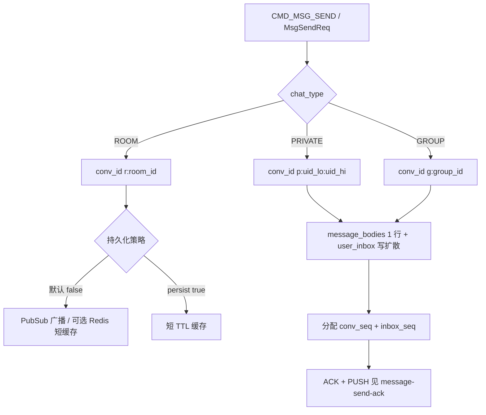
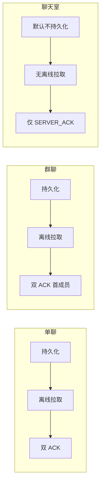

# 设计说明：消息模型

| 项 | 内容 |
| --- | --- |
| 状态 | **已确认** |
| 决策编号 | DD-007 |
| 规范定义 | [`proto/message.proto`](../../proto/message.proto)、[`proto/common.proto`](../../proto/common.proto)（`ChatType`） |
| 行为约定 | [`protocol.md` §7](protocol/protocol.md#7-消息模型) |
| 索引 | [`design-decisions.md`](../design-decisions.md) |
| 实现文档 | [implementation/elixir/message-model.md](../implementation/elixir/message-model.md) |

---

## 1. 要解决什么问题

需要一套结构同时承载单聊、群聊、聊天室消息，并明确：

- 会话标识（`conv_id`）、路由（`chat_type` / `from` / `to`）
- 内容类型（`msg_type` + `content`）
- 排序与离线同步（`conv_seq`）vs 投递优先级（`priority`）
- 三种会话在持久化、离线、ACK 上的差异

---

## 2. 决策摘要（已确认）

| # | 决策 |
| --- | --- |
| 1 | 三种 `ChatType` 共用 `ChatMessage`；单聊/群聊持久化+离线，聊天室实时为主 |
| 2 | 增加 **`conv_id`** 作为稳定会话标识，与 `OfflinePullReq.conv_id` 对齐 |
| 3 | **`conv_seq`（排序/游标）与 `priority`（投递）分离** |
| 4 | 七种 `MsgType` 本期够用；媒体只传 URL 元数据 |
| 5 | **聊天室**：仅 `SERVER_RECEIVED` 必达；**不强制** `CLIENT_RECEIVED` 与对端通知 |
| 6 | **阅后即焚**（`burn_after_read`）v1 **仅单聊**；见 [burn-after-read.md](burn-after-read.md) |

---

## 完整流程

### 消息从发送到落库/广播



### 三种会话对比（流程差异）



---

## 3. 会话类型 ChatType

| 类型 | 持久化 | 离线拉取 | 双阶段 ACK |
| --- | --- | --- | --- |
| `CHAT_PRIVATE` | 是 | 是 | 两档均必达 |
| `CHAT_GROUP` | 是 | 是 | 两档均必达 |
| `CHAT_ROOM` | 默认否 | 否 | 仅 `SERVER_RECEIVED` 必达 |

### 为什么共用 ChatMessage

- SDK/UI 一套模型；差异由服务端策略处理，而非多套 proto。

### 聊天室为何不默认持久化

- 成员多、实时广播为主；全量落库与离线成本高；历史走 REST（本期不做）。

### 聊天室短时缓存（可选）

默认不落库，但撤回/编辑需覆盖近期在线成员。服务端可对聊天室消息做**可选短时缓存**：

| 项 | 约定 |
| --- | --- |
| 用途 | 短窗内撤回/编辑状态、晚加入成员的近期广播（非 OFFLINE_PULL） |
| 存储 | Redis 等；**不写** `message_bodies` / `user_inbox` |
| 默认 TTL | **300 秒**（5 分钟）；服务端可配置 |
| 离线 | 不进 `OFFLINE_PULL`；过期即不可查 |

---

## 4. conv_id 规则

`conv_id` 在会话维度**稳定唯一**，发送时客户端应填写；服务端在 PUSH / ACK 中回填并校验。

| chat_type | conv_id 格式 | 示例 |
| --- | --- | --- |
| `CHAT_PRIVATE` | `p:{uid_lo}:{uid_hi}` | `p:alice:bob`（uid 按字典序 `lo ≤ hi`） |
| `CHAT_GROUP` | `g:{group_id}` | `g:grp_123` |
| `CHAT_ROOM` | `r:{room_id}` | `r:room_456` |

好处：

- 与 `OfflinePullReq.conv_id`、本地会话索引一致
- 单聊双方生成相同 `conv_id`（排序 uid）
- `route_key` 仍可用 `to` / `user_id` 做网关分流，与 `conv_id` 职责分离

### 服务端校验规则

服务端根据 `chat_type` + `from` + `to` **计算期望 `conv_id`**：

| 客户端 `conv_id` | 行为 |
| --- | --- |
| 未填或空字符串 | 服务端计算并回填 |
| 与计算结果一致 | 接受 |
| 与计算结果不一致 | 返回 `CMD_ERROR` + `CODE_MSG_INVALID`（2001） |

**以服务端计算结果为权威**；客户端不得自定义格式。

---

## 5. ChatMessage 字段意图

| 字段 | 意图 |
| --- | --- |
| `msg_id` / `client_msg_id` | 服务端权威 ID（Snowflake，见 [msg-id-snowflake.md](msg-id-snowflake.md)）vs 客户端幂等 ID |
| `chat_type` / `from` / `to` | 路由与展示 |
| `conv_id` | 会话稳定标识 |
| `target_users` | 定向用户列表；群聊/聊天室仅向指定用户推送 |
| `msg_type` + `content` (bytes) | 类型由枚举指示，内容可扩展 |
| `server_time` | 服务端时间，展示用 |
| `conv_seq` | 会话内单调位点；**排序与离线游标** |
| `priority` | **投递**优先级，不改变展示序 |
| `ext` | 业务扩展 KV |
| `recalled` | 是否已撤回（见 [recall.md](recall.md)） |
| `edit_version` | 编辑版本，0=未编辑（见 [edit.md](edit.md)） |
| `inbox_seq` | 用户收件箱位点，全量离线游标（见 [offline-pull.md](offline-pull.md)） |

### conv_seq vs priority

| | conv_seq | priority |
| --- | --- | --- |
| 分配 | 服务端 | 客户端可设，服务端可改 |
| 展示顺序 | 是 | 否 |
| 离线 cursor | 是 | 否 |
| 投递队列 | 否 | 是（WFQ + 老化，见 [message-send-ack.md](message-send-ack.md) §7） |

**出站调度要点**（仅影响 Socket 到达先后，不影响 UI 排序）：

- HIGH 优先，但 LOW 通过 **权重保底 + 等待升档** 避免饿死
- 同优先级带内 FIFO（`inbox_seq` / 入队时间）
- 客户端落库与展示仍按 `conv_seq`

---

## 6. 定向消息（target_users）

群聊和聊天室支持定向消息，设置 `target_users` 后仅向指定用户推送。

### 设计意图

| 需求 | 场景 |
| --- | --- |
| @提醒 | 群内 @ 特定成员，仅被 @ 者收到强提醒 |
| 定向通知 | 仅管理员可见的系统消息 |
| 敏感消息 | 特定人员可见的机密内容 |
| 可见性控制 | 部分成员可见的消息（如红包、密令） |

### 行为约定

| 项目 | 约定 |
| --- | --- |
| **适用范围** | 仅 `CHAT_GROUP` / `CHAT_ROOM`；`CHAT_PRIVATE` 忽略此字段 |
| **实时推送** | 仅向 `target_users` 中在线用户推送 `CMD_MSG_PUSH` |
| **发送方其他设备** | **始终** PUSH（发送设备除外）；见 [multi-device.md](multi-device.md) |
| **其他成员** | 不收实时 PUSH；默认仍可通过离线拉取/REST 查看历史 |
| **历史存储** | 写入 `message_bodies`（记录 `target_users`）；群聊同步写扩散 `user_inbox` |
| **ACK 语义** | 首个在线 **`target_users` 成员** `ACK_UP` 后通知发送方 |
| **离线同步** | 群聊：**默认不过滤**，定向消息进 `OFFLINE_PULL`；聊天室不进离线 |
| **可见性默认** | 离线拉取与 REST 历史默认**全员可见**；应用可配置仅 `target_users` 可查 |

### 服务端处理流程

```
1. 收到群聊/聊天室消息，检查 target_users 是否非空
2. 非空 → 实时 PUSH：`target_users` 在线成员 + **发送方其他在线设备**（发起 SEND 设备除外）
3. 空值或 `[]` → 向全部在线成员推送（普通消息）
4. 写入存储时记录 target_users
5. 可选：查询历史消息时按 target_users 过滤可见性
```

### 可见性策略（可选）

服务端可根据业务需要控制历史消息的可见性：

| 策略 | 说明 |
| --- | --- |
| **全部可见** | 未收到推送的成员也可查历史（默认） |
| **仅定向用户可见** | 查询历史时按 `target_users` 过滤 |
| **混合策略** | 结合 `ext` 字段或应用配置决定 |

### 典型用例：@提醒

```json
{
  "chat_type": 2,
  "from": "alice",
  "to": "group_001",
  "conv_id": "g:group_001",
  "msg_type": 1,
  "content": "...",
  "target_users": ["bob", "charlie"],
  "ext": {
    "mention_type": "at"
  }
}
```

仅 `bob` 和 `charlie` 收到实时推送，其他群成员不收推送。

---

## 7. MsgType 与 Content

| MsgType | Content | 说明 |
| --- | --- | --- |
| TEXT / IMAGE / AUDIO / VIDEO / FILE / LOCATION | 对应 `*Content` | 媒体仅元数据 + URL |
| CUSTOM | `CustomContent` | `custom_type` + `data` |

文件二进制走 HTTP 上传，不经长连接。

---

## 8. 聊天室 ACK 策略

单聊/群聊：发送方必须收到 `SERVER_RECEIVED` 与 `CLIENT_RECEIVED` 两档 `ACK_DOWN`。

聊天室：

- 发送方**必须**收到 `ACK_DOWN(SERVER_RECEIVED)`（已受理广播）
- **不要求**成员逐人 `ACK_UP`，**不强制**向发送方推送 `CLIENT_RECEIVED`
- 原因：成员规模大，全量投递回执成本高；产品定位为实时通道而非可靠私信

---

## 9. 存库

离线库存 `ChatMessage` 业务字段（含 `conv_id`、`conv_seq`、`target_users` 等），不存 `Packet`。

---

## 10. 刻意放弃

| 放弃 | 原因 |
| --- | --- |
| 聊天室全量双阶段 ACK | 已确认仅 SERVER_RECEIVED |
| 长连接传文件二进制 | 走 HTTP |
| 本期新增 Quote/合并转发等 MsgType | CUSTOM + ext 可扩展 |

---

