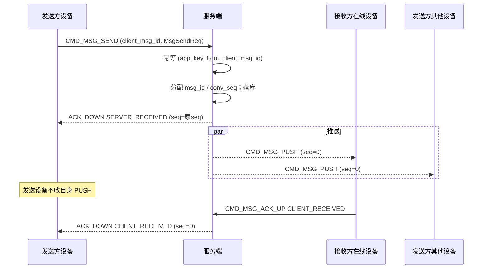
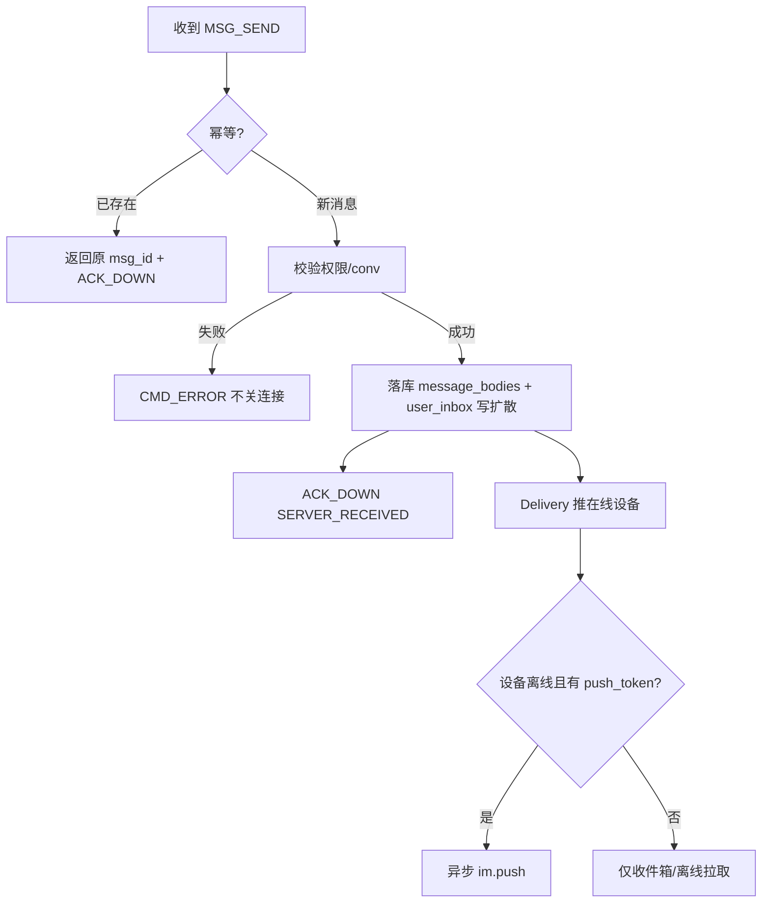
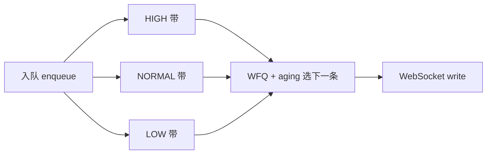

# 设计说明：发消息与 ACK / 批量下行

| 项 | 内容 |
| --- | --- |
| 状态 | **已确认** |
| 决策编号 | DD-008 |
| 规范定义 | [`proto/message.proto`](../../proto/message.proto)、[`proto/auth.proto`](../../proto/auth.proto)（`push_batch_max`） |
| 行为约定 | [`protocol.md` §8](protocol/protocol.md#8-发消息与-ack) |
| 索引 | [`design-decisions.md`](../design-decisions.md) |
| 实现文档 | [implementation/elixir/message-send-ack.md](../implementation/elixir/message-send-ack.md) |

---

## 1. 要解决什么问题

将「发送 → 服务端确认 → 对端收到 → 发送方知晓」串成可实现流程，并覆盖幂等、三种会话差异、单条/批量推送与至少一次投递。

---

## 2. 多租户隔离

**原则**：`from` 和 `to` 必须在同一个 `app_key` 下，不支持跨 App 发消息。

**判断逻辑**：

| 步骤 | 校验 | 说明 |
| --- | --- | --- |
| 1 | 获取连接上下文 | 鉴权时已绑定 `app_key` + `user_id` 到连接 |
| 2 | 校验 `from` | `message.from` 必须等于连接的 `user_id`（防止伪造发送方） |
| 3 | 校验 `to` | `to` 用户/群/聊天室必须存在于当前 `app_key` 下 |
| 4 | 失败处理 | 不存在返回 `CODE_CONV_NOT_FOUND`（2004）或 `CODE_MSG_NO_PERMISSION`（2002） |

**设计意图**：
- 简化多租户隔离，每个 App 是独立命名空间
- 避免跨租户数据泄露
- 无需在每条消息中携带 `app_key`，从连接上下文获取

---

## 3. 决策摘要（已确认）

| # | 决策 |
| --- | --- |
| 1 | 发送幂等：`Packet.cid` 与 `ChatMessage.client_msg_id` **同时使用**（见 §3.1） |
| 2 | **发送设备不收**自己消息的 PUSH；靠 `ACK_DOWN` 更新（见 [multi-device.md](multi-device.md)） |
| 3 | 群聊 `CLIENT_RECEIVED`：**首个在线成员** `ACK_UP` 即通知发送方 |
| 4 | 群聊**全员离线**时发送方可能长期仅收 `SERVER_RECEIVED`；**不补**历史 `CLIENT_RECEIVED` |
| 5 | 批量下行单包上限默认 **50**，由 `AuthResp.push_batch_max` **可配置**下发 |
| 6 | 接收方收到 PUSH 后**必须尽快** `ACK_UP`（单聊/群聊） |
| 7 | `CMD_MSG_SEND` 失败只回 `CMD_ERROR`，**不关闭连接** |
| 8 | 接收方设备**离线**且有 `push_token` 时，异步写 Kafka **`im.push`** 触发系统推送（见 [mobile-push.md](mobile-push.md)） |
| 9 | 下行扇出 **整包只编码一次**，传递 `packet_binary`（见 [zero-copy-delivery.md](zero-copy-delivery.md)） |

---

## 完整流程

### 单聊发消息（主路径）



### 服务端处理分支



单聊拉黑、群禁言等权限检查走 Redis 热缓存，不直查 PG；见 [permission-cache.md](permission-cache.md)。

群聊 `CLIENT_RECEIVED`：任一在线成员首条 `ACK_UP` 即通知发送方；聊天室仅 `SERVER_RECEIVED`。详见下文 §5。

**写扩散 / 读扩散**：单聊与小群（`write_fanout`）为 `message_bodies` + `user_inbox`；**大群**（`read_fanout`，成员数大于 threshold）**仅** `message_bodies`，离线按 `conv_seq` 拉取。小群可异步 fanout（`group_inbox_fanout_async`）。见 [database-design.md](database/database-design.md) §3、[group.md](group.md) §6。

---

## 4. 发送流程 CMD_MSG_SEND

```text
客户端 → CMD_MSG_SEND (seq, cid, route_key, MsgSendReq)
服务端 → 幂等检查 → 分配 msg_id/conv_seq → 落库或受理广播
       → ACK_DOWN(SERVER_RECEIVED) → 发送设备
       → PUSH / PUSH_BATCH → 接收方在线设备（及发送方其他在线设备；发送设备除外）
       → 离线设备 + push_token → im.push（异步，推送服务 → APNs/FCM）
```

`msg_id` 由 [msg-id-snowflake.md](msg-id-snowflake.md)（DD-039）Snowflake 本机生成；`conv_seq` / `inbox_seq` 仍 Redis `INCR`。

### 4.1 幂等（cid + client_msg_id）

| 键 | 作用 |
| --- | --- |
| `Packet.cid` | 请求级幂等，**同 WebSocket 连接**内去重（Redis `im:dedup:cid:{conn_id}:{cid}`，TTL 5min） |
| `ChatMessage.client_msg_id` | 消息级幂等，业务层主键（Redis `im:dedup:msg:...` + DB UNIQUE） |

**优先级**：业务幂等 **`(app_key, from, client_msg_id)` 优先于 `cid`**。

| 场景 | 行为 |
| --- | --- |
| 相同 `client_msg_id`（同发送方），不同 `cid` | 返回已有 `msg_id` / `conv_seq` / `ACK_DOWN`；**不重复** PUSH |
| 相同 `cid` + 相同 `client_msg_id` | 重复请求，同上 |
| 相同 `cid`，不同 `client_msg_id` | 视为新消息（`cid` 仅绑定单次请求） |
| 重连后重试 | 可换新 `cid` / `seq`；`client_msg_id` 不变则幂等 |

重复请求：返回同一 `msg_id`、`conv_seq`，**不重复** PUSH 给对端。

### SEND 与 ACK_DOWN 的 `seq`

| 场景 | `Packet.seq` | 说明 |
| --- | --- | --- |
| SEND 成功第 1 档 | **回传 SEND 的 `seq`** | `CMD_MSG_ACK_DOWN(SERVER_RECEIVED)`，等同 SEND 成功响应 |
| SEND 幂等重试 | **回传本次 SEND 的 `seq`** | 返回已有结果，不重复 PUSH 对端 |
| 第 2 档送达 | **`0`** | `CMD_MSG_ACK_DOWN(CLIENT_RECEIVED)`，由对端 `ACK_UP` 触发 |
| 批量送达 | **`0`** | `CMD_MSG_ACK_BATCH_DOWN` |

### SEND 失败

返回 `CMD_ERROR`（如 2001/2002/2004），**保持连接**，由客户端处理重试或提示。

---

## 5. 双阶段 ACK

### 单聊

两档 `ACK_DOWN` 均必达；接收方 PUSH 后必须 `ACK_UP`。

### 群聊

| 档 | 行为 |
| --- | --- |
| `SERVER_RECEIVED` | 同单聊，发给发送方 |
| `CLIENT_RECEIVED` | **任一在线成员**首次 `ACK_UP` 后，向发送方推 **一条** `ACK_DOWN`；不等全员 |
| 离线成员 | 上线后 `OFFLINE_PULL`；**不补**历史 `CLIENT_RECEIVED` 给原发送方 |
| **全员离线** | 发送方**仅**收 `SERVER_RECEIVED`；直至任一成员上线并 `ACK_UP` 才推 `CLIENT_RECEIVED`；若始终无人上线则**永远停在第一档**（产品预期，非缺陷） |

原因：全员 ACK 成本高；「已送达群（至少一人在线收到）」符合常见 IM 体验。

### 聊天室

仅 `SERVER_RECEIVED` 必达（见 [message-model.md](message-model.md)）。

### 接收方 ACK_UP 时机

本地去重确认后**尽快**上报，可异步但不应故意延迟。

---

## 6. 批量下行 CMD_MSG_PUSH_BATCH

| 项 | 约定 |
| --- | --- |
| 常态 | 单条 `CMD_MSG_PUSH` 低延迟 |
| 批量 | 积压冲刷、群高峰 |
| `seq` | 0 |
| 单包上限 | `AuthResp.push_batch_max`，**默认 50** |
| 超出 | 服务端拆多个批量包 |
| 组包顺序 | `priority` HIGH→NORMAL→LOW，同级 `conv_seq` 升序 |
| 接收方 | 逐条去重；单聊/群聊可用 `CMD_MSG_ACK_BATCH_UP` 批量上报 |

上限可配置的原因：不同 app 消息大小与网络差异大，与 `heartbeat_interval_sec` 一样由服务端统一下发。

---

## 7. WebSocket 出站优先级调度（防饿死）

每条设备长连接维护**出站待发队列**（`CMD_MSG_PUSH` / `CMD_MSG_PUSH_BATCH` / 其他下行）。`ChatMessage.priority` 只影响**经 Socket 写出的先后顺序**，**不改变**客户端展示序（仍按 `conv_seq`）。

### 7.1 问题

| 策略 | 优点 | 缺点 |
| --- | --- | --- |
| 严格优先级（永远先 HIGH） | 紧急消息延迟最低 | LOW/NORMAL 在 HIGH 洪峰下**饿死** |
| 纯 FIFO | 公平 | 无法保证 @提醒、系统通知优先 |

**决策**：**加权公平队列（WFQ）+ 老化提升（aging）**，兼顾「高优先先出」与「低优先有保底带宽」。

### 7.2 调度模型



每条待发项记录：

| 字段 | 说明 |
| --- | --- |
| `priority` | 原始 `MsgPriority` |
| `effective_priority` | 调度用；随等待时间**只升不降** |
| `enqueued_at_ms` | 入队时间（老化计算） |
| `inbox_seq` | 同带内排序；无则 `conv_seq` |
| `packet_binary` | 预编码下行包（见 [zero-copy-delivery.md](zero-copy-delivery.md)） |

### 7.3 加权公平（WFQ）

三带权重（`app_configs`，可 per-tenant 覆盖）：

| 带 | 默认权重 | 含义 |
| --- | --- | --- |
| HIGH | 8 | 每轮调度配额最高 |
| NORMAL | 4 | 中等 |
| LOW | 1 | 保底份额 |

每选出一条待发项，对应带的 **deficit（赤字）** += 权重；选出时 deficit -= `sum(weights)`。选 **deficit 最大且队列非空** 的带；同带多条时取 **FIFO**（`inbox_seq` 升序，其次 `enqueued_at_ms`）。

**效果**：持续 HIGH 洪峰时，LOW 仍按约 **1/(8+4+1) ≈ 7.7%** 份额获得写出机会，不会永久阻塞。

### 7.4 老化提升（防饿死硬上限）

仅靠 WFQ 在极端比例下 LOW 仍可能等太久。对**等待时间**做虚拟升档（`effective_priority` 只升不降）：

| 原始 priority | 等待 ≥ 阈值 | 提升为 |
| --- | --- | --- |
| `LOW` | `priority_aging_low_ms`（默认 **2000**） | `NORMAL` |
| `NORMAL` | `priority_aging_normal_ms`（默认 **500**） | `HIGH` |
| `LOW` | `priority_aging_low_to_high_ms`（默认 **5000**） | `HIGH` |

调度与 WFQ **按 `effective_priority` 分带**，组 `PUSH_BATCH` 时仍按 **原始** `priority` 排序（HIGH→NORMAL→LOW），与 §6 一致。

### 7.5 连续写出上限（轮转）

同一 `effective_priority` 带连续写出 **`priority_max_burst`**（默认 **16**）条后，若其他带非空，**强制**从 deficit 次高的非空带选一条。避免单带长时间独占 Socket。

### 7.6 实时路径与积压

| 场景 | 行为 |
| --- | --- |
| 队列空 + Socket 可写 + `HIGH` | 可**直写**（不入队），降低 @提醒延迟 |
| 队列非空或 Socket 背压 | 一律入队，由调度器统一 drain |
| 队列深度 > `outbound_coalesce_depth`（默认 **32**） | 将同带多条合并为 `CMD_MSG_PUSH_BATCH`（仍遵守 §6 组包顺序） |
| 队列深度 > `outbound_max_depth`（默认 **10_000**） | 丢弃 **LOW** 最旧项并记指标；NORMAL/HIGH 不丢（可降速或断开慢连接） |

### 7.7 与展示 / 离线的关系

| 维度 | 规则 |
| --- | --- |
| 客户端 UI 排序 | **只看** `conv_seq` / `server_time`，与到达先后无关 |
| `OFFLINE_PULL` | 按 `inbox_seq` 升序，**不受**出站调度影响 |
| 重复 PUSH | 客户端按 `msg_id` 去重；调度重排不导致重复展示 |

### 7.8 可观测性

| 指标 | 用途 |
| --- | --- |
| `im_outbound_queue_depth{priority}` | 各带积压 |
| `im_outbound_wait_ms{priority}` histogram | 入队→写出延迟；发现饿死 |
| `im_outbound_aged_total{from,to}` | 老化升档次数 |
| `im_outbound_dropped_total{priority}` | 超限丢弃（应仅 LOW） |

详见 [observability.md](observability.md)。

### 7.9 默认配置汇总

```text
priority_weight_high=8, priority_weight_normal=4, priority_weight_low=1
priority_aging_normal_ms=500, priority_aging_low_ms=2000, priority_aging_low_to_high_ms=5000
priority_max_burst=16
outbound_coalesce_depth=32, outbound_max_depth=10000
```

实现落位：`IM.Delivery.OutboundQueue`（每连接进程或 Registry 托管），由 `IM.Delivery.ConnectionManager` 在 Socket `{:tcp,:send}` 可写时 drain。见 [implementation/elixir/message-send-ack.md](../implementation/elixir/message-send-ack.md) §6。

---

## 8. 批量 ACK

为减少往返次数，支持批量 ACK：

| 命令 | 方向 | Payload | 场景 |
| --- | --- | --- | --- |
| `CMD_MSG_ACK_BATCH_UP` | 客户端 → 服务端 | `MsgAckBatchUp` | 收到 `PUSH_BATCH` 后批量上报 |
| `CMD_MSG_ACK_BATCH_DOWN` | 服务端 → 客户端 | `MsgAckBatchDown` | 群消息送达通知等 |

约定：
- 服务端逐条处理 `MsgAck`，幂等
- 批量 ACK 不改变单条 ACK 语义，仅减少往返

---

## 9. QoS

- 至少一次投递 + 客户端 `msg_id` 去重
- 单聊/群聊：两档 ACK 必达（群聊 CLIENT 见上）
- PUSH 重复时接收方可重复 `ACK_UP`，服务端幂等

---

## 10. 刻意放弃

| 放弃 | 原因 |
| --- | --- |
| 独立 MSG_SEND_RESP | 第 1 档 ACK_DOWN 已足够 |
| 群聊 per-member ACK 给发送方 | 过于复杂 |
| SEND 失败断连接 | 已确认仅 CMD_ERROR |

---

