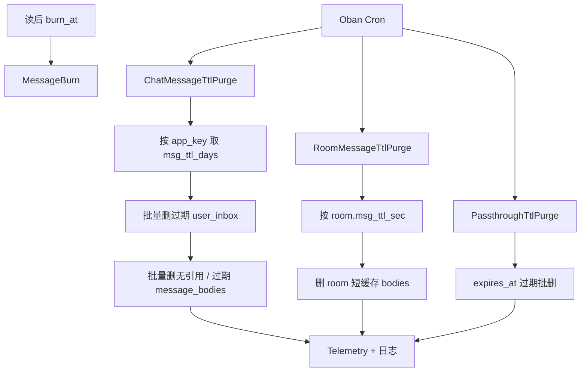

# 设计说明：消息 TTL 清理 Job

| 项 | 内容 |
| --- | --- |
| 状态 | **已确认** |
| 决策编号 | DD-040 |
| 规范定义 | 本文档；TTL 数值来自 `apps` / `app_configs` / 表字段（见 [database-design.md](database/database-design.md)） |
| 索引 | [`design-decisions.md`](../design-decisions.md) |
| 实现文档 | [implementation/elixir/database.md](../implementation/elixir/database.md)（Worker 落点） |
| Roadmap | 建议挂 Phase 7/9 运维任务；实现前以本文为验收契约 |

---

## 1. 要解决什么问题

库表已定义保留窗口（`msg_ttl_days`、聊天室 `msg_ttl_sec`、透传 `expires_at`、阅后即焚 `burn_at`），但缺少**可调度、可观测、可限速**的删除规格。若不清理，`message_bodies` / `user_inbox` 与短缓存表将无限膨胀。

本文规定 **Oban 定时 Job** 的职责切分、删除顺序、批大小、禁止事项与验收指标。

---

## 2. 决策摘要（已确认）

| # | 决策 |
| --- | --- |
| 1 | 单聊/群聊热数据硬删窗口 = 租户 `msg_ttl_days`（默认 **7**）；以 `message_bodies.created_at` 为准 |
| 2 | MVP：**硬删除**；温/冷归档（7–30 天副本、30+ 对象存储）为可选扩展，见 §6 |
| 3 | 聊天室 `persist_msg=true`：按房间 `msg_ttl_sec`（默认 **300**）清理对应 `message_bodies` |
| 4 | 透传：按 `expires_at < now()` 清理（已有索引约定）；阅后即焚仍走 `IM.Jobs.MessageBurn`，**不**并入本文通用 purge |
| 5 | 一律 **分批 DELETE**（`LIMIT` + 循环）；禁止单次全表扫删；禁止在 partial index 谓词中使用 `NOW()` |
| 6 | Job 幂等、可重入；失败重试；打 Telemetry；单次运行有墙钟上限 |

---

## 3. 保留窗口一览

| 数据 | 权威字段 | 默认窗口 | 配置来源 |
|------|----------|----------|----------|
| 单聊/群聊正文 + inbox | `message_bodies.created_at` / inbox 关联 | **7 天** | `apps.msg_ttl_days` → `app_configs.message.msg_ttl_days` |
| 聊天室短缓存正文 | `message_bodies.created_at` + `chat_type=room` | **300 秒** | `rooms.msg_ttl_sec`（仅 `persist_msg=true`） |
| 透传暂存 | `passthrough_messages.expires_at` | 客户端 TTL，默认 7 天、上限 7 天 | 行内 `ttl_sec` |
| 阅后即焚 | `message_bodies.burn_at` | 读后延迟 | 独立 Job，见 [burn-after-read.md](burn-after-read.md) |

**cutoff 计算**（单聊/群聊）：

```text
cutoff(app_key) = now_utc() - msg_ttl_days(app_key) * 86400s
```

同一 Job 调度周期内对同一 `app_key` **固定** cutoff（读配置一次），避免长跑过程中窗口漂移导致漏删/误删边界抖动。

---

## 4. Job 清单

实现模块建议命名空间：`IM.Jobs.*`（Oban Worker）。

| Worker | 队列 | Cron（建议） | 作用对象 |
|--------|------|--------------|----------|
| `IM.Jobs.ChatMessageTtlPurge` | `ttl_purge` | 每 **15** 分钟 | 单聊/群聊 `user_inbox` → `message_bodies` |
| `IM.Jobs.RoomMessageTtlPurge` | `ttl_purge` | 每 **1** 分钟 | 聊天室短缓存 `message_bodies` |
| `IM.Jobs.PassthroughTtlPurge` | `ttl_purge` | 每 **1** 小时 | `passthrough_messages` |
| `IM.Jobs.MessageBurn` | `message_burn` | 延迟调度（非 cron） | 阅后即焚；**本文不改** |

**并发**：`ttl_purge` 队列 `global_limit: 1`（或 per-worker unique），避免多实例叠删抢 IO。多租户时 **按 `app_key` 串行分片**（一轮扫完所有 app，或每 app 一个 Job args）。

---

## 5. 删除算法

### 5.1 单聊 / 群聊（`ChatMessageTtlPurge`）

**范围**：`chat_type ∈ {single, group}`（或等价枚举）；**不含** `room`。

**顺序**（必须）：

1. **先删 inbox**：按 `app_key` 分批  
   `DELETE FROM user_inbox WHERE ctid IN (SELECT ctid FROM user_inbox ui JOIN message_bodies mb ON ... WHERE mb.app_key = $1 AND mb.created_at < $cutoff AND mb.chat_type IN (...) LIMIT $batch)`  
   或等价：先选过期 `msg_id` 列表再删 inbox（推荐，便于指标）。
2. **再删正文**：仅删除 **已无任何 inbox 引用** 且 `created_at < cutoff` 的 `message_bodies`；`read_fanout` 群消息本就可能无 inbox，仍按 `created_at < cutoff` 直接删正文。
3. **附属**：同 `msg_id` 的已读游标、编辑历史等若存在独立表，随正文 FK `ON DELETE CASCADE` 或同批清理（以实现 schema 为准）。

**批参数**（可配置，系统默认）：

| 参数 | 默认 | 说明 |
|------|------|------|
| `ttl_purge_batch_size` | **1000** | 每批删除行数上限 |
| `ttl_purge_max_batches_per_run` | **50** | 单次 Job 最多批次数（墙钟保护） |
| `ttl_purge_max_runtime_ms` | **55_000** | 单次运行墙钟；超时则下一 cron 续跑 |
| `ttl_purge_sleep_ms` | **50** | 批间休眠，降低对主库影响 |

**验收**：

- 过期数据在 **2×cron 周期** 内进入删除路径（允许积压时多轮消化）。
- 未过期消息 **零误删**（以 `created_at >= cutoff` 不出现在 DELETE 谓词为准）。
- `im_ttl_purge_deleted_total{table,app_key}`、`im_ttl_purge_duration_ms`、`im_ttl_purge_batches` 有指标。

### 5.2 聊天室短缓存（`RoomMessageTtlPurge`）

**范围**：`persist_msg=true` 的房间；正文在 `message_bodies`（`chat_type=room`，`conv_id=r:{room_id}`）。

```text
expire_before = created_at + room.msg_ttl_sec
DELETE 条件：created_at < now() - msg_ttl_sec（按 room 行取值）
```

- `msg_ttl_sec = 0`：表示不缓存 / 不落短 TTL 清理（与协议「0 = 不缓存」一致）；本 Job **跳过**该房间。
- 聊天室**不写** `user_inbox`，只需删 `message_bodies`。
- 批参数复用 `ttl_purge_batch_size`；因窗口短（分钟级），cron 更密（1 min）。

### 5.3 透传（`PassthroughTtlPurge`）

与 [database-design.md](database/database-design.md) 透传表约定一致：

```sql
DELETE FROM passthrough_messages
WHERE ctid IN (
  SELECT ctid FROM passthrough_messages
  WHERE expires_at < NOW()
  LIMIT $batch
);
```

索引：`idx_passthrough_expires (expires_at)`。**禁止** `WHERE expires_at < NOW()` 出现在 **partial index 定义**中。

### 5.4 与阅后即焚的边界

| 机制 | 触发 | 是否本文 Job |
|------|------|--------------|
| TTL 保留窗口 | 时间到 `msg_ttl_days` / `msg_ttl_sec` / `expires_at` | ✅ |
| 阅后即焚 | 已读后 `burn_at` | ❌ `MessageBurn` |
| 撤回/编辑 | 业务命令 | ❌ 业务路径 |

若消息已焚毁，正文行已不存在，TTL Job 自然 no-op。

---

## 6. 冷热归档（可选扩展，非 MVP）

与 [database-design.md](database/database-design.md)「冷热分离」对齐，**在硬删之前**可插入：

```text
热（PG 主，≤ msg_ttl_days）
  → 温（只读副本 / 归档表，≤ 30 天）
  → 冷（对象存储，> 30 天）
  → 删除
```

| 阶段 | MVP（本文强制） | 扩展 |
|------|-----------------|------|
| 热→删 | `created_at < cutoff` 直接 DELETE | — |
| 热→温 | 不做 | Export 后再 DELETE 热行 |
| 温→冷 | 不做 | 对象存储 + 元数据索引 |
| 冷→删 | 不做 | 合规保留期满后删 |

扩展开启时：`ChatMessageTtlPurge` 增加 `archive_before_delete` 开关；默认 **false**。

---

## 7. 安全与运维约束

| 约束 | 说明 |
|------|------|
| 主库优先 | purge 只打 primary；禁止在热路径（`MSG_SEND`）同步删 |
| 限速 | 批间 sleep + max_batches；高峰可调大 sleep 或暂停 cron |
| 多租户 | 按 `app_key` 隔离 cutoff 与指标标签 |
| 可暂停 | env `IM_TTL_PURGE_ENABLED=false` 全局跳过（应急） |
| 审计 | 结构化日志 `event=ttl_purge`：`app_key,table,deleted,cutoff,duration_ms` |
| 禁止 | `TRUNCATE` 业务表；无 `LIMIT` 的巨型 DELETE；用 `NOW()` 建 partial index |

---

## 完整流程



---

## 8. 实现落点（验收清单）

- [ ] Oban cron 注册上述 3 个 Worker；`MessageBurn` 保持独立
- [ ] 配置项：`ttl_purge_*` + `IM_TTL_PURGE_ENABLED`
- [ ] 单测：构造过期/未过期行，断言只删过期；批次数触顶时下一轮续删
- [ ] 集成：聊天室 `msg_ttl_sec=1` 时约 1–2 分钟内正文消失
- [ ] 指标与日志符合 §5.1 / §7
- [ ] 文档交叉：database-design §冷热 / 透传清理段落指向本文

---

## 9. 相关文档

| 文档 | 关系 |
|------|------|
| [database-design.md](database/database-design.md) | 表字段、冷热策略、透传索引 |
| [room.md](room.md) | `persist_msg` / `msg_ttl_sec` |
| [passthrough.md](passthrough.md) | 透传暂存语义 |
| [burn-after-read.md](burn-after-read.md) | 焚毁 Job 边界 |
| [observability.md](observability.md) | 指标命名风格 |
