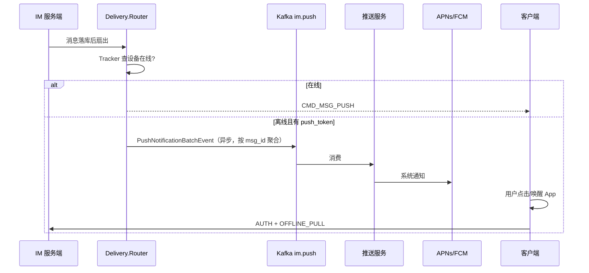
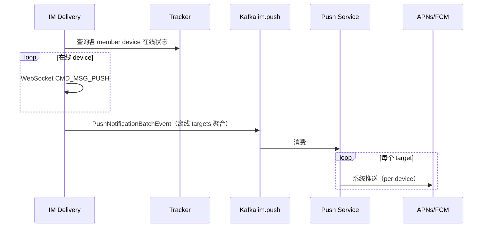

# 设计说明：离线设备系统推送（Kafka）

| 项 | 内容 |
|------|------|
| 状态 | **已确认** |
| 决策编号 | DD-030 |
| 规范定义 | [`proto/event.proto`](../../proto/event.proto)（`PushNotificationBatchEvent`） |
| 行为约定 | 本文档 |
| 索引 | [`design-decisions.md`](../design-decisions.md) |
| 实现文档 | [implementation/elixir/mobile-push.md](../implementation/elixir/mobile-push.md) |
| 相关 | [message-send-ack.md](message-send-ack.md)、[kafka-event-bus.md](kafka-event-bus.md)、[multi-device.md](multi-device.md) |

---

## 1. 要解决什么问题

用户设备**未建立 WebSocket 长连接**（离线）时，无法通过 `CMD_MSG_PUSH` 实时送达。需要：

1. IM 在消息落库、扇出投递时识别**离线设备**
2. 将同一条消息（同一 `msg_id`）的离线设备推送任务**聚合为批量 Kafka 事件**写入 `im.push`
3. **独立推送服务**订阅 Topic，按 `targets` **逐设备**调用 APNs / FCM
4. 用户点击通知或 App 被唤醒后，走 `AUTH` + `OFFLINE_PULL` 拉取完整消息

IM **不直接**调 APNs/FCM，保持与推送通道解耦。

---

## 2. 决策摘要（已确认）

| # | 决策 |
| --- | --- |
| 1 | 新增 Kafka Topic **`im.push`**（可配置名），与 `im.downstream` **职责分离** |
| 2 | **每条 Kafka 记录对应一条消息的一次扇出**：`PushNotificationBatchEvent`，`repeated targets` 含各离线设备的 `push_token`；单聊可为 `targets` 长度 1 |
| 3 | 写入时机：消息**落库成功**、Delivery 扇出**结束后**，对本 `msg_id` 全部离线设备**一次性**（或分块）写 `im.push` |
| 4 | **异步旁路**，不阻塞 `CMD_MSG_SEND` 同步 `ACK_DOWN` |
| 5 | `push_token` 来自 `user_devices`（REST 注册），**不在** `AuthReq` 传递 |
| 6 | 幂等键 `idempotency_key = {app_key}:{user_id}:{device_id}:{msg_id}`（在 `targets[]` 内），避免重复推送 |
| 7 | 聊天室消息**默认不写** `im.push`（仅在线 WS）；单聊 / 群聊离线设备写 |
| 8 | 目标数超过 `push_batch_targets_max`（默认 500）时**按 msg_id 分块**写多条 Kafka，共享 `batch_index` / `batch_total` |

---

## 完整流程



---

## 3. 与 `im.downstream` 的区别

| 维度 | `im.downstream` | `im.push` |
|------|-----------------|-----------|
| 目的 | 下行镜像 / 审计 / BI | **触发系统推送** |
| 消费者 | 数据分析、风控、同步 | **推送服务** |
| 粒度 | 大群可 aggregated（用户列表） | **按 msg_id 批量**（`targets[]` 含设备级 token）；APNs/FCM 仍 per-device |
| 离线设备 | 通常不在 `targets` / `audience` 中 | **仅离线设备** |
| 内容 | `Packet.payload` 镜像 | `push_token` + `PushDisplay` + 可选 `payload` |

---

## 4. 投递流程

```text
CMD_MSG_SEND 成功
  → 落库（收件箱写扩散）
  → ACK_DOWN(SERVER_RECEIVED) → 发送方（同步，主路径结束）

  → Delivery 扇出（异步，不阻塞 ACK）
       收集本 msg 全部离线且可推送的 device → targets[]
       扇出结束后 cast IM.EventBus → im.push（PushNotificationBatchEvent，超上限分块）
```



---

## 5. Topic `im.push`

### 5.1 写入条件（须同时满足）

| 条件 | 说明 |
|------|------|
| 设备**离线** | 本集群 Tracker 无该 `device_id` 连接 |
| 有 **`push_token`** | `user_devices.push_token` 非空且未过期 |
| 平台支持 | 默认 `ios` / `android`；`web` / `desktop` 跳过（可后续扩展） |
| App 配置启用 | `app_configs` 中 `push.apns_enabled` / `push.fcm_enabled` |
| 会话类型 | 单聊、群聊；**聊天室默认跳过** |
| 非免打扰 | 用户 / 会话 `muted` 时跳过（见 §5.4） |
| 非发送设备 | 与协议一致：发送方**当前设备**不收 PUSH，也不写 push |
| 消息幂等 | 同一 `msg_id` + `device_id` **只写一次** |

### 5.2 分区键

`{app_key}:{msg_id}` — 同一条消息的分块批次有序；与 `im.downstream` aggregated 一致按消息维度分区。

### 5.3 事件字段

Protobuf：`PushNotificationBatchEvent` + `PushNotificationTarget`（见 `proto/event.proto`）。

**批次级（共用）**

| 字段 | 说明 |
|------|------|
| `msg_id` / `conv_id` / `chat_type` / `from_*` | 消息引用 |
| `display` | 通知栏 `title` / `body` / `badge`；IM 从消息内容生成摘要 |
| `payload` | 可选 `ChatMessage` bytes |
| `batch_index` / `batch_total` | 分块序号（仅超限时大于 1） |

**targets[]（每设备）**

| 字段 | 说明 |
|------|------|
| `user_id` / `device_id` | 目标设备 |
| `push_token` / `channel` | 推送服务直接用于 APNs/FCM |
| `idempotency_key` | 推送服务去重 |

**展示文案**：IM 根据 `msg_type` 生成（如文本取前 N 字；图片为「[图片]」），避免推送服务解析业务 PB。

### 5.4 免打扰与折叠

| 策略 | 默认 |
|------|------|
| 用户全局 `muted` | 不写 `im.push` |
| 会话级免打扰 | 不写（查 `conversations.muted`） |
| 群 @ 提醒 | Phase 2+；本期群聊离线一律推送（可配置关闭） |

### 5.5 群聊与多端

- 群消息写扩散后，对**本条 `msg_id` 的全部离线可推送设备**写入 **1 条** `PushNotificationBatchEvent`（`targets` 展开各成员设备）；超过 `push_batch_targets_max` 时拆为多条 Kafka，共用 `msg_id` 与 `batch_total`。
- 单聊仅 1 个离线对端时，`targets` 长度为 1，仍使用同一批量信封（实现统一）。
- 发送方**其他离线设备**若需同步，与 [multi-device.md](multi-device.md) 一致：纳入同一 `msg_id` 的 `targets`（若非发送当前设备）。

### 5.6 分块与大小

| 配置 | 默认 | 说明 |
|------|------|------|
| `push_batch_targets_max` | `500` | 单条 Kafka 内 `targets` 上限；与 `downstream_group_recipient_list_max` 对齐 |
| 超限行为 | 按 `msg_id` 顺序分块 | `batch_index` 0..N-1，`batch_total` 为 N |

推送服务须：**遍历 `targets` 逐设备投递**；某 target 失败不影响同批其他 target（各自按 `idempotency_key` 重试）。

---

## 6. 硬约束

| 约束 | 说明 |
|------|------|
| **不阻塞主路径** | Kafka 失败不影响 SEND ACK / 在线 WS 推送 |
| **统一出口** | 仅 `IM.EventBus.publish(:push, …)` |
| `write_kafka: false` | Kafka 回灌等场景跳过 |
| **推送服务独立部署** | IM 不持有 APNs/FCM 证书 |
| **与离线拉取配合** | 推送仅为提醒；完整消息靠 `OFFLINE_PULL` |

---

## 7. 推送服务职责（IM 之外）

| 职责 | 说明 |
|------|------|
| 订阅 `im.push` | 消费 `PushNotificationBatchEvent`，展开 `targets` |
| 调用通道 | APNs / FCM / HMS |
| 幂等 | 按 `idempotency_key` 去重 |
| 失败重试 | 指数退避；死信 Topic 或 DLQ |
| Token 失效 | 回调 IM REST 清除无效 `push_token`（后续 API） |

---

## 8. 监控

| 指标 | 说明 |
|------|------|
| `im_push_enqueue_total{chat_type,result}` | IM 写入 `im.push` 批次数（非设备数） |
| `im_push_targets_total{chat_type}` | 本批 `targets` 设备数（histogram 或 counter） |
| `im_push_skipped_total{reason}` | 跳过原因：`online` / `no_token` / `muted` / `room`… |
| 推送服务侧 | 投递成功/失败、延迟（独立服务） |

生产环境 IM **不对每条 push 打 info 日志**；采样 `warning` 见 [observability.md](observability.md)。

---

## 9. 刻意不做

| 不做 | 原因 |
|------|------|
| IM 直连 APNs/FCM | 证书与通道演进独立 |
| 用 `im.downstream` 代替 | 大群 aggregated 无设备级 token |
| 聊天室全员离线推送（默认） | 量级与体验；仅在线 WS |
| 同步等待推送结果 | 违反主路径时序 |
| 在 `AuthReq` 带 `push_token` | 已确认走 REST 注册 |

---

## 10. 刻意不做的替代方案

| 方案 | 不做原因 |
|------|----------|
| 仅 `offline_user_ids`、不带 token | 推送服务无法直接调 APNs/FCM，须同步查库 |
| 每离线设备一条 Kafka（旧方案） | 大群 Kafka 写入量与 IM CPU 过高；已由批量事件替代 |
| 推送服务侧 HTTP 批量合并 | 推送服务可在消费后自行用 APNs HTTP/2 / FCM multicast；**IM 不依赖** |

---
