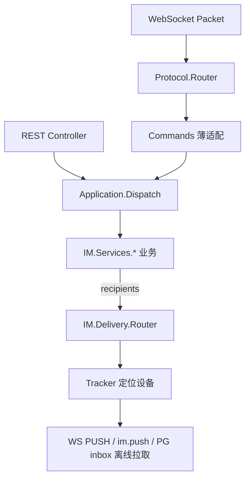

# 设计说明：模块化实现架构

| 项 | 内容 |
|------|------|
| 状态 | 已确认 |
| 决策编号 | DD-024 |
| 规范定义 | 本文档 |
| 行为约定 | 本文档 |
| 索引 | [`design-decisions.md`](../design-decisions.md) |
| 实现文档 | [implementation/elixir/modular-architecture.md](../implementation/elixir/modular-architecture.md) |

---

## 1. 设计原则

### 1.1 核心原则

| 原则 | 说明 |
|------|------|
| **单一职责** | 每个模块只负责一件事 |
| **关注点分离** | 业务逻辑与推送逻辑分离 |
| **可复用** | 通用逻辑抽取为独立模块 |
| **可组合** | 通过组合构建复杂功能 |
| **双通道一致** | WS 与 REST 共用 Service；见 [dual-channel-api.md](dual-channel-api.md) |

### 1.2 完整流程（请求在服务端内的路径）



发消息、群管理、好友等 **各功能文档** 另有端到端时序图；本图描述 **通用分层**。

### 1.3 分层架构

```
┌─────────────────────────────────────────────────────────┐
│              接入层 (Ingress Layer)                       │
│  WebSocket Commands / Api.V1 Controllers（薄适配）        │
│  职责：解码、构造 MessageContext、回包编码；无业务逻辑      │
└────────────────────┬────────────────────────────────────┘
                     │
┌────────────────────▼────────────────────────────────────┐
│              协议路由层 (Protocol Router)                 │
│  IM.Protocol.Router — 按 cmd 选 Handler（仅 WS）           │
│  职责：鉴权态门禁、:telemetry.span；无业务逻辑              │
└────────────────────┬────────────────────────────────────┘
                     │
┌────────────────────▼────────────────────────────────────┐
│              应用分发层 (Dispatch)                        │
│  IM.Application.Dispatch — cmd + MessageContext            │
│  WS / REST / Kafka 等入口的统一业务入口                     │
└────────────────────┬────────────────────────────────────┘
                     │
┌────────────────────▼────────────────────────────────────┐
│                    服务层 (Services Layer)                │
│  IM.Services.SingleChat / GroupChat / RoomChat / Friend … │
│  职责：业务校验、落库、计算 recipients、构造下行 payload     │
└────────────────────┬────────────────────────────────────┘
                     │ 输出：recipients (用户列表)
                     │
┌────────────────────▼────────────────────────────────────┐
│                    推送层 (Delivery Layer)                │
│  IM.Delivery.Router — 通用推送模块                         │
│  职责：找到用户设备、编码 Packet、推送；离线 enqueue          │
└────────────────────┬────────────────────────────────────┘
                     │ 输出：device targets
                     │
┌────────────────────▼────────────────────────────────────┐
│                   连接层 (Connection Layer)               │
│  ConnectionManager / Tracker                             │
│  职责：管理连接、定位用户设备                               │
└─────────────────────────────────────────────────────────┘
```

### 1.4 Router / Dispatch / Delivery.Router 职责分界

| 模块 | 层级 | 输入 | 输出 | 禁止 |
| --- | --- | --- | --- | --- |
| `IM.Protocol.Router` | 协议 | `Packet` + `socket` | 调用对应 `Commands.*` | 直接 `Repo`、扇出、业务校验 |
| `IM.Application.Dispatch` | 应用 | `cmd` + payload + `MessageContext` | `Services.*` 返回值 | 按 WS/REST 分叉两套逻辑 |
| `IM.Services.*` | 领域 | 业务请求 + `MessageContext` | 落库结果、recipients、下行 notify | 直接操作 WebSocket pid |
| `IM.Delivery.Router` | 投递 | notify + recipients | WS PUSH / PG `user_inbox` 离线拉取 | 好友/群权限等业务判断 |

**REST 路径**：`Api.V1.*Controller` 不经 `Protocol.Router`，直接调用 `Dispatch`（见 [dual-channel-api.md](dual-channel-api.md) §4）。

**命名约定**：领域模块统一 **`IM.Services.*`**；不再使用 `IM.Business.*`。

---

## 2. 模块划分

### 2.1 服务层模块

#### 2.1.1 SingleChat（单聊）

**职责**：
- 验证单聊逻辑（from/to 关系）
- 构造消息
- 确定 recipients（对端 + 自己的其他设备）

**输入**：
- message: 消息对象
- context: 上下文信息

**输出**：
- `{:ok, message, recipients}` - 消息和推送目标列表
- `{:error, reason}` - 失败

**推送目标格式**：
```
[
  {:user, to_user_id},           # 对端
  {:user_other, from_user_id}    # 自己的其他设备（排除发送设备）
]
```

#### 2.1.2 GroupChat（群聊）

**职责**：
- 查询群成员
- 构造消息
- 确定 recipients（所有群成员 + 自己的其他设备）

**输入**：
- message: 消息对象
- context: 上下文信息

**输出**：
- `{:ok, message, recipients}` - 消息和推送目标列表
- `{:error, reason}` - 失败

**推送目标格式**：
```
[
  {:user_other, from_user_id},   # 发送者的其他设备
  {:user, member_id_1},          # 其他成员的所有设备
  {:user, member_id_2},
  ...
]
```

#### 2.1.3 RoomChat（聊天室）

**职责**：
- 查询聊天室在线成员
- 构造消息
- 确定 recipients（所有在线成员）

**输入**：
- message: 消息对象
- context: 上下文信息

**输出**：
- `{:ok, message, recipients}` - 消息和推送目标列表
- `{:error, reason}` - 失败

**推送目标格式**：
```
[
  {:devices, user_id_1, [device_ids]},  # 指定的设备列表
  {:devices, user_id_2, [device_ids]},
  ...
]
```

### 2.2 推送层模块

#### 2.2.1 Router（通用推送模块）

**职责**：
- 接收 recipients 列表
- 定位用户设备
- 编码 Packet
- 推送到目标设备

**不负责**：
- 决定推送给谁（由业务层决定）
- 消息存储（由存储层决定）

**推送目标类型**：

| 类型 | 格式 | 说明 |
|------|------|------|
| 用户所有设备 | `{:user, user_id}` | 查找该用户的所有设备 |
| 用户其他设备 | `{:user_other, user_id}` | 查找该用户的其他设备（需配合 exclude） |
| 指定设备列表 | `{:devices, user_id, device_ids}` | 推送给指定的设备列表 |
| 单个设备 | `{:device, user_id, device_id}` | 推送给单个设备 |

**接口定义**：

```
push(message, recipients, opts) -> {:ok, pushed_count} | {:error, reason}

参数：
- message: 要推送的消息
- recipients: 推送目标列表
- opts: 选项
  - exclude: 排除的设备 {user_id, device_id}
  - encode_once: 是否只编码一次（优化）
```

#### 2.2.2 Encoder（编码模块）

**职责**：
- 编码各种 Packet 类型
- 缓存编码结果（可选）

**不负责**：
- 推送消息
- 消息存储

#### 2.2.3 ConnectionManager（连接管理模块）

**职责**：
- 查找用户设备（本地/远程）
- 推送到设备

**不负责**：
- 编码 Packet
- 消息存储

---

## 3. 组合使用

### 3.1 消息发送服务（组合各模块）

**流程**：

```
┌──────────────────────────────────────────────────────────┐
│                    Message Service                        │
│                      send_message/2                       │
└──────────────────────┬───────────────────────────────────┘
                       │
        ┌──────────────┼──────────────┐
        │              │              │
        ▼              ▼              ▼
   ┌─────────┐    ┌─────────┐    ┌─────────┐
   │SingleChat│   │GroupChat│    │RoomChat │
   │  (单聊)  │   │ (群聊)  │    │(聊天室) │
   └────┬────┘    └────┬────┘    └────┬────┘
        │              │              │
        │              │              │
        └──────────────┼──────────────┘
                       │
                       │ 输出：recipients
                       │
                       ▼
              ┌─────────────────┐
              │  MessageStore   │
              │   (存储消息)     │
              └────────┬────────┘
                       │
                       ▼
              ┌─────────────────┐
              │     Router      │
              │  (通用推送模块)  │
              └────────┬────────┘
                       │
        ┌──────────────┼──────────────┐
        │              │              │
        ▼              ▼              ▼
   ┌─────────┐    ┌─────────┐    ┌─────────┐
   │ Device 1│    │ Device 2│    │ Device N│
   └─────────┘    └─────────┘    └─────────┘
```

### 3.2 步骤说明

| 步骤 | 操作 | 说明 |
|------|------|------|
| 1 | 分发 | 根据会话类型分发到对应的业务模块 |
| 2 | 业务处理 | 业务模块确定推送目标，返回 recipients |
| 3 | 存储 | 将消息持久化 |
| 4 | 推送 | 调用 Router 推送消息 |

---

## 4. 模块复用示例

### 4.1 撤回消息（复用 Router）

| 步骤 | 操作 | 说明 |
|------|------|------|
| 1 | 获取消息 | 从存储中获取原始消息 |
| 2 | 验证权限 | 验证是否有撤回权限 |
| 3 | 标记撤回 | 更新消息状态 |
| 4 | 推送通知 | 复用 Router 推送撤回通知 |

### 4.2 编辑消息（复用 Router）

| 步骤 | 操作 | 说明 |
|------|------|------|
| 1 | 获取消息 | 从存储中获取原始消息 |
| 2 | 验证权限 | 验证是否有编辑权限 |
| 3 | 更新内容 | 更新消息内容 |
| 4 | 推送通知 | 复用 Router 推送编辑通知 |

### 4.3 已读回执（复用 Router）

| 步骤 | 操作 | 说明 |
|------|------|------|
| 1 | 更新位点 | 更新已读位点 |
| 2 | 推送通知 | 复用 Router 推送已读回执 |

### 4.4 阅后即焚（Read → Burn Job → Router）

| 步骤 | 操作 | 说明 |
|------|------|------|
| 1 | 已读触发 | `CMD_MSG_READ` 覆盖 `burn_after_read` 消息时调度 `MessageBurn` Job |
| 2 | 销毁落库 | `burned=true`，清空 `content` |
| 3 | 推送通知 | `CMD_MSG_BURN_PUSH` 扇出双方全设备 |

---

## 5. 模块边界

### 5.1 业务层边界

| 模块 | 可以做 | 不可以做 |
|------|--------|----------|
| SingleChat | 验证单聊逻辑、确定推送目标 | 编码 Packet、推送消息 |
| GroupChat | 查询群成员、确定推送目标 | 编码 Packet、推送消息 |
| RoomChat | 查询聊天室成员、确定推送目标 | 编码 Packet、推送消息 |

### 5.2 推送层边界

| 模块 | 可以做 | 不可以做 |
|------|--------|----------|
| Router | 解析 recipients、推送消息 | 决定推送给谁、消息存储 |
| Encoder | 编码 Packet | 推送消息、消息存储 |
| ConnectionManager | 查找设备、推送消息 | 编码 Packet、消息存储 |

### 5.3 依赖关系

```
业务层 (SingleChat/GroupChat/RoomChat)
    │
    ├── 不依赖 ──> Encoder
    │
    └── 依赖 ──> Router ──> Encoder
                         ──> ConnectionManager
```

---

## 6. 测试策略

### 6.1 单元测试

每个模块独立测试：

| 模块 | 测试内容 |
|------|----------|
| SingleChat | 验证逻辑、确定 recipients |
| GroupChat | 群成员查询、确定 recipients |
| RoomChat | 在线成员查询、确定 recipients |
| Router | 解析 recipients、推送逻辑 |

### 6.2 集成测试

测试模块组合：

| 场景 | 测试内容 |
|------|----------|
| 单聊消息 | 发送 → 存储 → 推送 → ACK |
| 群聊消息 | 发送 → 存储 → 推送给所有成员 |
| 聊天室消息 | 发送 → 推送给在线成员 |

---

## 7. 性能优化

### 7.1 Packet 编码优化

**策略**：只编码一次，推送给多个设备

**说明**：
- 同一条消息推送给多个设备时，Packet 只需编码一次
- 编码后的二进制数据可以重复使用

### 7.2 大群：推送与存储

**在线推送**（与存储模式无关）：

- 成员数大于 `group_read_fanout_threshold`（默认 500）视为大群
- 按节点分组，**树状扇出** + 批量 `CMD_MSG_PUSH_BATCH`
- 避免单节点对万人循环推送

**持久化**（按 `groups.storage_mode`）：

| 模式 | 成员数 | 写库 | 离线拉取 |
|------|--------|------|----------|
| `write_fanout` | ≤ threshold | `message_bodies` + `user_inbox` N 行 | `inbox_seq` 或 `conv_seq` |
| `read_fanout` | 大于 threshold | **仅** `message_bodies` | **必须** `conv_id` + `conv_seq` |

详见 [group.md](group.md) §6.3、[database-design.md](database/database-design.md) §3.1。

---

## 8. 多端同步模块

### 8.1 设计原则

**独立的模块**：
- 不关心消息类型
- 不关心会话类型
- 只负责同步给发送者的其他设备

### 8.2 接口定义

```
sync_to_other_devices(message, from_user_id, exclude_device_id) 
  -> {:ok, %{synced: count}} | {:error, reason}

参数：
- message: 要同步的消息
- from_user_id: 发送者 user_id
- exclude_device_id: 要排除的设备 ID（通常是发送设备）
```

### 8.3 使用场景

| 场景 | 说明 |
|------|------|
| 消息同步 | 发送消息时同步给其他设备 |
| 已读回执同步 | 已读回执同步给其他设备 |
| 撤回消息同步 | 撤回通知同步给其他设备 |
| 编辑消息同步 | 编辑通知同步给其他设备 |

---

## 9. Hook 模块设计

### 9.1 Hook 类型

| Hook 类型 | 执行时机 | 说明 |
|-----------|----------|------|
| pre_send | 发送前 | 同步执行，可拦截消息 |
| post_send | 发送后 | 异步执行，不阻塞 |
| pre_push | 推送前 | 同步执行，可修改消息 |
| post_push | 推送后 | 异步执行，不阻塞 |

### 9.2 Hook 返回值

**pre_send**：
- `{:ok, message}` - 继续处理，message 可被修改
- `{:error, reason}` - 拦截消息，返回错误
- `{:reject, reason}` - 拒绝消息（业务拒绝）

**pre_push**：
- `{:ok, message}` - 继续推送，message 可被修改
- `{:skip, reason}` - 跳过推送

**post_send / post_push**：
- `:ok` - 忽略返回值，不影响主流程

### 9.3 Hook 独立性

| 特性 | 说明 |
|------|------|
| **可插拔** | 通过配置启用/禁用 Hook |
| **可排序** | 配置中定义 Hook 执行顺序 |
| **可替换** | 可以替换 Hook 实现 |
| **独立部署** | Hook 逻辑独立，可部署为独立服务 |
| **不阻塞** | post_send/post_push 异步执行 |

### 9.4 Hook 示例

| Hook | 职责 |
|------|------|
| 敏感词过滤 | 检查消息内容，过滤或替换敏感词 |
| 风控检查 | 检查发送频率、权限 |
| 审计日志 | 记录消息发送/推送日志 |

---

## 10. 服务拆分演进

### 10.1 演进方向

```
┌─────────────────────────────────────────────────────────┐
│                     客户端                                │
└────────────┬────────────────────────────────────────────┘
             │
             ├──→ 单聊 ──→ IM Core
             │
             ├──→ 群聊 ──→ Group Service ──┐
             │                              │
             └──→ 聊天室 ──→ Room Service ──┼──→ IM Core
                                            │    (只负责投递)
                                            │
                     提供消息 + 用户列表 ─────┘
```

### 10.2 IM Core 的职责边界

**IM Core 只负责**：
- ✅ 接收消息 + 用户列表
- ✅ 投递消息给指定用户

**IM Core 不负责**：
- ❌ 群成员管理
- ❌ 聊天室成员管理
- ❌ 判断要推送给谁（由上游服务决定）
- ❌ 多端同步逻辑（由业务层决定）

### 10.3 投递接口

**接口定义**：

```
deliver(message, user_list, opts) -> {:ok, %{delivered: count}} | {:error, reason}

参数：
- message: 要投递的消息（已构造完成）
- user_list: 目标用户列表
- opts: 选项
  - exclude: 排除的设备
  - trace_id: 链路追踪 ID
```

**user_list 格式**：

| 格式 | 说明 |
|------|------|
| `{user_id, :all}` | 该用户的所有设备 |
| `{user_id, :other}` | 该用户的其他设备（需配合 exclude） |
| `{user_id, [device_ids]}` | 指定的设备列表 |

### 10.4 使用示例

**单聊**：

```
user_list = [
  {"bob", :all},           # bob 的所有设备
  {"alice", :other}        # alice 的其他设备
]
exclude = {"alice", "device_001"}  # 排除发送设备
```

**群聊（Group Service 调用）**：

```
user_list = [
  {"alice", :all},
  {"bob", :all},
  {"charlie", :all}
]
```

**聊天室（Room Service 调用）**：

```
user_list = [
  {"alice", ["device_001"]},
  {"bob", ["device_002", "device_003"]}
]
```

---

## 11. 总结

| 设计点 | 说明 |
|------|------|
| **分层** | 业务层 + 推送层 + 连接层 |
| **职责分离** | 业务层决定推给谁，推送层决定如何推 |
| **模块复用** | Router 被所有业务模块复用 |
| **多端同步** | MultiDeviceSync 模块独立，可复用 |
| **独立测试** | 每个模块可独立测试 |
| **易于扩展** | 新增会话类型只需新增业务模块 |
| **服务拆分** | IM Core 只负责投递，不关心业务逻辑 |
| **接口抽象** | 支持本地调用和服务调用两种模式 |

---

## 附录：模块依赖图

```
┌───────────────────────────────────────────────────────┐
│                   Message Service                      │
│                    (消息发送服务)                        │
└─────────────────────┬─────────────────────────────────┘
                      │
        ┌─────────────┼─────────────┬─────────────┐
        │             │             │             │
        ▼             ▼             ▼             ▼
┌──────────────┐ ┌──────────────┐ ┌──────────────┐ ┌──────────────┐
│ SingleChat   │ │  GroupChat   │ │  RoomChat    │ │   Friend     │
│  (单聊业务)   │ │  (群聊业务)   │ │ (聊天室业务)  │ │  (好友业务)   │
└──────────────┘ └──────────────┘ └──────────────┘ └──────────────┘
        │             │             │             │
        └─────────────┼─────────────┼─────────────┘
                      │             │
                      │             ▼
                      │     ┌──────────────┐
                      │     │  Auth Module │
                      │     │  (认证模块)   │
                      │     └──────────────┘
                      │
                      ▼
              ┌──────────────┐
              │    Router    │
              │ (通用推送模块) │
              └───────┬──────┘
                      │
        ┌─────────────┼─────────────┬─────────────┐
        │             │             │             │
        ▼             ▼             ▼             ▼
┌──────────────┐ ┌──────────────┐ ┌──────────────┐ ┌──────────────┐
│   Encoder    │ │ Connection   │ │   Tracker    │ │  MultiDevice │
│  (编码模块)   │ │   Manager    │ │  (设备定位)   │ │  (多端同步)   │
└──────────────┘ └──────────────┘ └──────────────┘ └──────────────┘
```

