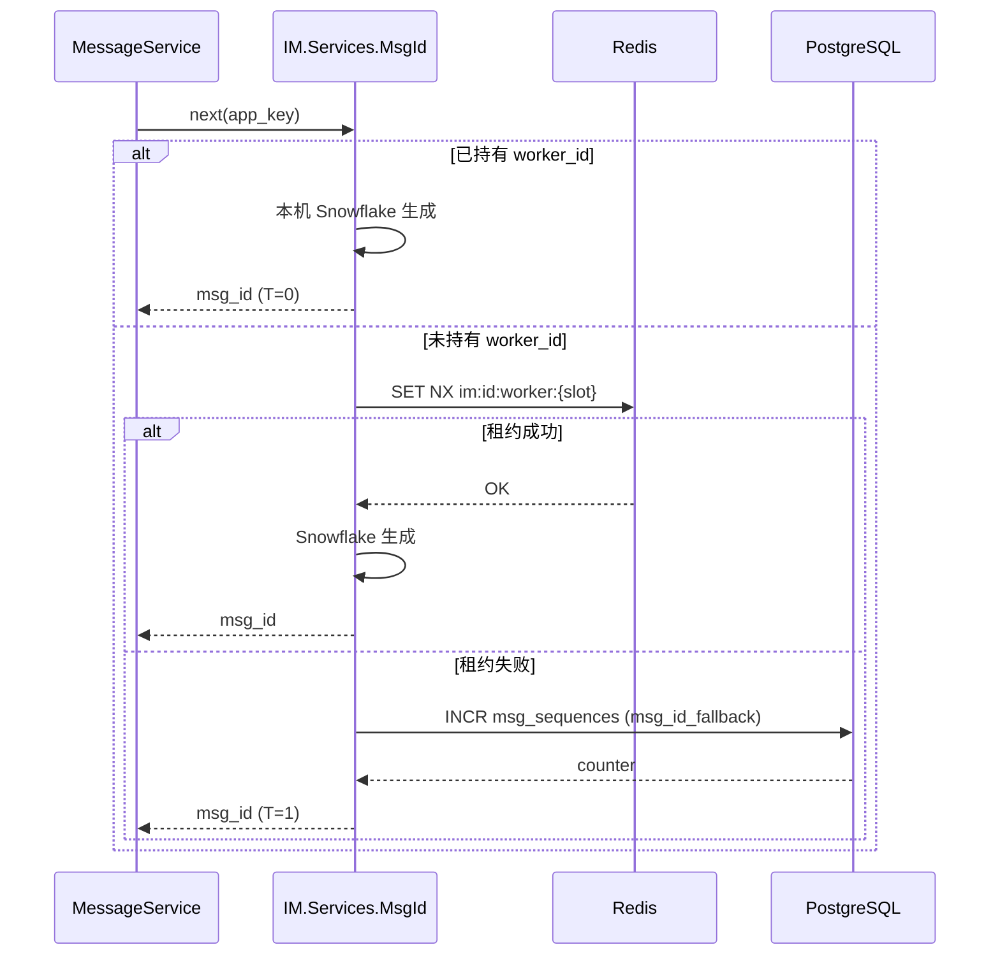
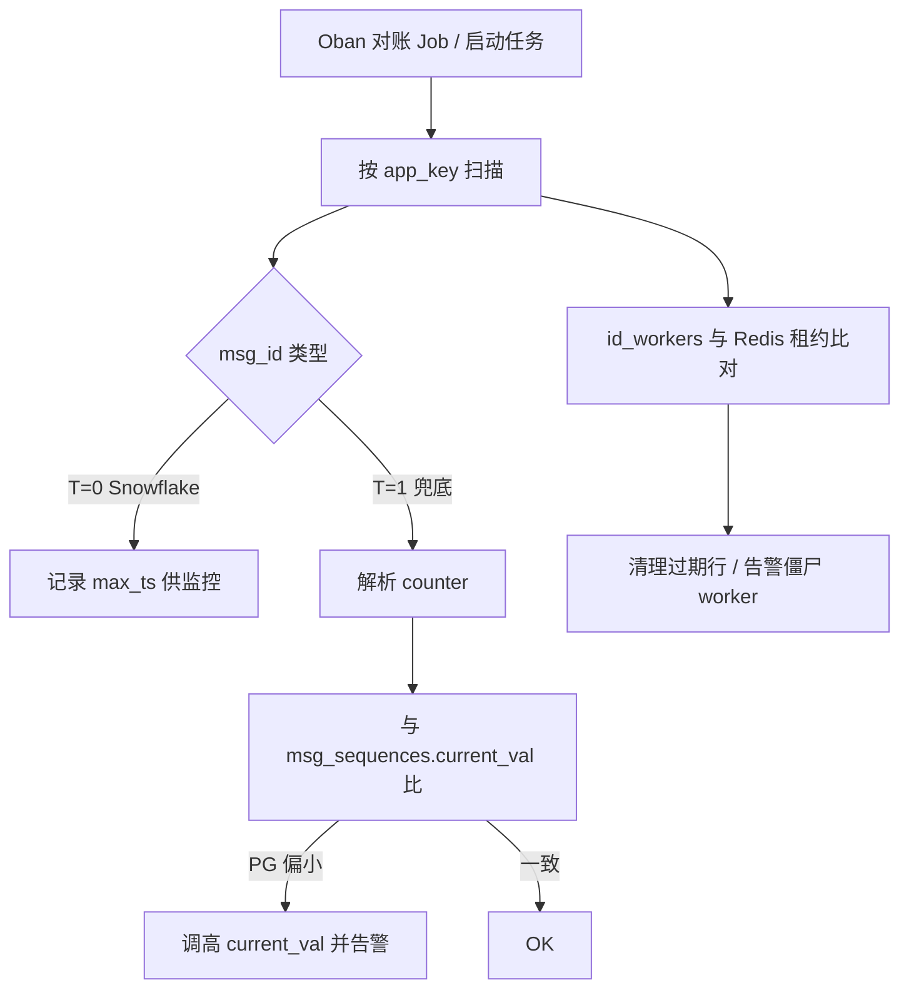

# 设计说明：`msg_id` Snowflake 发号

| 项 | 内容 |
|------|------|
| 状态 | **已确认** |
| 决策编号 | DD-039 |
| 规范定义 | 本文档；`msg_id` 字段仍为 `proto` `string`，语义「服务端全局唯一」不变 |
| 索引 | [database-design.md](database/database-design.md) §三.2、[design-decisions.md](../design-decisions.md) |
| 实现文档 | [implementation/elixir/database.md](../implementation/elixir/database.md) §8 |

---

## 1. 要解决什么问题

| 问题 | 说明 |
|------|------|
| Redis 单 key 热点 | `im:{app_key}:seq:msg_id` 在大租户下成为 INCR 热点 |
| 发消息热路径 RTT | 每条消息多一次 Redis 往返 |
| 排障 | 希望从 `msg_id` **可选**解析出生成时间、worker（非必须，副产品） |

**范围**：仅 **`msg_id`**。`conv_seq` / `inbox_seq` **继续** Redis `INCR` + PG `msg_sequences` 兜底（会话/收件箱须严格单调，不适合 Snowflake）。

---

## 2. 决策是什么

### 2.1 位布局（64 bit，无符号）

对外仍用 **十进制字符串**（`proto` `string msg_id`），客户端按字符串处理，**禁止**当 JS `Number` 解析（超过 `2^53-1`）。

```
 63   62   61 ───────────── 22   21 ─── 12   11 ───── 0
┌────┬────┬──────────────────┬──────────┬─────────────┐
│ 0  │ T  │   timestamp (41) │ worker(10)│ sequence(12)│  T=0 Snowflake 正常
└────┴────┴──────────────────┴──────────┴─────────────┘

 63   62   61 ─────────────────────────────────── 0
┌────┬────┬──────────────────────────────────────────┐
│ 0  │ 1  │      PG 兜底计数器 (62 bit)               │  T=1 PG 兜底
└────┴────┴──────────────────────────────────────────┘
```

| 字段 | 位数 | Snowflake（T=0） | 说明 |
|------|------|------------------|------|
| 符号 | 1 (bit 63) | 固定 `0` | 保证 ID 字符串可按数值比较（同类型内） |
| 类型 T | 1 (bit 62) | `0` | `1` = PG 兜底命名空间 |
| 时间戳 | 41 (bit 61–21) | `now_ms - EPOCH_MS` | 毫秒；约 **69 年**跨度 |
| worker_id | 10 (bit 20–11) | `0..1023` | 集群内进程租约 ID |
| 序列 | 12 (bit 10–0) | `0..4095` / ms | 同 worker 同毫秒内递增 |

**常量（建议）**：

```elixir
@epoch_ms 1_704_067_200_000   # 2024-01-01 00:00:00 UTC
@max_worker_id 0x3FF          # 1023
@max_sequence 0xFFF           # 4095
```

**编码**：

```text
id = (ts << 22) | (worker_id << 12) | sequence   # T=0，隐含 bit 62=0
msg_id = Integer.to_string(id)
```

**解码（运维工具）**：

```elixir
id = String.to_integer(msg_id)
type = Bitwise.bsr(id, 62) &&& 1
# type == 0 → ts, worker, seq = 按位拆解
# type == 1 → counter = id &&& ((1 <<< 62) - 1)
```

### 2.2 worker_id 租约

| 项 | 约定 |
|------|------|
| 粒度 | **集群级**（非 per `app_key`）；同一 K8s 集群内 `worker_id` 唯一 |
| 权威 | Redis 为主；PG `id_workers` 为持久化与对账 |
| 租约 | `SET im:id:worker:{worker_id} {node_name} NX EX 30`；进程每 **10s** 续期 |
| 分配 | 启动时从 `0..1023` 扫描第一个可 `NX` 的 slot；失败则 **降级 PG 兜底发号** |
| 释放 | 优雅下线 `DEL`；崩溃靠 TTL 过期后回收（**至少等待 2× 租约** 再复用，防旧进程迟发号） |

```sql
-- PG 镜像（可选对账；Redis 故障时仍可查历史租约）
CREATE TABLE id_workers (
    worker_id       SMALLINT PRIMARY KEY,           -- 0..1023
    node_name       VARCHAR(255) NOT NULL,          -- Node.self() 或 K8s Pod 名
    lease_until     TIMESTAMPTZ NOT NULL,
    updated_at      TIMESTAMPTZ NOT NULL DEFAULT NOW()
);
```

### 2.3 本机发号算法（Snowflake 路径）

```text
1. 若未持有有效 worker_id → 尝试租约；失败 → 走 PG 兜底（§2.5）
2. now = 当前毫秒
3. 若 now < last_ts → 时钟回拨：
     - 回拨 ≤ 5ms：自旋等待追平
     - 回拨 > 5ms：告警 + 降级 PG 兜底（本进程暂停 Snowflake）
4. 若 now == last_ts → sequence++；若 sequence > 4095 → 自旋到下一毫秒
5. 若 now > last_ts → sequence = 0
6. 组装 64 bit → 十进制字符串返回
```

进程内状态：`last_ts`、`sequence`（ETS 或 GenServer 单写）。

### 2.4 与 Redis `INCR` 方案的关系

| 阶段 | `msg_id` | `conv_seq` / `inbox_seq` |
|------|----------|---------------------------|
| **v1（已废弃）** | Redis `INCR` | Redis `INCR` |
| **v2（当前，DD-039）** | **Snowflake 本机** + PG 兜底命名空间 | **不变** Redis `INCR` |

**不再使用** `im:{app_key}:seq:msg_id` 热路径；新部署直接 Snowflake。自 v1 迁移见 §4。

### 2.5 PG 兜底发号

**触发条件**（任一）：

- 拿不到 `worker_id` 租约
- 时钟回拨超阈值
- 运维开关 `IM_MSG_ID_MODE=pg_fallback`（全集群降级）

**行为**：

```sql
-- 每 app_key 独立计数器（与现 msg_sequences 复用）
INSERT INTO msg_sequences (app_key, seq_type, seq_key, current_val)
VALUES ($app_key, 'msg_id_fallback', '__global__', 1)
ON CONFLICT (app_key, seq_type, seq_key)
DO UPDATE SET current_val = msg_sequences.current_val + 1,
              updated_at = NOW()
RETURNING current_val;
```

```elixir
# counter 填入 bit 61..0，bit 62 = 1
id = (1 <<< 62) ||| counter
msg_id = Integer.to_string(id)
```

| 项 | 说明 |
|------|------|
| 唯一性 | `(app_key, msg_id)` PK + 62 bit 计数器 per tenant 足够 |
| 性能 | 每条消息一次 PG 往返；**仅降级路径**，非稳态 |
| 可辨识 | `decode(type)==1` 或 `Bitwise.bsr(id, 62)==1` |

---

## 完整流程

### 正常发号（Snowflake）



### 对账与冷启动



---

## 3. 对账方案

### 3.1 日常对账（Oban，建议每小时）

| 步骤 | 动作 |
|------|------|
| 1 | 对每个 `app_key`，`SELECT MAX(msg_id::numeric)` **仅兜底 ID**（`msg_id::numeric >= 2^62` 或解析 `T=1`） |
| 2 | 与 `msg_sequences` 中 `seq_type='msg_id_fallback'` 的 `current_val` 比较 |
| 3 | 若 `current_val < max_counter` → **`UPDATE` 拉高** + `Logger.warning` 事件 `msg_id_fallback_drift` |
| 4 | 扫描 `id_workers` 中 `lease_until < now()` 且 Redis key 不存在 → 删除或标过期 |
| 5 | Snowflake 路径：**不**与 PG 数值对账；仅 Telemetry `im_msg_id_generated_total{type=snowflake\|fallback}` |

### 3.2 冷启动 / 新集群

| 场景 | 行为 |
|------|------|
| 新部署无历史 | worker 从 0 扫描租约；Snowflake 从当前时间发号 |
| 从 Redis INCR 迁移 | 见 §4；迁移完成前 **禁止** 启用 Snowflake |
| Redis 恢复后 | 兜底计数器 **不回拨**；Snowflake 与兜底 ID 靠 `T` 位区分，无冲突 |

### 3.3 冲突与重复

| 风险 | 缓解 |
|------|------|
| worker_id 复用过快 | TTL 30s + 复用前等待 60s；租约 value 校验 `node_name` |
| 时钟回拨 | 小回拨自旋；大回拨降级 PG |
| 同 ms 序列耗尽 | 等下一毫秒（4096/ms/worker 足够 IM 单进程） |
| 与旧 INCR 数字 ID 共存 | 旧 ID 通常 < `10^15`；Snowflake ≥ `10^17` 量级；兜底 ≥ `2^62`；三者命名空间分离 |

### 3.4 幂等不变

`(app_key, from_uid, client_msg_id)` 幂等 **不变**；重复 SEND 返回**原** `msg_id`，与发号路径无关。

---

## 4. 从 Redis INCR 迁移（若启用本方案）

1. **冻结** `im:{app_key}:seq:msg_id` 只读，记录 `last_incr` per `app_key`
2. 确认 `MAX(msg_id)`（数值型旧 ID）< Snowflake 下限（部署前校验脚本）
3. 全集群切换 `IM.Services.MsgId` 为 Snowflake；**灰度**单节点观察 24h
4. 对账 Job 启用；监控 `fallback` 比例应 ≈ 0
5. 稳定后删除 Redis `seq:msg_id` key（可选保留只读备份一周）

**回滚**：开关回 `IM_MSG_ID_MODE=redis_incr`（仅当尚未产生 Snowflake ID 或接受双模式共存期）。

---

## 5. 可观测性

| 指标 / 日志 | 说明 |
|-------------|------|
| `im_msg_id_generated_total{type="snowflake"}` | 正常路径 |
| `im_msg_id_generated_total{type="fallback"}` | PG 兜底；**>0 持续 5min 告警** |
| `im_worker_lease_fail_total` | 租约失败 |
| `im_clock_skew_total` | 时钟回拨触发降级 |
| 日志 `event=msg_id_fallback` | `:warning`，含 `app_key`、`node` |

---

## 6. 评审清单

- [x] 人工确认采用 Snowflake 替代 Redis `INCR` 作为 `msg_id` 主路径（2026-07）
- [x] 确认 `EPOCH_MS` 与 `worker_id` 上限（1024 节点）
- [x] 更新 [database-design.md](database/database-design.md) §三.2 权威表述
- [ ] 压测：单节点 Snowflake 生成 + 写库 P99（Phase 3 验收）
- [ ] 实现 `IM.Services.MsgId` + Oban 对账 Worker（P3-12）
- [x] **不修改** `proto` 字段类型（仍为 `string`）

---

## 7. 关联文档

| 文档 | 关联 |
|------|------|
| [database-design.md](database/database-design.md) | `msg_sequences`、`message_bodies.msg_id` |
| [message-send-ack.md](message-send-ack.md) | 发消息时分配 `msg_id` |
| [observability.md](observability.md) | 指标与告警 |
| [modular-architecture.md](modular-architecture.md) | `IM.Services.*` 落位 |
