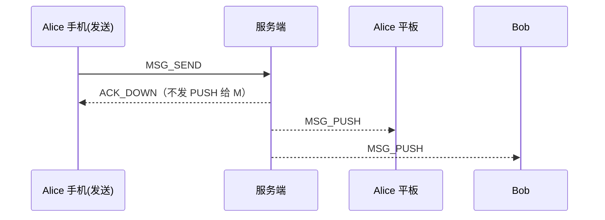
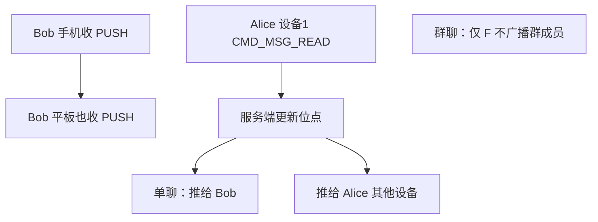

# 多端同步设计

本文档说明用户多设备场景下的消息同步与状态同步机制。

| 项 | 内容 |
|------|------|
| 状态 | 已确认 |
| 决策编号 | DD-013 |
| 实现文档 | [implementation/elixir/multi-device.md](../implementation/elixir/multi-device.md) |

---

## 完整流程

### 发送方多设备



### 接收方多设备 + 已读同步



设备上限与 `duplicate_login` 见 [auth.md](auth.md) §8。

---

## 1. 问题背景

用户可能在多个设备登录（手机、平板、Web、桌面端），需要保证：

1. 消息在所有设备同步
2. 已读状态在所有设备同步
3. 会话列表在所有设备一致

---

## 2. 消息同步机制

### 2.1 发送方多设备同步

**原则**：发送设备不收自身消息的 PUSH，但发送方的其他设备需要收到 PUSH。

**实现**：

```
Alice 手机（发送设备）→ 发送消息
Alice 平板（其他设备）← 收到 CMD_MSG_PUSH
Alice Web（其他设备）← 收到 CMD_MSG_PUSH
```

**数据库设计**：

- 群聊写扩散时，发送方也写入一条 `user_inbox` 行（`user_id = alice`）
- 离线拉取时，发送方可拉取自己发送的消息

**推送逻辑**：

```elixir
def push_to_sender_other_devices(app_key, from_uid, from_device_id, message) do
  # 获取发送方所有在线设备
  devices = UserLocator.find_devices(app_key, from_uid)
  
  # 排除发送设备
  other_devices = Enum.reject(devices, fn {device_id, _} -> 
    device_id == from_device_id 
  end)
  
  # 推送给其他设备
  Enum.each(other_devices, fn {_device_id, target} ->
    deliver(target, encode_push_packet(message))
  end)
end
```

### 2.2 接收方多设备同步

**原则**：接收方的所有在线设备都收到 PUSH。

**实现**：

```
Bob 手机 ← 收到 CMD_MSG_PUSH
Bob 平板 ← 收到 CMD_MSG_PUSH
Bob Web  ← 收到 CMD_MSG_PUSH
```

**离线拉取**：

- 设备上线后，从 `inbox_seq` 游标开始拉取
- 每个设备独立维护本地游标
- 消息通过 `msg_id` 去重

---

## 3. 已读状态同步

### 3.1 单聊场景

**原则**：已读回执同步到对端 + 自己的其他设备。

**流程**：

```
Alice 设备1（已读）→ CMD_MSG_READ
  ↓
Bob（对端）← CMD_MSG_READ（通知对端）
Alice 设备2 ← CMD_MSG_READ（同步其他设备）
Alice 设备3 ← CMD_MSG_READ（同步其他设备）
```

**实现**：

```elixir
def handle_msg_read(app_key, from_uid, from_device_id, msg_read) do
  # 1. 持久化已读位点
  update_read_cursor(app_key, from_uid, msg_read.conv_id, msg_read.conv_seq)
  
  # 2. 推送给对端（单聊）
  if msg_read.chat_type == :CHAT_PRIVATE do
    push_read_receipt_to_peer(app_key, msg_read)
  end
  
  # 3. 推送给自己的其他设备
  push_read_receipt_to_other_devices(app_key, from_uid, from_device_id, msg_read)
end
```

### 3.2 群聊场景

**原则**：本期不广播给其他群成员，仅同步自己的其他设备。

**流程**：

```
Alice 设备1（已读）→ CMD_MSG_READ
  ↓
Alice 设备2 ← CMD_MSG_READ（同步其他设备）
Alice 设备3 ← CMD_MSG_READ（同步其他设备）

（不推送给其他群成员）
```

### 3.3 聊天室场景

**原则**：不支持已读回执。

---

## 4. 会话列表同步

### 4.1 数据来源

- 会话列表从 `conversations` 表查询
- 每个用户独立维护自己的会话列表

### 4.2 更新时机

| 操作 | 更新内容 |
|------|---------|
| 收到消息 | 更新 `last_msg_*`、`unread_count++` |
| 发送消息 | 更新 `last_msg_*` |
| 已读消息 | `unread_count = 0` |
| 删除会话 | 从列表移除 |

### 4.3 多设备同步

**方式**：各设备独立查询，不主动同步。

**原因**：

- 会话列表可通过 `inbox_seq` 游标增量拉取
- 已读状态通过 `CMD_MSG_READ` 同步后，各设备本地更新 `unread_count`

---

## 5. 设备管理

### 5.1 设备标识

每个设备有唯一的 `device_id`，由客户端生成或服务端分配。

**建议格式**：`{platform}_{随机字符串}`

- `ios_abc123`
- `android_def456`
- `web_ghi789`

### 5.2 按平台在线设备数限制

**规范与配置**：见 [`auth.md`](auth.md) §8（已确认）。

| 项 | 说明 |
| --- | --- |
| 限制对象 | 同一 `user_id`、同一 `platform` 下 **同时在线** 的 `device_id` 数量 |
| 配置 | `app_configs`：`device.max_devices_per_platform`、`device.device_limit_policy` |
| 默认上限 | ios/android 各 2；web 5；desktop 3；其他 5 |
| 超限拒绝 | `CMD_ERROR` 1004（`CODE_DEVICE_LIMIT_EXCEEDED`） |
| 超限踢最旧 | `CMD_KICK`，`reason=device_limit` |

**与消息同步**：未超限时，各平台设备仍按本文 §2–§4 收 PUSH；被 `device_limit` 踢下线的设备须重连，重连时再次走限额检查。

### 5.3 同 device_id 重连

同一 `device_id` 新连接顶替旧连接：`CMD_KICK`，`reason=duplicate_login`。**不占用**新的平台名额。

---

## 6. 总结

| 场景 | 同步机制 |
|------|---------|
| 发送方多设备 | 写扩散 + PUSH 给其他设备（排除发送设备） |
| 接收方多设备 | 所有设备都收 PUSH |
| 已读状态（单聊） | 推送给对端 + 自己的其他设备 |
| 已读状态（群聊） | 仅推给自己的其他设备 |
| 会话列表 | 各设备独立查询，已读状态通过 CMD_MSG_READ 同步 |
| 平台设备上限 | AUTH 时按 platform 限制在线数；见 auth.md §8 |

**关键点**：

- `user_id` + `device_id` 唯一标识设备
- 群聊：`user_inbox` 按 `user_id` 写扩散，天然支持多设备；正文在 `message_bodies` 共享
- 推送时排除发送设备，避免循环
