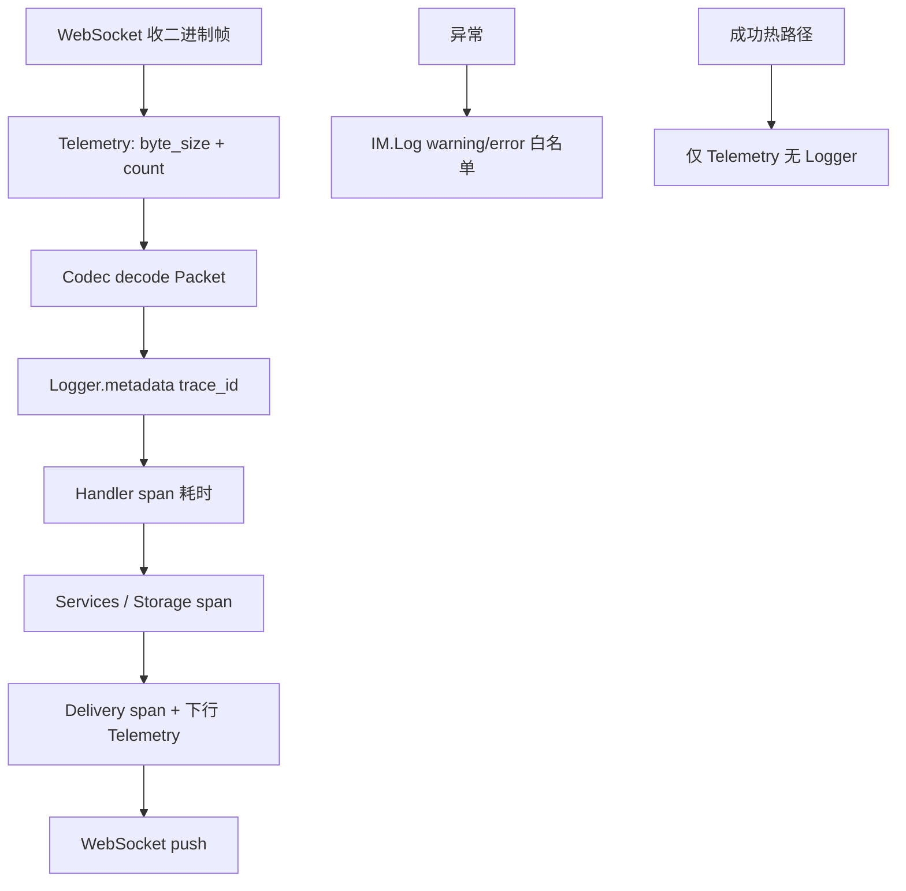

# 设计说明：可观测性（指标与日志）

| 项 | 内容 |
|------|------|
| 状态 | **已确认** |
| 决策编号 | DD-028 |
| 规范定义 | 本文档；`Packet.trace_id` / `Packet.ts` 见 [`proto/common.proto`](../../proto/common.proto) |
| 行为约定 | 本文档 |
| 索引 | [`design-decisions.md`](../design-decisions.md) |
| 实现文档 | [implementation/elixir/observability.md](../implementation/elixir/observability.md) |

---

## 1. 要解决什么问题

百万在线 IM 系统需要在**多个层级**掌握运行状态，否则无法回答：

| 问题 | 示例 |
|------|------|
| 流量是否正常 | 上行 `MSG_SEND` QPS 是否突增？下行 `MSG_PUSH` 是否跟得上？ |
| 哪类消息异常 | `CMD_ERROR` 按错误码分布？某 `cmd` 失败率升高？ |
| 延迟卡在哪 | SEND → SERVER_RECEIVED 多久？落库多久？推到对端 socket 多久？ |
| 扇出是否健康 | 大群推送批次耗时、跨节点投递次数 |
| **单次请求为何失败** | 某条消息 SEND 失败的具体原因？鉴权为何拒绝？推送哪一步超时？ |
| **开发/线上排障** | 需要 **debug** 级别查看 Handler 入参、扇出目标，但生产默认不能刷屏 |

**原则**：

- **指标（Telemetry）**：聚合趋势、告警。
- **日志（Logger）**：单请求排障、错误现场、可开关的 debug 细节。
- 二者通过 **`trace_id`** 关联；与 [`message-context.md`](message-context.md) 上下文一致。

---

## 完整流程



---

## 2. 决策是什么

### 2.1 统一埋点层

所有监控经固定 **Instrumentation Points** 发出，业务 Handler 不直接调 Prometheus API。

```text
WebSocket 收包 ──► 上行计数
       │
       ▼
Codec 解码 ──► Handler（:telemetry.span 耗时）
       │
       ├── Service / Store（存储延迟，Ecto/Redis 自带事件 + 业务 span）
       │
       └── Delivery（推送计数、扇出耗时、下行计数）
       │
       ▼
WebSocket 发包 ──► 下行计数
```

### 2.2 方向定义

| 方向 | 含义 | 典型 cmd |
|------|------|----------|
| **上行（up）** | 客户端 → 服务端 | `AUTH_REQ`、`MSG_SEND`、`ACK_UP`、`HEARTBEAT_REQ` |
| **下行（down）** | 服务端 → 客户端 | `AUTH_RESP`、`MSG_PUSH`、`ACK_DOWN`、`CMD_ERROR`、`CMD_KICK` |

推送包 `seq = 0`，仍计为 **下行**。

每条上下行包指标须带 **`direction`** 标签：`up`（客户端→服务端）/ `down`（服务端→客户端），与 counter 名称 `received`/`sent` 语义一致，便于 PromQL 按方向聚合。

### 2.3 核心指标

#### 2.3.1 消息计数与包大小（按 cmd）

| 指标名 | 类型 | 标签 | 说明 |
|--------|------|------|------|
| `im_packet_received_total` | Counter | `cmd`, `host`, `msg_type`, `direction`, `node` | 上行收包数（解码成功后） |
| `im_packet_sent_total` | Counter | `cmd`, `host`, `msg_type`, `direction`, `node` | 下行发包数（编码前） |
| `im_packet_received_bytes` | Histogram | 同上 | 上行整帧大小（**二进制 WebSocket 帧字节数**，含 Packet 信封） |
| `im_packet_sent_bytes` | Histogram | 同上 | 下行整帧大小 |
| `im_packet_errors_total` | Counter | `code`, `ref_cmd`, `host` | `CMD_ERROR` 计数 |

`cmd` 使用 `CmdType` 枚举名（如 `CMD_MSG_SEND`），不用数字，便于看板阅读。

**标签约定**：

| 标签 | 来源 | 说明 |
|------|------|------|
| `host` | `HOSTNAME` 环境变量或 `:inet.gethostname/0` | **Pod / 宿主机名**，用于按实例看流量与延迟 |
| `node` | `Node.self/0` 短名 | BEAM 集群节点名；与 `host` 并存（K8s 一 Pod 一节点时通常 1:1） |
| `msg_type` | payload 内 `MsgType` 枚举名 | 消息类 cmd 从 body 解析；**非消息类 cmd 填 `none`** |
| `direction` | 固定 | 上行 `up` / 下行 `down` |

**禁止作为 Prometheus 标签**（高基数）：`app_key`、`user_id`、`device_id`、`msg_id`、`trace_id`。多租户 `app_key` 数量可达成千上万，**仅写入日志 / Logger.metadata**；按租户看流量走 **日志聚合或独立租户报表**（Phase 10+），不走 Prometheus 标签。

**`msg_type` 适用 cmd**（从 payload 解码后取值，失败则 `unknown`）：

| cmd | 取值字段 |
|-----|----------|
| `CMD_MSG_SEND` | `MsgSendReq.msg_type` |
| `CMD_MSG_PUSH` / `CMD_MSG_PUSH_BATCH` | 包内 `ChatMessage.msg_type`（批量取首条或 `mixed` 若类型不一致） |
| `CMD_MSG_EDIT_REQ` | `MsgEditReq.msg_type` |
| 其他 | `none` |

`msg_type` 为有限枚举（见 `message.proto`），**可作为 Prometheus 标签**；仍 **禁止** 将 `app_key` / `user_id` / `msg_id` / `trace_id` 作为标签。

包大小 Histogram buckets 建议（字节）：`256, 512, 1024, 2048, 4096, 8192, 16384, 32768, 65536`。

#### 2.3.2 延迟（Histogram，单位 ms）

| 指标名 | 标签 | 测量区间 |
|--------|------|----------|
| `im_handler_duration_ms` | `cmd`, `result`, `host`, `msg_type`, `direction` | Handler 入口 → 响应/错误返回（**单包处理耗时**） |
| `im_storage_duration_ms` | `operation`, `store`, `host` | `insert` / `query` / `update` 等 |
| `im_delivery_duration_ms` | `chat_type`, `fanout_mode`, `host`, `msg_type` | 决定 recipients → 最后一包 push 写出 |
| `im_ack_latency_ms` | `stage`, `chat_type`, `host`, `msg_type` | 见 §2.4 |

延迟 Histogram buckets 建议：`5, 10, 25, 50, 100, 250, 500, 1000, 2500, 5000`（ms）。

**上下行包耗时**：以 `im_handler_duration_ms` 为主（`direction=up` 表示服务端处理客户端请求耗时；下行 PUSH 类若经独立写出路径，在 `push` 时以 `direction=down` 记录写出耗时，或合入 `im_delivery_duration_ms`，二者不重复计数）。

#### 2.3.3 连接与资源（Gauge / Counter）

| 指标名 | 类型 | 说明 |
|--------|------|------|
| `im_connections_active` | Gauge | 当前节点已鉴权 WebSocket 数 |
| `im_connections_total` | Counter | 累计建连次数（含未鉴权） |
| `im_auth_total` | Counter | `result=success\|failure` |
| `im_push_recipients` | Histogram | 单次投递目标设备数（扇出规模） |
| `im_outbound_queue_depth` | Gauge | 每连接出站队列深度；标签 `priority=high\|normal\|low` |
| `im_outbound_wait_ms` | Histogram | 入队→Socket 写出延迟；标签 `priority`；用于发现饿死 |
| `im_outbound_aged_total` | Counter | 老化升档次数；标签 `from`/`to` 优先级带 |
| `im_outbound_dropped_total` | Counter | 队列超限丢弃；**仅** `priority=low` |
| `im_cross_node_dispatch_total` | Counter | 跨节点推送次数 |

### 2.4 ACK 与端到端延迟阶段

| `stage` | 起点 | 终点 | 说明 |
|---------|------|------|------|
| `send_to_server_ack` | 收到 `CMD_MSG_SEND` | 发出 `ACK_DOWN(SERVER_RECEIVED)` | **主路径 SLA**，必须同步 |
| `send_to_push` | 收到 `CMD_MSG_SEND` | 对端首包 `CMD_MSG_PUSH` 写出 | 投递延迟 |
| `send_to_client_ack` | 收到 `CMD_MSG_SEND` | 发出 `ACK_DOWN(CLIENT_RECEIVED)` | 含对端 ACK_UP 等待 |
| `ack_up_processing` | 收到 `CMD_MSG_ACK_UP` | `ACK_DOWN` 处理完成 | ACK 处理耗时 |
| `heartbeat_rtt` | 收到 `HEARTBEAT_REQ` | 发出 `HEARTBEAT_RESP` | 粗测连接 RTT（也可用 `Packet.ts`） |

记录延迟时使用 `msg_id` 或 `(app_key, from, client_msg_id)` 作进程内关联键；**指标标签不带 `app_key` / `msg_id`**。

### 2.5 埋点位置清单

| # | 位置 | 事件 | 必做 Phase |
|---|------|------|------------|
| 1 | `UserSocket` 收二进制帧 | `[:im, :packet, :received]`（含 `byte_size`） | 2 |
| 2 | `UserSocket` 发二进制帧 | `[:im, :packet, :sent]`（含 `byte_size`） | 2 |
| 3 | `IM.Protocol.Router` → `Commands.*`（协议层 span） | `[:im, :handler, :start\|:stop]`（含 `duration`；metadata 带 `host`、`msg_type`） | 1 |
| 4 | `CMD_ERROR` 构造 | `[:im, :packet, :error]` | 1 |
| 5 | `MessageStore` 写/读 | `[:im, :storage, :stop]`（span） | 3 |
| 6 | `Delivery.Router` 推送 | `[:im, :delivery, :stop]`（span） | 3 |
| 7 | `ACK` 各阶段 | `[:im, :ack, :latency]` | 3 |
| 8 | 连接建立/断开/鉴权 | `[:im, :connection, *]` | 2 |
| 9 | 跨节点扇出 | `[:im, :cluster, :dispatch]` | 5 |
| 10 | `IM.Jobs.MessageBurn` 执行 | `[:im, :msg_burn, :executed]`；计数 `im_msg_burn_*`（见 [burn-after-read.md](burn-after-read.md) §8） | 7 |
| 11 | Prometheus `/metrics` | TelemetryMetrics 聚合 | 9 |

### 2.6 日志规范

#### 2.6.0 统一输出格式（硬约束）

所有运行日志 **必须** 经 `IM.Log` 输出，并遵守 **同一套字段契约**，以便 Loki / ELK / Datadog 等采集端 **无需按模块定制解析规则**。

| 规则 | 说明 |
|------|------|
| **唯一入口** | 业务代码 **禁止** 直接 `Logger.*`；审计走 `IM.Audit` 落库，与 stdout 日志分离 |
| **宏保留调用点** | `IM.Log` **必须**以 `defmacro` + `__CALLER__` 实现，注入 `caller_module` / `caller_file` / `caller_line`；禁止普通函数包装 `Logger`（否则位置全落在 `IM.Log`） |
| **生产 NDJSON** | 生产环境 **每条日志一行 JSON**（`application/json` 语义），禁止多行堆栈拼进 `message` |
| **开发可 TTY** | 开发环境可用文本 formatter，但 **metadata 键名与生产 JSON 字段一致** |
| **静态 message** | `message` 字段 **等于** `event` 的字符串形式（如 `"packet_error"`），**禁止**自由文案、插值、`inspect` |
| **结构化载荷** | 业务语义全部放在 **顶层 JSON 字段**（`code`、`reason`、`msg_id` 等），不塞进 `message` |
| **字段命名** | 全小写 **snake_case**；枚举值用字符串（如 `"CMD_MSG_SEND"`、`"warning"`） |
| **时间戳** | ISO 8601 UTC，字段名 **`@timestamp`**（与 ELK 生态对齐） |
| **服务标识** | 每条日志带 **`service`**（固定 `"im"`）、**`host`**（Pod/节点名）、**`node`**（Erlang 节点名） |
| **关联字段** | 凡有请求上下文，**必须**带 `trace_id`；多租户场景 warning/error **必须**带 `app_key` |
| **禁止多格式并存** | 不得在同一环境混用 logfmt、纯文本、自定义前缀（如 `[IM]`）与 JSON |

**生产单条日志 JSON 示例**（字段顺序无关；未列字段不出现）：

```json
{
  "@timestamp": "2026-07-29T10:15:30.123Z",
  "level": "warning",
  "event": "packet_error",
  "message": "packet_error",
  "service": "im",
  "host": "im-0",
  "node": "im@10.0.0.12",
  "trace_id": "550e8400-e29b-41d4-a716-446655440000",
  "app_key": "demo_app",
  "user_id": "u_10001",
  "device_id": "d_android_01",
  "cmd": "CMD_MSG_SEND",
  "seq": 42,
  "cid": 7,
  "code": 2004,
  "ref_cmd": "CMD_MSG_SEND",
  "reason": "conv_not_found",
  "caller_module": "IM.Services.MessageSend",
  "caller_file": "message_send.ex",
  "caller_line": 142
}
```

**字段分层**（采集端可按层建索引）：

| 层级 | 字段 | 出现时机 |
|------|------|----------|
| **信封（必有）** | `@timestamp`, `level`, `event`, `message`, `service`, `host`, `node` | 每条日志 |
| **链路上下文** | `trace_id`, `app_key`, `user_id`, `device_id`, `cmd`, `seq`, `cid` | 有 Packet/连接上下文时由 `Logger.metadata` 自动注入 |
| **调用点** | `caller_module`, `caller_file`, `caller_line` | `IM.Log` 宏在业务调用点注入（§2.6.0）；生产 **必有** `caller_module`，`caller_line` 建议保留 |
| **事件载荷** | `code`, `ref_cmd`, `reason`, `msg_id`, `client_msg_id`, `duration_ms`, `operation`, … | 按 `event` 白名单（§2.6.2）追加；键名须在实现文档登记 |

**采集与分析约定**：

- 日志 agent 从容器 **stdout** 采集；应用 **不** 写本地日志文件。
- 查询首选 **`event`** + **`trace_id`**；租户隔离用 **`app_key`**；定位代码用 **`caller_module`**（可选加 `caller_line`）。
- 新增 `event` 时须在 §2.6.2 白名单（或 debug 清单）登记，并在 [implementation/elixir/observability.md](../implementation/elixir/observability.md) 补充可选载荷字段，**禁止**临时发明未文档化的字段名。

实现细节（`LoggerJSON` 配置、`IM.Log` 门面、metadata 白名单）见 [implementation/elixir/observability.md](../implementation/elixir/observability.md) §3–§3.5。

#### 2.6.1 日志级别与环境策略

| 级别 | 用途 | 开发默认 | **生产默认** |
|------|------|----------|--------------|
| **`:error`** | 必须处理的失败 | 开启 | **开启** |
| **`:warning`** | 业务拒绝、可恢复异常 | 开启 | **开启**（高频事件须采样，见 §2.6.7） |
| **`:info`** | 业务里程碑、连接生命周期 | 开启 | **关闭**（`Logger` 级别 `:warning`） |
| **`:debug`** | 排障细节 | 开启 | **关闭** |

**生产硬约束**：

1. **`config :logger, level: :warning`** — 仅输出 `warning` + `error`，不输出 `info` / `debug`。
2. **成功路径不打日志** — 建连、鉴权成功、心跳、`MSG_SEND` 成功、推送成功、ACK 成功等 **只记 Telemetry 指标**，不写 Logger。
3. **百万在线下日志是稀缺资源** — 日志用于「异常与拒绝」；流量与延迟看 Prometheus，单条排障靠采样 + `trace_id`（见 §2.6.8）。
4. **禁止** 生产默认 `:info` / `:debug`；禁止在热路径对每条消息 `Logger.info`。

#### 2.6.2 生产环境允许的事件（白名单）

生产（`level: :warning`）**仅**允许以下 event 输出：

| 级别 | event | 说明 |
|------|-------|------|
| error | `packet_decode_error` | 协议/攻击异常 |
| error | `storage_failed` | 落库失败 |
| error | `push_failed` | 推送写出失败 |
| error | `cluster_dispatch_failed` | 跨节点投递失败 |
| error | `handler_crash` | 未捕获异常 |
| error | `internal_error` | 9000 类内部错误 |
| warning | `packet_error` | 返回 `CMD_ERROR`（含 `code`） |
| warning | `auth_failed` | 鉴权失败（**须采样**，见 §2.6.7） |
| warning | `rate_limited` | 触发限流 |
| warning | `channel_subscribe_denied` | 应用通道订阅拒绝 |
| warning | `channel_publish_dropped` | 应用通道上行/下行丢弃（限速、缓冲满） |
| error | `channel_push_failed` | 应用通道下行扇出失败 |

**生产禁止**（改走指标或 debug）：

| 禁止 event | 替代 |
|------------|------|
| `ws_connect` / `ws_disconnect` | `im_connections_*` 指标 |
| `auth_ok` | `im_auth_total{result="success"}` |
| `msg_send_ok` | `im_packet_*` + `im_ack_latency_ms` |
| `packet_received` / `packet_sent` | `im_packet_received/sent_total` |
| `handler_enter` / `handler_exit` | `im_handler_duration_ms` |

审计类登录登出走 **`IM.Audit` 落库**（异步），**不**走高频 stdout 日志。

#### 2.6.3 结构化日志

遵守 §2.6.0 统一格式：

- 使用 **固定事件名**（`event` 字段）+ **顶层 JSON 关键字字段**，禁止仅字符串插值。
- `message` **必须**与 `event` 相同（静态），便于全文检索与 `| json | event="..."` 过滤。
- 元数据字段与 `Logger.metadata` 白名单一致（见实现文档 §3.3、§3.5）。
- 每条日志必须能关联 `trace_id`（根 trace：HTTP 必填 `X-Trace-Id`，WS 空则生成；**衍生包必须继承**，见 [message-context.md](message-context.md) §7.4）。

```text
# 开发环境 TTY 示例（键名与生产 JSON 一致）
2026-07-29T10:15:30.123Z event=msg_send_ok trace_id=abc msg_id=m1 duration_ms=12 level=info

# 生产 JSON 示例（单行）
{"@timestamp":"...","level":"warning","event":"packet_error","message":"packet_error","trace_id":"abc","code":2004,"ref_cmd":"CMD_MSG_SEND"}

# 避免
Logger.info("User alice sent msg m1 to bob")   # 不可检索；生产热路径禁止
IM.Log.warning(:packet_error, "conv not found")  # message 不得为自由文案
```

#### 2.6.4 埋点清单（按环境）

| # | 位置 | 开发 | 生产 | event | 说明 |
|---|------|------|------|-------|------|
| 1 | 解码失败 | error | error | `packet_decode_error` | |
| 2 | `CMD_ERROR` | warning | warning | `packet_error` | |
| 3 | 鉴权失败 | warning | warning（采样） | `auth_failed` | |
| 4 | 落库失败 | error | error | `storage_failed` | |
| 5 | 推送失败 | error | error | `push_failed` | |
| 6 | 跨节点失败 | error | error | `cluster_dispatch_failed` | |
| 7 | 未捕获异常 | error | error | `handler_crash` | |
| 8 | 建连/断连 | info | **指标 only** | — | `im_connections_*` |
| 9 | 鉴权成功 | info | **指标 only** | — | `im_auth_total` |
| 10 | `MSG_SEND` 成功 | info | **指标 only** | — | `im_ack_latency_ms` |
| 11 | 心跳/ACK 成功 | debug | **无** | — | 仅指标 |

#### 2.6.5 Debug 日志（仅非生产）

| event | 内容 |
|-------|------|
| `packet_received` | `cmd`, `seq`, `cid`, `payload_size`, `host`（**不**打 payload 正文） |
| `packet_sent` | 同上 |
| `handler_enter` / `handler_exit` | `cmd`, `duration_ms`, `result` |
| `delivery_targets` | `recipient_count`, `fanout_mode`, `chat_type` |
| `ack_stage` | `stage`, `msg_id`, `duration_ms` |
| `storage_query` | `operation`, `duration_ms`（或由 Ecto telemetry handler 转 debug） |

按 **`app_key` / `user_id` 动态调高日志级别** 用于单用户排障，**必须带过期时间**（建议 ≤ 30min），防止遗忘关闭。**不得**在生产长期开启全量 debug。

#### 2.6.6 性能约束（硬约束）

日志不得 measurable 拖慢消息主路径（`CMD_MSG_SEND` → `ACK_DOWN(SERVER_RECEIVED)`）。

| 规则 | 说明 |
|------|------|
| **热路径零成功日志** | 生产成功路径只 `Telemetry.execute`，不 `Logger` |
| **先判断级别再构造** | `Logger.enabled?(:warning)` 为 false 时不构建 keyword / 不 `inspect` |
| **惰性 message** | `Logger.log(level, fn -> ... end, metadata)`，禁止热路径字符串拼接 |
| **元数据最小化** | 生产 `Logger.metadata` 仅 `trace_id`、`app_key`、`cmd`；失败时再补 `code`/`reason` |
| **禁止同步磁盘** | 生产 Logger 写 stdout，由容器/agent 异步采集；禁止 `File` 同步写日志 |
| **高频 warning 采样** | `auth_failed` 等：每连接每 60s 最多 1 条，或全局 token bucket（见 §2.6.7） |
| **指标优先** | QPS、延迟、连接数 **只** 走 Telemetry，不得用日志聚合 |
| **主路径禁止 IO** | `CMD_MSG_SEND` 同步路径上不得有日志 IO；审计走异步 `Task` / Oban |

**验收**：压测下开启生产日志配置，主路径 P99 与「无日志模块」相比劣化 **< 1%**。

#### 2.6.7 高频事件采样

| event | 策略 |
|-------|------|
| `auth_failed` | 每 `{app_key, remote_ip}` 每分钟最多 1 条 warning；超出只记指标 |
| `packet_error` | 全量 warning（业务错误通常低频）；若单 `code` 突增由告警发现 |
| `rate_limited` | 每用户每分钟最多 1 条 |

采样由 `IM.Log` 内部 token bucket 实现，业务代码无感。

#### 2.6.8 生产临时排障

| 手段 | 适用 | 限制 |
|------|------|------|
| `IM_LOG_LEVEL=debug` + 重启 | 全节点细粒度 | 须变更窗口；**不得**常驻 |
| 按 `user_id` trace 采样 | 单用户问题 | API 设置，30min 自动过期 |
| `trace_id` 查 Loki | 已有 warning/error 现场 | 依赖此前错误日志中的 `trace_id` |
| Grafana 指标 | 流量/延迟 | 首选 |

#### 2.6.9 敏感信息

| 字段 | 生产日志 |
|------|----------|
| `token` / 密码 | **禁止** |
| 消息 `content` 正文 | 仅 debug 且可配置关闭；默认只记 `content_type`、长度 |
| `user_id` / `device_id` | 允许（排障必需） |
| IP | info 及以上允许 |

审计类登录登出见 [`auth-module.md`](auth-module.md) §8；业务审计走 `IM.Audit`（**异步落库**），与普通运行日志分离。

#### 2.6.10 与指标的分工

| 场景 | 指标 | 日志 |
|------|------|------|
| QPS 突增 | `im_packet_received_total` | 不需要每条 |
| 某用户 SEND 失败原因 | 计数 `im_packet_errors_total` | `packet_error` / `msg_send_failed`（warning） |
| P99 变慢 | histogram | debug 打开后看 `handler_exit.duration_ms` |
| 线上事故复盘 | Grafana | Loki/ELK 按 `trace_id` 拉全链路 |

### 2.7 日志关联字段

结构化日志与 `Logger.metadata` 必须携带（与 [`message-context.md`](message-context.md) 一致）。**字段名即 §2.6.0 JSON 顶层键**，采集端直接 `| json` 解析，无需二次映射：

| 字段 | 来源 |
|------|------|
| `@timestamp` / `level` / `service` / `host` / `node` | Formatter 注入（§2.6.0 信封） |
| `event` / `message` | `IM.Log` 调用时的 event 原子（`message` 与 `event` 字符串相同） |
| `trace_id` | 根请求入站确定；衍生 ACK/PUSH/Kafka/日志 **必须继承**同一值 |
| `app_key` / `user_id` / `device_id` | 连接上下文 |
| `cmd` / `seq` / `cid` | 当前 Packet |
| `msg_id` / `client_msg_id` | 消息类业务（warning/error 建议带） |
| `caller_module` / `caller_file` / `caller_line` | `IM.Log` 宏在 **业务调用点** 经 `__CALLER__` 注入（非 `IM.Log` 模块自身） |

日志用于排障单条请求；指标用于聚合趋势。**禁止**把 `app_key` / `user_id` / `msg_id` / `trace_id` 作为 Prometheus 标签（基数爆炸）。`app_key` **必须**出现在 warning/error 日志与 `Logger.metadata` 中。

### 2.8 导出与告警

| 环境 | 指标 | 日志 |
|------|------|------|
| 开发 | Logger + LiveDashboard（可选） | 级别 `:debug`，TTY 彩色 |
| 生产 | `TelemetryMetricsPrometheus` → `/metrics` | 级别 **`:warning`**，仅 error/warning 白名单事件 |
| 排障 | Grafana 指标 | Loki/ELK 按 `trace_id` / `event` 查询 |
| 告警 | 见 §4.1 | `level=error` 速率、特定 `event` 阈值 |

---

## 3. 为什么这样设计

| 原因 | 说明 |
|------|------|
| **统一信封** | 上下行都走 `Packet`，在 Socket 边界计数即可覆盖全 cmd |
| **与协议 QoS 对齐** | `send_to_server_ack` 直接反映主路径是否被阻塞 |
| **分层延迟** | Handler / Storage / Delivery 分开，快速定位瓶颈 |
| **BEAM 生态** | `:telemetry` + `TelemetryMetrics` 是 Elixir 标准，库已发事件 |
| **可测试** | 测试环境 attach 内存 Handler，断言事件而不依赖 Prometheus |
| **日志可检索** | §2.6.0 统一 JSON + `event` + `trace_id`，对接 ELK/Loki **零定制解析** |

### 4.2 建议日志告警（初始）

| 告警 | 条件 | 严重性 |
|------|------|--------|
| 错误日志突增 | `rate({event="handler_crash"}[5m])` > 0 | 高 |
| 推送失败 | `rate({event="push_failed"}[5m])` > 10/min | 高 |
| 存储失败 | `rate({event="storage_failed"}[5m])` > 0 | 高 |
| 鉴权失败飙升 | `rate({event="auth_failed"}[5m])` 较基线 3x | 中 |

---

## 4. 有什么好处

| 好处 | 说明 |
|------|------|
| 流量可视 | 按 cmd 看上下行 QPS，区分消息/ACK/管理命令 |
| 延迟可拆 | 知道慢在 Handler、DB 还是扇出 |
| 故障发现 | 错误码、连接数、跨节点投递异常可告警 |
| 容量规划 | `push_recipients` 分布支撑大群容量评估 |
| 排障闭环 | `trace_id` 从指标异常跳到日志 |

### 4.1 建议告警（初始）

| 告警 | 条件 | 严重性 |
|------|------|--------|
| 主路径延迟 | `im_ack_latency_ms{stage="send_to_server_ack"}` P99 > 200ms 持续 5min | 高 |
| 错误率 | `im_packet_errors_total` 速率 / `im_packet_received_total` > 1% | 高 |
| 连接下跌 | `im_connections_active` 5min 内下降 > 20% | 中 |
| 推送堆积 | `send_to_push` P99 > 1s | 中 |
| 跨节点异常 | `im_cross_node_dispatch_total` 失败（若有）突增 | 中 |

---

## 5. 刻意不做 / 后续演进

| 不做 | 原因 |
|------|------|
| 指标标签带 `app_key` | 多租户场景租户数无上限，Prometheus 序列数爆炸 |
| 指标标签带 `user_id` / `msg_id` / `trace_id` | 百万用户 / 请求级唯一 ID，基数爆炸 |
| 指标标签带高基数 `device_id` | 同上；`host`（Pod 级）与 `msg_type`（枚举）允许 |
| 同步路径写 Kafka 做监控 | 监控不得阻塞 `CMD_MSG_SEND`；用 Telemetry 内存聚合 |
| 首期全量 OpenTelemetry | 可选 Phase 10+；`trace_id` + 日志已够排障 |
| 客户端上报延迟 | 首期服务端视角；SDK 侧 RTT 由客户端自有监控 |
| 全量 Packet payload 日志 | 体积与隐私风险；仅 debug 记 `payload_size` |
| 生产 `:info` 成功日志 | 百万 QPS 下 IO 成为瓶颈；成功路径只走指标 |

---

## 6. 与现有模块关系

| 模块 | 监控要点 |
|------|----------|
| [message-send-ack.md](message-send-ack.md) | `send_to_server_ack`、`send_to_client_ack` |
| [message-model.md](message-model.md) | `im_storage_duration_ms{operation="insert"}` |
| [modular-architecture.md](modular-architecture.md) | Delivery 层 `im_delivery_duration_ms` |
| [auth.md](auth.md) | `im_auth_total`、`im_connections_*` |
| [packet.md](packet.md) | `CMD_ERROR` 分布、`trace_id` 约定、`packet_error` 日志 |

---

## 附录：Telemetry 事件契约（语言无关）

| 事件名 | 测量值（measurements） | 元数据（metadata） |
|--------|------------------------|-------------------|
| `[:im, :packet, :received]` | `%{count: 1, byte_size: n}` | `cmd`, `host`, `msg_type`, `direction`=`up`, `node` |
| `[:im, :packet, :sent]` | `%{count: 1, byte_size: n}` | `cmd`, `host`, `msg_type`, `direction`=`down`, `node` |
| `[:im, :packet, :error]` | `%{count: 1}` | `code`, `ref_cmd`, `host` |
| `[:im, :handler, :stop]` | `%{duration: native}` | `cmd`, `result`, `host`, `msg_type`, `direction` |
| `[:im, :storage, :stop]` | `%{duration: native}` | `operation`, `store`, `result`, `host` |
| `[:im, :delivery, :stop]` | `%{duration: native, recipients: n}` | `chat_type`, `fanout_mode`, `host`, `msg_type` |
| `[:im, :ack, :latency]` | `%{duration: native}` | `stage`, `chat_type`, `host`, `msg_type` |
| `[:im, :connection, :open]` | `%{count: 1}` | `host`, `node` |
| `[:im, :connection, :close]` | `%{count: 1}` | `reason`, `host`, `node` |
| `[:im, :connection, :auth]` | `%{count: 1}` | `result`, `host` |

`duration` 使用 `:erlang.monotonic_time()` 差值，导出时转为毫秒。`byte_size` 为 WebSocket 二进制帧 `byte_size/1`。
