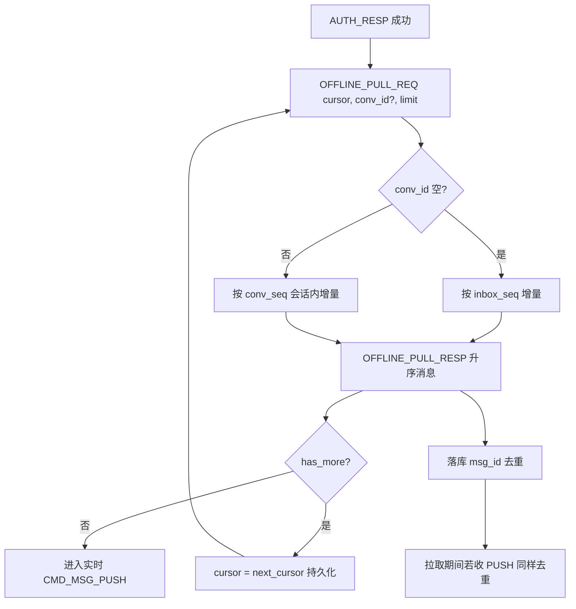
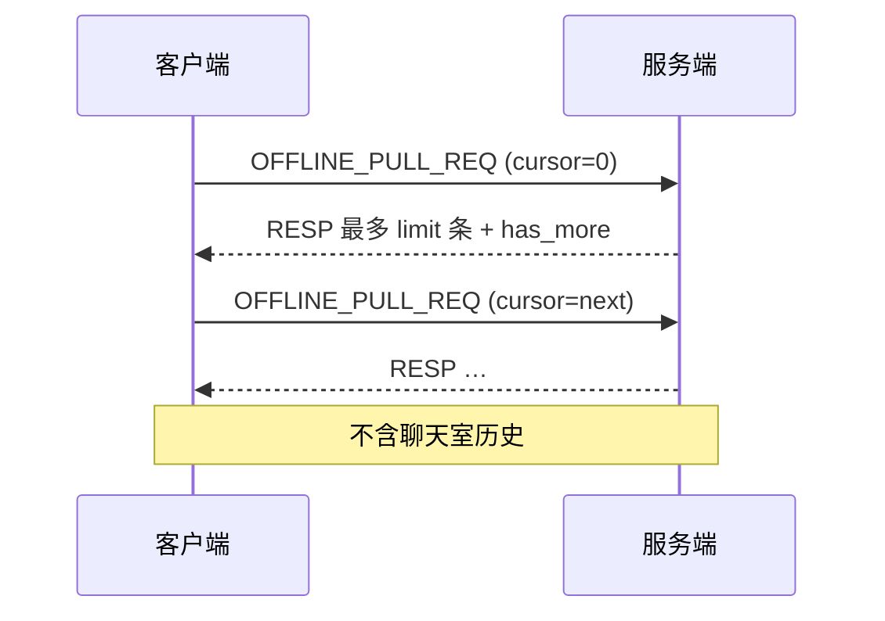

# 设计说明：离线拉取

| 项 | 内容 |
| --- | --- |
| 状态 | **已确认** |
| 决策编号 | DD-011 |
| 规范定义 | [`proto/sync.proto`](../../proto/sync.proto)、[`proto/message.proto`](../../proto/message.proto)（`inbox_seq`）、[`proto/auth.proto`](../../proto/auth.proto)（`offline_pull_limit`） |
| 行为约定 | [`protocol.md` §11](protocol/protocol.md#11-离线拉取) |
| 索引 | [`design-decisions.md`](../design-decisions.md) |
| 实现文档 | [implementation/elixir/offline-pull.md](../implementation/elixir/offline-pull.md) |

---

## 1. 要解决什么问题

用户离线或新设备登录后，在实时 `PUSH` 之前补全**单聊/群聊**增量，并带上撤回、编辑、阅后即焚等最终状态。

---

## 2. 决策摘要（已确认）

| # | 决策 |
| --- | --- |
| 1 | **游标双模式**：`conv_id` 空 → `inbox_seq`；`conv_id` 非空 → `conv_seq` |
| 2 | `limit` 由 `AuthResp.offline_pull_limit` 配置，默认 **50**，硬上限 **200** |
| 3 | RESP 内消息**升序**排列 |
| 4 | **先离线拉完再实时**；拉取与 PUSH 按 `msg_id` 去重 |
| 5 | 失败 `CMD_ERROR`，**不关连接** |
| 6 | **不含聊天室**历史 |
| 7 | 群聊定向消息：**默认不过滤**，与全员消息相同进入 `user_inbox` 与 `OFFLINE_PULL`；仅当应用配置「仅定向可见」时 JOIN 查询侧过滤 `target_users` |
| 8 | **大群读扩散**（`groups.storage_mode = read_fanout`）：**无** `user_inbox` 行；须带 `conv_id` 按 `conv_seq` 拉 `message_bodies`；**不进**全局 `inbox_seq` 拉取（见 [group.md](group.md) §6.3） |

---

## 完整流程





---

## 3. 游标双模式

| 请求 `conv_id` | `cursor` 含义 | 拉取条件 | `next_cursor` |
| --- | --- | --- | --- |
| 空 | 用户 `inbox_seq` | `inbox_seq > cursor`（跨会话） | 本页最大 `inbox_seq` |
| 非空 | 该会话 `conv_seq` | 同会话 `conv_seq > cursor` | 本页最大 `conv_seq` |

### ChatMessage.inbox_seq

服务端为**每个收件用户**在 `user_inbox` 分配跨会话单调 `inbox_seq`；正文经 **JOIN** `message_bodies` 获取（见 [database-design.md](database/database-design.md) §3）。

### 为何需要 inbox_seq

`conv_seq` 仅会话内有效，无法用一个数字表示「用户全局同步进度」；双模式兼顾「一次拉全会话」与「只补某一个会话」。

### 3.1 大群读扩散（`read_fanout`）

| 项 | 行为 |
|----|------|
| 适用 | `groups.storage_mode = read_fanout`（成员数大于 threshold，默认 500） |
| 存储 | 仅 `message_bodies`，无 `user_inbox` |
| 拉取方式 | **必须** `conv_id = g:{group_id}` + `conv_seq` 游标 |
| 全局拉取 | `conv_id` 空时**跳过**读扩散群；客户端 AUTH 后按会话列表逐群 `OFFLINE_PULL` |
| 游标持久化 | 服务端 `group_read_cursors.last_conv_seq`；RESP `next_cursor` = 本页最大 `conv_seq` |
| 与写扩散群混用 | 同一用户可同时有小群（inbox）与大群（conv_seq）；SDK 须区分 `storage_mode` |

```text
AUTH 后：
  1) OFFLINE_PULL(conv_id=空)     → 单聊 + 小群写扩散消息
  2) 对每个 read_fanout 群会话：
       OFFLINE_PULL(conv_id=g:{id}, cursor=本地或 group_read_cursors)
  3) 进入实时 PUSH
```

---

## 4. 流程

```text
AUTH_RESP
  loop:
    OFFLINE_PULL_REQ(cursor, conv_id?, limit)
    OFFLINE_PULL_RESP → 落库，cursor = next_cursor
    until !has_more
  进入实时 CMD_MSG_PUSH / PUSH_BATCH
```

拉取期间若收到 PUSH：按 `msg_id` 去重，避免重复落库。

---

## 5. 返回内容

- 完整 `ChatMessage`：`recalled`、`edit_version`、`burned`、最新 `content`（已销毁时 `content` 为空）
- 按 `inbox_seq` 或 `conv_seq` **升序**
- 群聊：仅当前用户收件箱视角，非群全量审计日志

---

## 6. 刻意放弃

| 放弃 | 原因 |
| --- | --- |
| 聊天室离线拉取 | 实时为主；历史 REST |
| 单一 conv_seq 游标拉全会话 | 多会话语义错误 |
| 拉取失败断连接 | 与 SEND 一致 |

---

