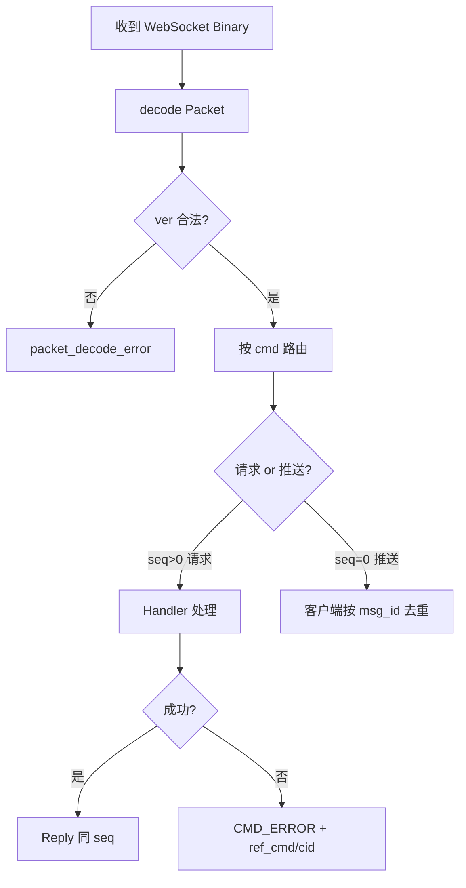

# 设计说明：通用封包 Packet

| 项 | 内容 |
| --- | --- |
| 状态 | **已确认** |
| 决策编号 | DD-003 |
| 规范定义 | [`proto/common.proto`](../../proto/common.proto)（`Packet` / `ErrorBody` / `CMD_ERROR`） |
| 行为约定 | [`protocol.md` §3](protocol/protocol.md#3-通用封包-packet) |
| 索引 | [`design-decisions.md`](../design-decisions.md) |

本文只讲**为什么这样设计、有什么好处、刻意放弃了什么**；字段表与交互约定以 `protocol.md` / `proto` 为准。

---

## 1. 要解决什么问题

IM 长连接上会跑很多种交互：鉴权、心跳、发消息、推送、ACK、撤回、离线拉取、透传、错误……若每种业务各自一套顶层二进制格式，会出现：

- 接入网关无法用统一方式做路由、限流、日志、追踪
- 每加一个能力就要改「帧解析」核心路径
- 客户端状态机碎片化（每种响应自己的错误字段）

因此需要一层稳定的**传输信封（Envelope）**，把「连接期控制面」和「业务内容」分开。

---

## 完整流程



---

## 2. 总体决策：统一 Packet + 按 cmd 解析 payload

```text
WebSocket Binary Frame
        │
        ▼
     Packet（信封）
        │
        ▼
  payload（由 cmd 决定类型）
```

### 为什么这样定

1. **网关浅解析**：只解 `Packet` 即可完成版本校验、命令路由、`route_key` 分流、`seq` 关联，不必加载全部业务 proto。
2. **业务可拆分演进**：auth / message / sync / passthrough 分文件定义，互不拖成巨型 `oneof`。
3. **扩展成本低**：新能力 ≈ 新 `cmd` + 新 payload 类型；旧客户端对未知 `cmd` 可统一拒绝或忽略。
4. **观测面统一**：日志、metrics、trace 都挂在同一套信封字段上。

### 好处（相对「每种业务一套顶层结构」）

| 好处 | 说明 |
| --- | --- |
| 接入层稳定 | 网关核心循环很少因业务字段变更而改 |
| 存储干净 | 库表存 `ChatMessage` 等业务体，不把 `seq` 等连接期字段写进消息库 |
| 多语言一致 | 各端都先解 Packet，再按 cmd 分发，SDK 结构同构 |

### 刻意放弃

- **顶层巨型 `oneof` 所有业务类型**：类型更「安全」，但信封 proto 会依赖全部业务，网关与业务发版耦合重。
- **把完整 Packet 当离线消息落库**：`seq` 换连接即失效，且污染业务数据模型。

---

## 3. 字段级设计意图

### `ver` — 协议版本

- **为什么**：多端 SDK 升级不同步时，需要硬门禁，避免用错字段语义导致「半成功」。
- **好处**：不兼容可直接 `CMD_ERROR` + `CODE_PROTO_VERSION_UNSUPPORTED`，行为可预期。

### `cmd` — 命令字

- **为什么**：用数值命令字指示 payload 类型与处理路径。
- **好处**：路由表 / switch 高效；比字符串命令省流量、比较稳定。可读性由枚举名与文档补齐。

### `seq` — 请求序号

- **为什么**：客户端并发多请求时，必须能把响应配对回原请求。
- **约定**：上行必填且单调递增；成功/失败响应回传同一 `seq`；**推送 `seq=0`**，改用 `msg_id` 等业务 ID。
- **好处**：把「RPC 式应答」和「服务端主动推」分成两种模式，客户端状态机清晰。
- **不做**：服务端推送再占用一套全局 seq——与客户端序号空间混淆，收益有限。

### `ts` — 时间戳

- **为什么**：排障、粗测时钟偏差 / RTT。
- **好处**：出问题时能对照客户端与服务端时间线。
- **明确不做**：会话内排序与离线游标**不靠** `ts`（改手机时间会乱序），而靠业务侧 `conv_seq`。

### `cid` — 客户端请求级幂等 ID

- **为什么**：弱网重试、连点发送会导致同一逻辑写操作到达多次。
- **好处**：网关/业务可按 `cid` 做幂等，避免重复落库、重复推送。
- **职责分离**：
  - `Packet.cid`：请求级幂等，网关层去重
  - `ChatMessage.client_msg_id`：消息级幂等，业务层去重
- **放在信封的好处**：部分场景网关不解 payload 也能透传/记录去重键。

### `trace_id` — 链路追踪 ID

- **为什么**：IM 涉及接入、业务、存储、扇出多环节；一次发消息会产生 ACK、多路 PUSH、Kafka 事件等，需用同一 ID 串联排障。
- **好处**：
  - 日志、Kafka、下行 `Packet` 全链路透传，一次搜索定位整段因果
  - 客户端可上报根 `trace_id` 用于问题反馈
- **约定**：
  - **根 trace**：WS 入站建议客户端生成，空则服务端生成；HTTP 必填 `X-Trace-Id`
  - **衍生包**（响应、PUSH、ERROR）：**必须**继承上游 `MessageContext.trace_id`，禁止在扇出/推送路径新生成
  - 客户端 `ACK_UP`：**应**继承所响应 PUSH 的 `trace_id`
- **放在信封的好处**：网关与推送层无需解 payload 即可记录链路信息。

详见 [protocol.md](protocol/protocol.md) §2 `trace_id`、[message-context.md](message-context.md) §7.3–§7.4。

### `payload` — 业务体 bytes

- **为什么**：用 `bytes` 承载，而不是在 Packet 内嵌全部业务 message。
- **好处**：信封稳定、依赖少；不同服务只需依赖自己关心的业务 proto。
- **代价**：类型安全弱于 `oneof`，靠 `cmd` 约定与单测/文档约束——可接受。
- **压缩**：可为 gzip/lz4 压缩字节；先解压再按 `cmd` 解析。见 [payload-compression.md](payload-compression.md)。

### `compression` — payload 压缩算法

- **为什么**：弱网场景在应用层进一步减小 `payload` 体积；鉴权时协商，避免每包重复声明。
- **约定**：`UNSPECIFIED` 继承 `AuthResp.payload_compression`；`CMD_AUTH_*` 必须为 `NONE`。
- **v1**：实现仅 `NONE`；枚举与字段先落地便于扩展。

### `route_key` — 网关分流键

- **为什么**：后期多实例网关 / 消息节点需要一致性哈希分流，若每次都反序列化业务 `to` 才能路由，接入层会变重且与业务字段耦合。
- **好处**：
  - 网关只读信封即可选后端
  - 与业务字段解耦：`route_key` 负责「送到哪台机器」，`ChatMessage.to` 负责「业务发给谁」
  - 单聊 / 群 / 聊天室可填不同键（user / group / room id）
- **不做**：用 `route_key` 替代 `to`——分流键可以缺失或策略变更，业务语义不能丢。

---

## 4. 错误模型设计意图

### 决策

- **失败一律** `CMD_ERROR` + `ErrorBody`（`code` / `msg` / `ref_cmd` / `ref_cid`）
- **成功响应不带 `code`**（信封已删除 `code`/`msg`；业务 RESP/ACK 也不放 `code`）

### 为什么这样定

| 决策 | 意图与好处 |
| --- | --- |
| 统一 `CMD_ERROR` | 客户端只需一套失败处理；解包失败、未鉴权、业务校验失败路径一致 |
| 成功不带 `code` | 成功路径干净；用 `cmd == CMD_ERROR` 判断失败，避免每个 RESP 重复错误字段 |
| `ref_cmd` / `ref_cid` | 多请求并行时，把失败关联回原命令与业务幂等 ID |
| `CMD_KICK` 仍独立 | 踢人是服务端主动通知，不是某次请求的失败应答，职责分离 |

### 刻意放弃

- **每个成功/失败响应都带 `Packet.code`**：成功时无意义的字段噪音大，且「失败长什么样」不统一。
- **用 `CMD_AUTH_RESP` 等业务 RESP 同时表达成功与失败**：客户端要在每个 RESP 里分支解析 `code`，和统一错误通道重复。

---

## 5. 请求超时机制

### 决策

所有客户端发起的请求-响应式命令，必须设置超时时间。超时后视为失败，清理等待队列。后续收到的响应直接忽略。

### 为什么这样定

| 点 | 好处 |
|---|------|
| 统一超时机制 | 避免无限等待，客户端可及时重试或报错 |
| 超时后忽略响应 | 避免状态混乱，简化客户端逻辑 |
| `seq` 匹配队列 | 清晰的请求-响应关联，支持并发请求 |

### 实现

```
客户端状态机：
1. 发送请求 → 记录 (seq, cmd, send_time, callback) 到等待队列
2. 启动定时器（超时时间 = timeout）
3. 收到响应 → 检查 seq 是否在队列中
   - 在队列中 → 处理响应，删除队列项，取消定时器
   - 不在队列中 → 忽略（已超时或重复）
4. 定时器触发 → 删除队列项，执行失败回调
```

---

## 6. 与存储、网关的边界

| 层 | 用 Packet？ | 说明 |
| --- | --- | --- |
| WebSocket 收发 | 是 | 线上唯一外壳 |
| 网关分流 | 读信封 | 主要用 `route_key` / `cmd` / `ver` |
| 离线消息库 | 否 | 存 `ChatMessage`（及检索字段），推送时再包成 Packet |
| 透传离线 | 否 | 存 `Passthrough` 业务体 |

---

## 7. 错误码（ErrorCode）

完整枚举定义于 [`proto/common.proto`](../../proto/common.proto) `ErrorCode`。仅通过 `CMD_ERROR` + `ErrorBody` 返回。

| 区间 | 说明 | 示例 |
| --- | --- | --- |
| 1000–1999 | 连接类 | `CODE_UNAUTHORIZED`(1001)、`CODE_PROTO_VERSION_UNSUPPORTED`(1003) |
| 2000–2999 | 消息类 | `CODE_MSG_INVALID`(2001)、`CODE_CONV_NOT_FOUND`(2004) |
| 3000–3999 | 群组类 | `CODE_GROUP_NOT_FOUND`(3001)、`CODE_GROUP_NOT_MEMBER`(3005) |
| 4000–4999 | 聊天室类 | `CODE_ROOM_NOT_FOUND`(4001) |
| 5000–5999 | 限流类 | `CODE_RATE_LIMITED`(5001) |
| 9000–9999 | 服务端 | `CODE_INTERNAL_ERROR`(9000) |

Elixir 实现使用 `IM.Protocol.Errors` 模块与 proto 枚举保持一致。

---

