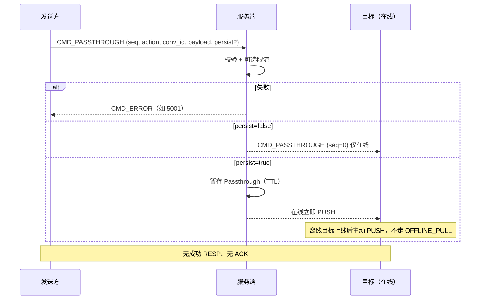

# 设计说明：透传指令

| 项 | 内容 |
| --- | --- |
| 状态 | **已确认** |
| 决策编号 | DD-012 |
| 规范定义 | [`proto/passthrough.proto`](../../proto/passthrough.proto) |
| 行为约定 | [`protocol.md` §12](protocol/protocol.md#12-透传指令) |
| 索引 | [`design-decisions.md`](../design-decisions.md) |
| 实现文档 | [implementation/elixir/passthrough.md](../implementation/elixir/passthrough.md) |

---

## 1. 要解决什么问题

承载**非聊天消息**类信令：输入状态、业务自定义控制面等。要求默认不进历史、不加未读，且与 `MSG_SEND` 严格区分。

---

## 2. 决策摘要（已确认）

| # | 决策 |
| --- | --- |
| 1 | 上行/下行**共用** `CMD_PASSTHROUGH`（500）；上行带 `seq`，下行 `seq=0` |
| 2 | 增加 **`conv_id`**，规则同 `ChatMessage` |
| 3 | `persist=true` 离线：**不并入 OFFLINE_PULL**；登录后服务端**主动 PUSH** 暂存透传 |
| 4 | **无 ACK**、**无成功 RESP**；失败才 `CMD_ERROR` |
| 5 | **聊天室**允许透传（广播在线成员） |
| 6 | 失败**不关连接**；可按 `action` **限流**（5001） |

---

## 完整流程

聊天室：广播房间内在线成员（见 [room.md](room.md)）。

---

## 3. 为什么这样设计

### 与 MSG_SEND 分离

| 点 | 好处 |
| --- | --- |
| 独立 cmd 500 段 | 网关/SDK 不会误落库为聊天消息 |
| 不计未读 | 产品语义正确（typing 等） |
| 可单独限流 | typing 高频不影响消息通道 |

### 双向同一命令

实现简单：同一 `Passthrough` 结构；方向由连接角色与 `seq` 区分。

### 无 ACK / 无成功 RESP

信令类「尽力而为」；减少往返。typing 等重复发送可接受。

### persist 与离线

| persist | 行为 |
| --- | --- |
| `false`（默认） | 仅转发给在线目标 |
| `true` | 服务端暂存 `Passthrough` 业务体；目标上线后 **PUSH**，不走 `OFFLINE_PULL` |

原因：`OFFLINE_PULL` 只同步 `ChatMessage` 收件箱模型，透传保持独立存储与投递路径。

**TTL 建议**：`persist=true` 的暂存透传应设置 TTL（如 7 天），避免长期未登录用户数据积压。

### conv_id

与消息、离线、网关分流一致；单聊/群/房间索引统一。

---

## 4. 推荐 action（非强制枚举）

| action | 用途 |
| --- | --- |
| `typing` | 正在输入 |
| `typing_stop` | 停止输入 |
| `stream_signal` | 音视频等业务信令（示例） |

业务可自定义；服务端可按 `action` 限流。

---

## 5. 存库

- `persist=true`：存 **`Passthrough`** 业务体（及 `conv_id`、`to`、时间等索引字段）
- **不**写入 `ChatMessage` 表
- **不**存 `Packet`

---

## 6. 刻意放弃

| 放弃 | 原因 |
| --- | --- |
| 透传进 OFFLINE_PULL | 与消息收件箱模型分离 |
| 透传 ACK | 已确认不需要 |
| 独立 PASSTHROUGH_PUSH cmd | 本期共用 500 即可 |

---

