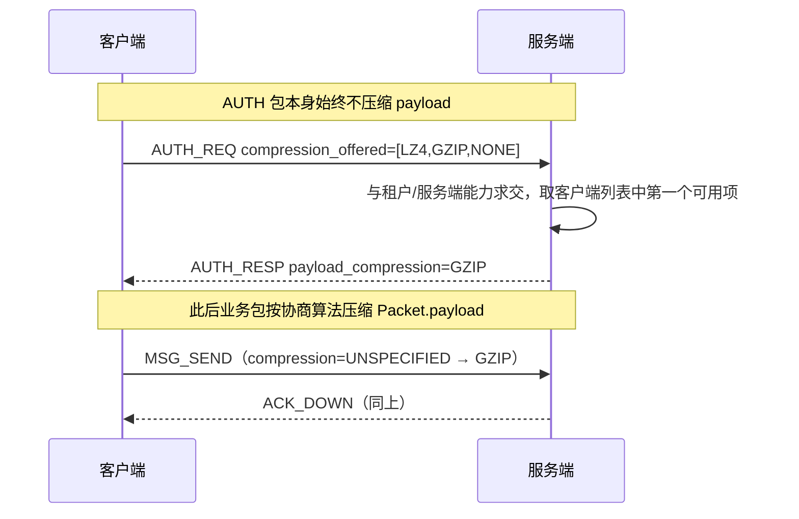

# 设计说明：Packet.payload 压缩协商

| 项 | 内容 |
|------|------|
| 状态 | **已确认** |
| 决策编号 | DD-034 |
| 规范定义 | [`proto/common.proto`](../../proto/common.proto)（`PayloadCompression`、`Packet.compression`）、[`proto/auth.proto`](../../proto/auth.proto) |
| 行为约定 | [`protocol.md` §5](protocol/protocol.md#5-连接与鉴权)、[`protocol.md` §3](protocol/protocol.md#3-通用封包-packet) |
| 索引 | [`design-decisions.md`](../design-decisions.md) |
| 实现文档 | [implementation/elixir/payload-compression.md](../implementation/elixir/payload-compression.md) |

---

## 1. 要解决什么问题

弱网或大体量 `ChatMessage.content` 场景下，仅靠 Protobuf 可能仍不够紧凑。需要在**鉴权阶段**协商连接级压缩算法，并预留 `gzip`、`lz4` 等扩展，避免日后改信封格式。

**与 WebSocket `permessage-deflate` 的关系**：本设计是 **应用层 `Packet.payload` 压缩**；传输层扩展由基础设施可选启用，**不在** `AuthResp` 中协商。

---

## 完整流程

---

## 2. 决策摘要（已确认）

| # | 决策 |
| --- | --- |
| 1 | 枚举 `PayloadCompression`：`NONE` \| `GZIP` \| `LZ4`（`UNSPECIFIED=0` 为继承/缺省） |
| 2 | **鉴权协商**：`AuthReq.compression_offered`（有序列表）→ `AuthResp.payload_compression`（单值） |
| 3 | **单包覆盖**：`Packet.compression`；`UNSPECIFIED` 时使用会话协商值 |
| 4 | **鉴权包不压缩**：`CMD_AUTH_REQ` / `CMD_AUTH_RESP` 的 `payload` **必须为原始 Protobuf**（`compression` 为 `NONE` 或省略） |
| 5 | **v1 实现**：服务端**仅协商 `NONE`**；字段与枚举先落地，算法后续 Phase 启用 |
| 6 | **压缩范围**：仅 `Packet.payload` 字节；**不**压缩整个 WebSocket 帧或 `Packet` 其它字段 |
| 7 | **解码顺序**：解压 → 再按 `cmd` 解析 payload message |

---

## 3. 协商规则

### 3.1 客户端 `AuthReq.compression_offered`

| 规则 | 说明 |
|------|------|
| 顺序 | **优先级从高到低**；服务端选第一个自己也支持的算法 |
| 兜底 | **必须**包含 `PAYLOAD_COMPRESSION_NONE`（建议放最后） |
| 空列表 / 全为 `UNSPECIFIED` | 视为 `[NONE]` |

示例：`[LZ4, GZIP, NONE]` — 优先 LZ4，不支持则 GZIP，再不行则明文。

### 3.2 服务端 `AuthResp.payload_compression`

| 规则 | 说明 |
|------|------|
| 选择 | `compression_offered` ∩ 服务端允许列表（`app_configs`）的第一个 |
| 无交集 | 回退 `NONE`（**不得**因压缩协商失败而拒绝鉴权） |
| 绑定 | 与本 `session_id` 绑定，重连须重新 `AUTH` 协商 |

### 3.3 HTTP `config` 对齐

`POST /api/v1/sessions` 响应 `config` 增加 `payload_compression`（字符串：`none` / `gzip` / `lz4`），与 `AuthResp` 语义一致；**运行时以 WS `AuthResp` 为准**（同其它策略参数）。

---

## 4. `Packet.compression` 语义

| `Packet.compression` | 行为 |
| --- | --- |
| `UNSPECIFIED` (0) | 使用本会话 `AuthResp.payload_compression` |
| `NONE` | 本包 `payload` 为原始 Protobuf |
| `GZIP` / `LZ4` | 本包 `payload` 为对应压缩字节流 |

| 场景 | 要求 |
|------|------|
| 鉴权前任意包 | 视为 `NONE` |
| `CMD_AUTH_*` | 必须 `NONE`（或 `UNSPECIFIED` 且会话未建立，等价 NONE） |
| 心跳等小 payload | 允许显式 `NONE` 跳过压缩开销 |
| `CMD_ERROR` | 与触发失败的请求使用相同压缩方式，或 `UNSPECIFIED` 继承会话值 |

**网关浅解析**：可先读 `Packet` 信封；若 `compression != NONE`，解压后再按 `cmd` 路由（或转发压缩字节由业务节点解压，实现自定）。

---

## 5. 算法约定（启用时）

| 算法 | 字节格式 | 备注 |
|------|----------|------|
| `NONE` | 原始 Protobuf | 默认 |
| `GZIP` | RFC 1952 gzip 包装 | 广泛库支持；CPU 较高 |
| `LZ4` | LZ4 frame format | 低延迟；适合 IM 热路径 |

启用前须在 `app_configs`（category=`transport`）配置 `allowed_payload_compressions` 白名单。

---

## 6. 与少拷贝 / 热路径

压缩与 [zero-copy-delivery.md](zero-copy-delivery.md) 的关系：

- **NONE（v1）**：保持「编码一次、扇出 `packet_binary`」
- **GZIP/LZ4**：在**最终写出 WS 前**对 `payload` 压缩；扇出仍可共享未压缩 `packet_binary`，各连接按协商结果压缩（同用户多设备协商一致时仍可共享压缩后字节）

---

## 7. 刻意放弃

| 放弃 | 原因 |
|------|------|
| 连接内重新协商 | 须新 WebSocket + AUTH；简化状态机 |
| 压缩整个 Packet 信封 | 网关无法浅解析 `cmd` / `trace_id` |
| 流式消息块单独算法 | 统一走 `Packet.compression`；流块压缩仍 deferred |

---

## 8. 关联文档

| 文档 | 关联 |
|------|------|
| [transport.md](transport.md) | 传输选型 |
| [packet.md](packet.md) | 信封字段 |
| [auth.md](auth.md) | 鉴权与 `config` |
