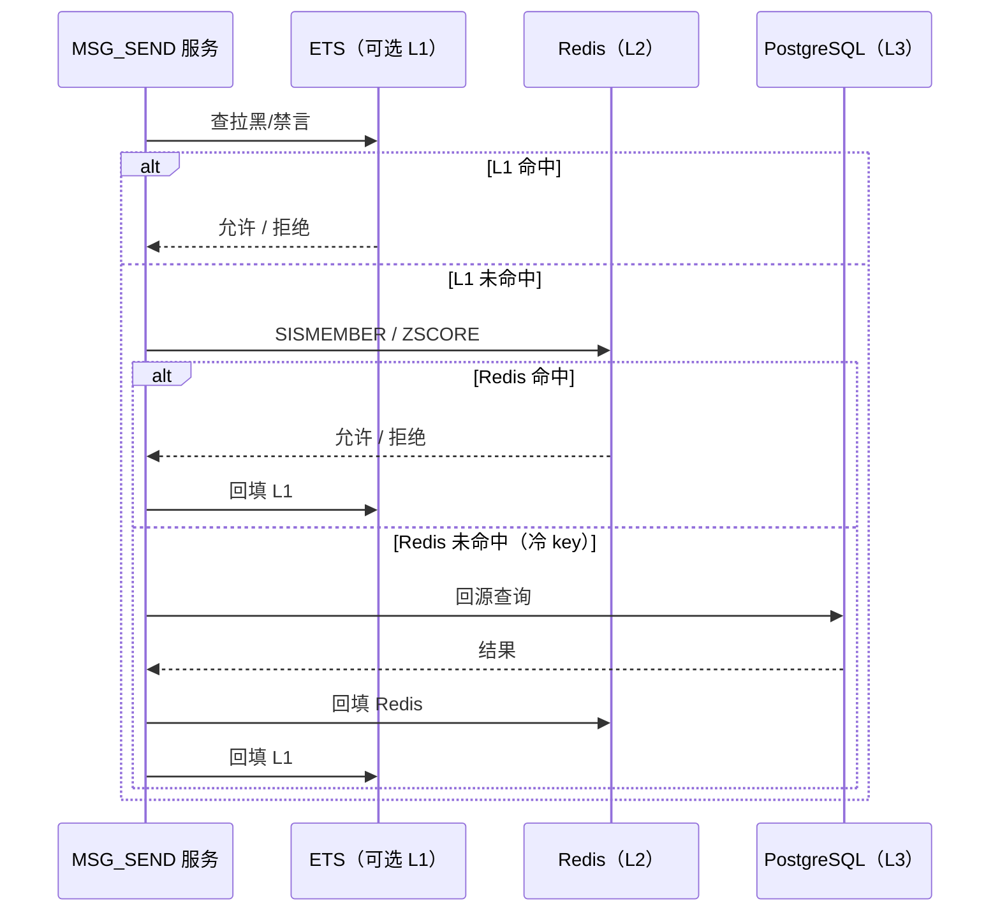
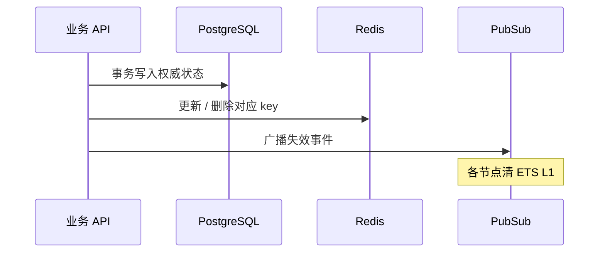

# 设计说明：权限状态热缓存（拉黑 / 禁言 / 封禁）

| 项 | 内容 |
|------|------|
| 状态 | 已确认 |
| 决策编号 | DD-033 |
| 规范定义 | 本文档 |
| 索引 | [`design-decisions.md`](../design-decisions.md) |
| 实现文档 | [implementation/elixir/permission-cache.md](../implementation/elixir/permission-cache.md) |

---

## 1. 要解决什么问题

`CMD_MSG_SEND`、群管理、登录鉴权等路径需要频繁判断：

| 场景 | 查询语义 | 数据源 |
|------|----------|--------|
| **好友拉黑** | 接收方是否拉黑了发送方 | `friendships.status = blocked` |
| **群禁言** | 成员在群内是否仍处于禁言期 | `group_members.muted_until` |
| **设备封禁** | 设备是否禁止登录/鉴权 | `user_devices.banned_at` |

这些状态变更频率低、读取频率高。若每次发消息都打 PostgreSQL，热路径延迟与 DB 压力不可接受。

**决策**：PostgreSQL 为权威源；**Redis 存精确热状态**（不使用布隆过滤器）；可选进程内短 TTL 缓存；变更时主动失效。

---

## 完整流程

### 发消息前权限检查（拉黑 + 群禁言）



### 状态变更（拉黑 / 禁言 / 封禁）



---

## 2. 分层与原则

| 层级 | 介质 | 职责 |
|------|------|------|
| **L3** | PostgreSQL | 权威、对账、冷启动回源 |
| **L2** | Redis | 精确热数据；**主路径默认只打到 L2** |
| **L1** | 进程 ETS（可选） | 极热 key 短 TTL（如 5–30s）；**必须**订阅 PubSub 失效 |

| 原则 | 说明 |
|------|------|
| **精确匹配** | 拒绝/允许均以 Redis/PG 精确结果为准；不做概率型缓存 |
| **写后更新** | 先落 PG，再更新 Redis；Redis 失败可降级回源 PG，并异步修复 |
| **跨节点一致** | 拉黑/禁言/封禁后 PubSub `im:permission:invalidate` 清各节点 L1 |
| **主路径少 IO** | `CMD_MSG_SEND` 同步路径：Redis 一次往返；禁止为权限检查打 Kafka |

---

## 3. Redis Key 设计

### 3.1 好友拉黑 — `SET`

语义：`blocked?(接收方 to, 发送方 from)` ⇔ `from ∈ SET(接收方拉黑名单)`。

| 项 | 约定 |
|------|------|
| Key | `im:block:{app_key}:{blocker_user_id}` |
| 类型 | `SET`，成员为 `blocked_user_id` |
| 读 | `SISMEMBER im:block:{app}:{to} {from}` → `1` 则拒绝（`CODE_MSG_NO_PERMISSION`） |
| 写 | 拉黑：`SADD` + PG `status=blocked`；取消拉黑：`SREM` + PG 更新 |
| 冷启动 | key 不存在时回源 PG 该用户全部拉黑列表，批量 `SADD` 后设合理 TTL（如 7d，续期由读/写刷新） |

单用户拉黑列表通常很短；`SISMEMBER` O(1)、无假阳性，优于布隆过滤器。

### 3.2 群禁言 — `ZSET`

禁言带截止时间，需比较 `muted_until > now_ms`。

| 项 | 约定 |
|------|------|
| Key | `im:mute:{app_key}:{group_id}` |
| 类型 | `ZSET`，score = `muted_until`（毫秒），member = `user_id` |
| 读 | `ZSCORE` → score 存在且 `score > now_ms` 则拒绝 |
| 写 | 禁言：`ZADD` score=截止时间；解禁：`ZREM`；到期成员可惰性删除（读时 `ZREMRANGEBYSCORE -inf now`） |
| 优化 | 发群消息已需成员态时，可与成员缓存合并一次 `HMGET` / pipeline |

### 3.3 设备封禁 — `STRING` 标记

鉴权频率低于发消息；仍用 Redis 避免每次登录查 PG。

| 项 | 约定 |
|------|------|
| Key | `im:device_ban:{app_key}:{device_id}` |
| 类型 | `STRING`，值 `1`（或 ban 元数据 JSON） |
| 读 | `GET` 存在即拒绝 `POST /api/v1/sessions` / `CMD_AUTH_REQ` |
| 写 | 封禁：PG `banned_at` + `SET`；解封：`DEL` + PG 清 `banned_at` |
| 关联 | 与 [auth.md](auth.md) §9.6 一致；封禁时同步吊销 token 缓存 |

### 3.4 内部调用方 / IP 封禁

见 [dual-channel-api.md](dual-channel-api.md) §4.4。键定义见 [database-design.md](database/database-design.md) §二.9。

| 项 | 约定 |
|------|------|
| Key（调用方） | `im:internal_caller_block:{app_key}` — `SET`，member 为 `caller_service` 名 |
| Key（IP） | `im:internal_ip_block:{app_key}` — `SET`，member 为单 IP 字符串 |
| 读 | `SISMEMBER` → 命中则 `403 caller_blocked` |
| 写 | 运维 API / 配置热更新 `SADD` / `SREM`；变更后 PubSub 通知各节点（可选 L1 失效） |
| CIDR | 复杂网段规则存 PG 或配置中心，启动时展开写入上述 SET，或请求路径回源规则表 |

与 §3.1–3.3 同一套「精确热缓存」思路，不单独引入布隆过滤器。

---

## 4. 模块边界

```text
IM.Services.Friend.check_send_permission/2
        │
        ▼
IM.Permission.BlockCache  ──► Redis SET（§3.1）

IM.Services.GroupChat.send/2（群 MSG_SEND）
        │
        ▼
IM.Permission.MuteCache   ──► Redis ZSET（§3.2）

IM.Services.Auth / DeviceBan
        │
        ▼
IM.Permission.DeviceBanCache ──► Redis STRING（§3.3）
```

实现经 `IM.Cache` Behaviour（见 [dependency-abstraction.md](dependency-abstraction.md)）；测试用内存实现。

---

## 5. 失效与对账

| 事件 | Redis | L1 ETS | PubSub |
|------|-------|--------|--------|
| 拉黑 | `SADD` | 删 `to` 相关条目 | `{:block, app, to}` |
| 取消拉黑 | `SREM` | 同上 | 同上 |
| 群禁言 | `ZADD` | 删 `group_id` 相关 | `{:mute, app, group_id}` |
| 解禁 / 到期 | `ZREM` / 惰性清理 | 同上 | 同上 |
| 设备封禁 | `SET` | 删 `device_id` | `{:device_ban, app, device_id}` |
| 解封 | `DEL` | 同上 | 同上 |
| 内部 caller/IP 封禁 | `SADD` / `SREM` | 可选 | `{:internal_block, app}` |

**对账**（可选 Oban 低频任务）：抽样比对 PG 与 Redis，修复漂移；指标 `im_permission_cache_drift_total`。

---

## 6. 可观测性

| 指标 | 说明 |
|------|------|
| `im_permission_check_total{type,result}` | `type=block\|mute\|device_ban`；`result=allow\|deny` |
| `im_permission_cache_hit_total{layer}` | `layer=l1\|l2\|pg_fallback` |
| `im_permission_check_duration_ms` | 热路径延迟 |

成功路径不打日志；拒绝打 `:info` 含 `trace_id`（见 [observability.md](observability.md)）。

---

## 7. 刻意放弃

| 放弃项 | 原因 |
|--------|------|
| 布隆过滤器 | 假阳性需二次确认；拉黑/禁言集合稀疏，Redis 精确结构足够 |
| 仅负缓存（只缓存「未拉黑」） | 拉黑后难以及时失效，误放行风险高 |
| 主路径直查 PG | 不符合百万在线发消息延迟目标 |

---

## 8. 关联文档

| 文档 | 关联 |
|------|------|
| [friend.md](friend.md) §7.2 | 单聊拉黑拦截 |
| [group.md](group.md) §5 | 群禁言与规模化 |
| [auth.md](auth.md) §9.6 | 设备封禁 |
| [message-send-ack.md](message-send-ack.md) | MSG_SEND 权限分支 |
| [database-design.md](database/database-design.md) | `friendships`、`group_members.muted_until`、`user_devices.banned_at` |
