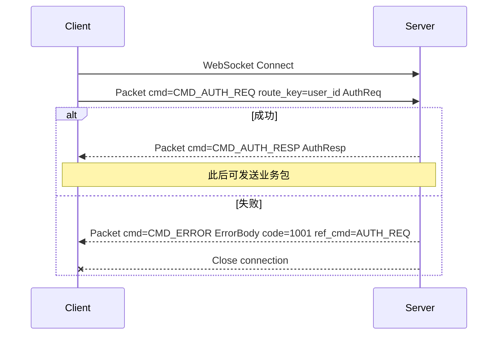
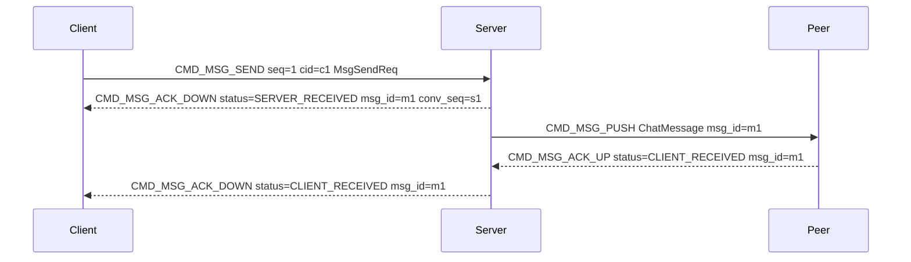
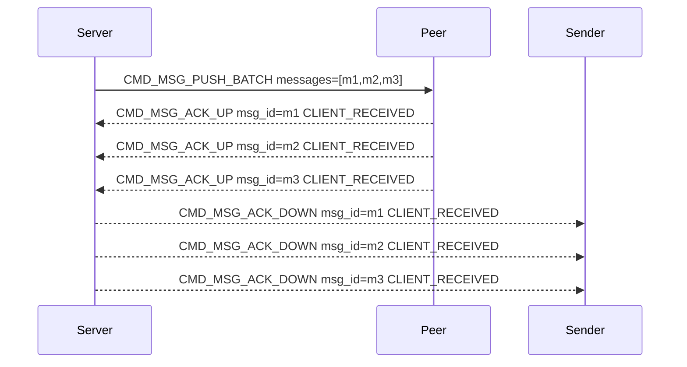

# IM 消息协议

基于 **WebSocket（二进制帧）+ Protobuf** 的即时通讯协议。

| 文档 | 职责 |
| --- | --- |
| 本文 `protocol.md` | 规范：字段约定、命令表、时序、对错行为 |
| [`system-design.md`](system-design.md) | **系统设计总览**：功能清单、架构、逐步时序说明 |
| [`design/`](../design/) | **设计意图**：为什么这样定、有什么好处（每模块独立一文） |
| [`design-decisions.md`](design-decisions.md) | 确认状态索引 |
| [`proto/`](../../../proto/) | 机器可读定义 |

> **文档约定**：每一块协议经评审确认后，必须在 `docs/design/` 下新增独立设计文档（为什么 / 好处），本文对应节只保留规范并链接过去。未确认章节仍可能调整。

## 1. 技术选型

| 项 | 选择 |
| --- | --- |
| 传输 | WebSocket Binary Frame |
| 序列化 | Protobuf 3 |
| 协议版本 | `ver = 1` |

能力范围：登录鉴权、单聊、群聊、聊天室、ACK、心跳、撤回、编辑、阅后即焚、离线拉取、透传指令。

**设计意图（已确认）**：见 [`design/transport.md`](../design/transport.md)。

## 2. 协议分层

```text
WebSocket Binary Frame
        │
        ▼
   Packet Envelope   (common.proto)
        │
        ▼
 payload by cmd      (auth / message / sync / passthrough)
```

所有业务消息均封装为统一的 `Packet`，`payload` 为对应命令的 Protobuf 序列化字节。

**设计意图（已确认）**：信封分层与 Packet 一并说明，见 [`design/packet.md`](../design/packet.md) §2。

### 2.1 服务端请求路径（Router / Dispatch）

线上协议只定义 `Packet`；服务端实现分三层路由，**勿混淆**：

| 层 | 模块 | 职责 |
| --- | --- | --- |
| **协议路由** | `IM.Protocol.Router` | 按 `cmd` 选 WS Handler；鉴权态校验；`:telemetry.span`；**无业务逻辑** |
| **应用分发** | `IM.Application.Dispatch` | `cmd` + payload + `MessageContext` → `IM.Services.*`；WS / REST / 内部入口 **唯一业务入口** |
| **投递路由** | `IM.Delivery.Router` | 按 recipients 定位在线设备、编码下行 `Packet`、离线 enqueue；**不负责业务校验** |

```text
WS:  Codec → Protocol.Router → Commands.*（薄）→ Dispatch → Services.*
REST: Controller（薄）────────────────────────→ Dispatch → Services.*
发消息扇出: Services.* → Delivery.Router → ConnectionManager / im.push
```

详见 [`design/modular-architecture.md`](../design/modular-architecture.md) §1.3、[dual-channel-api.md](../design/dual-channel-api.md) §4。

## 3. 通用封包 Packet

### Packet 字段

| 字段 | 说明 |
| --- | --- |
| `ver` | 协议版本，当前 = 1；不匹配返回 `CODE_PROTO_VERSION_UNSUPPORTED` |
| `cmd` | 命令字，见 CmdType 枚举；决定 payload 如何解析 |
| `seq` | 客户端单调递增请求序号；用于请求-响应匹配；推送包 = 0 |
| `ts` | 发送时间戳（ms）；用于排障与粗测 RTT；不用于消息排序 |
| `cid` | 请求级幂等 ID（网关层去重）；与 `ChatMessage.client_msg_id`（消息级幂等）职责分离 |
| `trace_id` | 链路追踪 ID；标识**一次根操作**的因果链；见下文「`trace_id`」 |
| `payload` | 业务体；由 `cmd` 决定具体 message 类型；可能经压缩 |
| `route_key` | 网关分流键；单聊建议填对端 user_id，群填 group_id，聊天室填 room_id |
| `compression` | `Packet.payload` 压缩算法；`UNSPECIFIED` 继承会话 `AuthResp.payload_compression`；`CMD_AUTH_*` 必须为 `NONE`。见 [payload-compression.md](../design/payload-compression.md) |

### 约定

| 方向 | `seq` | `cid` | `trace_id` | `route_key` | 失败如何表达 |
| --- | --- | --- | --- | --- | --- |
| 客户端 → 服务端 | 必填，单调递增 | 幂等写操作必填 | 建议填写；**空则服务端生成根 trace** | 建议按目标填写 | — |
| 服务端 → 客户端（成功响应） | 回传请求的 `seq` | 可回传 | **必须**继承触发请求的 `trace_id` | 可透传/回填 | 不使用错误码字段 |
| 服务端 → 客户端（失败） | 回传请求的 `seq` | 可回传 `ref_cid` | **必须**继承触发请求的 `trace_id` | 可选 | **一律** `CMD_ERROR` + `ErrorBody` |
| 服务端 → 客户端（推送） | `0` | 可选 | **必须**继承因果上游的 `trace_id` | 可为接收方/会话键 | 业务失败一般不推错误包 |
| 客户端 → 服务端（`ACK_UP` 等） | 必填 | — | **应**继承所响应 PUSH/ACK 的 `trace_id` | 可选 | — |

- 成功响应：`cmd` 为对应业务 RESP/ACK 等，`payload` 仅为业务体，**信封与业务体均不带 `code`**
- 失败响应：`cmd = CMD_ERROR`，`payload = ErrorBody`（含 `code` / `msg` / `ref_cmd`）
- `ver` 不匹配时返回 `CMD_ERROR` + `CODE_PROTO_VERSION_UNSUPPORTED`（1003）
- 推送包用业务 ID（如 `msg_id`）标识，不用 `seq` 做匹配

### `route_key`（网关分流）

供接入网关 / 内部 RPC 做一致性哈希与分流，**不替代业务字段**（如 `ChatMessage.to`）。

| 场景 | 建议填写 |
| --- | --- |
| 单聊发送 / 撤回 / 透传 | 对端 `user_id` 或会话 ID |
| 群聊 | `group_id` |
| 聊天室 | `room_id` |
| 鉴权 | `user_id`（可选） |
| 心跳 / 纯连接类 | 可空 |

### `trace_id`（链路追踪）

用于跨服务追踪**同一次根操作**衍生的完整因果链（请求 → ACK → 扇出 PUSH → 存储 / Kafka / 日志）。

**根 trace**（仅在此处可新生成）：

| 入口 | 规则 |
| --- | --- |
| WebSocket 入站 | 客户端建议填写 `Packet.trace_id`；**为空则服务端生成** |
| HTTP 入站 | 客户端**必须** `X-Trace-Id`（见 [dual-channel-api.md](../dual-channel-api.md) §4.2） |
| 定时任务 / 无上游 | 服务端生成 |

**继承 trace**（**禁止**在衍生路径 `generate_trace_id()`）：

| 衍生产物 | 规则 |
| --- | --- |
| 同步响应（`ACK_DOWN`、`*_RESP`、`CMD_ERROR`） | **必须**与触发包相同 `trace_id` |
| 因果下行 PUSH（`MSG_PUSH`、`RECALL_PUSH`、`EDIT_PUSH`、`BURN_PUSH`、群/室成员变更 PUSH 等） | **必须**继承上游 `MessageContext.trace_id`（群扇出 N 路仍为同一 trace） |
| Kafka 旁路事件 | **必须**继承（见 [kafka-event-bus.md](../kafka-event-bus.md)） |
| 服务端日志 / 审计 | **必须**使用当前 context 的 `trace_id` |
| 内部 HTTP 下游调用 | **必须**带同一 `X-Trace-Id` |

**新 trace**（与上游无因果关系）：

- 客户端发起的**下一次**独立请求（新的 SEND、新的 HTTP 调用）
- 与业务无关的心跳（可不填 / 不关联业务 trace）
- `OFFLINE_PULL` 等拉取：每次请求使用**本次**客户端提供的 trace（HTTP 必填；WS 建议每轮拉取新 trace）

客户端收到 PUSH 后上报 `ACK_UP` 时，**应**填写该 PUSH 的 `Packet.trace_id`，便于把「投递确认」接回同一条链。

详见 [message-context.md](../message-context.md) §7.3–§7.4。

### 请求超时机制

所有客户端发起的请求-响应式命令（非推送），必须设置超时时间。

**约定**：

| 项目 | 说明 |
|------|------|
| 默认超时 | **5 秒**（客户端可按命令类型调整） |
| 超时判定 | 发送请求后，在超时时间内未收到 `seq` 匹配的响应 |
| 超时行为 | 视为请求失败，清理等待队列，触发失败回调 |
| 晚到响应 | 超时后收到的响应，**直接忽略**（不处理、不回调） |

**实现要点**：

1. 客户端维护 `seq → (cmd, send_time, callback)` 的等待队列
2. 每个请求启动定时器，超时自动清理
3. 收到响应时，先检查 `seq` 是否在等待队列中
   - 存在：处理响应，清理队列项，取消定时器
   - 不存在：直接忽略（已超时或重复响应）

**超时时间建议**：

| 命令类型 | 建议超时 | 说明 |
|---------|---------|------|
| 鉴权 `CMD_AUTH_REQ` | 10 秒 | 首包，网络可能未稳定 |
| 心跳 `CMD_HEARTBEAT_REQ` | = `heartbeat_interval_sec` | 与心跳间隔一致 |
| 发消息 `CMD_MSG_SEND` | 5 秒 | 默认值 |
| 离线拉取 `CMD_OFFLINE_PULL_REQ` | 10 秒 | 可能数据量大 |
| 群组/聊天室操作 | 5 秒 | 默认值 |
| 透传 `CMD_PASSTHROUGH` | 无需等待 | 无响应 |

**本块状态：已确认。**
**设计意图（为什么 / 好处 / 放弃了什么）**：见 [`design/packet.md`](../design/packet.md)。

网关只依赖信封上的 `route_key` 选后端，避免为了路由而反序列化整包 `payload`。

## 4. 命令字 CmdType

**本块状态：已确认。**  
**设计意图**：见 [`design/cmd-type.md`](../design/cmd-type.md)。

| 区间 | 用途 |
| --- | --- |
| 1–99 | 连接与会话 |
| 100–199 | 消息收发 |
| 200–299 | ACK / 已读 |
| 300–399 | 离线与同步 |
| 400–499 | 撤回 / 编辑 / 阅后即焚 |
| 500–599 | 透传 |
| 600–699 | 群组管理 |
| 700–799 | 聊天室管理 |
| 800–822 | 好友管理 |
| 900–906 | 应用通道（App Channel） |
| 1000+ | 预留扩展 |

| 命令 | 值 | Payload | 说明 |
| --- | --- | --- | --- |
| `CMD_AUTH_REQ` | 1 | `AuthReq` | 鉴权请求 |
| `CMD_AUTH_RESP` | 2 | `AuthResp` | 鉴权**成功**响应 |
| `CMD_HEARTBEAT_REQ` | 3 | `HeartbeatReq` | 心跳请求 |
| `CMD_HEARTBEAT_RESP` | 4 | `HeartbeatResp` | 心跳响应 |
| `CMD_KICK` | 5 | `KickNotify` | 被踢下线通知 |
| `CMD_ERROR` | 6 | `ErrorBody` | **统一失败响应** |
| `CMD_MSG_SEND` | 100 | `MsgSendReq` | 发送消息 |
| `CMD_MSG_PUSH` | 101 | `ChatMessage` | 服务端推送单条消息；seq = 0 |
| `CMD_MSG_PUSH_BATCH` | 102 | `MsgPushBatch` | 服务端批量推送消息；seq = 0 |
| `CMD_MSG_ACK_UP` | 200 | `MsgAck` | 客户端上报 ACK |
| `CMD_MSG_ACK_DOWN` | 201 | `MsgAck` | 服务端下发 ACK |
| `CMD_MSG_READ` | 202 | `MsgRead` | 已读回执 |
| `CMD_MSG_ACK_BATCH_UP` | 203 | `MsgAckBatchUp` | 客户端批量上报 ACK |
| `CMD_MSG_ACK_BATCH_DOWN` | 204 | `MsgAckBatchDown` | 服务端批量下发 ACK |
| `CMD_OFFLINE_PULL_REQ` | 300 | `OfflinePullReq` | 离线拉取请求 |
| `CMD_OFFLINE_PULL_RESP` | 301 | `OfflinePullResp` | 离线拉取响应 |
| `CMD_MSG_RECALL_REQ` | 400 | `MsgRecall` | 撤回请求 |
| `CMD_MSG_RECALL_PUSH` | 401 | `MsgRecall` | 撤回推送/成功确认 |
| `CMD_MSG_EDIT_REQ` | 402 | `MsgEdit` | 编辑请求 |
| `CMD_MSG_EDIT_PUSH` | 403 | `MsgEdit` | 编辑推送/成功确认 |
| `CMD_MSG_BURN_PUSH` | 404 | `MsgBurn` | 阅后即焚销毁通知（仅下行） |
| `CMD_PASSTHROUGH` | 500 | `Passthrough` | 透传指令；上行/下行共用 |
| `CMD_GROUP_CREATE_REQ` | 600 | `GroupCreateReq` | 创建群 |
| `CMD_GROUP_CREATE_RESP` | 601 | `GroupCreateResp` | 创建群响应 |
| `CMD_GROUP_DISMISS_REQ` | 602 | `GroupOperateReq` | 解散群 |
| `CMD_GROUP_DISMISS_PUSH` | 603 | `GroupOperatePush` | 解散群通知 |
| `CMD_GROUP_JOIN_REQ` | 604 | `GroupOperateReq` | 加入群 |
| `CMD_GROUP_JOIN_PUSH` | 605 | `GroupMemberPush` | 加入群通知 |
| `CMD_GROUP_LEAVE_REQ` | 606 | `GroupOperateReq` | 退群 |
| `CMD_GROUP_LEAVE_PUSH` | 607 | `GroupMemberPush` | 退群通知 |
| `CMD_GROUP_KICK_REQ` | 608 | `GroupKickReq` | 踢人 |
| `CMD_GROUP_KICK_PUSH` | 609 | `GroupMemberPush` | 踢人通知 |
| `CMD_GROUP_INVITE_REQ` | 610 | `GroupInviteReq` | 邀请入群 |
| `CMD_GROUP_INVITE_PUSH` | 611 | `GroupMemberPush` | 邀请入群通知 |
| `CMD_GROUP_SET_ADMIN_REQ` | 612 | `GroupAdminReq` | 设置管理员 |
| `CMD_GROUP_SET_ADMIN_PUSH` | 613 | `GroupAdminPush` | 设置管理员通知 |
| `CMD_GROUP_REMOVE_ADMIN_REQ` | 614 | `GroupAdminReq` | 移除管理员 |
| `CMD_GROUP_REMOVE_ADMIN_PUSH` | 615 | `GroupAdminPush` | 移除管理员通知 |
| `CMD_GROUP_TRANSFER_REQ` | 616 | `GroupTransferReq` | 转让群主 |
| `CMD_GROUP_TRANSFER_PUSH` | 617 | `GroupTransferPush` | 转让群主通知 |
| `CMD_GROUP_UPDATE_REQ` | 618 | `GroupUpdateReq` | 更新群信息 |
| `CMD_GROUP_UPDATE_PUSH` | 619 | `GroupUpdatePush` | 更新群信息通知 |
| `CMD_ROOM_CREATE_REQ` | 700 | `RoomCreateReq` | 创建聊天室 |
| `CMD_ROOM_CREATE_RESP` | 701 | `RoomCreateResp` | 创建聊天室响应 |
| `CMD_ROOM_DISMISS_REQ` | 702 | `RoomOperateReq` | 解散聊天室 |
| `CMD_ROOM_DISMISS_PUSH` | 703 | `RoomOperatePush` | 解散聊天室通知 |
| `CMD_ROOM_JOIN_REQ` | 704 | `RoomOperateReq` | 加入聊天室 |
| `CMD_ROOM_JOIN_PUSH` | 705 | `RoomMemberPush` | 加入聊天室通知 |
| `CMD_ROOM_LEAVE_REQ` | 706 | `RoomOperateReq` | 离开聊天室 |
| `CMD_ROOM_LEAVE_PUSH` | 707 | `RoomMemberPush` | 离开聊天室通知 |
| `CMD_ROOM_KICK_REQ` | 708 | `RoomKickReq` | 踢出聊天室 |
| `CMD_ROOM_KICK_PUSH` | 709 | `RoomMemberPush` | 踢出聊天室通知 |
| `CMD_ROOM_UPDATE_REQ` | 710 | `RoomUpdateReq` | 更新聊天室信息 |
| `CMD_ROOM_UPDATE_PUSH` | 711 | `RoomUpdatePush` | 更新聊天室信息通知 |
| `CMD_FRIEND_ADD_REQ` | 800 | `FriendAddReq` | 添加好友请求 |
| `CMD_FRIEND_ADD_RESP` | 801 | `FriendAddResp` | 添加好友响应 |
| `CMD_FRIEND_REQUEST_PUSH` | 802 | `FriendRequestNotify` | 好友请求通知 |
| `CMD_FRIEND_ACCEPT_REQ` | 803 | `FriendAcceptReq` | 接受好友请求 |
| `CMD_FRIEND_ACCEPT_RESP` | 804 | `FriendAcceptResp` | 接受好友响应 |
| `CMD_FRIEND_ACCEPT_PUSH` | 805 | `FriendAcceptNotify` | 好友请求被接受通知 |
| `CMD_FRIEND_REJECT_REQ` | 806 | `FriendRejectReq` | 拒绝好友请求 |
| `CMD_FRIEND_REJECT_RESP` | 807 | `FriendRejectResp` | 拒绝好友响应 |
| `CMD_FRIEND_REJECT_PUSH` | 808 | `FriendRejectNotify` | 好友请求被拒绝通知 |
| `CMD_FRIEND_DELETE_REQ` | 809 | `FriendDeleteReq` | 删除好友 |
| `CMD_FRIEND_DELETE_RESP` | 810 | `FriendDeleteResp` | 删除好友响应 |
| `CMD_FRIEND_DELETE_PUSH` | 811 | `FriendDeleteNotify` | 被删除好友通知 |
| `CMD_FRIEND_BLOCK_REQ` | 812 | `FriendBlockReq` | 拉黑用户 |
| `CMD_FRIEND_BLOCK_RESP` | 813 | `FriendBlockResp` | 拉黑响应 |
| `CMD_FRIEND_BLOCK_PUSH` | 814 | `FriendBlockNotify` | 被拉黑通知 |
| `CMD_FRIEND_UNBLOCK_REQ` | 815 | `FriendUnblockReq` | 取消拉黑 |
| `CMD_FRIEND_UNBLOCK_RESP` | 816 | `FriendUnblockResp` | 取消拉黑响应 |
| `CMD_FRIEND_SET_REMARK_REQ` | 817 | `FriendSetRemarkReq` | 设置好友备注 |
| `CMD_FRIEND_SET_REMARK_RESP` | 818 | `FriendSetRemarkResp` | 设置备注响应 |
| `CMD_FRIEND_LIST_REQ` | 819 | `FriendListReq` | 获取好友列表 |
| `CMD_FRIEND_LIST_RESP` | 820 | `FriendListResp` | 好友列表响应 |
| `CMD_FRIEND_REQUEST_LIST_REQ` | 821 | `FriendRequestListReq` | 获取好友请求列表 |
| `CMD_FRIEND_REQUEST_LIST_RESP` | 822 | `FriendRequestListResp` | 好友请求列表响应 |
| `CMD_CHANNEL_SUBSCRIBE_REQ` | 900 | `ChannelSubscribeReq` | 订阅应用通道 |
| `CMD_CHANNEL_SUBSCRIBE_RESP` | 901 | `ChannelSubscribeResp` | 订阅响应 |
| `CMD_CHANNEL_UNSUBSCRIBE_REQ` | 902 | `ChannelUnsubscribeReq` | 取消订阅 |
| `CMD_CHANNEL_UNSUBSCRIBE_RESP` | 903 | `ChannelUnsubscribeResp` | 取消订阅响应 |
| `CMD_CHANNEL_PUBLISH` | 904 | `ChannelPublish` | 客户端上行 |
| `CMD_CHANNEL_PUBLISH_ACK` | 905 | `ChannelPublishAck` | 上行受理确认 |
| `CMD_CHANNEL_PUSH` | 906 | `ChannelPush` | 服务端下行广播；seq = 0 |

## 5. 连接与鉴权

**本块状态：已确认。**  
**设计意图**：见 [`design/auth.md`](../design/auth.md)。



### AuthReq 字段

| 字段 | 必填 | 说明 |
| --- | --- | --- |
| `app_key` | 是 | 应用标识，多租户隔离 |
| `user_id` | 是 | 业务用户 ID，与 token 交叉校验 |
| `token` | 是 | 短期 token（REST 登录获取），不进 URL |
| `device_id` | 是 | 设备唯一标识，多端与互踢 |
| `platform` | 是 | 客户端平台：`ios` / `android` / `web` / `desktop` |
| `sdk_ver` | 是 | SDK 版本，兼容与灰度 |
| `compression_offered` | 否 | 支持的 `Packet.payload` 压缩算法，**优先级从高到低**；须含 `NONE` 兜底；空=仅 `NONE`。见 [payload-compression.md](../design/payload-compression.md) |

### AuthResp 字段

与 [`proto/auth.proto`](../../../proto/auth.proto) `AuthResp` 一致。

| 字段 | 说明 |
| --- | --- |
| `device` | `DeviceResource`；鉴权成功后回传设备信息（见下表） |
| `server_time` | 服务端时间 ms |
| `heartbeat_interval_sec` | 心跳间隔，建议默认 **30** |
| `user_id` | 以服务端校验结果为准 |
| `push_batch_max` | 批量下行单包消息上限，默认 **50**，服务端可配置 |
| `recall_window_sec` | 撤回时间窗秒数，默认 **120**，服务端可配置 |
| `edit_window_sec` | 编辑时间窗秒数，默认 **120**，服务端可配置（独立于撤回） |
| `offline_pull_limit` | 离线拉取单页条数，默认 **50**，硬上限 **200** |
| `clear_local_data` | 是否清除 SDK 本地 IM 数据；见 [auth.md](../design/auth.md) §9.8；默认 `false` |
| `payload_compression` | 本会话 `Packet.payload` 压缩算法；`NONE` / `GZIP` / `LZ4`；**v1 固定 `NONE`**。见 [payload-compression.md](../design/payload-compression.md) |
| `burn_after_read_enabled` | 是否允许发阅后即焚消息；默认 **true**；见 [burn-after-read.md](../design/burn-after-read.md) |
| `burn_ttl_sec_default` | 阅后即焚默认读后延迟（秒）；默认 **0**（立即销毁） |
| `burn_ttl_sec_max` | 单条 `burn_ttl_sec` 上限；默认 **3600** |

**`device`（`DeviceResource`）常用字段**：

| 字段 | 说明 |
| --- | --- |
| `device_id` | 与 `AuthReq.device_id` 一致 |
| `session_id` | 本次长连接会话 ID（**服务端生成**） |
| `platform` | 与 `AuthReq.platform` 一致 |
| `sdk_ver` | 与 `AuthReq.sdk_ver` 一致 |
| `client_ip` | 服务端检测的客户端 IP |
| `connected_at` | 连接建立时间 ms（服务端生成） |
| `os` / `device_name` / `device_model` / `network` | 来自 `AuthReq` 的可选字段，原样回传 |

### 规则

1. WebSocket 建连后，**首包必须是** `CMD_AUTH_REQ`；`Packet.route_key` 建议填 `user_id`
2. **未鉴权超时 10s**（服务端可配置）：超时未收到合法 `AUTH_REQ` 则断开
3. 鉴权成功前发送其他业务包，服务端**直接断开**（可不发 `CMD_ERROR`）
4. 鉴权失败：`CMD_ERROR`（通常 `CODE_UNAUTHORIZED`），**随后必须关闭连接**；不使用 `CMD_AUTH_RESP` 表达失败
5. **`authenticated` 后禁止再次 `CMD_AUTH_REQ`**；收到则 `CMD_ERROR`（`code=1001`，`ref_cmd=AUTH_REQ`）后关闭；须**新 WebSocket 连接**再鉴权
6. `AuthResp` 成功后，客户端再发 `OFFLINE_PULL_REQ` 等业务包
7. 同一 `user_id` 多 `device_id` 可同时在线；互踢由服务端策略决定，通过 `CMD_KICK` 通知（如 `reason=duplicate_login`）
8. **按平台限制在线设备数**：`(app_key, user_id, platform)` 下同时在线的 `device_id` 不超过租户配置上限；超限见 [§5.1](#51-按平台在线设备数限制)
9. token 过期：服务端发 `CMD_KICK`（`reason=token_expired`），客户端重连并重新 `AUTH_REQ`；**本期不做**连接内 `AUTH_REFRESH`
10. `push_token` 等设备推送注册信息走 REST，不在 `AuthReq` 中传递
11. **payload 压缩**：`AuthReq.compression_offered` 与 `AuthResp.payload_compression` 协商；`CMD_AUTH_*` 包体不压缩。见 [payload-compression.md](../design/payload-compression.md)

### 5.1 按平台在线设备数限制

**设计意图**：见 [`design/auth.md`](../design/auth.md) §8。

| 项 | 约定 |
| --- | --- |
| 统计范围 | **在线**连接（Tracker/Registry），按 `AuthReq.platform` 分组 |
| 配置 | `app_configs`：`device.max_devices_per_platform`（json）、`device.device_limit_policy` |
| 同 `device_id` 重连 | 先 `duplicate_login` 踢旧连接，**不计入**新增名额 |
| 超限 `reject` | `CMD_ERROR` `code=1004`（`CODE_DEVICE_LIMIT_EXCEEDED`），`ref_cmd=CMD_AUTH_REQ`，关连接 |
| 超限 `kick_oldest_on_platform` | 向该平台最旧在线设备发 `CMD_KICK`（`reason=device_limit`），新设备 `AUTH_RESP` 成功 |

默认每平台上限（可被租户覆盖）：`ios=2`，`android=2`，`web=5`，`desktop=3`，其他平台 `default=5`。

### KickNotify（CMD_KICK）

| 字段 | 说明 |
| --- | --- |
| `reason_code` | **权威**枚举 `KickReason`（`DUPLICATE_LOGIN` / `DEVICE_LIMIT` / `DEVICE_BANNED` / `ADMIN_KICK` / `TOKEN_EXPIRED`）；服务端必填 |
| `reason` | 兼容短字符串（与 `reason_code` 同义）；新客户端以 `reason_code` 为准 |
| `kicker` | 可选；`DEVICE_LIMIT` / `DUPLICATE_LOGIN` 时填触发方 `DeviceResource` |
| `timestamp` | 踢人时间 ms |
| `clear_local_data` | 为 `true` 时 SDK **须清除本地 IM 数据**（消息、会话缓存等）；见 auth.md §9.8 |

## 6. 心跳

**本块状态：已确认。**  
**设计意图**：见 [`design/heartbeat.md`](../design/heartbeat.md)。

命令：`CMD_HEARTBEAT_REQ(3)` / `CMD_HEARTBEAT_RESP(4)`。仅在 **鉴权成功后** 发送；未鉴权阶段不发心跳。

### 参数（默认）

| 参数 | 默认值 | 说明 |
| --- | --- | --- |
| `heartbeat_interval_sec` | **30** | 由 `AuthResp` 下发；客户端发包周期 |
| 单次等待 RESP 超时 | **= interval** | 发 REQ 后在此时间内应收 RESP |
| 客户端重连阈值 N | **3** | 连续 N 次无 RESP 则重连 |
| 服务端空闲超时 | **90** | 建议 `3 × interval`；无心跳且无业务则断开 |

### 流程

1. 客户端按 `heartbeat_interval_sec` 发送 `CMD_HEARTBEAT_REQ`（`HeartbeatReq`，可带 `client_time`）
2. 服务端回 `CMD_HEARTBEAT_RESP`（`HeartbeatResp.server_time`）
3. 客户端连续 **3 次** 无 RESP → 判定断线，**重连**（重新 `AUTH_REQ`）
4. 服务端：已鉴权连接在 **90s** 内既无心跳也无任何业务包 → **静默断开**（不发 `CMD_ERROR`）
5. **任意业务包**（发消息、ACK、离线拉取等）均视为活跃，**重置**心跳计时；本周期可省略心跳 REQ

### HeartbeatReq / HeartbeatResp

| 消息 | 字段 | 说明 |
| --- | --- | --- |
| `HeartbeatReq` | `client_time` | 可选，客户端时间 ms，用于 RTT / 对时 |
| `HeartbeatResp` | `server_time` | 服务端时间 ms |

## 7. 消息模型

**本块状态：已确认。**  
**设计意图**：见 [`design/message-model.md`](../design/message-model.md)。

### 会话类型 ChatType

| 值 | 含义 | 持久化 | 离线拉取 | 撤回 / 编辑 / 阅后即焚 | 双阶段 ACK |
| --- | --- | --- | --- | --- | --- |
| `CHAT_PRIVATE` (1) | 单聊 | 是 | 是 | 是 / 是 / **是（单聊）** | 两档均必达 |
| `CHAT_GROUP` (2) | 群聊 | 是 | 是 | 是 / 是 / **否（v1）** | 两档均必达 |
| `CHAT_ROOM` (3) | 聊天室 | 默认否（短时缓存，TTL 默认 300s） | 否 | 视策略 / 视策略 / **否** | 仅 `SERVER_RECEIVED` 必达 |

### conv_id（会话 ID）

发送时客户端**应填**；服务端在 PUSH / ACK 中回填。与 `OfflinePullReq.conv_id` 使用同一标识。

| chat_type | 格式 | 说明 |
| --- | --- | --- |
| `CHAT_PRIVATE` | `p:{uid_lo}:{uid_hi}` | 双方 uid 按字典序，`lo ≤ hi` |
| `CHAT_GROUP` | `g:{group_id}` | 群 ID |
| `CHAT_ROOM` | `r:{room_id}` | 聊天室 ID |

**服务端校验**：根据 `chat_type` + `from` + `to` 计算期望 `conv_id`；客户端未填则回填，不一致则 `CODE_MSG_INVALID`（2001）。详见 [`design/message-model.md`](../design/message-model.md)。

### ChatMessage 字段

| 字段 | 说明 |
| --- | --- |
| `msg_id` | 服务端生成，全局唯一 |
| `client_msg_id` | 客户端生成，去重与 ACK 关联 |
| `chat_type` / `from` / `to` | 单聊 `to`=对端 uid；群 `to`=group_id；房间 `to`=room_id |
| `conv_id` | 会话稳定 ID，见上表 |
| `target_users` | 定向用户列表；仅群聊/聊天室有效；非空时仅向指定用户推送 |
| `recalled` | 是否已撤回；`true` 时展示撤回样式，`content` 可忽略 |
| `edit_version` | 编辑版本，`0`=未编辑，`≥1`=已编辑 |
| `burn_after_read` | 阅后即焚标志（发送时设置）；v1 **仅单聊** |
| `burn_ttl_sec` | 对端已读后延迟销毁秒数；`0`=立即；上限见 `AuthResp.burn_ttl_sec_max` |
| `burned` | 是否已销毁；`true` 时 `content` 为空，展示「阅后即焚」占位 |
| `inbox_seq` | 用户收件箱单调位点；全量离线拉取游标 |
| `msg_type` + `content` | `content` 为 bytes，按 `msg_type` 解析 |
| `server_time` | 服务端时间 ms；仅用于展示与排障，不用于排序（排序用 conv_seq） |
| `conv_seq` | 会话内单调位点；排序与离线游标（服务端分配） |
| `priority` | 投递优先级，**不影响**展示顺序 |
| `ext` | 扩展 KV |

媒体消息只传元数据（URL 等）；文件经 HTTP 上传。

### 定向消息（target_users）

群聊和聊天室支持定向消息，仅向指定用户推送。

| 项目 | 说明 |
| --- | --- |
| **适用范围** | 仅 `CHAT_GROUP` / `CHAT_ROOM`；单聊忽略此字段 |
| **发送时** | 设置 `target_users` 列表（user_id 数组） |
| **推送行为** | 仅向 `target_users` 中**在线**用户推送；其他成员不收实时 PUSH |
| **发送方其他设备** | **始终**向发送方除发起 SEND 设备外的其他在线设备 PUSH（见 [§13](#13-多端同步)） |
| **历史消息** | 写入 `message_bodies`（记录 `target_users`）；**仅** `target_users` + 发送方可经离线拉取 / REST 看到 |
| **ACK 语义** | 首个在线 **`target_users` 成员** `ACK_UP` 后通知发送方 `CLIENT_RECEIVED` |

**典型场景**：
- `@提醒`：群内 @ 特定用户，仅被 @ 者收到强提醒
- `定向通知`：仅管理员可见的系统消息
- `敏感消息`：特定人员可见的机密内容

**存储与可见性**（v1 唯一策略，与 [group.md](../group.md) §6.1 / [offline-pull.md](../offline-pull.md) 一致）：

| 项目 | 行为 |
| --- | --- |
| 正文存储 | 写一条 `message_bodies`（含 `target_users`） |
| inbox 写扩散 | **只写** `target_users` ∪ {发送方} 的 `user_inbox`，不全员扩散（5000 人群 @3 人只写约 4 行） |
| 离线拉取 | 非目标成员 inbox 中无此行，自然拉不到；读扩散群见下 |
| REST / 历史查询 | **仅** `target_users` ∪ {发送方} 可见；查询侧须按 `target_users` 过滤 |
| 读扩散群 | 无 inbox 行；按 `conv_seq` 拉 `message_bodies` 时 SQL 过滤非目标用户 |
| 聊天室 | 定向消息不进 `OFFLINE_PULL`；短时缓存可选记录 `target_users` |
| 需要全员可见 | **不要**设 `target_users`（发普通群消息） |

### 消息优先级 MsgPriority

| 值 | 含义 | 服务端建议行为 |
| --- | --- | --- |
| `MSG_PRIORITY_NORMAL` (0) | 默认 | 正常投递与提醒 |
| `MSG_PRIORITY_HIGH` (1) | 高优先 | 出站队列优先；批量下行靠前 |
| `MSG_PRIORITY_LOW` (2) | 低优先 | 可延迟合并；可不强提醒 |

约定：

1. `priority` **不改变**会话内展示顺序；展示与离线游标仍以 `conv_seq` / `server_time` 为准
2. 每条设备长连接的 WebSocket **出站队列**按 `priority` 调度：**加权公平（WFQ）+ 老化提升**，避免低优先消息饿死（见 [message-send-ack.md](../design/message-send-ack.md) §7）
3. `CMD_MSG_PUSH_BATCH` 包内顺序仍为 HIGH→NORMAL→LOW，同级 `conv_seq` 升序

### 消息类型 MsgType

`MSG_TEXT` / `MSG_IMAGE` / `MSG_AUDIO` / `MSG_VIDEO` / `MSG_FILE` / `MSG_LOCATION` / `MSG_CUSTOM` — 本期够用；扩展可用 `MSG_CUSTOM` 或后续新增枚举值。

`ChatMessage.content` 按 `msg_type` 解析为对应 `*Content` message。

## 8. 发消息与 ACK

**本块状态：已确认。**  
**设计意图**：见 [`design/message-send-ack.md`](../design/message-send-ack.md)。

### 发送 CMD_MSG_SEND

1. 客户端填 `chat_type` / `from` / `to` / `conv_id` / `msg_type` / `content` 等；`Packet.cid` 与 `client_msg_id` **同时用于幂等**
2. `msg_id` / `server_time` / `conv_seq` 由服务端分配并回填
3. 成功：先 `ACK_DOWN(SERVER_RECEIVED)` 给**发送设备**，再向接收方（及发送方**其他设备**）`PUSH`；**发送设备不收**自身 PUSH
4. 失败：`CMD_ERROR`，**不关闭连接**

### SEND 与 ACK_DOWN 的 `seq` 约定

`CMD_MSG_SEND` **无独立 RESP**；成功由 `CMD_MSG_ACK_DOWN` 表达（见 [message-send-ack.md](../message-send-ack.md)）。

| 场景 | `cmd` | `Packet.seq` | 说明 |
| --- | --- | --- | --- |
| SEND 成功第 1 档 | `CMD_MSG_ACK_DOWN` | **回传 SEND 的 `seq`** | 等同 SEND 成功响应；`status=SERVER_RECEIVED` |
| SEND 幂等重试 | `CMD_MSG_ACK_DOWN` | **回传本次 SEND 的 `seq`** | 返回已有 `msg_id` / `conv_seq`；不重复 PUSH 对端 |
| 第 2 档送达 | `CMD_MSG_ACK_DOWN` | **`0`** | 接收方 `ACK_UP` 后推送；`status=CLIENT_RECEIVED` |
| 批量送达通知 | `CMD_MSG_ACK_BATCH_DOWN` | **`0`** | 推送包 |

**多租户隔离**：`from` 和 `to` 必须在同一个 `app_key` 下。服务端从连接上下文获取 `app_key`，校验 `from` 等于连接 `user_id`，校验 `to` 存在于当前 `app_key` 下。跨 App 发消息返回 `CODE_MSG_NO_PERMISSION`（2002）。

**幂等**：`(app_key, from, client_msg_id)` 为业务主键，优先于 `Packet.cid`；重复 SEND 不重复 PUSH。详见 [`design/message-send-ack.md`](../design/message-send-ack.md) §4.1。



### 群聊 CLIENT_RECEIVED

任一**在线成员**首次 `ACK_UP` 后，向发送方推送**一条** `ACK_DOWN(CLIENT_RECEIVED)`；不等全员。离线成员上线走离线拉取，不补历史送达回执。

**全员离线**：发送方可能长期仅收 `SERVER_RECEIVED`；直至任一成员上线并 `ACK_UP` 才推第二档；若始终无人上线则停在第一档（产品预期）。

### 批量下行

| 命令 | Payload | 适用场景 |
| --- | --- | --- |
| `CMD_MSG_PUSH` | 单条 `ChatMessage` | 常态低延迟推送 |
| `CMD_MSG_PUSH_BATCH` | `MsgPushBatch` | 重连积压、群高峰合并下发 |

#### MsgPushBatch 字段

| 字段 | 说明 |
| --- | --- |
| `messages` | `ChatMessage` 列表；按 priority HIGH→NORMAL→LOW，同级 conv_seq 升序 |

约定：

1. `CMD_MSG_PUSH_BATCH` 为服务端 → 客户端推送，`Packet.seq = 0`
2. 单包消息条数上限 **`AuthResp.push_batch_max`**（默认 **50**，服务端可配置）；超出由服务端拆分
3. 组包顺序：`priority` HIGH → NORMAL → LOW，同级按 `conv_seq` 升序
4. 接收方：逐条 `msg_id` 去重落库；单聊/群聊对每条**尽快** `ACK_UP`
5. 登录后先 `OFFLINE_PULL`；在线积压用 `PUSH_BATCH` 冲刷



### 批量 ACK

为减少往返次数，支持批量 ACK：

| 命令 | 方向 | Payload | 场景 |
| --- | --- | --- | --- |
| `CMD_MSG_ACK_BATCH_UP` | 客户端 → 服务端 | `MsgAckBatchUp` | 收到 `PUSH_BATCH` 后批量上报 |
| `CMD_MSG_ACK_BATCH_DOWN` | 服务端 → 客户端 | `MsgAckBatchDown` | 群消息送达通知等 |

约定：
- 服务端逐条处理 `MsgAck`，幂等
- 批量 ACK 不改变单条 ACK 语义，仅减少往返

#### MsgAckBatchUp / MsgAckBatchDown 字段

| 字段 | 说明 |
| --- | --- |
| `acks` | `MsgAck` 列表 |

### MsgAck 字段

| 字段 | 说明 |
| --- | --- |
| `msg_id` | 消息 ID |
| `client_msg_id` | 客户端幂等 ID；用于关联 |
| `status` | ACK 状态 |
| `conv_seq` | 服务端落库位点；回传给发送方 |

### ACK 方向与状态

| 命令 | 方向 | 典型 `AckStatus` |
| --- | --- | --- |
| `CMD_MSG_ACK_UP` / `CMD_MSG_ACK_BATCH_UP` | 客户端 → 服务端 | `CLIENT_RECEIVED`（接收方收到 PUSH 后**必须**上报） |
| `CMD_MSG_ACK_DOWN` / `CMD_MSG_ACK_BATCH_DOWN` | 服务端 → 客户端 | `SERVER_RECEIVED`（发给发送方）；`CLIENT_RECEIVED`（**必达**，通知发送方对端已收） |
| `CMD_MSG_READ` | 已读（独立命令） | 不走 `MsgAck` |

### 双阶段 ACK

**单聊 / 群聊**：发送方**必须**依次收到两档 `CMD_MSG_ACK_DOWN`：

| 顺序 | `AckStatus` | 接收方 |
| --- | --- | --- |
| 1 | `SERVER_RECEIVED` | 发送方 |
| 2 | `CLIENT_RECEIVED` | 发送方（接收方 `ACK_UP` 后转发） |

**聊天室**：发送方**仅须**收到 `ACK_DOWN(SERVER_RECEIVED)`；**不要求**成员 `ACK_UP`，**不强制**向发送方推送 `CLIENT_RECEIVED`。

| 顺序 | `AckStatus` | 聊天室 |
| --- | --- | --- |
| 1 | `SERVER_RECEIVED` | 必达 |
| 2 | `CLIENT_RECEIVED` | 不强制 |

接收方在单聊/群聊收到 PUSH 后**必须尽快**发 `CMD_MSG_ACK_UP`。服务端对单聊/群聊**不得**省略第 2 档下行。

| 状态 | 含义 |
| --- | --- |
| `ACK_SERVER_RECEIVED` | **单聊**：bodies + 双方 inbox 已同步落库。**群聊 write_fanout**：canonical（bodies + 发送方 inbox）已落库，其余成员 inbox **异步**最终一致（见 [message-send-ack.md](../message-send-ack.md) §3.2）。**群聊 read_fanout / 聊天室**：已受理（读扩散仅 bodies；聊天室默认可不落库） |
| `ACK_CLIENT_RECEIVED` | 对端客户端已收 |
| `ACK_READ` | 已读（推荐走 `CMD_MSG_READ`） |

### QoS

- **至少一次投递**
- **单聊/群聊**：双阶段 ACK 必达；群聊 `CLIENT_RECEIVED` 以首个在线成员 `ACK_UP` 为准
- **聊天室**：仅 `SERVER_RECEIVED` 必达
- 客户端按 `msg_id` 去重
- 发送幂等：`(app_key, from, client_msg_id)` 优先；`Packet.cid` 请求级辅助
- **SEND 失败不关连接**，仅 `CMD_ERROR`

已读回执见 [§14](#14-已读回执)。

## 9. 撤回

**本块状态：已确认。**  
**设计意图**：见 [`design/recall.md`](../design/recall.md)。

命令：`CMD_MSG_RECALL_REQ(400)` / `CMD_MSG_RECALL_PUSH(401)`，payload：`MsgRecall`。

#### MsgRecall 字段

| 字段 | 说明 |
| --- | --- |
| `msg_id` | 被撤回的消息 ID |
| `chat_type` | 会话类型 |
| `from` | 撤回发起方（必须等于原消息发送者） |
| `to` | 会话对端 / 群 / 聊天室 |
| `timestamp` | 撤回时间（ms） |
| `reason` | 撤回原因（可选；管理员撤回时可填写） |
| `conv_id` | 会话 ID |

### 规则

1. **仅原发送方**可发起撤回；管理员策略撤回可通过 `reason` 区分，由服务端鉴权
2. 时间窗：`AuthResp.recall_window_sec`，默认 **120** 秒（服务端可配置）；超时 `CODE_MSG_RECALL_DENIED`（2003）
3. **已读消息**在时间窗内仍可撤回
4. 客户端发 `CMD_MSG_RECALL_REQ`（含 `msg_id`、`conv_id`、`chat_type`、`from`、`to`）
5. 成功：
   - 对发起方：`CMD_MSG_RECALL_PUSH`，**回传同一 `seq`**
   - 对其他在线成员：`CMD_MSG_RECALL_PUSH`，`seq = 0`
   - 服务端将消息标为已撤回（`ChatMessage.recalled = true`）
6. 客户端按 `msg_id` 将展示替换为「已撤回」；**不新分配 `msg_id`，`conv_seq` 不变**
7. **离线**：`OFFLINE_PULL` 返回的消息带 `recalled = true`
8. **聊天室**：允许短窗内撤回（在线广播；若有缓存同样标 recalled）
9. 失败：`CMD_ERROR`，**不关闭连接**
10. 对已撤回消息的重复 `RECALL_REQ`：**幂等成功**（可再推 PUSH）

## 10. 编辑消息

**本块状态：已确认。**  
**设计意图**：见 [`design/edit.md`](../design/edit.md)。

命令：`CMD_MSG_EDIT_REQ(402)` / `CMD_MSG_EDIT_PUSH(403)`，payload：`MsgEdit`。

#### MsgEdit 字段

| 字段 | 说明 |
| --- | --- |
| `msg_id` | 被编辑的消息 ID |
| `chat_type` | 会话类型 |
| `from` | 编辑发起方（必须等于原消息发送者） |
| `to` | 会话对端 / 群 / 聊天室 |
| `msg_type` | 编辑后的消息类型（可与原类型不同） |
| `content` | 编辑后的内容（按 msg_type 解析） |
| `timestamp` | 服务端确认的编辑时间（ms） |
| `edit_version` | 编辑版本，从 1 递增；用于展示「已编辑」与冲突检测 |
| `ext` | 扩展字段 |
| `conv_id` | 会话 ID |

### 规则

1. **仅原发送方**可编辑；`recalled=true`、`burn_after_read=true` 或 `burned=true` 的消息**不可编辑**
2. 时间窗：`AuthResp.edit_window_sec`，默认 **120** 秒（与撤回独立配置）
3. **全部 `MsgType`** 均可编辑（`msg_type` + `content` 为编辑后完整内容）
4. **已读消息**在时间窗内仍可编辑
5. 客户端发 `CMD_MSG_EDIT_REQ`；可选带 `edit_version` 做乐观锁（与服务端当前版本不一致 → `CODE_MSG_EDIT_DENIED`）
6. 成功：
   - 服务端 `edit_version` 从 **1** 起递增，更新 `content`
   - 对发起方：`CMD_MSG_EDIT_PUSH`，**回传同一 `seq`**
   - 对其他成员：`CMD_MSG_EDIT_PUSH`，`seq = 0`
7. 客户端按 `msg_id` 更新本地 `content` 与 `ChatMessage.edit_version`；**不新分配 `msg_id`，`conv_seq` 不变**
8. **离线**：`OFFLINE_PULL` 返回更新后的 `content` + `edit_version`
9. **聊天室**：允许短窗内编辑
10. 失败：`CMD_ERROR`（2005），**不关闭连接**
11. 对已生效编辑的重复相同 REQ：**幂等成功**

### ChatMessage.edit_version

| 值 | 含义 |
| --- | --- |
| `0` | 未编辑 |
| `≥ 1` | 已编辑，展示「已编辑」 |

## 11. 离线拉取

**本块状态：已确认。**  
**设计意图**：见 [`design/offline-pull.md`](../design/offline-pull.md)。

命令：`CMD_OFFLINE_PULL_REQ(300)` / `CMD_OFFLINE_PULL_RESP(301)`。

### 时机

`AUTH_RESP` 成功后、进入实时 `PUSH` 之前，循环拉取直到 `has_more = false`。拉取过程中若收到 `PUSH`，按 `msg_id` **去重**。

### 游标双模式

| `conv_id` | `cursor` | 拉取范围 | `next_cursor` |
| --- | --- | --- | --- |
| 空 | 用户 `inbox_seq` | 跨会话 `inbox_seq > cursor` | 本页最大 `inbox_seq` |
| 非空 | 该会话 `conv_seq` | 单会话 `conv_seq > cursor` | 本页最大 `conv_seq` |

`ChatMessage.inbox_seq`：服务端按**收件用户**跨会话单调分配，用于全量离线同步。

### 请求 / 响应

| 字段 | 说明 |
| --- | --- |
| `limit` | 默认 `AuthResp.offline_pull_limit`（**50**），硬上限 **200** |
| `messages` | `ChatMessage` 列表，含 `recalled` / `edit_version` / `burned` 等最终状态 |
| 排序 | **升序**（全量按 `inbox_seq`，单会话按 `conv_seq`） |
| `has_more` | `true` 时用 `next_cursor` 继续请求 |

### 规则

1. **仅单聊 / 群聊**；**不含聊天室**（聊天室历史走 REST，本期不做）
2. 群聊为当前用户收件箱视角，非群全量历史
3. 失败：`CMD_ERROR`，**不关闭连接**
4. 空结果：`messages=[]`，`has_more=false`
5. 群聊**定向消息**（`target_users` 非空）：inbox **只写** `target_users` ∪ {发送方}；非目标成员不进全局 `OFFLINE_PULL`；读扩散 / REST 查询侧按 `target_users` 过滤
6. 群聊 `write_fanout` 异步写 inbox：全局拉取后 SDK **必须**对活跃群做 `conv_id` + `conv_seq` 补拉，否则可能漏消息（见 [offline-pull.md](../offline-pull.md) §3.2）

## 12. 透传指令

**本块状态：已确认。**  
**设计意图**：见 [`design/passthrough.md`](../design/passthrough.md)。

命令：`CMD_PASSTHROUGH(500)`，payload：`Passthrough`。上行与下行**共用**此命令。

### Passthrough 字段

| 字段 | 说明 |
| --- | --- |
| `chat_type` / `from` / `to` | 路由，同 `ChatMessage` |
| `conv_id` | 会话 ID，规则同消息模型 |
| `action` | 业务动作名，如 `typing`、`typing_stop` |
| `data` | 自定义 bytes |
| `persist` | `false`（默认）仅在线；`true` 离线暂存 |

### 行为

1. **不进会话历史**、**不触发未读数**
2. 客户端上行：`Packet.seq` 必填；**无成功 RESP**；失败 `CMD_ERROR`，**不关连接**
3. 服务端下行：转发或广播，`Packet.seq = 0`
4. **`persist=false`**：仅投递给在线目标；目标离线则丢弃
5. **`persist=true`**：服务端暂存 `Passthrough` 业务体；目标 **登录后由服务端主动 PUSH**，**不经过 `OFFLINE_PULL`**
6. **无 ACK**
7. 单聊 / 群聊 / **聊天室**均可透传；聊天室广播在线成员
8. 服务端可按 `action` 限流，超限 `CODE_RATE_LIMITED`（5001）

### 推荐 action（非强制）

`typing`、`typing_stop`、`stream_signal`（业务可扩展）

## 13. 多端同步

**本块状态：已确认。**  
**设计意图**：见 [`design/multi-device.md`](../design/multi-device.md)。

### 规则

1. 同一 `user_id` 的**全部在线设备**均收 `CMD_MSG_PUSH` / `PUSH_BATCH`（接收方视角）
2. **发起 SEND 的设备不收**自己消息的 PUSH；靠 `ACK_DOWN` 更新本地
3. 发送方消息**写入发送者收件箱**（含 `inbox_seq`），供发送方其他设备 OFFLINE_PULL / PUSH 同步
4. 设备 A 上报 `CMD_MSG_READ` 后，服务端向**同用户其他在线设备**推送 `CMD_MSG_READ`（`seq=0`）同步已读
5. 互踢策略由服务端配置；协议不强制单端在线

## 14. 已读回执

**本块状态：已确认。**  
**设计意图**：见 [`design/read-receipt.md`](../design/read-receipt.md)。

命令：`CMD_MSG_READ(202)`，payload：`MsgRead`。**本期不使用** `AckStatus.ACK_READ`。

### MsgRead 字段

| 字段 | 说明 |
| --- | --- |
| `chat_type` | 会话类型 |
| `from` | 已读方 user_id；须等于连接用户 |
| `to` | 会话对端 / 群 / 聊天室 |
| `conv_id` | 会话 ID |
| `conv_seq` | 已读到的最大 conv_seq（**推荐**） |
| `msg_id` | 读到的最大 msg_id（可选） |
| `timestamp` | 已读时间（ms） |
| `unread_count` | 可选（`optional`）：已读后该会话未读数；见 [unread-count.md](../unread-count.md) §9.2 |

### 规则

1. 已读粒度：**会话级位点**（`conv_seq`）
2. **单聊**：服务端持久化已读位点，并向**对端全部在线设备**推送 `CMD_MSG_READ`（`seq=0`）
3. **群聊**：持久化本用户已读位点；**本期不向其他成员推送**；向同用户其他设备同步已读
4. **聊天室**：不支持已读回执
5. 已读位点**不进 `OFFLINE_PULL`**；新设备通过会话元数据 / REST 恢复
6. 失败：`CMD_ERROR`，**不关连接**

## 15. 未读数管理

**本块状态：已确认。**  
**设计意图**：见 [`design/unread-count.md`](../design/unread-count.md)。

### 规则

1. **未读数** = 会话中 `conv_seq > last_read_conv_seq` 的消息数（排除自己发送）
2. 服务端权威字段：`conversations.unread_count`（冗余）+ 已读位点 `last_read_conv_seq`
3. 收到 `CMD_MSG_PUSH` / `OFFLINE_PULL` 且 `from ≠ 自己` → `unread_count++`
4. `CMD_MSG_READ` 上报已读位点 → `unread_count = 0`，并向同用户其他设备同步
5. **聊天室**默认不计未读；**透传**不触发未读
6. 未读数**不进 `OFFLINE_PULL`**；新设备通过 REST / 会话元数据恢复

## 16. 重连与恢复

**本块状态：已确认。**  
**设计意图**：见 [`design/reconnect.md`](../design/reconnect.md)。

### 流程

```text
断线 → 退避重连 → WebSocket Connect → AUTH_REQ
  → OFFLINE_PULL 全局循环
  → 活跃 write_fanout 群 conv_seq 补拉（§11 规则 6）
  → read_fanout 群 conv_seq 拉取
  → 恢复实时 PUSH
```

### 规则

1. 每设备**独立**游标；首次登录 `cursor = 0`，否则用本地持久化的 `inbox_seq` / `conv_seq`
2. `OFFLINE_PULL` 与 `PUSH` 统一按 **`msg_id` 去重**
3. 重连完成（全局 + 会话补拉均 `has_more=false`）后再发业务包
4. 发送中消息：用相同 `client_msg_id` 重试 SEND；服务端幂等返回原 `ACK_DOWN`，不重复 PUSH 给对端
5. 心跳超时与网络断连走**同一重连流程**

## 17. 错误处理与错误码

### 规则

1. **失败一律** `CMD_ERROR` + `ErrorBody`；`Packet.seq` 回传原请求 `seq`
2. **成功响应不带错误码**（信封无 `code` 字段；业务 RESP/ACK 也不放 `code`）
3. `ErrorBody.ref_cmd` 标明失败的原命令；可选 `ref_cid` 关联业务幂等 ID
4. `CMD_KICK` 仍为独立踢人通知；若需同时带错误语义，可再发 `CMD_ERROR`（`CODE_KICKED`），或仅依赖 `KickNotify.reason_code`（兼容读 `reason` 字符串）
5. `ErrorBody.code` 类型为 `ErrorCode` 枚举（wire 仍为 varint，与旧 `int32` 数值兼容）

### 错误码表

| 码 | 常量 | 含义 |
| --- | --- | --- |
| 0 | `CODE_OK` | 保留；成功不走 `CMD_ERROR` |
| 1001 | `CODE_UNAUTHORIZED` | 未鉴权 / token 无效 |
| 1002 | `CODE_KICKED` | 被踢下线 |
| 1003 | `CODE_PROTO_VERSION_UNSUPPORTED` | 协议版本不支持 |
| 1004 | `CODE_DEVICE_LIMIT_EXCEEDED` | 该平台在线设备数已达上限 |
| 2001 | `CODE_MSG_INVALID` | 消息内容非法 |
| 2002 | `CODE_MSG_NO_PERMISSION` | 无发送权限 |
| 2003 | `CODE_MSG_RECALL_DENIED` | 撤回超时 / 不可撤回 |
| 2004 | `CODE_CONV_NOT_FOUND` | 目标会话不存在 |
| 2005 | `CODE_MSG_EDIT_DENIED` | 编辑超时 / 不可编辑 |
| 2006 | `CODE_MSG_BURN_DENIED` | 阅后即焚不允许（租户关闭 / 非单聊 / 参数非法） |
| 3001 | `CODE_GROUP_NOT_FOUND` | 群不存在 |
| 3002 | `CODE_GROUP_NO_PERMISSION` | 无群操作权限 |
| 3003 | `CODE_GROUP_MEMBER_LIMIT` | 群成员数量超限 |
| 3004 | `CODE_GROUP_ALREADY_MEMBER` | 已是群成员 |
| 3005 | `CODE_GROUP_NOT_MEMBER` | 非群成员 |
| 4001 | `CODE_ROOM_NOT_FOUND` | 聊天室不存在 |
| 4002 | `CODE_ROOM_NO_PERMISSION` | 无聊天室操作权限 |
| 4003 | `CODE_ROOM_MEMBER_LIMIT` | 聊天室成员数量超限 |
| 4004 | `CODE_ROOM_ALREADY_MEMBER` | 已在聊天室中 |
| 4005 | `CODE_ROOM_NOT_MEMBER` | 不在聊天室中 |
| 5001 | `CODE_RATE_LIMITED` | 频率限制 |
| 6001 | `CODE_CHANNEL_NOT_FOUND` | 应用通道不存在或未配置 |
| 6002 | `CODE_CHANNEL_NO_PERMISSION` | 无通道订阅/发布权限 |
| 6003 | `CODE_CHANNEL_RATE_LIMITED` | 应用通道限速（可选；默认静默丢） |
| 7001 | `CODE_FRIEND_SELF` | 不能添加自己 |
| 7002 | `CODE_FRIEND_ALREADY` | 已是好友 |
| 7003 | `CODE_FRIEND_BLOCKED` | 已拉黑对方 |
| 7004 | `CODE_FRIEND_BLOCKED_BY_PEER` | 被对方拉黑（含单聊发消息被拒） |
| 7005 | `CODE_FRIEND_REQUEST_NOT_FOUND` | 好友请求不存在或已处理 |
| 7006 | `CODE_FRIEND_NOT_FRIEND` | 非好友（租户开启须好友才能单聊时） |
| 7007 | `CODE_FRIEND_NO_PERMISSION` | 其它好友操作无权限 |
| 9000 | `CODE_INTERNAL_ERROR` | 服务内部错误 |

好友**重复请求**：返回已有 `request_id` 的成功 `RESP`，**不**走 `CMD_ERROR`（见 [friend.md](../friend.md) §7.1）。

## 18. 关键设计决策

| 决策 | 说明 |
| --- | --- |
| 错误模型 | 失败统一 `CMD_ERROR`；成功响应不带 `code` |
| 网关分流 | 信封 `route_key` 供网关哈希分流，无需解析 payload |
| 消息 ID | 服务端生成；`client_msg_id` 业务幂等主键 |
| conv_id | 服务端计算为权威；不一致返回 2001 |
| 排序与同步 | 每会话单调 `conv_seq`；全量离线用 `inbox_seq` |
| 消息优先级 | `MsgPriority` 控制投递顺序与提醒强度，不改变会话展示序 |
| QoS | 至少一次 + 客户端按 `msg_id` 去重 |
| 发送设备 | 不收自身 PUSH；靠 ACK_DOWN |
| 聊天室 | 实时广播；默认不进离线同步；可选短时缓存 TTL 300s |
| 大文件 | HTTP 上传拿 URL；IM 只传元数据 |
| 多端 | 全设备收 PUSH（发送设备除外）；已读多设备同步 |
| 重连 | AUTH → OFFLINE_PULL → 实时 PUSH |

## 19. 群组管理

**本块状态：已确认。**  
**设计意图**：见 [`design/group.md`](../design/group.md)。

群组操作走 **600–619** 命令段；`chat_type = CHAT_GROUP`，`conv_id = g:{group_id}`。

### 通用约定

| 项 | 约定 |
| --- | --- |
| `route_key` | 建议填 `group_id` |
| 多租户 | 操作者与目标均须在连接 `app_key` 下 |
| 成功响应 | `CMD_GROUP_CREATE_RESP` 或对应 `*_PUSH` **回传请求 `seq`** |
| 广播通知 | 向相关在线成员推 `*_PUSH`，`Packet.seq = 0` |
| 失败 | `CMD_ERROR`（3001–3005 等），**不关连接** |
| 幂等 | 重复加入（已是成员）→ `CODE_GROUP_ALREADY_MEMBER`；重复退群（非成员）→ `CODE_GROUP_NOT_MEMBER` |

### 角色与权限

| 角色 | `GroupMemberRole` | 典型权限 |
| --- | --- | --- |
| 群主 | `OWNER` (3) | 解散、踢人、设/撤管理员、转让群主、改群信息、邀请 |
| 管理员 | `ADMIN` (2) | 踢普通成员、邀请、改群信息（不含转让/解散，可配置） |
| 成员 | `MEMBER` (1) | 发消息、主动退群 |

### 命令与行为

| 命令 | 操作者权限 | 成功响应 | 推送范围 |
| --- | --- | --- | --- |
| `CMD_GROUP_CREATE_REQ` | 任意已鉴权用户 | `CMD_GROUP_CREATE_RESP`（同 `seq`） | 向初始 `member_uids` 在线设备推 `JOIN_PUSH`（`seq=0`） |
| `CMD_GROUP_DISMISS_REQ` | 群主 | `DISMISS_PUSH`（同 `seq`） | 全员在线成员 `DISMISS_PUSH`（`seq=0`） |
| `CMD_GROUP_JOIN_REQ` | 本人或邀请策略允许 | `JOIN_PUSH`（同 `seq`） | 全员在线成员 `JOIN_PUSH`（`seq=0`） |
| `CMD_GROUP_LEAVE_REQ` | 成员本人 | `LEAVE_PUSH`（同 `seq`） | 全员在线成员 `LEAVE_PUSH`（`seq=0`） |
| `CMD_GROUP_KICK_REQ` | 群主/管理员 | `KICK_PUSH`（同 `seq`） | 全员在线成员 `KICK_PUSH`（`seq=0`） |
| `CMD_GROUP_INVITE_REQ` | 群主/管理员/可配置 | `INVITE_PUSH`（同 `seq`） | 被邀请者 + 全员在线成员 `INVITE_PUSH`（`seq=0`） |
| `CMD_GROUP_SET_ADMIN_REQ` | 群主 | `SET_ADMIN_PUSH`（同 `seq`） | 全员在线成员 `SET_ADMIN_PUSH`（`seq=0`） |
| `CMD_GROUP_REMOVE_ADMIN_REQ` | 群主 | `REMOVE_ADMIN_PUSH`（同 `seq`） | 全员在线成员 `REMOVE_ADMIN_PUSH`（`seq=0`） |
| `CMD_GROUP_TRANSFER_REQ` | 群主 | `TRANSFER_PUSH`（同 `seq`） | 全员在线成员 `TRANSFER_PUSH`（`seq=0`） |
| `CMD_GROUP_UPDATE_REQ` | 群主/管理员 | `UPDATE_PUSH`（同 `seq`） | 全员在线成员 `UPDATE_PUSH`（`seq=0`） |

### GroupCreateReq / GroupCreateResp

创建时 `operator_uid` 为连接 `user_id`，自动成为群主。`group_id` 可选；不填则服务端生成。`conv_id` 由服务端计算为 `g:{group_id}` 并在 `GroupCreateResp` 返回。

### 与消息链路关系

- 建群后即可 `CMD_MSG_SEND`（`chat_type=CHAT_GROUP`，`to=group_id`）
- 成员变更通过 PUSH 通知客户端更新本地群列表；**不**自动发系统聊天消息（可由业务 REST 或自定义消息补充）

## 20. 聊天室管理

**本块状态：已确认。**  
**设计意图**：见 [`design/room.md`](../design/room.md)。

聊天室操作走 **700–711** 命令段；`chat_type = CHAT_ROOM`，`conv_id = r:{room_id}`。

### 通用约定

| 项 | 约定 |
| --- | --- |
| `route_key` | 建议填 `room_id` |
| 多租户 | 同群组约定 |
| 成功响应 | `CMD_ROOM_CREATE_RESP` 或对应 `*_PUSH` **回传请求 `seq`** |
| 广播通知 | 向相关在线成员推 `*_PUSH`，`Packet.seq = 0` |
| 失败 | `CMD_ERROR`（4001–4005 等），**不关连接** |
| 持久化 | 默认 `persist_msg=false`；开启后 `msg_ttl_sec` 默认 **300** 秒短时缓存（`0` = 不缓存） |

### 命令与行为

| 命令 | 操作者权限 | 成功响应 | 推送范围 |
| --- | --- | --- | --- |
| `CMD_ROOM_CREATE_REQ` | 任意已鉴权用户 | `CMD_ROOM_CREATE_RESP`（同 `seq`） | 无（创建者已知） |
| `CMD_ROOM_DISMISS_REQ` | 创建者/管理员策略 | `DISMISS_PUSH`（同 `seq`） | 房间内在线成员 `DISMISS_PUSH`（`seq=0`） |
| `CMD_ROOM_JOIN_REQ` | 开放加入或邀请策略 | `JOIN_PUSH`（同 `seq`） | 房间内在线成员 `JOIN_PUSH`（`seq=0`） |
| `CMD_ROOM_LEAVE_REQ` | 成员本人 | `LEAVE_PUSH`（同 `seq`） | 房间内在线成员 `LEAVE_PUSH`（`seq=0`） |
| `CMD_ROOM_KICK_REQ` | 创建者/管理员策略 | `KICK_PUSH`（同 `seq`） | 房间内在线成员 `KICK_PUSH`（`seq=0`） |
| `CMD_ROOM_UPDATE_REQ` | 创建者/管理员策略 | `UPDATE_PUSH`（同 `seq`） | 房间内在线成员 `UPDATE_PUSH`（`seq=0`） |

### RoomCreateReq / RoomCreateResp

`room_id` 可选；`persist_msg` 默认 `false`；`msg_ttl_sec` 为消息短时缓存 TTL（秒），默认 **300**，`0` 表示不缓存；仅 `persist_msg=true` 时有效。

### 与消息链路关系

- 加入聊天室后可 `CMD_MSG_SEND`（`chat_type=CHAT_ROOM`）
- 消息默认不进 `OFFLINE_PULL`；历史走 REST 或短时缓存
- 成员变更 PUSH 用于客户端更新房间状态，不强制系统消息

## 21. 双通道 API（WebSocket + REST）

**本块状态：已确认。**  
**设计意图**：见 [`design/dual-channel-api.md`](../design/dual-channel-api.md)。

| 项 | 约定 |
| --- | --- |
| 原则 | 客户端业务能力 **WS 与 REST 对等**；业务逻辑只实现一次 |
| WS | 本文档各节的 `CmdType` + `Packet` |
| REST | `/api/v1/*`；请求/响应体与对应 `proto` message 语义一致 |
| 认证 | WS：`CMD_AUTH_REQ`；REST：`Authorization: Bearer` |
| 链路追踪 | HTTP **必填** `X-Trace-Id`；WS 根请求 `Packet.trace_id`（建议，空则服务端生成）；**衍生包必须继承**（见 §2 `trace_id`） |
| 错误 | REST JSON 使用与 `ErrorBody` 相同的 `code` / `msg` / `ref_cmd` |
| 例外 | 心跳、下行 `PUSH`/`KICK` 等仅 WebSocket；见设计文档 §3.2 |

实现时 WS Handler 与 REST Controller **均经** `IM.Application.Dispatch` 调用 `IM.Services.*`。

## 22. 流式消息

**本块状态：已确认。**  
**设计意图**：见 [`design/stream-message.md`](../design/stream-message.md)。

### 透传模式（v1 纳入）

通过 `CMD_PASSTHROUGH` 传输流块，**不进会话历史、不触发未读、不走 `OFFLINE_PULL`**。

| `action` | 说明 |
| --- | --- |
| `stream_start` | 流开始；`data` 含 `stream_id`、元数据 |
| `stream_data` | 流数据块；`data` 含 `sequence`、`chunk`、`content_type` |
| `stream_end` | 流正常结束 |
| `stream_cancel` | 发送方取消 |
| `stream_error` | 流错误 |

`data` 字段推荐 JSON，字段语义与 [`proto/message.proto`](../../../proto/message.proto) 中 `StreamContent` 对齐。

### 消息模式（已实现，P7-08）

`MsgType.MSG_STREAM` + `StreamContent` 落库、离线拉取路径 **已实现**（`IM.Services.StreamManager`）；透传模式仍用 `CMD_PASSTHROUGH`。

## 23. 消息上下文（MessageContext）

**本块状态：已确认。**  
**设计意图**：见 [`design/message-context.md`](../design/message-context.md)。

服务端内部结构（非 `Packet` 字段），在 `Dispatch` 入口构造，贯穿 `Services` / `Delivery` / Kafka 旁路：

| 字段 | 说明 |
| --- | --- |
| `app_key` | 租户 |
| `user_id` / `device_id` | 操作者身份 |
| `trace_id` | 链路 ID；衍生 ACK/PUSH/ERROR **必须继承** |
| `ingress` | `ws` / `rest` / `internal` / `kafka` |
| `node` | 处理节点 |

HTTP 入口 **必填** `X-Trace-Id`；WS 根请求 `Packet.trace_id` 建议填写，空则服务端生成。

## 24. 测试客户端

**本块状态：已确认。**  
**设计意图**：见 [`design/test-client.md`](../design/test-client.md)。

协议自动化测试须覆盖：鉴权、发消息双 ACK、离线拉取、群/室、好友、撤回/编辑/阅后即焚等主路径。压测客户端见 Phase 10 `apps/elixir/loadtest/`。

## 25. 好友系统

**本块状态：已确认。**  
**设计意图**：见 [`design/friend.md`](../design/friend.md)。

好友操作走 **800–822** 命令段；与消息链路独立，不经过 `ChatMessage`。

### 通用约定

| 项 | 约定 |
| --- | --- |
| `route_key` | 建议填目标 `user_id` |
| 多租户 | 操作者与目标须在连接 `app_key` 下 |
| 成功响应 | 对应 `*_RESP` **回传请求 `seq`** |
| 通知推送 | `*_PUSH`，`Packet.seq = 0` |
| 失败 | `CMD_ERROR`（好友段 **7001–7007**，见 §17），**不关连接** |

### 关系状态

| 状态 | 说明 |
| --- | --- |
| `NONE` | 陌生人 |
| `PENDING` | 待处理好友请求 |
| `ACCEPTED` | 已是好友 |
| `BLOCKED` | 已拉黑 |
| `DELETED` | 已删除 |

### 命令与行为

| 命令 | 成功响应 | 推送 |
| --- | --- | --- |
| `CMD_FRIEND_ADD_REQ` | `CMD_FRIEND_ADD_RESP` | 向目标推 `CMD_FRIEND_REQUEST_PUSH` |
| `CMD_FRIEND_ACCEPT_REQ` | `CMD_FRIEND_ACCEPT_RESP` | 向发起方推 `CMD_FRIEND_ACCEPT_PUSH` |
| `CMD_FRIEND_REJECT_REQ` | `CMD_FRIEND_REJECT_RESP` | 向发起方推 `CMD_FRIEND_REJECT_PUSH` |
| `CMD_FRIEND_DELETE_REQ` | `CMD_FRIEND_DELETE_RESP` | 向被删方推 `CMD_FRIEND_DELETE_PUSH` |
| `CMD_FRIEND_BLOCK_REQ` | `CMD_FRIEND_BLOCK_RESP` | 向被拉黑方推 `CMD_FRIEND_BLOCK_PUSH` |
| `CMD_FRIEND_UNBLOCK_REQ` | `CMD_FRIEND_UNBLOCK_RESP` | 无 |
| `CMD_FRIEND_SET_REMARK_REQ` | `CMD_FRIEND_SET_REMARK_RESP` | 无 |
| `CMD_FRIEND_LIST_REQ` | `CMD_FRIEND_LIST_RESP` | 无 |
| `CMD_FRIEND_REQUEST_LIST_REQ` | `CMD_FRIEND_REQUEST_LIST_RESP` | 无 |

### 与消息链路关系

- v1 **默认不强制好友才能单聊**（`app_configs.friend.require_friend_to_send` 默认 `false`；设为 `true` 时须好友，P8-09）
- **拉黑拦截**（P8-08）：`CMD_MSG_SEND` 前校验 `FriendStore` 拉黑状态；被拉黑方发消息返回 `CODE_MSG_NO_PERMISSION`
- 好友 REST 路径与 WS 命令对等，经 `Dispatch` → `IM.Services.Friend`

## 26. 阅后即焚

**本块状态：已确认。**  
**设计意图**：见 [`design/burn-after-read.md`](../design/burn-after-read.md)。

### 命令

| 命令 | 值 | Payload | 说明 |
| --- | --- | --- | --- |
| `CMD_MSG_BURN_PUSH` | 404 | `MsgBurn` | 销毁完成通知；**仅服务端下行** |

发送阅后即焚消息仍使用 `CMD_MSG_SEND`，在 `ChatMessage` 上设置 `burn_after_read=true`。

### MsgBurn 字段

| 字段 | 说明 |
| --- | --- |
| `msg_id` | 被销毁的消息 ID |
| `chat_type` | v1 仅 `CHAT_PRIVATE` |
| `from` | 原消息发送方 |
| `to` | 单聊对端 |
| `timestamp` | 销毁完成时间 ms |
| `conv_id` | 会话 ID |
| `burn_ttl_sec` | 原消息配置的读后延迟（秒） |

### 规则

1. **v1 仅单聊**；群聊 / 聊天室带 `burn_after_read` 发消息 → `CODE_MSG_BURN_DENIED`（2006）
2. 租户 `burn_after_read_enabled=false` 或 `burn_ttl_sec` 超上限 → 2006
3. **触发**：接收方（非发送方）`CMD_MSG_READ` 且 `conv_seq` 覆盖该消息 → 调度销毁（`burn_ttl_sec` 延迟）
4. 销毁：`burned=true`，清空 `content`，`msg_id` / `conv_seq` **不变**；`CMD_MSG_BURN_PUSH`（`seq=0`）通知双方全设备
5. **不可编辑**；撤回时间窗内**可撤回**（撤回后取消 pending 销毁任务）
6. 离线：销毁前拉取有正文；销毁后 `burned=true`、空 `content`
7. 失败 2006 / 编辑拒绝 2005，**不关连接**；已销毁幂等

## 27. 应用通道（App Channel）

**本块状态：待评审。**  
**设计意图**：见 [`design/app-channel.md`](../design/app-channel.md)。

业务事件 **发布/订阅**，与聊天分离；QoS **尽力而为、仅在线、允许丢**。

### 命令字 900–906

| 命令 | 值 | Payload | 说明 |
| --- | --- | --- | --- |
| `CMD_CHANNEL_SUBSCRIBE_REQ` | 900 | `ChannelSubscribeReq` | 订阅 |
| `CMD_CHANNEL_SUBSCRIBE_RESP` | 901 | `ChannelSubscribeResp` | 订阅结果 |
| `CMD_CHANNEL_UNSUBSCRIBE_REQ` | 902 | `ChannelUnsubscribeReq` | 取消订阅 |
| `CMD_CHANNEL_UNSUBSCRIBE_RESP` | 903 | `ChannelUnsubscribeResp` | 取消结果 |
| `CMD_CHANNEL_PUBLISH` | 904 | `ChannelPublish` | **客户端上行** |
| `CMD_CHANNEL_PUBLISH_ACK` | 905 | `ChannelPublishAck` | 上行已受理（非 Kafka 持久化保证） |
| `CMD_CHANNEL_PUSH` | 906 | `ChannelPush` | **服务端下行**；`seq=0` |

### 通用约定

| 项 | 约定 |
| --- | --- |
| Channel ID | `{namespace}:{name}`；租户 `app_key` 由连接上下文注入 |
| 下行广播 | **仅** `POST /internal/v1/channels/{channel_id}/publish` |
| 客户端上行 | `CMD_CHANNEL_PUBLISH` 或 REST；**≤1 条/秒/连接**（burst 2） |
| 离线 | **不**缓存、**不**补发、**不**写 `im.push` |
| UI | **不**进会话列表 / `OFFLINE_PULL` |
| Kafka | 异步写 `im.app_events`（`AppEvent`） |
| 失败 | `CMD_ERROR`（6001–6003）；限速默认**静默丢弃** |
| 实现 | WS/REST 经 `Dispatch` → `IM.Services.Channel` |

## 28. 文件索引

| 文件 | 内容 |
| --- | --- |
| [`proto/common.proto`](../proto/common.proto) | `Packet`、`CmdType`、`ErrorBody`、`ErrorCode`、`ChatType` |
| [`proto/auth.proto`](../proto/auth.proto) | 鉴权、心跳、踢人 |
| [`proto/message.proto`](../proto/message.proto) | 消息体、发送、推送、ACK、已读、撤回、编辑、阅后即焚 |
| [`proto/sync.proto`](../proto/sync.proto) | 离线拉取 |
| [`proto/passthrough.proto`](../proto/passthrough.proto) | 透传指令 |
| [`proto/group.proto`](../proto/group.proto) | 群组管理 |
| [`proto/room.proto`](../proto/room.proto) | 聊天室管理 |
| [`proto/friend.proto`](../proto/friend.proto) | 好友管理 |
| [`proto/channel.proto`](../proto/channel.proto) | 应用通道 |
| [`proto/event.proto`](../proto/event.proto) | Kafka 事件总线（旁路，非 WS） |
| [`database-design.md`](database-design.md) | PostgreSQL + Redis 存储设计 |
| [`design/`](../design/) | 各模块独立设计说明（为什么 / 好处） |
| [`design/packet.md`](../design/packet.md) | Packet 设计意图（已确认） |
| [`design/cmd-type.md`](../design/cmd-type.md) | CmdType 设计意图（已确认） |
| [`design/auth.md`](../design/auth.md) | 连接与鉴权设计意图（已确认） |
| [`design/heartbeat.md`](../design/heartbeat.md) | 心跳设计意图（已确认） |
| [`design/message-model.md`](../design/message-model.md) | 消息模型设计意图（已确认） |
| [`design/message-send-ack.md`](../design/message-send-ack.md) | 发消息与 ACK / 批量下行（已确认） |
| [`design/recall.md`](../design/recall.md) | 撤回（已确认） |
| [`design/edit.md`](../design/edit.md) | 编辑消息（已确认） |
| [`design/burn-after-read.md`](../design/burn-after-read.md) | 阅后即焚（已确认） |
| [`design/offline-pull.md`](../design/offline-pull.md) | 离线拉取（已确认） |
| [`design/passthrough.md`](../design/passthrough.md) | 透传指令（已确认） |
| [`design/multi-device.md`](../design/multi-device.md) | 多端同步（已确认） |
| [`design/dual-channel-api.md`](../design/dual-channel-api.md) | WebSocket + REST 双通道（已确认） |
| [`design/read-receipt.md`](../design/read-receipt.md) | 已读回执（已确认） |
| [`design/reconnect.md`](../design/reconnect.md) | 重连与恢复（已确认） |
| [`design/group.md`](../design/group.md) | 群组管理（已确认） |
| [`design/room.md`](../design/room.md) | 聊天室管理（已确认） |
| [`design/friend.md`](../design/friend.md) | 好友系统（已确认） |
| [`design/app-channel.md`](../design/app-channel.md) | 应用通道（待评审） |
| [`design/stream-message.md`](../design/stream-message.md) | 流式消息（已确认） |
| [`design/message-context.md`](../design/message-context.md) | 消息上下文（已确认） |
| [`design/unread-count.md`](../design/unread-count.md) | 未读数管理（已确认） |
| [`design-decisions.md`](design-decisions.md) | 确认状态索引 |
