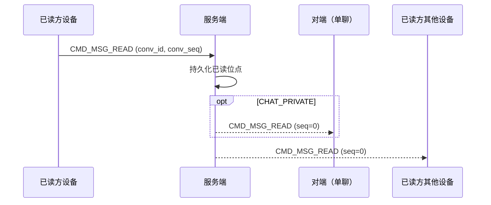

# 设计说明：已读回执

| 项 | 内容 |
| --- | --- |
| 状态 | **已确认** |
| 决策编号 | DD-014 |
| 规范定义 | [`proto/message.proto`](../../proto/message.proto)（`MsgRead`、`AckStatus.ACK_READ`） |
| 行为约定 | [`protocol.md` §14](protocol/protocol.md#14-已读回执) |
| 索引 | [`design-decisions.md`](../design-decisions.md) |
| 实现文档 | [implementation/elixir/read-receipt.md](../implementation/elixir/read-receipt.md) |

---

## 1. 要解决什么问题

「消息已送达」（`CLIENT_RECEIVED`）与「用户已读」是不同语义。需要明确：

- 用哪条命令表达已读
- 单聊 / 群聊 / 聊天室是否通知对端
- 是否持久化、是否进离线拉取
- 与同用户多设备如何同步（见 [multi-device.md](multi-device.md)）

---

## 2. 决策摘要（已确认）

| # | 决策 |
| --- | --- |
| 1 | **仅使用 `CMD_MSG_READ`**；`AckStatus.ACK_READ` **保留枚举值但本期不使用** |
| 2 | 已读粒度：**会话级位点**（推荐 `conv_seq`；`msg_id` 可选辅助） |
| 3 | **单聊**：向对端推送 `CMD_MSG_READ`（`seq=0`） |
| 4 | **群聊**：**本期不向其他成员推送**已读；仅更新本用户已读位点 + 多设备同步 |
| 5 | **聊天室**：**不支持**已读回执 |
| 6 | 已读位点**服务端持久化**；**不进 `OFFLINE_PULL`** 消息列表 |
| 7 | 失败 `CMD_ERROR`，**不关连接** |
| 8 | 单聊阅后即焚：接收方 `CMD_MSG_READ` 覆盖 `burn_after_read` 消息时触发销毁调度（见 [burn-after-read.md](burn-after-read.md)） |

---

## 完整流程

```mermaid
flowchart TD
  A[用户打开会话 / 滚到底] --> B[CMD_MSG_READ conv_seq]
  B --> C[服务端更新 last_read_conv_seq]
  C --> D{chat_type?}
  D -->|单聊| E[PUSH READ → 对端全部设备]
  D -->|群聊| F[不广播给其他成员]
  D -->|聊天室| G[不支持]
  E --> H[PUSH READ → 同用户其他设备]
  F --> H
  C --> I[unread_count = 0]
  Note over I: 不进 OFFLINE_PULL；新设备靠 REST 会话元数据
```



---

## 3. 流程（文字摘要）

### 上报（客户端 → 服务端）

```text
用户打开会话 / 滚动到底 → CMD_MSG_READ (seq, MsgRead)
  必填：chat_type, from, to, conv_id
  推荐：conv_seq = 已读到的最大 conv_seq
服务端 → 更新 (app_key, user_id, conv_id) 已读位点
       → 单聊：CMD_MSG_READ (seq=0) → 对端全部在线设备
       → 同用户其他设备：CMD_MSG_READ (seq=0)（见 multi-device.md）
```

### 字段意图

| 字段 | 意图 |
| --- | --- |
| `from` | 已读方 `user_id`；须等于连接用户 |
| `to` | 同 `ChatMessage.to` |
| `conv_id` | 会话 ID |
| `conv_seq` | **推荐**；该会话已读到的最大 `conv_seq` |
| `msg_id` | 可选；辅助定位，以 `conv_seq` 为准 |
| `timestamp` | 已读时间（ms）；服务端可覆盖为确认时间 |

---

## 4. 按 ChatType 的行为

| chat_type | 服务端持久化 | 通知对端 | 多设备同步 | 离线恢复 |
| --- | --- | --- | --- | --- |
| `CHAT_PRIVATE` | 是 | 是，推给对端 | 是，推给同用户其他设备 | 登录后会话列表/元数据带出已读位点（非 OFFLINE_PULL） |
| `CHAT_GROUP` | 是 | **否**（本期） | 是 | 同上 |
| `CHAT_ROOM` | 否 | 否 | 否 | — |

### 为何群聊本期不广播已读

- 大群已读扇出成本高
- 常见产品仅展示「我读到哪」；对端已读列表可走 REST 扩展
- 与「群 CLIENT_RECEIVED 仅首人在线」的简化策略一致

### 为何不放进 OFFLINE_PULL

- 已读是**会话元数据**，不是新消息
- 避免污染 `ChatMessage` 时间线
- 新设备登录：REST 会话列表或专用接口返回 `last_read_conv_seq`；在线期间靠 `CMD_MSG_READ` 推送同步

---

## 5. 与投递 ACK 的区分

| | `CLIENT_RECEIVED`（MsgAck） | `CMD_MSG_READ`（MsgRead） |
| --- | --- | --- |
| 语义 | 消息到达客户端 | 用户主动阅读会话 |
| 方向 | 接收方 ACK_UP → 发送方 ACK_DOWN | 已读方上报 → 对端/多设备通知 |
| 单聊 | 必达发送方 | 通知对端 |
| 群聊 | 首个在线成员即通知发送方 | 本期不通知其他成员 |
| 聊天室 | 不强制 | 不支持 |

---

## 6. 刻意放弃

| 放弃 | 原因 |
| --- | --- |
| `ACK_READ` 走 MsgAck | 与投递 ACK 混淆；独立 READ 命令更清晰 |
| 群聊 per-member 已读广播 | 本期成本高；可 REST 扩展 |
| 已读作为 ChatMessage 进离线拉取 | 元数据与消息流分离 |
| 聊天室已读 | 实时房间无强需求 |

---

