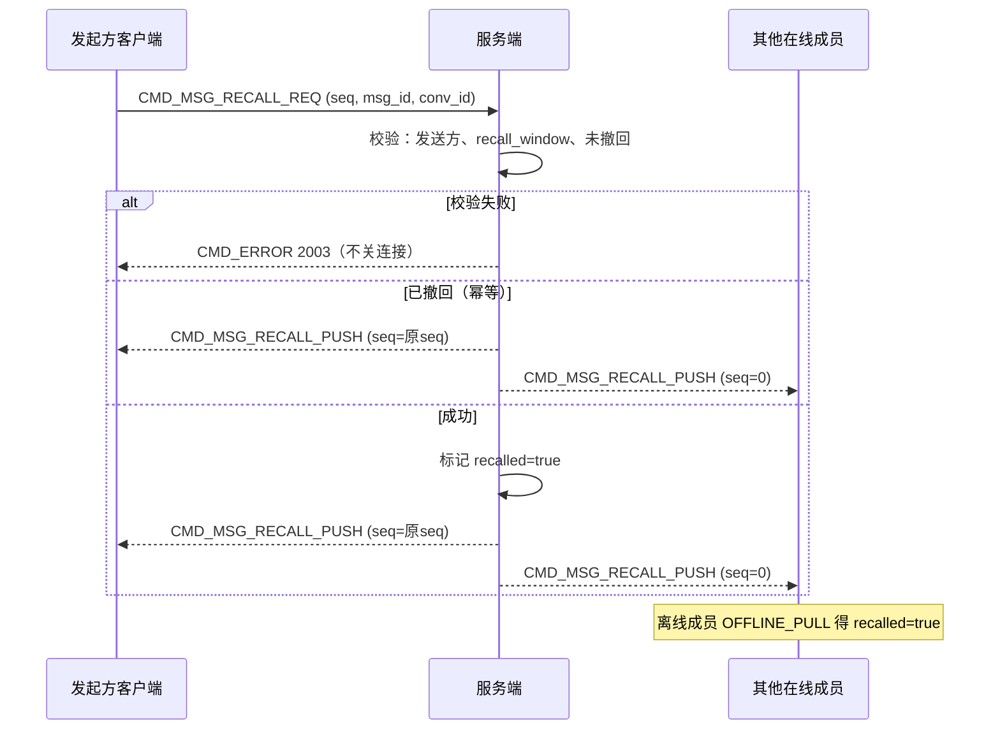

# 设计说明：撤回

| 项 | 内容 |
| --- | --- |
| 状态 | **已确认** |
| 决策编号 | DD-009 |
| 规范定义 | [`proto/message.proto`](../../proto/message.proto)（`MsgRecall`、`ChatMessage.recalled`）、[`proto/auth.proto`](../../proto/auth.proto)（`recall_window_sec`） |
| 行为约定 | [`protocol.md` §9](protocol/protocol.md#9-撤回) |
| 索引 | [`design-decisions.md`](../design-decisions.md) |
| 实现文档 | [implementation/elixir/recall.md](../implementation/elixir/recall.md) |

---

## 1. 要解决什么问题

发送方在限定时间内撤销已发消息；会话各方展示为「已撤回」，且离线成员上线后状态一致。

---

## 2. 决策摘要（已确认）

| # | 决策 |
| --- | --- |
| 1 | **仅原发送方**可撤回；管理员撤回走服务端策略 + `reason` |
| 2 | 撤回时间窗默认 **120s（2 分钟）**，`AuthResp.recall_window_sec` 可配置 |
| 3 | **聊天室**允许短窗内撤回（与不持久化策略并存：在线广播 + 短时缓存可标 recalled） |
| 4 | 离线成员通过 **OFFLINE_PULL** 同步撤回状态（`ChatMessage.recalled=true`） |
| 5 | **已读消息**在时间窗内仍可撤回 |
| 6 | 阅后即焚消息在时间窗内**可撤回**；撤回后取消 pending 销毁任务（见 [burn-after-read.md](burn-after-read.md)） |
| 7 | 失败 `CMD_ERROR`（2003），**不关连接**；已撤回重复请求 **幂等成功** |

---

## 完整流程



---

## 3. 流程（文字摘要）

```text
发起方 → RECALL_REQ (seq, msg_id, conv_id, …)
服务端 → 校验：发送方身份 + 时间窗 + 消息存在且未撤回
  成功：
    → RECALL_PUSH (seq=原seq) → 发起方
    → RECALL_PUSH (seq=0)     → 其他在线成员
    → 库表标记 msg recalled
  失败：
    → CMD_ERROR CODE_MSG_RECALL_DENIED
```

---

## 4. 为什么这样设计

### REQ / PUSH 分离

与编辑一致：发起方用回传 `seq` 的 PUSH 作成功确认；广播用 `seq=0`，方向清晰。

### 不改 msg_id / conv_seq

撤回是原消息状态变更，不插入新消息，离线游标与排序不乱。

### ChatMessage.recalled

| 点 | 好处 |
| --- | --- |
| 布尔字段 | 拉离线、推 PUSH 后统一模型；客户端一条渲染路径 |
| 在线 RECALL_PUSH | 实时通知；离线靠 pull 带 `recalled=true` |

### 聊天室短窗撤回

产品允许撤回；因默认不强持久化，以在线 `RECALL_PUSH` 为主；若短时缓存/落库则同样标 `recalled`。

### 已读可撤回

时间窗内发送方仍可撤销，与常见 IM 一致；超过窗返回 2003。

### 幂等

同一 `msg_id` 已撤回后再 RECALL_REQ：返回成功 PUSH（或等价确认），不报错。

---

## 5. 权限与时间窗

| 规则 | 说明 |
| --- | --- |
| 权限 | `from` 必须等于原消息发送者（服务端校验） |
| 时间窗 | `now - message.server_time ≤ recall_window_sec` |
| 配置 | 鉴权响应 `recall_window_sec`，默认 120 |

---

## 6. 刻意放弃

| 放弃 | 原因 |
| --- | --- |
| 撤回发新 msg_id | 破坏会话序与离线模型 |
| 撤回失败断连接 | 与 SEND 一致 |
| 全员必须在线才生效 | 离线靠 pull 同步 |

---

