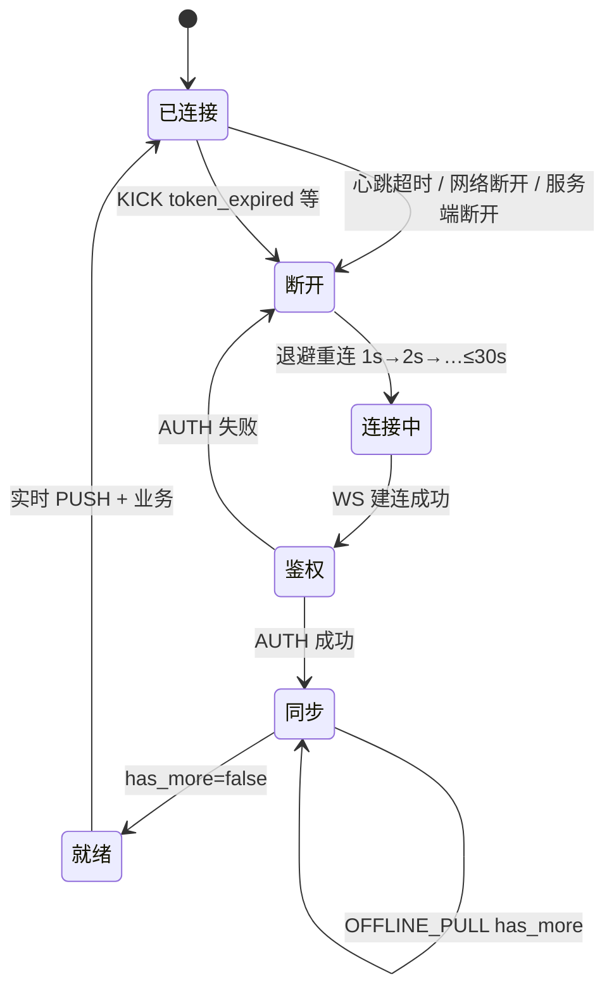
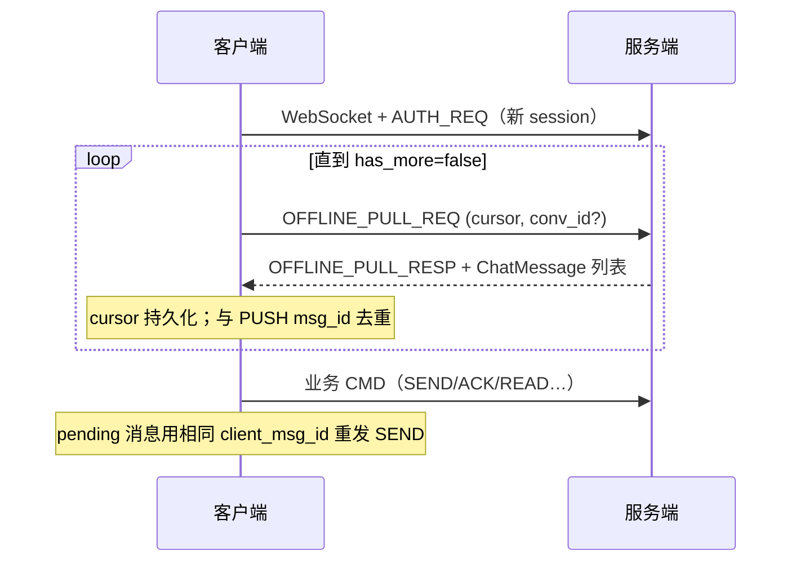

# 设计说明：重连与恢复

| 项 | 内容 |
| --- | --- |
| 状态 | **已确认** |
| 决策编号 | DD-016 |
| 规范定义 | [`proto/auth.proto`](../../proto/auth.proto)、[`proto/sync.proto`](../../proto/sync.proto)、[`proto/message.proto`](../../proto/message.proto) |
| 行为约定 | [`protocol.md` §15](protocol/protocol.md#15-重连与恢复) |
| 索引 | [`design-decisions.md`](../design-decisions.md) |
| 实现文档 | [implementation/elixir/reconnect.md](../implementation/elixir/reconnect.md) |

---

## 1. 要解决什么问题

长连接会因网络、NAT、服务端空闲等断开。客户端需可预期地：

- 检测断线并重连
- 从正确游标补全离线消息
- 与实时 PUSH 去重
- 处理「发送中」消息的幂等与 ACK 关联

相关能力分散在 [auth.md](auth.md)、[heartbeat.md](heartbeat.md)、[offline-pull.md](offline-pull.md)，本文汇总为**统一重连状态机**。

---

## 2. 决策摘要（已确认）

| # | 决策 |
| --- | --- |
| 1 | 断线后**完整重连**：新 WebSocket → `AUTH_REQ` → 全局 `OFFLINE_PULL` → 活跃群 `conv_seq` 补拉（含写扩散异步窗口）→ 读扩散群拉取 → 恢复实时 PUSH（见 [offline-pull.md](offline-pull.md) §3.1–§3.2） |
| 2 | 离线游标以**本地持久化**为准；首次登录 `cursor = 0` |
| 3 | `OFFLINE_PULL` 与 `PUSH` 统一按 **`msg_id` 去重** |
| 4 | 发送中消息：以 **`client_msg_id` 业务幂等**为准重试 SEND；已处理则收原 `ACK_DOWN`、不重复推给对端 |
| 5 | 重连期间**不发送业务包**（除鉴权与离线拉取）；拉取完成后再发消息 |
| 6 | 心跳触发的重连与网络断连**同一流程** |

---

## 完整流程





---

## 3. 重连状态机（文字）

```text
[已连接]
    │ 心跳超时 / 网络断开 / 服务端静默断开
    ▼
[断开] ──► 退避重连（建议 1s → 2s → 4s … 上限 30s）
    │
    ▼
[连接中] WebSocket Connect
    │
    ▼
[鉴权] CMD_AUTH_REQ（新 session_id）
    │ 失败 → CMD_ERROR + 关连接 → 回到 [断开]
    ▼
[同步] OFFLINE_PULL
    │   1) 全局：cursor = local.inbox_seq，直至 has_more = false
    │   2) 活跃 write_fanout 群：conv_id + conv_seq 补拉（异步 inbox 窗口）
    │   3) read_fanout 群：conv_id + conv_seq 拉取
    │   与 PUSH 按 msg_id 去重
    │   期间若收到 PUSH：msg_id 去重，不重复落库
    ▼
[就绪] 可 SEND / ACK / READ / 透传等
    │
    └── 心跳 + 业务包维持活跃
```

与 [auth.md](auth.md) 一致：token 过期走 `CMD_KICK` → 重新 `AUTH_REQ`（可能需 REST 换 token）。

---

## 4. 游标与初值

| 模式 | 本地存储键 | 初始值 | 拉取条件 |
| --- | --- | --- | --- |
| 全量收件箱 | `inbox_seq` | `0`（无本地数据） | `inbox_seq > cursor` |
| 单会话 | `conv_id` → `conv_seq` | `0` | `conv_seq > cursor` |

规则：

1. 每设备**独立**维护游标（同一用户多设备可能进度不同）
2. 每页拉取成功后：`cursor = next_cursor` 并**持久化**
3. 登出不清服务端数据；清本地游标视为全量重同步（`cursor=0`）

详见 [offline-pull.md](offline-pull.md)。

---

## 5. PUSH 与 OFFLINE_PULL 去重

| 场景 | 行为 |
| --- | --- |
| 先 PULL 到 msg_id=X，后又 PUSH X | 跳过，不重复落库、不重复未读 +1 |
| 先 PUSH X，PULL 又返回 X | 同上 |
| 撤回/编辑/阅后即焚 | 同 `msg_id` 更新 `recalled` / `content` / `burned`；以服务端最新状态为准 |

客户端维护已见 `msg_id` 集合或 DB 唯一约束 `(app_key, user_id, msg_id)`。

---

## 6. 发送中（pending）消息

弱网可能在 SEND 后断线，分为：

### 6.1 服务端已处理

重连后**用相同 `client_msg_id` 重发** `CMD_MSG_SEND`（可换新 `cid` / `seq`）：

- 服务端按 [message-send-ack.md](message-send-ack.md) 幂等返回同一 `msg_id`、`conv_seq`
- 补发 `ACK_DOWN`；**不重复**向对端 PUSH
- 客户端将本地 pending 标为已发送

### 6.2 服务端未处理

重发后走正常新消息流程。

### 6.3 幂等优先级

与发消息模块一致：**`(app_key, from, client_msg_id)` 为业务主键**；`Packet.cid` 仅请求级去重。详见 message-send-ack §3.1。

---

## 7. 与心跳的关系

| 事件 | 行为 |
| --- | --- |
| 连续 3 次心跳无 RESP | 主动断连并重连（见 [heartbeat.md](heartbeat.md)） |
| 重连成功 | 重新获取 `heartbeat_interval_sec` 等 `AuthResp` 参数 |
| 业务包 | 重置心跳计时；同步期间 OFFLINE_PULL 算活跃 |

---

## 8. 刻意放弃

| 放弃 | 原因 |
| --- | --- |
| 连接层 session 续期（不断 WS 只补拉） | 实现复杂；全量 AUTH + PULL 足够清晰 |
| 重连跳过 OFFLINE_PULL | 易丢消息；至少一次 + 游标补拉更可靠 |
| 服务端记住客户端 seq | seq 为客户端本地序号，新连接不延续 |

---

