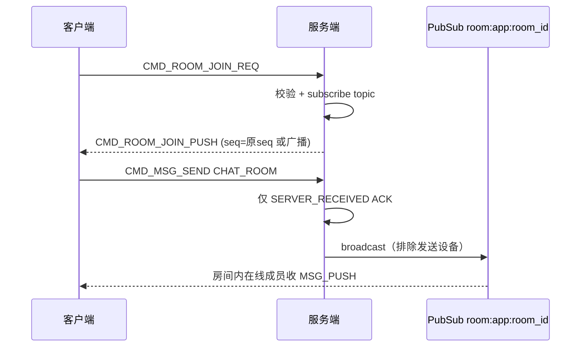
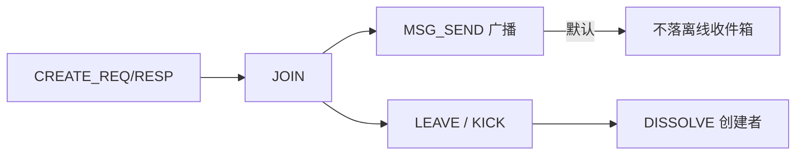

# 设计说明：聊天室管理

| 项 | 内容 |
| --- | --- |
| 状态 | **已确认** |
| 决策编号 | DD-018 |
| 规范定义 | [`proto/room.proto`](../../proto/room.proto) |
| 行为约定 | [`protocol.md` §19](protocol/protocol.md#19-聊天室管理) |
| 索引 | [`design-decisions.md`](../design-decisions.md) |
| 实现文档 | [implementation/elixir/room.md](../implementation/elixir/room.md) |

---

## 1. 要解决什么问题

管理高并发、弱持久化的聊天室：创建/解散、进出房、踢人、元数据更新，并与 `CHAT_ROOM` 实时广播、`conv_id = r:{room_id}` 对齐。

---

## 2. 决策摘要（已确认）

| # | 决策 |
| --- | --- |
| 1 | 命令段 **700–711**；`route_key` 建议填 `room_id` |
| 2 | **仅 CREATE** 有独立 `RESP`；其余操作用 `*_PUSH` 回传 `seq` 作成功确认 |
| 3 | 成员变更向**房间内在线成员**广播 `*_PUSH`（`seq=0`） |
| 4 | 默认 `persist_msg=false`；开启后可选 `msg_ttl_sec` 短时缓存（默认 **300** 秒，`0` = 不缓存） |
| 5 | `conv_id` 服务端权威：`r:{room_id}` |
| 6 | 失败 `CMD_ERROR`（4001–4005），**不关连接** |
| 7 | 聊天室**无**群主/管理员 proto 枚举；创建者为 `owner_uid`，权限策略服务端配置 |
| 8 | 在线消息广播**一律** Phoenix PubSub；**不**按规模切换树状扇出（树状仅群聊） |

---

## 完整流程

### 加入房间与实时消息

### 房间生命周期

---

## 3. 为什么这样设计

### 与群聊分离命令段

| 点 | 好处 |
| --- | --- |
| 700 段独立 | 网关/SDK 按场景分流；聊天室可部署到专用 PubSub 扇出路径 |
| payload 更轻 | `RoomMemberPush` 无角色字段，符合「弱关系」房间模型 |

### 默认不持久化

聊天室面向海量在线广播；默认 `persist_msg=false` 避免存储与离线同步成本。需要回放时：

- `persist_msg=true` + `msg_ttl_sec` 短时缓存
- 或 REST 拉历史

### 与群相同的 RESP/PUSH 模式

CREATE 返回 `room_id` / `conv_id`；其余操作复用「回传 `seq` 的 PUSH + `seq=0` 广播」，降低 SDK 分支。

### 成员变更不自动系统消息

同群组：避免无意义的 `conv_seq` 与未读；业务可自行发房间公告类消息。

---

## 4. 权限矩阵（默认）

| 操作 | 创建者 | 管理员（策略） | 成员 |
| --- | --- | --- | --- |
| 创建 | ✓ | — | — |
| 解散 | ✓ | 可配置 | ✗ |
| 加入 | 策略 | 策略 | 策略 |
| 离开 | ✓ | ✓ | ✓（本人） |
| 踢人 | ✓ | 可配置 | ✗ |
| 更新信息 | ✓ | 可配置 | ✗ |

聊天室管理员不在 proto 中枚举；由服务端 `app` 配置或 REST 预置，避免过早固化角色模型。

---

## 5. 规模化注意点

| 点 | 说明 |
| --- | --- |
| 房间广播 | **一律** Phoenix PubSub 一次 `broadcast`（与成员数无关）；避免 per-member 单播 |
| 与群聊差异 | **不**使用大群树状扇出（`GroupPusher`）；树状仅服务群聊，见 [modular-architecture.md](modular-architecture.md) §7.2、[group.md](group.md) |
| 成员计数 | `member_count` 走 Redis；DB 异步校正 |
| 大房间 | 成员变更 PUSH 仍走同一 PubSub topic；客户端只更新本地房间态，不拉全量成员 |
| 压力点 | PubSub 跨节点带宽 + 本节点慢连接背压；不靠换扇出算法缓解 |

---

## 6. 刻意放弃

| 放弃 | 原因 |
| --- | --- |
| 聊天室离线拉取 | 与 message-model 一致；历史走 REST/短缓存 |
| 房间内双阶段 ACK 全员 | 仅消息 `SERVER_RECEIVED` 必达 |
| proto 内建管理员角色 | 房间场景多样，先用策略配置 |
| 大房间改树状扇出 | 与「一律 PubSub」定稿冲突；两套路径难测；群聊已有树状即可 |

---
