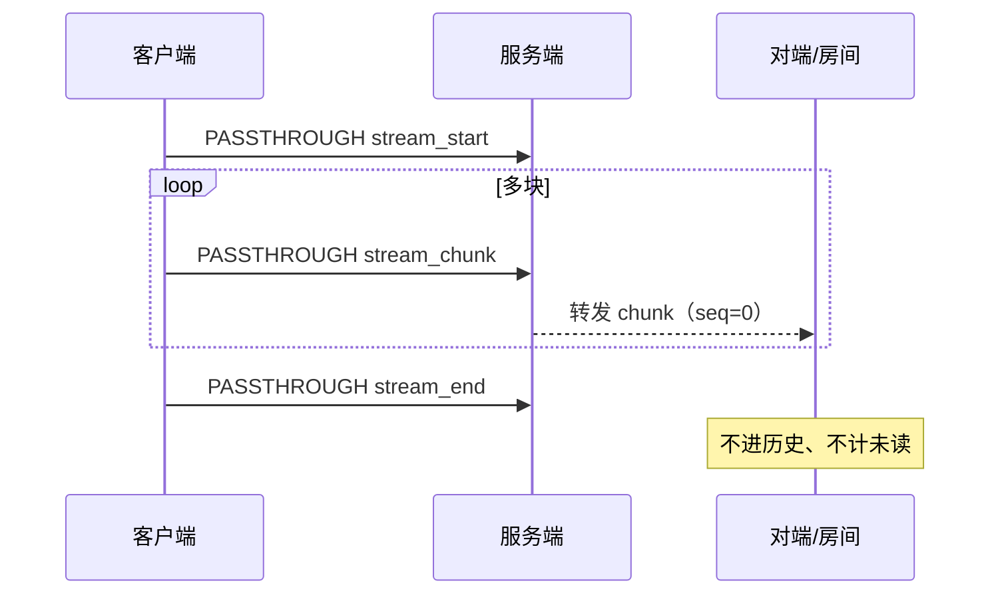
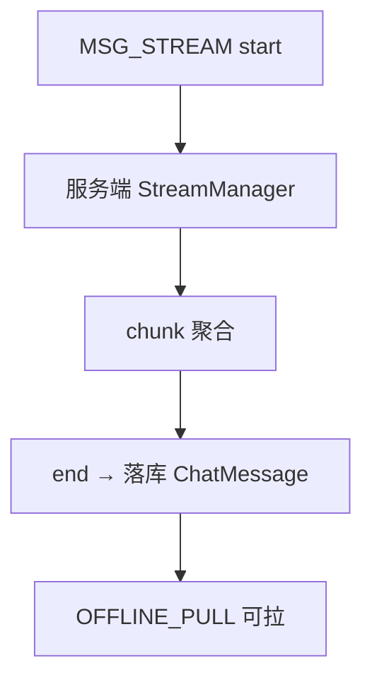

# 设计说明：流式消息

| 项 | 内容 |
|------|------|
| 状态 | 已确认 |
| 决策编号 | DD-019 |
| 规范定义 | [`proto/message.proto`](../../proto/message.proto)（`MsgType.MSG_STREAM`、`StreamContent`）、[`proto/passthrough.proto`](../../proto/passthrough.proto) |
| 行为约定 | 本文档 |
| 索引 | [`design-decisions.md`](../design-decisions.md) |
| 实现文档 | [implementation/elixir/stream-message.md](../implementation/elixir/stream-message.md) |

---

## 1. 要解决什么问题

随着AI技术发展，IM系统需要支持流式消息场景：

- **AI对话流式输出**: ChatGPT、Claude等AI助手逐字/逐块输出
- **实时协作编辑**: 多人协作文档实时同步
- **代码生成流**: AI代码助手逐行生成代码
- **长文本流式传输**: 大文档分块传输

核心需求：
- 实时性：逐块推送，低延迟
- 顺序性：块顺序必须保证
- 完整性：支持取消、错误恢复
- 交互性：用户可中断流
- 持久化：可选是否保存完整消息

---

## 2. 决策是什么

### 2.1 双模式支持

**模式一: 透传模式**（推荐，实时性优先）
- 使用 `CMD_PASSTHROUGH` 传输流块
- 不进会话历史、不触发未读数
- 适合AI对话实时输出

**模式二: 消息模式**（持久化优先）
- 使用 `MSG_STREAM` 消息类型
- 进会话历史、支持离线拉取
- 适合需要保存的流式内容

### 2.2 模式对比

| 特性 | 透传模式 | 消息模式 |
|------|---------|---------|
| 实时性 | ✅ 最高 | ✅ 高 |
| 持久化 | ❌ 不进历史 | ✅ 进历史 |
| 未读数 | ❌ 不触发 | ✅ 触发 |
| 离线拉取 | ❌ 不支持 | ✅ 支持 |
| 实现复杂度 | ⭐ 简单 | ⭐⭐⭐ 复杂 |
| 适用场景 | AI对话、实时协作 | 需要保存的流式内容 |

### 2.3 推荐使用场景

| 场景 | 推荐模式 | 原因 |
|------|---------|------|
| AI对话流式输出 | **透传模式** | 实时性优先，通常不需要历史 |
| AI对话历史保存 | 消息模式 | 需要离线查看 |
| 实时协作编辑 | 透传模式 | 实时性优先 |
| 代码生成流 | 透传模式 | 实时性优先 |
| 长文档分块传输 | 消息模式 | 需要完整性保证 |

---

## 完整流程

### 透传模式（推荐，v1 纳入路线图）



### 消息模式（deferred，proto 保留）



---

## 3. 为什么这样设计

### 3.1 为什么提供双模式

**问题**: 不同场景对流式消息的需求差异大。

| 需求维度 | AI对话 | 协作文档 | 历史记录 |
|---------|--------|---------|---------|
| 实时性 | 极高 | 极高 | 中等 |
| 持久化 | 可选 | 必须 | 必须 |
| 离线访问 | 可选 | 必须 | 必须 |
| 未读提醒 | 不需要 | 不需要 | 需要 |

**解决方案**: 提供两种模式，满足不同需求。

### 3.2 为什么透传模式推荐

**AI对话场景分析**:
- 流式输出是临时状态，最终结果才是完整消息
- 用户更关心实时体验，而非历史记录
- 透传模式延迟最低，实现最简单

**示例流程**:
```
用户发送: "介绍一下Elixir"
AI服务 → 用户: stream_start
AI服务 → 用户: stream_data "Elixir"
AI服务 → 用户: stream_data "是一门"
AI服务 → 用户: stream_data "函数式"
...
AI服务 → 用户: stream_end

（可选）AI服务生成完整消息后，发送 MSG_TEXT 消息保存历史
```

### 3.3 为什么消息模式也需要

**场景**: 用户需要离线查看AI对话历史。

**实现**:
```
流式传输阶段: 使用透传模式实时推送
传输完成后: 生成完整 MSG_TEXT 或 MSG_STREAM 消息保存
```

或直接使用 `MSG_STREAM` 模式：
```
每个流块作为独立消息推送：
  ChatMessage { msg_type=MSG_STREAM, stream_id=xxx, sequence=1, ... }
  ChatMessage { msg_type=MSG_STREAM, stream_id=xxx, sequence=2, ... }
```

---

## 4. 有什么好处

### 4.1 灵活性

| 好处 | 说明 |
|------|------|
| 模式可选 | 根据场景选择透传或消息模式 |
| 扩展性好 | 支持AI对话、协作编辑等多种场景 |
| 向后兼容 | 基于现有协议扩展，不破坏现有功能 |

### 4.2 实时性

| 好处 | 说明 |
|------|------|
| 低延迟 | 透传模式无持久化开销 |
| 顺序保证 | 通过 `sequence` 字段保证顺序 |
| 实时体验 | 用户可看到逐字输出效果 |

### 4.3 可靠性

| 好处 | 说明 |
|------|------|
| 状态管理 | 通过 `StreamStatus` 明确流状态 |
| 错误处理 | 支持流错误、取消等异常情况 |
| 完整性校验 | 通过 `sequence` 校验流完整性 |

---

## 5. 刻意放弃 / 不做的事

| 放弃项 | 原因 |
|--------|------|
| 流块重传机制 | 透传模式不保证可靠性，应用层自行处理 |
| 流块压缩 | 增加复杂度，文本块通常较小 |
| 流合并 | 客户端自行合并展示，服务端不干预 |

---

## 6. 协议细节

### 6.1 透传模式

#### action 值定义

| action | 说明 | data 字段内容 |
|--------|------|--------------|
| `stream_start` | 流开始 | `{"stream_id": "xxx", "content_type": "text/markdown", "metadata": {...}}` |
| `stream_data` | 流数据块 | `{"stream_id": "xxx", "sequence": 1, "chunk": "Hello"}` |
| `stream_end` | 流正常结束 | `{"stream_id": "xxx", "total_chunks": 10}` |
| `stream_cancel` | 流取消 | `{"stream_id": "xxx", "reason": "user_interrupted"}` |
| `stream_error` | 流错误 | `{"stream_id": "xxx", "error_code": "RATE_LIMIT", "error_message": "..."}` |

#### 完整示例

**场景**: AI对话流式输出

```json
// 1. 流开始
{
  "stream_id": "550e8400-e29b-41d4-a716-446655440000",
  "content_type": "text/markdown",
  "metadata": {
    "model": "gpt-4",
    "prompt_tokens": 50
  }
}

// 2. 流数据块（多次）
{
  "stream_id": "550e8400-e29b-41d4-a716-446655440000",
  "sequence": 1,
  "chunk": "Elixir",
  "timestamp": 1721808000000
}

{
  "stream_id": "550e8400-e29b-41d4-a716-446655440000",
  "sequence": 2,
  "chunk": "是一门",
  "timestamp": 1721808000100
}

{
  "stream_id": "550e8400-e29b-41d4-a716-446655440000",
  "sequence": 3,
  "chunk": "函数式编程语言",
  "timestamp": 1721808000200
}

// 3. 流结束
{
  "stream_id": "550e8400-e29b-41d4-a716-446655440000",
  "total_chunks": 3,
  "completion_tokens": 100,
  "finish_reason": "stop"
}
```

#### 客户端处理逻辑

```swift
class StreamMessageHandler {
    var streams: [String: StreamBuffer] = [:]
    
    func handlePassthrough(_ passthrough: Passthrough) {
        guard let data = try? JSONDecoder().decode(StreamData.self, from: passthrough.data) else {
            return
        }
        
        switch passthrough.action {
        case "stream_start":
            streams[data.streamId] = StreamBuffer(streamId: data.streamId)
            
        case "stream_data":
            streams[data.streamId]?.append(data.chunk, sequence: data.sequence)
            updateUI() // 实时更新UI
            
        case "stream_end":
            let fullText = streams[data.streamId]?.getFullText()
            saveToConversation(fullText) // 可选：保存完整消息
            streams.removeValue(forKey: data.streamId)
            
        case "stream_cancel":
            streams.removeValue(forKey: data.streamId)
            
        case "stream_error":
            showError(data.errorMessage)
            streams.removeValue(forKey: data.streamId)
        }
    }
}
```

### 6.2 消息模式

#### StreamContent 定义

```protobuf
message StreamContent {
  string stream_id = 1;      // 流唯一标识
  StreamStatus status = 2;   // 流状态
  int32 sequence = 3;        // 块序号
  string chunk = 4;          // 内容块
  string content_type = 5;   // 内容类型
  map<string, string> metadata = 6; // 元数据
}

enum StreamStatus {
  STREAM_STATUS_UNSPECIFIED = 0;
  STREAM_STATUS_START = 1;    // 流开始
  STREAM_STATUS_ONGOING = 2;  // 流进行中
  STREAM_STATUS_END = 3;      // 流正常结束
  STREAM_STATUS_CANCEL = 4;   // 流取消
  STREAM_STATUS_ERROR = 5;    // 流错误
}
```

#### 消息示例

```json
{
  "msg_id": "msg_001",
  "msg_type": 8,  // MSG_STREAM
  "content": {
    "stream_id": "550e8400-e29b-41d4-a716-446655440000",
    "status": 2,  // STREAM_STATUS_ONGOING
    "sequence": 5,
    "chunk": "函数式编程语言",
    "content_type": "text/markdown",
    "metadata": {
      "model": "gpt-4"
    }
  }
}
```

#### 存储策略

**方案一: 每个流块独立存储**
- 每个流块作为一条 `ChatMessage` 记录
- 离线拉取时返回所有流块
- 客户端按 `sequence` 排序合并

**方案二: 流结束后存储完整消息**
- 流传输阶段使用透传模式
- 流结束后生成完整 `MSG_TEXT` 消息
- 节省存储空间，但需要等待流结束

**推荐**: 方案二，兼顾实时性和存储效率。

---

## 7. 服务端实现要点

### 7.1 流状态管理

```elixir
defmodule IM.Services.StreamManager do
  use GenServer
  
  # 流状态: %{stream_id => %{status, chunks, sequence, ...}}
  
  def start_stream(stream_id, metadata) do
    GenServer.call(__MODULE__, {:start, stream_id, metadata})
  end
  
  def append_chunk(stream_id, chunk) do
    GenServer.cast(__MODULE__, {:append, stream_id, chunk})
  end
  
  def end_stream(stream_id) do
    GenServer.call(__MODULE__, {:end, stream_id})
  end
  
  # ...
end
```

### 7.2 顺序保证

```elixir
# 使用 sequence 字段排序
def get_full_text(stream_id) do
  chunks = get_chunks(stream_id)
  chunks
  |> Enum.sort_by(& &1.sequence)
  |> Enum.map(& &1.chunk)
  |> Enum.join()
end
```

### 7.3 错误处理

```elixir
def handle_stream_error(stream_id, error) do
  # 1. 推送错误通知
  push_stream_error(stream_id, error)
  
  # 2. 清理流状态
  cleanup_stream(stream_id)
  
  # 3. 记录日志
  Logger.error("Stream error: #{stream_id}, #{inspect(error)}")
end
```

---

## 8. 客户端实现要点

### 8.1 流缓冲区

```swift
class StreamBuffer {
    let streamId: String
    private var chunks: [Int: String] = [:] // sequence -> chunk
    private var maxSequence: Int = 0
    
    func append(_ chunk: String, sequence: Int) {
        chunks[sequence] = chunk
        maxSequence = max(maxSequence, sequence)
    }
    
    func getFullText() -> String {
        (1...maxSequence).compactMap { chunks[$0] }.joined()
    }
}
```

### 8.2 实时渲染

```swift
func updateUI() {
    // 实时显示当前流内容
    let currentText = streamBuffer.getFullText()
    messageLabel.text = currentText
    
    // 滚动到底部
    scrollToBottom()
}
```

### 8.3 取消流

```swift
// 用户点击"停止生成"按钮
func stopStream(streamId: String) {
    // 发送取消请求
    sendPassthrough(action: "stream_cancel", data: [
        "stream_id": streamId,
        "reason": "user_interrupted"
    ])
}
```

---

## 9. 性能优化

### 9.1 批量推送

**场景**: 流块频繁到达时，减少UI刷新频率。

**优化**:
```swift
// 使用防抖，每 100ms 刷新一次UI
func appendChunk(_ chunk: String, sequence: Int) {
    streamBuffer.append(chunk, sequence: sequence)
    debounce("updateUI", delay: 0.1) {
        self.updateUI()
    }
}
```

### 9.2 流块合并

**场景**: 流块过小（如单个字符）时。

**优化**:
- 服务端合并小流块（如 50ms 内的块合并）
- 客户端延迟渲染，积累一定量后刷新

---

## 10. 安全考虑

### 10.1 流ID生成

**建议**: 服务端生成，保证唯一性。

```elixir
def generate_stream_id do
  UUID.uuid4()
end
```

### 10.2 流权限校验

**检查点**:
- 流发起者是否有权限
- 流目标（conv_id/to）是否合法
- 流块是否属于该用户

```elixir
def validate_stream_access(user_id, stream_id, conv_id) do
  # 检查用户是否有权限访问该会话
  with :ok <- check_conversation_access(user_id, conv_id),
       :ok <- check_stream_owner(user_id, stream_id) do
    :ok
  end
end
```

### 10.3 限流

**场景**: 防止恶意高频发送流块。

**策略**:
- 单个流频率限制：如 20块/秒
- 单用户并发流数量限制：如 5个
- 单流块大小限制：如 1KB

---

## 11. 监控与告警

### 11.1 关键指标

| 指标 | 说明 |
|------|------|
| 流创建速率 | 每秒新建流数量 |
| 流块推送延迟 | 从生成到推送的延迟 |
| 流完成率 | 正常结束的流占比 |
| 流错误率 | 错误/取消的流占比 |
| 平均流时长 | 从 start 到 end 的时长 |

### 11.2 告警规则

| 告警 | 阈值 | 处理 |
|------|------|------|
| 流错误率过高 | > 10% | 检查下游AI服务状态 |
| 流块延迟过高 | P99 > 500ms | 检查网络、服务性能 |
| 流未正常结束 | 超过 5 分钟无 end | 清理僵尸流 |

---

## 12. 典型场景示例

### 12.1 AI对话流式输出

```
用户 → 服务端: 发送问题（MSG_TEXT）
服务端 → AI服务: 调用AI API
AI服务 → 服务端: 流式返回（SSE/WebSocket）
服务端 → 用户: stream_start (PASSTHROUGH)
服务端 → 用户: stream_data × N (PASSTHROUGH)
服务端 → 用户: stream_end (PASSTHROUGH)
（可选）服务端 → 用户: MSG_TEXT (完整消息保存历史)
```

### 12.2 实时协作编辑

```
用户A → 服务端: 编辑操作（PASSTHROUGH, action=doc_edit）
服务端 → 用户B: 编辑操作（PASSTHROUGH, action=doc_edit）
用户B → 服务端: 编辑操作（PASSTHROUGH, action=doc_edit）
服务端 → 用户A: 编辑操作（PASSTHROUGH, action=doc_edit）
```

### 12.3 代码生成流

```
用户 → 服务端: 代码生成请求
服务端 → 用户: stream_start (content_type=text/code)
服务端 → 用户: stream_data "def hello():"
服务端 → 用户: stream_data "    print('hello')"
服务端 → 用户: stream_end
```

---

## 13. 总结

| 项 | 说明 |
|------|------|
| **双模式支持** | 透传模式（实时优先）+ 消息模式（持久化优先） |
| **透传模式** | 使用 `CMD_PASSTHROUGH`，通过 action 区分流状态 |
| **消息模式** | 使用 `MSG_STREAM` 类型，进历史可离线拉取 |
| **核心字段** | `stream_id` 关联流，`sequence` 保证顺序，`status` 表示状态 |
| **推荐用法** | AI对话用透传模式，需要历史时流结束后生成 MSG_TEXT |

---

## 附录：常见问题

### Q1: 透传模式下流块丢失怎么办？

**解决方案**:
- 透传模式不保证可靠性
- 如需可靠传输，使用消息模式
- 或在应用层实现确认机制

### Q2: 如何判断流已完整接收？

**判断依据**:
- 收到 `stream_end` 或 `stream_error`
- 超时未收到新流块（如 30 秒）
- 通过 `sequence` 校验是否有缺失块

### Q3: 离线用户如何查看流式消息？

**方案一**: 透传模式不支持离线，需流结束后生成完整消息
**方案二**: 使用消息模式，离线拉取所有流块后合并

### Q4: 如何处理流中的格式化内容？

**推荐**: 使用 Markdown 格式
- `content_type: text/markdown`
- 客户端实时渲染 Markdown
- 支持代码高亮、表格、列表等
