# IM 系统设计文档

本文是**系统级设计总览**：功能清单、架构、各功能时序图，以及**每一步的收发内容与处理逻辑**。

| 文档 | 职责 |
| --- | --- |
| **本文** | 系统功能、架构、时序与逐步说明 |
| [`protocol/protocol.md`](protocol/protocol.md) | 协议规范（字段、命令、规则） |
| [`design/`](design/) | 各模块设计意图（为什么）+ **`## 完整流程` Mermaid 图** |
| [`database/database-design.md`](database/database-design.md) | 存储设计 |
| [`proto/`](../proto/) | Protobuf 定义 |

---

## 1. 系统概述

### 1.1 技术栈

| 层 | 选型 |
| --- | --- |
| 客户端接入 | **WebSocket**（实时）+ **REST** `/api/v1`（同等业务能力） |
| 传输（WS） | WebSocket 二进制帧 |
| 序列化 | Protobuf 3（WS）；JSON 或 Protobuf（REST） |
| 协议版本 | `ver = 1` |
| 存储（规划） | PostgreSQL + Redis |
| 媒体文件 | HTTP 上传，长连接只传 URL 元数据 |

### 1.2 协议分层

```text
客户端 SDK
    │ 组包 / 解包 / 状态机 / 本地存储
    ▼
WebSocket Binary Frame
    ▼
Packet 信封（ver / cmd / seq / cid / trace_id / route_key / payload）
    ▼
业务 Payload（按 cmd 解析：Auth / Message / Sync / Passthrough）
    ▼
服务端：接入网关 → 消息服务 → 存储
```

### 1.3 统一约定

| 约定 | 说明 |
| --- | --- |
| 成功响应 | 回传同一 `seq`；`cmd` 为业务 RESP/ACK；**不带** `code` |
| 失败响应 | `cmd=CMD_ERROR`；`payload=ErrorBody`（`code`/`msg`/`ref_cmd`/`ref_cid`） |
| 服务端推送 | `seq=0`；用 `msg_id` 等业务 ID 标识 |
| 幂等 | 发消息：`(app_key, from, client_msg_id)` 为主键；`Packet.cid` 为请求级辅助 |
| QoS | 至少一次投递；客户端按 `msg_id` 去重 |

---

## 2. 功能清单

> **通道**：除标注「仅 WS」外，功能均支持 **WebSocket + REST**（见 [dual-channel-api.md](design/dual-channel-api.md)）。

| # | 功能模块 | 会话类型 | 命令 / REST | 设计文档 |
| --- | --- | --- | --- | --- |
| 1 | 连接与鉴权 | — | `AUTH_REQ` / `AUTH_RESP` | [auth.md](design/auth.md) |
| 1.1 | 认证模块架构 | — | — | [auth-module.md](design/auth-module.md) |
| 2 | 心跳保活 | — | `HEARTBEAT_*`（**仅 WS**） | [heartbeat.md](design/heartbeat.md) |
| 3 | 踢人下线 | — | `CMD_KICK`（**下行仅 WS**） | [auth.md](design/auth.md) |
| 4 | 重连与恢复 | — | `AUTH` + `OFFLINE_PULL` | [reconnect.md](design/reconnect.md) |
| 5 | 离线拉取 | 单聊 / 群聊 | `OFFLINE_PULL_REQ` / `RESP` | [offline-pull.md](design/offline-pull.md) |
| 6 | 发送消息 | 单聊 / 群聊 / 聊天室 | `MSG_SEND` | [message-send-ack.md](design/message-send-ack.md) |
| 7 | 消息推送 | 单聊 / 群聊 / 聊天室 | `MSG_PUSH` / `PUSH_BATCH` | [message-send-ack.md](design/message-send-ack.md) |
| 8 | 双阶段 ACK | 单聊 / 群聊 | `ACK_UP` / `ACK_DOWN` | [message-send-ack.md](design/message-send-ack.md) |
| 9 | 批量 ACK | 单聊 / 群聊 | `ACK_BATCH_UP` / `DOWN` | [message-send-ack.md](design/message-send-ack.md) |
| 10 | 已读回执 | 单聊（对端通知）；群聊（仅本用户） | `MSG_READ` | [read-receipt.md](design/read-receipt.md) |
| 11 | 未读数管理 | 单聊 / 群聊 | `MSG_READ` + 服务端维护 | [unread-count.md](design/unread-count.md) |
| 12 | 撤回消息 | 单聊 / 群聊 / 聊天室 | `RECALL_REQ` / `RECALL_PUSH` | [recall.md](design/recall.md) |
| 13 | 编辑消息 | 单聊 / 群聊 / 聊天室 | `EDIT_REQ` / `EDIT_PUSH` | [edit.md](design/edit.md) |
| 14 | 阅后即焚 | **单聊** | `MSG_SEND`（`burn_after_read`）+ `BURN_PUSH` | [burn-after-read.md](design/burn-after-read.md) |
| 15 | 流式消息 | 单聊 / 群聊 / 聊天室 | `MSG_STREAM` / `PASSTHROUGH` | [stream-message.md](design/stream-message.md) |
| 16 | 透传信令 | 单聊 / 群聊 / 聊天室 | `PASSTHROUGH` | [passthrough.md](design/passthrough.md) |
| 17 | 多端同步 | 单聊 / 群聊 | PUSH + 收件箱 | [multi-device.md](design/multi-device.md) |
| 18 | 消息上下文 | 系统内部 | — | [message-context.md](design/message-context.md) |
| 19 | 错误处理 | 全局 | `CMD_ERROR` | [packet.md](design/packet.md) |
| 20 | 群组管理 | 群聊 | `GROUP_*`（600–619） | [group.md](design/group.md) |
| 21 | 聊天室管理 | 聊天室 | `ROOM_*`（700–711） | [room.md](design/room.md) |
| 22 | 好友系统 | 单聊 | `FRIEND_*`（800–822） | [friend.md](design/friend.md) |
| 22 | 模块化架构 | 系统内部 | — | [modular-architecture.md](design/modular-architecture.md) |
| 23 | 测试客户端 | 测试 | — | [test-client.md](design/test-client.md) |
| — | Web 演示控制台 | 联调/演示 | — | [web-console.md](design/web-console.md) |
| 24 | 依赖抽象层 | 系统内部 | — | [dependency-abstraction.md](design/dependency-abstraction.md) |
| 25 | 可观测性（指标与日志） | 系统内部 | — | [observability.md](design/observability.md) |
| 26 | Kafka 事件总线 | 系统内部 | — | [kafka-event-bus.md](design/kafka-event-bus.md) |

### 2.1 三种会话差异

| 能力 | 单聊 | 群聊 | 聊天室 |
| --- | --- | --- | --- |
| 持久化 | 是 | 是 | 默认否（可选短时缓存 300s） |
| 离线拉取 | 是 | 是 | 否 |
| 双阶段 ACK | 两档必达 | 两档必达（CLIENT 取首个在线成员） | 仅 SERVER_RECEIVED |
| 撤回 / 编辑 / 阅后即焚 | 是 | 是 | 短窗内 / 短窗内 / **否** |
| 已读回执 | 通知对端 | 本期不广播给其他成员 | 不支持 |
| 透传 | 是 | 是 | 是（广播在线成员） |

---

## 3. 系统架构

> **通俗总览（推荐首读）**：[architecture-overview.md](architecture-overview.md) — 整体图、分模块、消息怎么流动。  
> 下文为精简鸟瞰；逐步时序见本文 §4 起。

```text
┌─────────────┐     WebSocket      ┌─────────────┐
│  客户端 SDK  │ ◄──────────────► │  接入网关    │
│ (多设备)     │    Packet 信封    │ 鉴权/心跳/路由│
└─────────────┘                   └──────┬──────┘
                                         │ route_key 分流
                    ┌────────────────────┼────────────────────┐
                    ▼                    ▼                    ▼
             ┌───────────┐        ┌───────────┐        ┌───────────┐
             │ 消息服务   │        │ 同步服务   │        │ 信令服务   │
             │ SEND/ACK  │        │ OFFLINE   │        │ PASSTHROUGH│
             │ PUSH/撤回 │        │ _PULL     │        │           │
             └─────┬─────┘        └─────┬─────┘        └─────┬─────┘
                   │                    │                    │
                   └────────────────────┼────────────────────┘
                                        ▼
                              ┌──────────────────┐
                              │ PostgreSQL       │
                              │ (消息/会话/群)    │
                              │ Redis            │
                              │ (连接/缓存/限流)  │
                              └──────────────────┘
```

---

## 4. 功能时序与逐步说明

以下各节格式统一为：

1. **时序图**（Mermaid）
2. **步骤表**：步骤编号、方向、命令、做什么、返回什么

---

### 4.1 连接与鉴权

#### 时序图

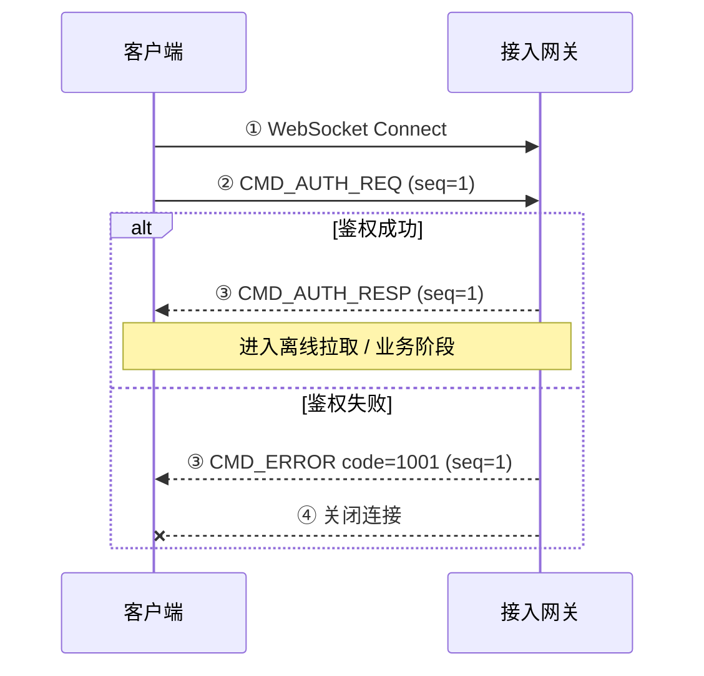

#### 步骤说明

| 步骤 | 方向 | 命令 / 动作 | 做什么 | 返回什么 |
| --- | --- | --- | --- | --- |
| ① | C→G | WebSocket 建连 | 建立 TCP + WS 握手 | 连接成功或失败（网络层） |
| ② | C→G | `CMD_AUTH_REQ` | 首包鉴权；`payload=AuthReq`（`app_key`/`user_id`/`token`/`device_id`/`platform`/`sdk_ver`）；`route_key` 建议填 `user_id` | — |
| ③a 成功 | G→C | `CMD_AUTH_RESP` | 校验 token 与 user_id；绑定连接上下文（`app_key`+`user_id`+`device_id`） | `AuthResp`：`session_id`、`server_time`、`heartbeat_interval_sec`(30)、`user_id`、`push_batch_max`(50)、`recall_window_sec`(120)、`edit_window_sec`(120)、`offline_pull_limit`(50) |
| ③b 失败 | G→C | `CMD_ERROR` | token 无效 / user 不存在等 | `ErrorBody`：`code=1001`(UNAUTHORIZED)、`ref_cmd=AUTH_REQ` |
| ④ | G→C | 关闭连接 | 仅鉴权失败时执行 | 连接断开；客户端应完整重连 |

**超时规则**：建连后 **10s** 内未收到合法 `AUTH_REQ` → 服务端断开。

---

### 4.2 心跳保活

#### 时序图

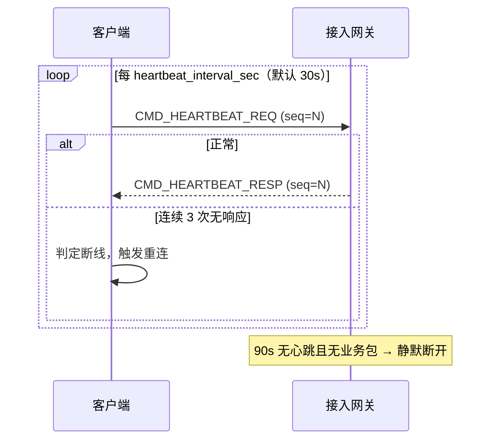

#### 步骤说明

| 步骤 | 方向 | 命令 | 做什么 | 返回什么 |
| --- | --- | --- | --- | --- |
| 1 | C→G | `CMD_HEARTBEAT_REQ` | 保活探测；可带 `client_time`（ms） | — |
| 2 | G→C | `CMD_HEARTBEAT_RESP` | 更新连接活跃时间 | `HeartbeatResp.server_time`（ms） |
| 3 | — | 超时 | 单次等待 = `heartbeat_interval_sec`；连续 **3 次**无 RESP | 客户端主动重连（见 §4.4） |
| 4 | — | 服务端空闲 | 90s 内无心跳且无业务包 | 静默断开，**不发** `CMD_ERROR` |

**注意**：任意业务包（发消息、ACK、离线拉取等）均重置活跃计时，有业务时可不发本周期心跳。

---

### 4.3 踢人下线

#### 时序图

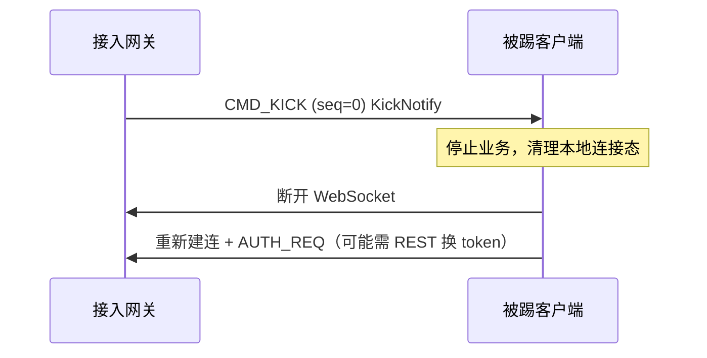

#### 步骤说明

| 步骤 | 方向 | 命令 | 做什么 | 返回什么 |
| --- | --- | --- | --- | --- |
| 1 | G→C | `CMD_KICK` | 服务端主动踢人（互踢 / 管理员踢 / token 过期） | `KickNotify`：`reason`（`duplicate_login`/`admin_kick`/`token_expired`）、`device_id`（可选）、`timestamp` |
| 2 | C | 本地处理 | 展示原因；停止心跳与业务 | — |
| 3 | C→G | 重连 | `token_expired` 时需 REST 重新获取 token，再 `AUTH_REQ` | 见 §4.1 |

---

### 4.4 重连与恢复

#### 时序图

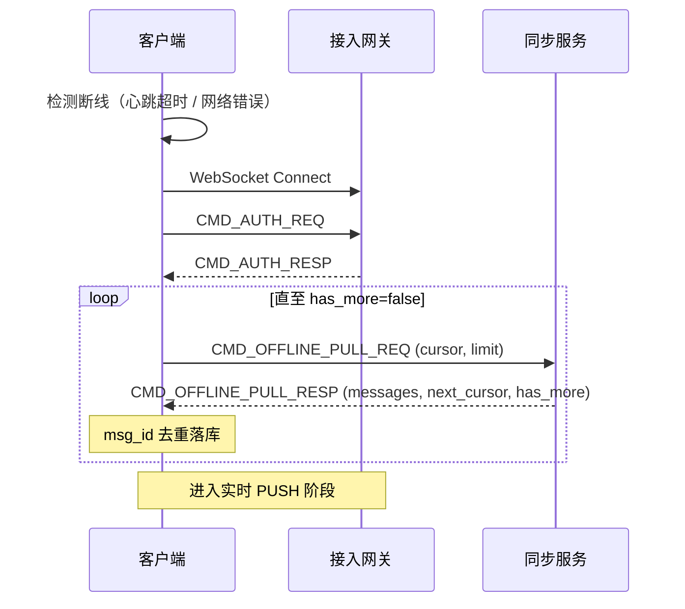

#### 步骤说明

| 步骤 | 方向 | 命令 | 做什么 | 返回什么 |
| --- | --- | --- | --- | --- |
| 1 | C | 退避重连 | 建议 1s→2s→4s…上限 30s | — |
| 2 | C→G | `AUTH_REQ` | 新 `session_id`；重新获取配置参数 | `AUTH_RESP`（同 §4.1） |
| 3 | C→S | `OFFLINE_PULL_REQ` | `conv_id` 空 = 全量收件箱；`cursor` = 本地 `inbox_seq`（首次为 0） | — |
| 4 | S→C | `OFFLINE_PULL_RESP` | 拉取 `inbox_seq > cursor` 的消息 | `messages[]`（升序）、`next_cursor`、`has_more` |
| 5 | C | 循环 | `has_more=true` 时用 `next_cursor` 继续请求 | 直至 `has_more=false` |
| 6 | C | 就绪 | 拉取期间若收到 PUSH，按 `msg_id` 去重 | 可正常发消息 / ACK |

**发送中消息重试**：用相同 `client_msg_id` 重发 `MSG_SEND`；服务端幂等返回原 `ACK_DOWN`，不重复 PUSH 给对端。

---

### 4.5 离线拉取

#### 时序图

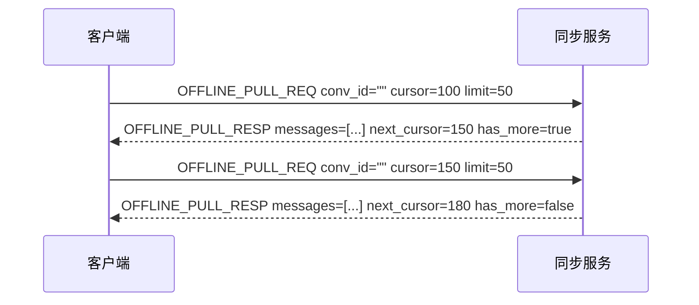

#### 步骤说明

| 步骤 | 方向 | 命令 | 请求字段 | 返回什么 |
| --- | --- | --- | --- | --- |
| 1 | C→S | `OFFLINE_PULL_REQ` | **全量模式**：`conv_id` 空，`cursor`=本地 `inbox_seq`，`limit`≤200（默认 50） | — |
| 2 | S→C | `OFFLINE_PULL_RESP` | 查询当前用户收件箱 `inbox_seq > cursor` | `messages`（完整 `ChatMessage`，含 `recalled`/`edit_version`）、`next_cursor`、 `has_more` |
| 3 | C→S | `OFFLINE_PULL_REQ` | **单会话模式**：`conv_id` 非空，`cursor`=该会话 `conv_seq` | — |
| 4 | S→C | `OFFLINE_PULL_RESP` | 查询 `conv_id` 下 `conv_seq > cursor` | 同上，`next_cursor` 为最大 `conv_seq` |
| 失败 | S→C | `CMD_ERROR` | 参数非法等 | `code` 对应错误码；**不关连接** |

**范围**：仅单聊 / 群聊；不含聊天室。

---

### 4.6 发送消息 — 单聊（含双阶段 ACK）

#### 时序图

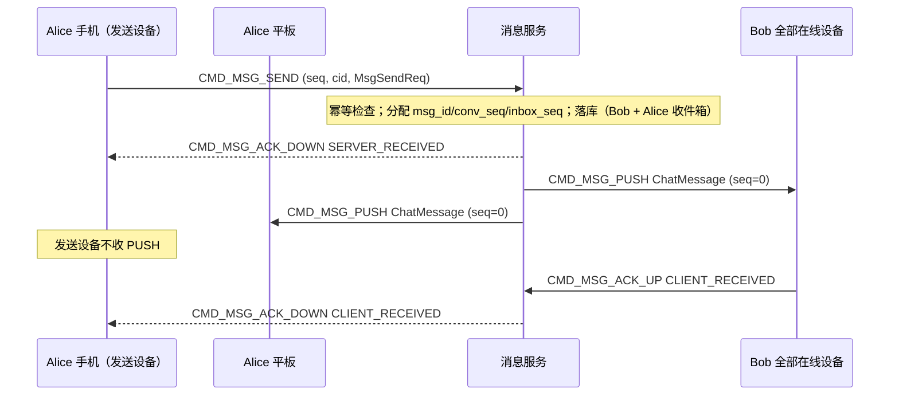

#### 步骤说明

| 步骤 | 方向 | 命令 | 做什么 | 返回什么 |
| --- | --- | --- | --- | --- |
| 1 | A1→S | `CMD_MSG_SEND` | `MsgSendReq.message` 含 `chat_type=PRIVATE`、`from`、`to`、`conv_id`、`msg_type`、`content`、`client_msg_id`；`Packet.cid` 必填 | — |
| 2 | S | 校验 | `from` = 连接 user；`to` 存在于 app_key；`conv_id` 校验或回填 | 失败 → `CMD_ERROR` 2001/2002/2004 |
| 3 | S | 落库 | 写 Bob 收件箱 + **Alice 收件箱**（多端同步） | 分配 `msg_id`、`server_time`、`conv_seq`、`inbox_seq` |
| 4 | S→A1 | `CMD_MSG_ACK_DOWN` | 第 1 档 ACK | `MsgAck`：`status=SERVER_RECEIVED`、`msg_id`、`conv_seq` |
| 5 | S→B | `CMD_MSG_PUSH` | 推送给 Bob 全部在线设备 | `ChatMessage` 完整字段（`seq=0`） |
| 6 | S→A2 | `CMD_MSG_PUSH` | 推送给 Alice **其他**在线设备 | 同上 |
| 7 | B→S | `CMD_MSG_ACK_UP` | Bob 本地去重后上报 | `MsgAck`：`status=CLIENT_RECEIVED`、`msg_id` |
| 8 | S→A1 | `CMD_MSG_ACK_DOWN` | 第 2 档 ACK，通知发送方对端已收 | `MsgAck`：`status=CLIENT_RECEIVED` |

**幂等重发**：相同 `client_msg_id` 重复 SEND → 返回步骤 4/8 的 ACK，**不重复**步骤 5/6 的 PUSH。

---

### 4.7 发送消息 — 群聊

#### 时序图

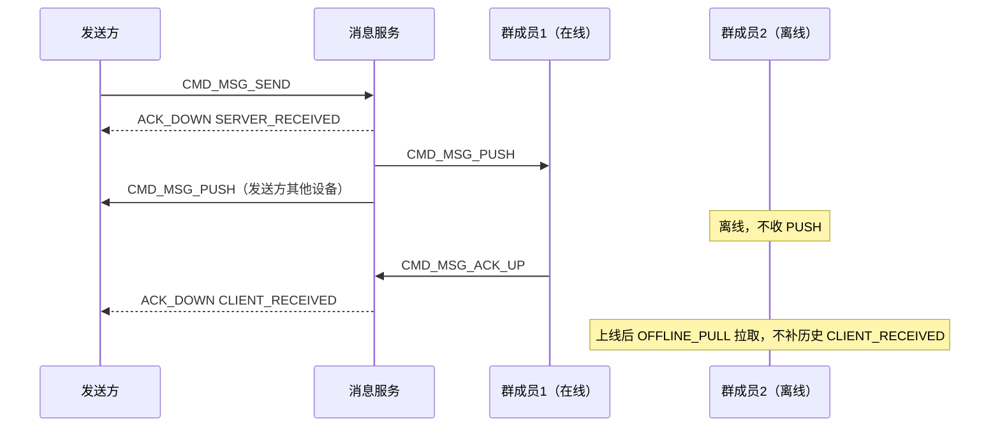

#### 步骤说明

| 步骤 | 与单聊差异 | 返回什么 |
| --- | --- | --- |
| 落库 | `message_bodies` 1 行 + 每收件人 `user_inbox` 1 瘦行（单聊 2 行、群聊 N 行，均含发送方视角） | 统一 JOIN 拉取；各收件人独立 `inbox_seq`，共享 `conv_seq` |
| PUSH | 推给所有**在线**成员 + 发送方其他设备 | `ChatMessage`，`to=group_id` |
| CLIENT_RECEIVED | **任一在线成员**首次 `ACK_UP` 即向发送方推一条 | 不等全员 |
| 全员离线 | 发送方可能长期只有 `SERVER_RECEIVED` | 直至有人上线并 ACK_UP |

---

### 4.8 发送消息 — 聊天室

#### 时序图

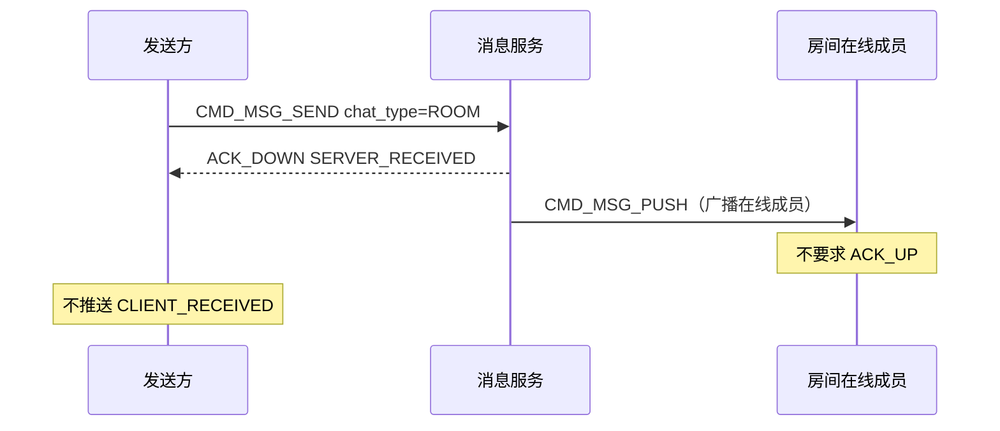

#### 步骤说明

| 步骤 | 方向 | 做什么 | 返回什么 |
| --- | --- | --- | --- |
| 1 | C→S | `MSG_SEND`，`to=room_id` | — |
| 2 | S→C | 受理广播 | `ACK_DOWN(SERVER_RECEIVED)` **仅此一档** |
| 3 | S→R | 广播 PUSH | `ChatMessage`（默认不落库） |
| — | — | 成员不强制 `ACK_UP`；不推 `CLIENT_RECEIVED` | — |

---

### 4.9 批量下行与批量 ACK

#### 时序图

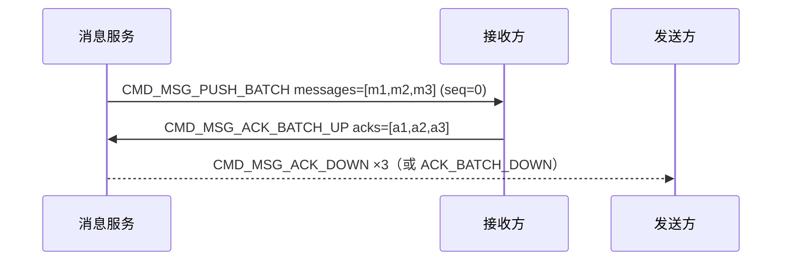

#### 步骤说明

| 步骤 | 方向 | 命令 | 做什么 | 返回什么 |
| --- | --- | --- | --- | --- |
| 1 | S→P | `CMD_MSG_PUSH_BATCH` | 重连积压 / 群高峰合并下发；单包 ≤ `push_batch_max`（50） | `MsgPushBatch.messages`；按 priority HIGH→NORMAL→LOW，同级 `conv_seq` 升序 |
| 2 | P | 本地 | 逐条 `msg_id` 去重落库 | — |
| 3 | P→S | `CMD_MSG_ACK_BATCH_UP` | 批量上报已收 | `MsgAckBatchUp.acks[]`，每条 `status=CLIENT_RECEIVED` |
| 4 | S→C | `CMD_MSG_ACK_DOWN` 或 `ACK_BATCH_DOWN` | 通知发送方送达 | 单聊每条必达；群聊首成员逻辑同 §4.7 |

---

### 4.10 已读回执 — 单聊

#### 时序图

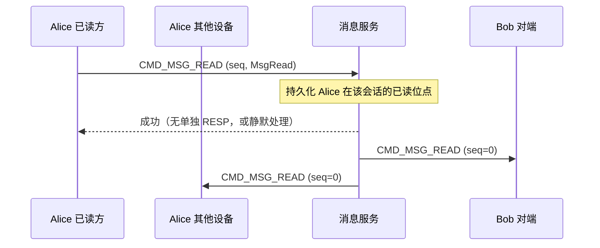

#### 步骤说明

| 步骤 | 方向 | 命令 | 做什么 | 返回什么 |
| --- | --- | --- | --- | --- |
| 1 | A→S | `CMD_MSG_READ` | `from`=连接用户；`conv_id`、`conv_seq`（推荐）、`chat_type`、`to` | 失败 → `CMD_ERROR` |
| 2 | S | 持久化 | 更新 `(app_key, user_id, conv_id)` → `last_read_conv_seq` | — |
| 3 | S→B | `CMD_MSG_READ` | 通知对端全部在线设备：Alice 已读到 `conv_seq` | `MsgRead`（`seq=0`） |
| 4 | S→A2 | `CMD_MSG_READ` | 同步 Alice 其他设备未读状态 | 同上 |

**不进 OFFLINE_PULL**；新设备通过会话元数据 / REST 恢复已读位点。

---

### 4.11 已读回执 — 群聊

#### 步骤说明

| 步骤 | 做什么 | 返回什么 |
| --- | --- | --- |
| 1 | 上报 `CMD_MSG_READ` | 仅更新**本用户**已读位点 |
| 2 | 向同用户其他设备推送 `CMD_MSG_READ` | 多设备未读同步 |
| 3 | **不向**其他群成员广播 | 本期不做群已读列表 |

---

### 4.12 撤回消息

#### 时序图

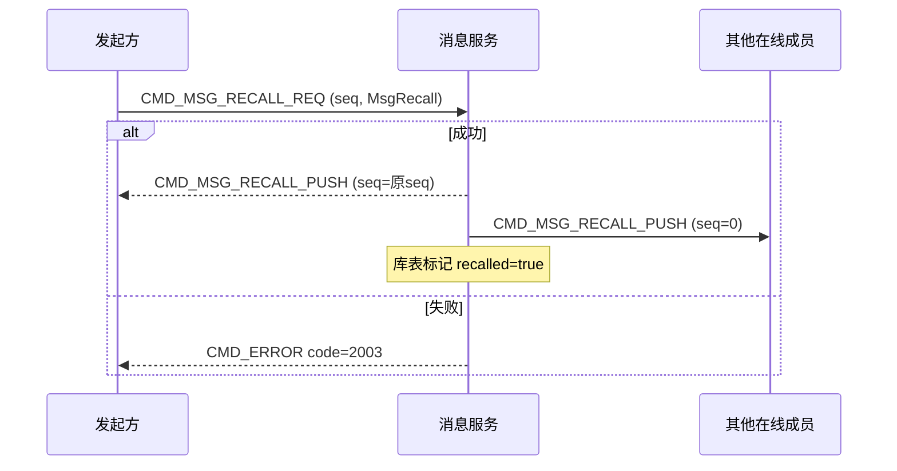

#### 步骤说明

| 步骤 | 方向 | 命令 | 做什么 | 返回什么 |
| --- | --- | --- | --- | --- |
| 1 | C→S | `RECALL_REQ` | `msg_id`、`conv_id`、`from`（=原发送者）、`chat_type`、`to` | — |
| 2 | S | 校验 | 发送者身份；`now - server_time ≤ recall_window_sec`（120s） | 失败 → `CODE_MSG_RECALL_DENIED`(2003) |
| 3 | S | 更新 | `recalled=true`；**不改** `msg_id`/`conv_seq` | — |
| 4 | S→C | `RECALL_PUSH` | 成功确认 | `MsgRecall`（`seq` 回传原请求） |
| 5 | S→O | `RECALL_PUSH` | 广播在线成员 | `MsgRecall`（`seq=0`） |
| 6 | 离线成员 | `OFFLINE_PULL` | 拉取时 `ChatMessage.recalled=true` | — |
| 重复请求 | — | 幂等成功 | 可再推 `RECALL_PUSH` | — |

---

### 4.13 编辑消息

#### 时序图

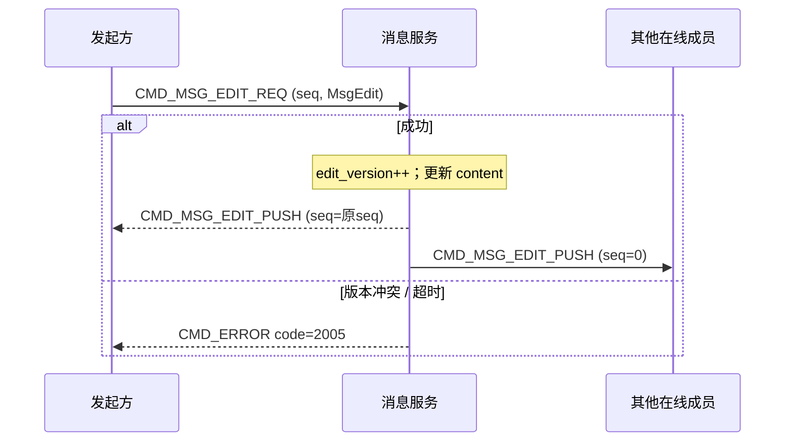

#### 步骤说明

| 步骤 | 方向 | 命令 | 做什么 | 返回什么 |
| --- | --- | --- | --- | --- |
| 1 | C→S | `EDIT_REQ` | `msg_id`、`msg_type`、`content`、`edit_version`（乐观锁，可选）、`conv_id` | — |
| 2 | S | 校验 | 原发送者；未撤回；`edit_window_sec`（120s）；版本不冲突 | 失败 → `CODE_MSG_EDIT_DENIED`(2005) |
| 3 | S | 更新 | `edit_version` 从 1 递增；更新 `content` | — |
| 4 | S→C | `EDIT_PUSH` | 成功确认 | `MsgEdit`（含新 `edit_version`、`timestamp`） |
| 5 | S→O | `EDIT_PUSH` | 广播 | `MsgEdit`（`seq=0`） |
| 6 | 离线 | `OFFLINE_PULL` | 返回最新 `content` + `edit_version` | — |

---

### 4.14 透传信令

#### 4.14.1 在线透传（persist=false）

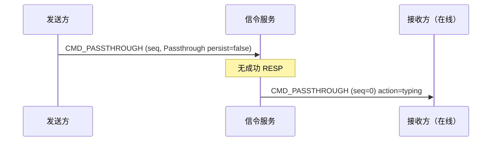

| 步骤 | 方向 | 做什么 | 返回什么 |
| --- | --- | --- | --- |
| 1 | A→S | `action`（如 `typing`）、`data`、`conv_id`、`to` | 失败 → `CMD_ERROR`（如 5001 限流）；**无成功 RESP** |
| 2 | S→B | 仅转发给**在线**目标 | `Passthrough`（`seq=0`） |
| 3 | B 离线 | — | 直接丢弃 |

#### 4.14.2 离线暂存（persist=true）

| 步骤 | 方向 | 做什么 | 返回什么 |
| --- | --- | --- | --- |
| 1 | A→S | `persist=true` | 服务端暂存 `Passthrough`（建议 TTL 7 天） |
| 2 | B 上线 | 鉴权成功后 | 服务端主动 `CMD_PASSTHROUGH` PUSH |
| — | — | **不走** `OFFLINE_PULL` | — |

**特点**：不进会话历史、不计未读、无 ACK。

---

### 4.15 错误处理（通用）

#### 时序图

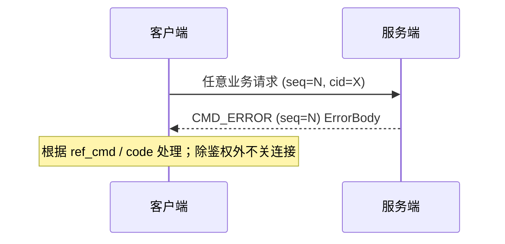

#### 步骤说明

| 场景 | 返回 | 是否关连接 |
| --- | --- | --- |
| 鉴权失败 | `code=1001` | **是** |
| 协议版本不支持 | `code=1003` | 视实现 |
| 消息非法 / conv_id 错误 | `code=2001` | 否 |
| 无权限 | `code=2002` | 否 |
| 撤回拒绝 | `code=2003` | 否 |
| 会话不存在 | `code=2004` | 否 |
| 编辑拒绝 | `code=2005` | 否 |
| 限流 | `code=5001` | 否 |
| 内部错误 | `code=5000` | 否 |

`ErrorBody` 字段：`code`、`msg`（调试）、`ref_cmd`（原命令）、`ref_cid`（原幂等 ID）。

---

## 5. 消息数据模型速查

### 5.1 ChatMessage 核心字段

| 字段 | 谁填 | 用途 |
| --- | --- | --- |
| `msg_id` | 服务端 | 全局唯一；去重 |
| `client_msg_id` | 客户端 | 发送幂等 |
| `conv_id` | 客户端填 / 服务端校验 | 会话稳定 ID |
| `conv_seq` | 服务端 | 会话内排序与单会话离线游标 |
| `inbox_seq` | 服务端 | 用户全量离线游标 |
| `priority` | 客户端可设 | 投递优先级，**不影响**展示序 |
| `recalled` / `edit_version` / `burned` | 服务端 | 撤回 / 编辑 / 阅后即焚状态 |

### 5.2 conv_id 格式

| chat_type | 格式 | 示例 |
| --- | --- | --- |
| 单聊 | `p:{uid_lo}:{uid_hi}` | `p:alice:bob` |
| 群聊 | `g:{group_id}` | `g:grp_123` |
| 聊天室 | `r:{room_id}` | `r:room_456` |

---

## 6. 客户端推荐状态机

```text
[未连接]
    │ Connect
    ▼
[鉴权中] ──失败──► [未连接]
    │ 成功
    ▼
[同步中] OFFLINE_PULL 循环
    │ has_more=false
    ▼
[就绪] ◄──► 心跳 / 发消息 / ACK / READ / 透传
    │ 断线 / 踢人
    ▼
[未连接] → 退避重连
```

---

## 7. 文档索引

| 类型 | 路径 |
| --- | --- |
| 协议规范 | [`protocol/protocol.md`](protocol/protocol.md) |
| 存储设计 | [`database/database-design.md`](database/database-design.md) |
| 设计意图（按模块） | [`design/`](design/) |
| 决策索引 | [`design-decisions.md`](design-decisions.md) |
| Protobuf | [`proto/`](../proto/) |
| AI 协作 | [`agent.md`](../agent.md) |

---

