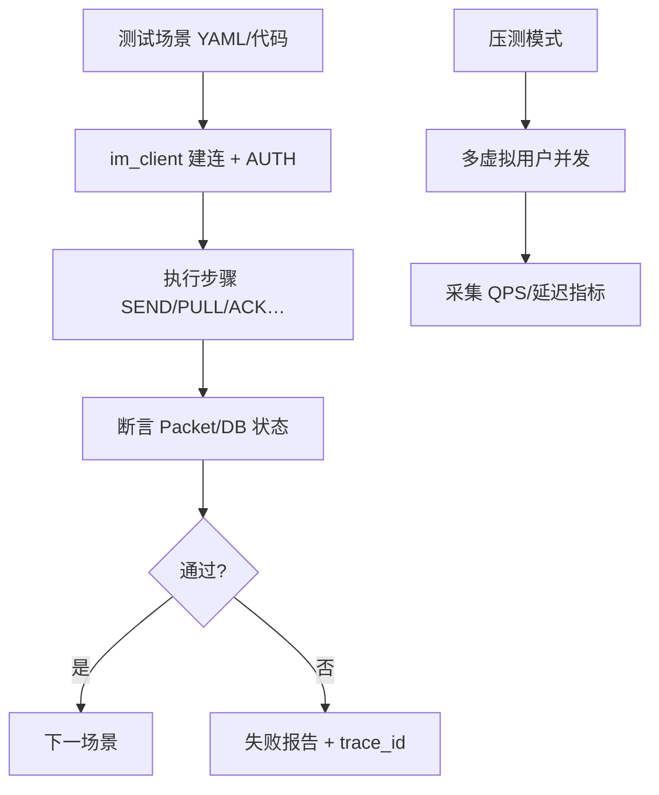

# 设计说明：自动化测试客户端

| 项 | 内容 |
|------|------|
| 状态 | 已确认 |
| 决策编号 | DD-023 |
| 规范定义 | 本文档 |
| 行为约定 | 本文档 |
| 索引 | [`design-decisions.md`](../design-decisions.md) |
| 实现文档 | [implementation/elixir/test-client.md](../implementation/elixir/test-client.md) |

---

## 1. 要解决什么问题

IM 系统需要进行多层次的自动化测试：

### 1.1 测试类型

| 测试类型 | 目的 | 场景 |
|---------|------|------|
| **功能测试** | 验证协议正确性 | 鉴权、发消息、ACK、撤回、阅后即焚等 |
| **回归测试** | 防止功能退化 | 每次发版前自动运行 |
| **压力测试** | 验证系统容量 | 模拟万级在线、万级 QPS |
| **稳定性测试** | 验证长时间运行 | 72 小时不崩溃、无内存泄漏 |
| **兼容性测试** | 验证多端一致 | iOS/Android/Web 行为一致 |

---

## 完整流程



功能回归走 ExUnit + `apps/elixir/im_client`；压测走 `apps/elixir/loadtest`（见 [monorepo-layout.md](../implementation/monorepo-layout.md)）。

**与 Web 演示控制台的区别**（[web-console.md](web-console.md) DD-037）：`im_client` 为 **无头** 自动化库，服务 CI/压测；`apps/web/im-console` 为 **浏览器 SPA**，供 **人工全协议走查** 与演示。二者均须覆盖 protocol 客户端能力；Console 侧重 UI 与双通道对照，im_client 侧重并发与断言。共用 `proto/`、互不依赖运行时。

### 1.2 测试场景

| 场景 | 说明 |
|------|------|
| 单用户行为 | 登录、发消息、收消息、ACK、已读、撤回、阅后即焚 |
| 双用户交互 | 单聊、已读回执、输入状态 |
| 群组场景 | 群聊、群管理、成员变更 |
| 聊天室场景 | 聊天室、广播、成员管理 |
| 边界场景 | 断线重连、离线拉取、超时 |
| 异常场景 | 非法消息、权限错误、限流 |

### 1.3 为什么需要专用测试客户端

**现有方案的问题**：
- 真实客户端 SDK 不适合大规模并发测试
- 手动测试无法覆盖所有场景
- 缺乏协议层面的可观测性

**专用测试客户端的优势**：
- 支持大规模并发（万级连接）
- 可编程的测试场景
- 完整的协议日志和指标
- 可集成到 CI/CD 流程

---

## 2. 决策是什么

### 2.1 架构设计

```
┌─────────────────────────────────────────────────────────────┐
│                    测试控制中心 (Test Controller)            │
│  - 测试场景配置                                               │
│  - 测试客户端管理                                             │
│  - 结果收集与报告                                             │
└────────────────────┬────────────────────────────────────────┘
                     │
         ┌───────────┼───────────┬─────────────┐
         ▼           ▼           ▼             ▼
   ┌──────────┐ ┌──────────┐ ┌──────────┐ ┌──────────┐
   │ Client 1 │ │ Client 2 │ │ Client 3 │ │ Client N │
   │ (Worker) │ │ (Worker) │ │ (Worker) │ │ (Worker) │
   └──────────┘ └──────────┘ └──────────┘ └──────────┘
         │           │           │             │
         └───────────┴───────────┴─────────────┘
                     │
                     ▼
         ┌───────────────────────┐
         │   IM Server Cluster   │
         └───────────────────────┘
```

### 2.2 核心组件

#### 2.2.1 测试控制中心 (Test Controller)

**职责**：
- 加载测试场景配置
- 创建和管理测试客户端
- 下发测试任务
- 收集测试结果
- 生成测试报告

**技术选型**：
- Elixir + Phoenix（利用并发优势）
- 或 Go（单机高性能）

#### 2.2.2 测试客户端 (Test Client Worker)

**职责**：
- 建立 WebSocket 连接
- 执行协议交互
- 记录请求/响应
- 上报指标和日志

**技术选型**：
- **推荐**：Elixir（与 IM Server 同语言，协议共享）
- 备选：Go（单机更高性能）

#### 2.2.3 数据收集器 (Data Collector)

**职责**：
- 收集客户端日志和指标
- 汇总统计结果
- 持久化测试数据

**技术选型**：
- InfluxDB / Prometheus（时序指标）
- Elasticsearch（日志搜索）
- PostgreSQL（测试结果）

#### 2.2.4 报告生成器 (Report Generator)

**职责**：
- 生成 HTML/JSON 测试报告
- 统计成功/失败率
- 分析性能数据

---

## 3. 为什么这样设计

### 3.1 为什么使用 Elixir

| 优势 | 说明 |
|------|------|
| **并发模型** | 轻量级进程，单机万级连接无压力 |
| **协议复用** | 与 IM Server 共享 proto 定义和编解码模块 |
| **热更新** | 测试脚本可热更新，无需重启 |
| **分布式** | 天然支持多节点，可扩展测试规模 |

### 3.2 为什么分离 Controller 和 Worker

| 原因 | 说明 |
|------|------|
| **职责分离** | Controller 管理调度，Worker 执行测试 |
| **水平扩展** | Worker 可按需扩展，适应不同规模 |
| **故障隔离** | 单个 Worker 崩溃不影响整体测试 |
| **资源隔离** | Controller 和 Worker 可部署在不同机器 |

### 3.3 为什么需要专用协议客户端

| 原因 | 说明 |
|------|------|
| **可控性** | 完全控制协议行为（正常、异常、边界） |
| **可观测** | 记录每个请求/响应的详细信息 |
| **可编程** | 用代码定义测试场景，灵活配置 |
| **高性能** | 专为测试优化，单机支持万级连接 |

---

## 4. 有什么好处

### 4.1 自动化测试

| 好处 | 说明 |
|------|------|
| CI/CD 集成 | 每次提交自动运行功能测试 |
| 快速反馈 | 几分钟内发现回归问题 |
| 覆盖率高 | 自动覆盖所有协议命令 |

### 4.2 压力测试

| 好处 | 说明 |
|------|------|
| 容量规划 | 验证系统承载能力 |
| 性能瓶颈 | 发现性能瓶颈和优化点 |
| 稳定性验证 | 长时间运行验证稳定性 |

### 4.3 问题排查

| 好处 | 说明 |
|------|------|
| 协议日志 | 完整记录请求/响应，便于排查 |
| 重现场景 | 可重现特定测试场景 |
| 对比分析 | 对比不同版本的性能指标 |


---

## 5. 测试客户端设计

### 5.1 核心模块

```elixir
defmodule IM.TestClient do
  @moduledoc """
  自动化测试客户端。
  """
  
  use GenServer
  
  defstruct [
    :conn_pid,           # WebSocket 连接进程
    :socket,             # Socket 状态
    :config,             # 客户端配置
    :state,              # 当前状态
    :pending_requests,   # 等待响应的请求
    :message_log,        # 消息日志
    :metrics             # 性能指标
  ]
  
  # 状态机
  # :disconnected -> :connecting -> :authenticating -> :connected -> :disconnecting
  
  def start_link(config) do
    GenServer.start_link(__MODULE__, config)
  end
  
  def connect(client) do
    GenServer.call(client, :connect)
  end
  
  def authenticate(client, auth_req) do
    GenServer.call(client, {:authenticate, auth_req})
  end
  
  def send_message(client, message) do
    GenServer.call(client, {:send_message, message})
  end
  
  def disconnect(client) do
    GenServer.call(client, :disconnect)
  end
end
```

### 5.2 协议编解码

```elixir
defmodule IM.TestClient.Protocol do
  @moduledoc """
  协议编解码模块，复用 IM Server 的 proto 定义。
  """
  
  alias IM.Protocol.{Packet, Codec}
  
  def encode_packet(cmd, payload, opts \\ []) do
    %Packet{
      ver: 1,
      cmd: cmd,
      seq: Keyword.get(opts, :seq, 1),
      ts: System.system_time(:millisecond),
      cid: Keyword.get(opts, :cid),
      trace_id: Keyword.get(opts, :trace_id),
      payload: payload,
      route_key: Keyword.get(opts, :route_key)
    }
    |> Codec.encode()
  end
  
  def decode_packet(binary) do
    Codec.decode(binary)
  end
end
```

### 5.3 测试场景 DSL

```elixir
defmodule IM.TestClient.DSL do
  @moduledoc """
  测试场景 DSL，用于定义测试用例。
  """
  
  defmacro scenario(name, do: block) do
    quote do
      def unquote(name)(config \\ %{}) do
        context = %{config: config, clients: %{}, results: []}
        unquote(block)
        context
      end
    end
  end
  
  defmacro connect(client_name, opts) do
    quote do
      {:ok, pid} = IM.TestClient.start_link(unquote(opts))
      context = put_in(context, [:clients, unquote(client_name)], pid)
      :ok = IM.TestClient.connect(pid)
      context
    end
  end
  
  defmacro send_message(client_name, message) do
    quote do
      client = context.clients[unquote(client_name)]
      {:ok, ack} = IM.TestClient.send_message(client, unquote(message))
      context = update_in(context, [:results], &(&1 ++ [ack]))
      context
    end
  end
end
```

### 5.4 测试场景示例

```elixir
defmodule IM.TestScenarios do
  use IM.TestClient.DSL
  
  scenario :single_chat do
    # 用户 Alice 登录
    connect :alice, %{host: "localhost", port: 4000}
    authenticate :alice, %{app_key: "test", user_id: "alice"}
    
    # 用户 Bob 登录
    connect :bob, %{host: "localhost", port: 4000}
    authenticate :bob, %{app_key: "test", user_id: "bob"}
    
    # Alice 发消息给 Bob
    send_message :alice, %{from: "alice", to: "bob", content: "Hello"}
    
    # Bob 收到消息
    assert_received :bob, 5000 do
      assert message.from == "alice"
    end
    
    disconnect :alice
    disconnect :bob
  end
end
```


---

## 6. 压力测试设计

### 6.1 测试控制器

```elixir
defmodule IM.LoadTest.Controller do
  use GenServer
  
  def run_test(config) do
    # 1. 创建 Worker 进程
    workers = for i <- 1..config.worker_count do
      {:ok, pid} = IM.LoadTest.Worker.start_link(%{worker_id: i})
      pid
    end
    
    # 2. 分发测试任务
    tasks = Enum.map(workers, fn worker ->
      Task.async(fn ->
        IM.LoadTest.Worker.run(worker, config.scenario)
      end)
    end)
    
    # 3. 等待所有任务完成
    results = Task.await_many(tasks, config.timeout || :infinity)
    
    # 4. 汇总结果
    generate_report(results)
  end
  
  defp generate_report(results) do
    %{
      total_requests: Enum.sum(Enum.map(results, & &1.request_count)),
      success_count: Enum.sum(Enum.map(results, & &1.success_count)),
      failure_count: Enum.sum(Enum.map(results, & &1.failure_count)),
      avg_latency_ms: calculate_avg_latency(results),
      qps: calculate_qps(results)
    }
  end
end
```

### 6.2 压测配置示例

```elixir
%{
  worker_count: 10,            # Worker 进程数
  users_per_worker: 100,       # 每个 Worker 的用户数
  scenario: :message_flood,    # 测试场景
  iterations: 100,             # 每个用户发送的消息数
  timeout: 300_000,            # 超时时间（5 分钟）
  message_size: 100,           # 消息大小（字节）
  sample_rate: 0.1             # 采样率（10%）
}
```

---

## 7. 功能测试设计

### 7.1 测试用例组织

```
test/
├── protocol/                    # 协议测试
│   ├── auth_test.exs           # 鉴权测试
│   ├── message_test.exs        # 消息测试
│   └── ack_test.exs            # ACK 测试
├── scenario/                    # 场景测试
│   ├── single_chat_test.exs    # 单聊场景
│   ├── group_chat_test.exs     # 群聊场景
│   └── multi_device_test.exs   # 多端同步场景
└── stress/                      # 压力测试
    └── message_flood_test.exs
```

### 7.2 测试用例示例

```elixir
defmodule IM.Test.Protocol.AuthTest do
  use ExUnit.Case
  
  test "successful authentication" do
    {:ok, client} = IM.TestClient.start_link(%{})
    :ok = IM.TestClient.connect(client)
    
    auth_req = %{
      app_key: "test_app",
      user_id: "test_user",
      token: "valid_token"
    }
    
    assert {:ok, _resp} = IM.TestClient.authenticate(client, auth_req)
    
    IM.TestClient.disconnect(client)
  end
end
```

---

## 8. 指标收集与报告

### 8.1 关键指标

| 指标类别 | 指标名称 | 说明 |
|---------|---------|------|
| **连接指标** | 连接成功率 | 连接建立成功的比例 |
| | 连接延迟 | 建立连接的平均时间 |
| **消息指标** | 发送成功率 | 消息发送成功的比例 |
| | 推送延迟 | 从发送到接收的时间 |
| | QPS | 每秒处理的消息数 |
| **错误指标** | 错误码分布 | 各类错误的出现频率 |

### 8.2 报告示例

```json
{
  "test_id": "load_test_20260727",
  "duration_ms": 180000,
  "summary": {
    "total_requests": 100000,
    "success_count": 99850,
    "failure_count": 150,
    "success_rate": 0.9985,
    "qps": 555.5
  },
  "latency": {
    "avg_ms": 45,
    "p50_ms": 30,
    "p90_ms": 80,
    "p99_ms": 150,
    "max_ms": 500
  },
  "errors": [
    {"code": 5001, "count": 100, "message": "Rate limited"},
    {"code": 9000, "count": 50, "message": "Internal error"}
  ]
}
```


---

## 9. CI/CD 集成

### 9.1 GitHub Actions 示例

```yaml
name: IM Test Suite

on:
  push:
    branches: [main, develop]

jobs:
  protocol-test:
    runs-on: ubuntu-latest
    steps:
      - uses: actions/checkout@v3
      
      - name: Setup Elixir
        uses: erlef/setup-beam@v1
        with:
          elixir-version: '1.19.5-otp-28'
          otp-version: '28.0'
      
      - name: Run protocol tests
        run: mix test test/protocol/
      
      - name: Run scenario tests
        run: mix test test/scenario/
  
  load-test:
    if: github.ref == 'refs/heads/main'
    steps:
      - name: Run load test
        run: mix run test/stress/message_flood_test.exs
```

### 9.2 测试命令

```bash
# 运行所有协议测试
mix test test/protocol/

# 运行特定场景测试
mix test test/scenario/single_chat_test.exs

# 运行压力测试
MIX_ENV=test mix run test/stress/message_flood_test.exs

# 生成覆盖率报告
mix test --cover
```

---

## 10. 最佳实践

### 10.1 测试环境隔离

| 实践 | 说明 |
|------|------|
| 独立数据库 | 测试使用独立的数据库 |
| 独立 Redis | 测试使用独立的 Redis 实例 |
| 清理数据 | 每次测试后清理测试数据 |
| 超时设置 | 所有测试都设置超时 |

### 10.2 断言最佳实践

```elixir
# 好：明确断言，有超时
assert_receive {:push, ^client, message}, 5000
assert message.from == "alice"

# 差：模糊断言，无超时
assert_received {:push, _, _}
```

---

## 11. 刻意放弃 / 不做的事

| 放弃项 | 原因 |
|--------|------|
| UI 自动化测试 | IM 协议层测试不依赖 UI |
| 真实设备测试 | 测试客户端模拟协议行为 |
| 生产环境压测 | 压测在独立测试环境进行 |

---

## 12. 总结

| 项 | 说明 |
|------|------|
| **架构** | Controller-Worker 分离，支持水平扩展 |
| **技术选型** | Elixir（与 IM Server 同语言，协议复用） |
| **测试类型** | 功能测试、回归测试、压力测试、稳定性测试 |
| **DSL** | 提供易用的测试场景 DSL |
| **指标收集** | 完整的指标收集和报告生成 |
| **CI/CD** | 集成到持续集成流程 |

---

## 附录：目录结构

```
test_client/
├── lib/
│   ├── im_test_client.ex           # 主模块
│   ├── client.ex                    # 客户端核心
│   ├── protocol.ex                  # 协议编解码
│   ├── dsl.ex                       # 测试 DSL
│   ├── metrics.ex                   # 指标收集
│   └── reporter.ex                  # 报告生成
├── test/
│   ├── protocol/                    # 协议测试
│   ├── scenario/                    # 场景测试
│   └── stress/                      # 压力测试
└── config/
    └── load_test.exs                # 压测配置
```
