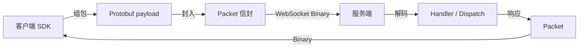

# 设计说明：传输与序列化

| 项 | 内容 |
| --- | --- |
| 状态 | **已确认** |
| 决策编号 | DD-001 |
| 规范约定 | [`protocol.md` §1](protocol/protocol.md#1-技术选型) |
| 索引 | [`design-decisions.md`](../design-decisions.md) |

---

## 完整流程

REST 通道使用 JSON 或 Protobuf body，不经 Packet 信封（见 [dual-channel-api.md](dual-channel-api.md)）。

## 决策

- 传输：**WebSocket Binary Frame**
- 序列化：**Protobuf 3**
- 协议版本从 **`ver = 1`** 起
- **Payload 压缩**：鉴权协商 `NONE` / `GZIP` / `LZ4`（v1 仅 `NONE`）；见 [payload-compression.md](payload-compression.md)

## 为什么这样设计

### WebSocket

- IM 需要服务端主动推送，全双工模型匹配。
- 浏览器、移动端、桌面端生态成熟，接入成本低。
- 可走 443 / 反向代理，防火墙友好。
- 使用**二进制帧**承载 Protobuf，避免文本帧转义与额外体积。

### Protobuf

- 有显式 schema，多语言代码生成，端到端字段一致。
- 相对 JSON：体积更小、解析更快，适合高频心跳与消息。
- 相对纯自定义二进制：字段号兼容演进更安全，文档与实现更易对齐。

### `ver`

- 多端 SDK 不可能同时升级；不兼容时必须可拒绝，避免脏写与诡异互操作。

## 好处小结

| 点 | 好处 |
| --- | --- |
| 推送自然 | 不必轮询 |
| 性能可控 | 二进制 + Protobuf |
| 可演进 | 版本门禁 + proto 字段兼容规则 |

## 热路径少拷贝

传输层选定二进制 + Protobuf 后，实现须避免 **decode → struct → encode** 循环。约定见 [zero-copy-delivery.md](zero-copy-delivery.md)：

- 下行 `Packet` **编码一次**，扇出传递 `packet_binary`
- Kafka `payload` **透传** `Packet.payload` bytes
- 落库存 PB `bytes`，禁止热路径 JSON 中转

