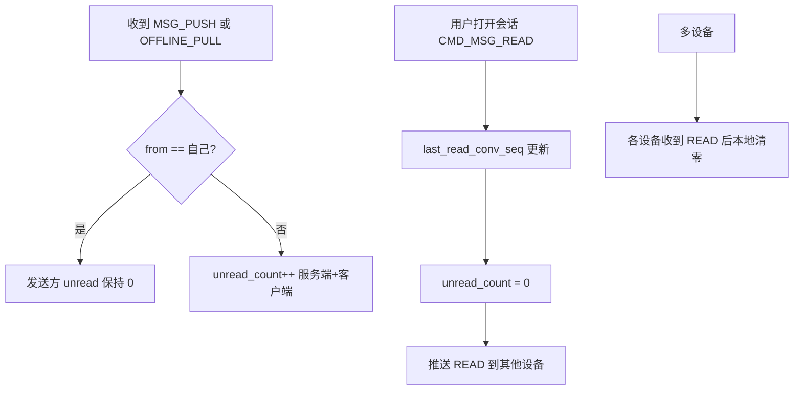
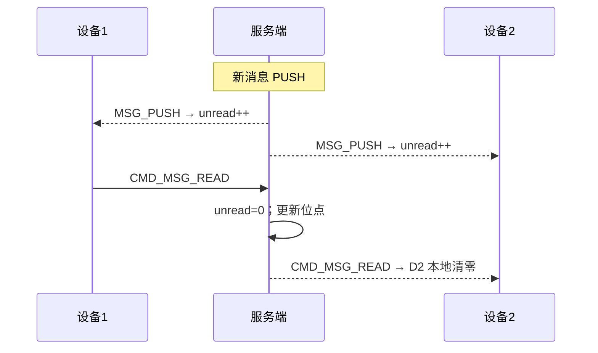

# 设计说明：未读数管理

| 项 | 内容 |
|------|------|
| 状态 | 已确认 |
| 决策编号 | DD-015 |
| 规范定义 | [`proto/message.proto`](../../proto/message.proto)（`MsgRead`）、[`database/database-design.md`](database/database-design.md)（`conversations.unread_count`） |
| 行为约定 | 本文档 |
| 相关文档 | [read-receipt.md](read-receipt.md)、[multi-device.md](multi-device.md) |
| 索引 | [`design-decisions.md`](../design-decisions.md) |
| 实现文档 | [implementation/elixir/unread-count.md](../implementation/elixir/unread-count.md) |

---

## 1. 要解决什么问题

未读数是IM核心功能，直接影响用户体验。需要明确：

- 未读数如何计算
- 未读数何时更新
- 多设备场景下未读数如何同步
- 已读回执与未读数的关系

---

## 2. 决策是什么

### 2.1 核心定义

**未读数** = 该会话中 `conv_seq > last_read_conv_seq` 的消息数量

| 概念 | 说明 |
|------|------|
| `last_read_conv_seq` | 用户在该会话中已读到的最大 `conv_seq`（服务端持久化） |
| `unread_count` | 会话未读数（存储在 `conversations` 表，冗余字段） |

### 2.2 存储设计

**服务端**:
- `conversations.unread_count`：会话未读数（冗余，用于快速查询）
- 隐式已读位点：`last_read_conv_seq`（可通过已读回执推算）

**客户端**:
- 本地维护未读数（用于UI展示）
- 本地维护已读位点（用于离线计算）

### 2.3 计算规则

#### 2.3.1 服务端计算（权威）

```sql
-- 实时计算（精确，但性能开销大；写扩散路径）
SELECT COUNT(*)
FROM user_inbox i
JOIN message_bodies b ON b.app_key = i.app_key AND b.msg_id = i.msg_id
WHERE i.app_key = ? AND i.user_id = ? AND i.conv_id = ?
  AND i.conv_seq > ?   -- last_read_conv_seq
  AND b.from_uid != ?;

-- 冗余存储（推荐，查询快）
-- conversations.unread_count + last_read_conv_seq
```

#### 2.3.2 客户端计算（辅助）

```
本地未读数 = 本地最新消息的 conv_seq - last_read_conv_seq
（需排除自己发送的消息）
```

---

## 完整流程





---

## 3. 为什么这样设计

### 3.1 服务端权威 + 客户端缓存

| 方案 | 优点 | 缺点 |
|------|------|------|
| **服务端权威**（选择） | 数据准确、多设备一致 | 需要推送更新 |
| 客户端计算 | 减少服务端压力 | 多设备不一致、已读回执延迟导致误差 |

**选择理由**：
- 未读数是关键业务数据，准确性优先
- 多设备场景下，服务端是唯一权威来源
- 客户端本地缓存用于优化体验，但以服务端为准

### 3.2 冗余存储 `unread_count`

| 方案 | 优点 | 缺点 |
|------|------|------|
| **冗余存储**（选择） | 查询快、会话列表直接返回 | 需维护一致性 |
| 实时计算 | 无需维护 | 查询性能差、会话列表慢 |

**选择理由**：
- 会话列表是高频查询场景，未读数必须快速返回
- 写入时更新 `unread_count`，读取时无需计算
- 通过事务和幂等保证一致性

---

## 4. 有什么好处

### 4.1 用户体验

| 好处 | 说明 |
|------|------|
| 实时准确 | 收到消息立即显示未读数，已读立即清零 |
| 多设备一致 | 所有设备显示相同未读数 |
| 离线可靠 | 离线消息拉取后未读数准确 |

### 4.2 技术优势

| 好处 | 说明 |
|------|------|
| 查询高效 | 会话列表无需实时计算，直接读 `unread_count` |
| 扩展性好 | 支持后续未读数相关功能（未读消息提醒、角标等） |
| 调试友好 | 服务端未读数可审计、可修复 |

---

## 5. 刻意放弃 / 不做的事

| 放弃项 | 原因 |
|--------|------|
| 群聊 per-member 未读详情 | 本期不展示「谁读了、谁未读」，可后续通过 REST 扩展 |
| 聊天室未读数 | 聊天室默认不持久化，实时性为主，未读数意义不大 |
| 未读数历史记录 | 仅保留当前未读数，不记录历史变化 |

---

## 6. 未读数更新时机

### 6.1 未读数增加

| 时机 | 服务端行为 | 客户端行为 |
|------|----------|----------|
| 收到新消息（PUSH） | `unread_count++`（接收方） | 本地 `unread_count++` |
| 离线拉取消息 | 批量写入时：`unread_count += 消息数` | 根据已读位点计算 |
| 自己发送消息 | **不更新**（发送方未读数为0） | 本地 `unread_count = 0`（发送方） |

**注意**：发送方不会增加自己的未读数。

### 6.2 未读数清零

| 时机 | 服务端行为 | 客户端行为 |
|------|----------|----------|
| 用户上报已读（`CMD_MSG_READ`） | `unread_count = 0`<br/>持久化 `last_read_conv_seq` | 本地 `unread_count = 0` |
| 多设备已读同步 | 收到 `CMD_MSG_READ` 推送后<br/>本地 `unread_count = 0` | 同左 |

### 6.3 未读数同步

#### 场景1: 实时消息推送

```
服务端 → 客户端：CMD_MSG_PUSH (ChatMessage)
客户端：本地 unread_count++
```

#### 场景2: 已读回执

```
客户端 → 服务端：CMD_MSG_READ (conv_seq=100)
服务端：
  1. 更新 last_read_conv_seq = 100
  2. UPDATE conversations SET unread_count = 0
  3. 推送给其他设备：CMD_MSG_READ
其他设备：本地 unread_count = 0
```

#### 场景3: 离线拉取

```
客户端 → 服务端：CMD_OFFLINE_PULL_REQ (cursor=50)
服务端：
  1. 查询 inbox_seq > 50 的消息（100条）
  2. 返回消息 + conv_seq 范围
客户端：
  1. 根据本地 last_read_conv_seq 计算未读数
  2. 或等待服务端推送已读状态
```

---

## 7. 服务端实现要点

### 7.1 数据一致性

**写入消息时**：
```elixir
def handle_msg_send(message, context) do
  # 1. 落库消息
  {:ok, message} = save_message(message)
  
  # 2. 更新接收方未读数（事务）
  update_unread_count(message.to, message.conv_id, +1)
  
  # 3. 推送
  push_to_recipients(message)
end
```

**已读回执时**：
```elixir
def handle_msg_read(user_id, conv_id, conv_seq) do
  # 事务：更新已读位点 + 清零未读数
  Repo.transaction(fn ->
    # 1. 更新已读位点（隐式或显式存储）
    update_last_read_seq(user_id, conv_id, conv_seq)
    
    # 2. 清零未读数
    Repo.update_all(
      from(c in Conversation,
        where: c.user_id == ^user_id and c.conv_id == ^conv_id,
        set: [unread_count: 0]
      )
    )
  end)
  
  # 3. 推送给其他设备
  push_read_receipt(user_id, conv_id, conv_seq)
end
```

### 7.2 幂等性

**问题**：重复消息推送可能导致 `unread_count` 重复增加。

**解决方案**：
```elixir
def update_unread_count(user_id, conv_id, delta) do
  # 方案1: 客户端去重（msg_id）
  # 客户端收到重复消息时，不上报未读数
  
  # 方案2: 服务端去重（推荐）
  # 使用 msg_id 去重，避免重复更新
  case check_msg_delivered?(msg_id) do
    true -> :ok  # 已推送过，跳过
    false ->
      mark_msg_delivered(msg_id)
      increment_unread_count(user_id, conv_id, delta)
  end
end
```

### 7.3 并发控制

**场景**：用户同时收到多条消息，并发更新 `unread_count`。

**解决方案**：
```sql
-- 使用数据库行锁或乐观锁
UPDATE conversations 
SET unread_count = unread_count + 1,
    updated_at = NOW()
WHERE app_key = ? AND user_id = ? AND conv_id = ?;

-- 或使用 Redis 原子操作
INCR unread_count:{app_key}:{user_id}:{conv_id}
```

---

## 8. 客户端实现要点

### 8.1 本地未读数维护

```swift
// 伪代码
class Conversation {
    var unreadCount: Int = 0
    var lastReadConvSeq: Int64 = 0
    
    func onReceiveMessage(_ message: ChatMessage) {
        // 排除自己发送的消息
        if message.from != currentUserId {
            unreadCount += 1
        }
    }
    
    func onReadMessage(convSeq: Int64) {
        lastReadConvSeq = convSeq
        unreadCount = 0
    }
}
```

### 8.2 多设备同步

```swift
// 收到已读回执推送
func onMsgReadPush(_ msgRead: MsgRead) {
    // 本地未读数清零
    conversations[msgRead.convId]?.unreadCount = 0
    conversations[msgRead.convId]?.lastReadConvSeq = msgRead.convSeq
}
```

### 8.3 离线拉取后计算

```swift
func onOfflinePull(messages: [ChatMessage]) {
    for msg in messages {
        // 排除已读消息
        if msg.convSeq > lastReadConvSeq {
            unreadCount += 1
        }
    }
}
```

---

## 9. 查询接口

### 9.1 会话列表接口（REST）

**请求**：
```
GET /conversations?include_unread=true
```

**响应**：
```json
{
  "conversations": [
    {
      "conv_id": "p:alice:bob",
      "chat_type": 1,
      "peer_id": "bob",
      "last_msg_preview": "Hello",
      "last_msg_time": 1721808000000,
      "unread_count": 5
    }
  ],
  "total_unread": 10
}
```

### 9.2 未读数推送（可选）

**方案A: 已读回执携带未读数**

```protobuf
message MsgRead {
  ...
  int32 unread_count = 8;  // 可选：已读后的未读数
}
```

**方案B: 独立未读数推送**

```
服务端 → 客户端：CMD_UNREAD_UPDATE
{
  "conv_id": "p:alice:bob",
  "unread_count": 0
}
```

**建议**：本期使用方案A，已读回执携带未读数即可。

---

## 10. 特殊场景处理

### 10.1 发送方未读数

**规则**：发送方的未读数始终为 0。

**实现**：
```elixir
# 发送消息时，不更新发送方的 unread_count
def handle_msg_send(message, context) do
  # 接收方未读数 +1
  update_unread_count(message.to, message.conv_id, +1)
  
  # 发送方未读数保持为 0（或清零）
  update_unread_count(message.from, message.conv_id, 0)
end
```

### 10.2 群聊未读数

**规则**：群聊未读数按会话维度计算，不区分成员。

**实现**：
```elixir
# 群消息写入时，每个成员独立维护未读数
def handle_group_msg_send(message, member_ids) do
  Enum.each(member_ids, fn member_id ->
    # 每个成员的未读数独立计数
    update_unread_count(member_id, message.conv_id, +1)
  end)
end
```

### 10.3 聊天室未读数

**规则**：聊天室默认不显示未读数（消息不持久化）。

**可选扩展**：如需支持聊天室未读数，可在 Redis 中维护短时未读计数。

---

## 11. 性能优化

### 11.1 未读数缓存

**Redis 缓存**（权威定义 [database-design.md](database/database-design.md) §二.6）：

```
Key:   im:unread:{app_key}:{user_id}
Type:  Hash
Value:
  {conv_id}: 未读计数（整数）
TTL:   5 分钟
```

**更新策略**：
- 写消息时：`HINCRBY im:unread:{app_key}:{user_id} {conv_id} 1`
- 已读时：`HSET im:unread:{app_key}:{user_id} {conv_id} 0`，并同步 PG `last_read_conv_seq` / `unread_count`

### 11.2 批量更新

**场景**：离线拉取大量消息时。

**优化**：
```elixir
# 批量更新未读数，减少数据库写入
def batch_update_unread_count(updates) do
  # updates: [{user_id, conv_id, delta}, ...]
  
  Repo.transaction(fn ->
    Enum.each(updates, fn {user_id, conv_id, delta} ->
      Repo.query!(
        "UPDATE conversations SET unread_count = unread_count + $1 WHERE user_id = $2 AND conv_id = $3",
        [delta, user_id, conv_id]
      )
    end)
  end)
end
```

---

## 12. 监控与告警

### 12.1 关键指标

| 指标 | 说明 |
|------|------|
| 未读数更新延迟 | 从消息推送到未读数更新的延迟 |
| 未读数一致性 | 服务端与客户端未读数差异 |
| 未读数查询 QPS | 会话列表查询频率 |

### 12.2 告警规则

| 告警 | 阈值 | 处理 |
|------|------|------|
| 未读数更新失败 | 失败率 > 1% | 检查数据库连接、事务冲突 |
| 未读数不一致 | 差异 > 10% | 客户端重新拉取会话列表 |

---

## 13. 总结

| 项 | 说明 |
|------|------|
| **核心原则** | 服务端权威、客户端缓存、冗余存储 |
| **更新时机** | 收消息 +1、已读清零、发送不计数 |
| **多设备同步** | 已读回执推送后各设备清零 |
| **查询接口** | 会话列表携带未读数，可选独立接口 |

---

## 附录：常见问题

### Q1: 未读数不准确怎么办？

**排查步骤**：
1. 检查服务端 `unread_count` 是否正确
2. 检查 `last_read_conv_seq` 是否正确
3. 客户端重新拉取会话列表，以服务端为准

### Q2: 离线消息导致未读数错误？

**解决方案**：
- 离线拉取时，服务端返回已读位点
- 客户端根据已读位点重新计算未读数
- 或等待服务端推送已读状态

### Q3: 多设备未读数不一致？

**原因**：已读回执推送延迟。

**解决方案**：
- 客户端本地先清零（乐观更新）
- 收到已读回执推送后再次确认
- 如有差异，以服务端推送为准
