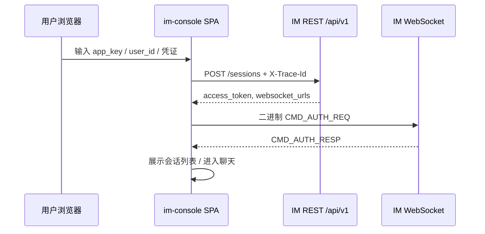
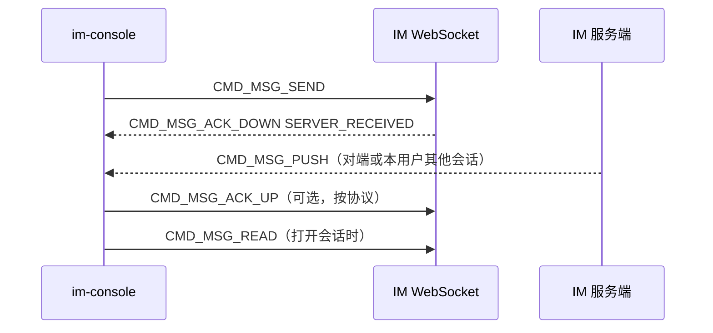

# 设计说明：Web 演示控制台（独立前端）

| 项 | 内容 |
|------|------|
| 状态 | 已确认 |
| 决策编号 | DD-037 |
| 规范定义 | 本文档；协议以 [`proto/`](../../proto/)、[`protocol.md`](protocol/protocol.md) 为准 |
| 行为约定 | 本文档 |
| 索引 | [`design-decisions.md`](../design-decisions.md) |
| 实现文档 | [implementation/web/web-console.md](../implementation/web/web-console.md) |

---

## 1. 要解决什么问题

IM 服务端开发需要 **人工可操作的浏览器客户端**，用于：

| 场景 | 说明 |
|------|------|
| **联调** | Phase 2+ 验证登录、WS 鉴权、发消息、收 PUSH |
| **演示** | 对内展示 **协议已定义的全部客户端能力**（单聊/群/室/好友/通道等），无需安装移动端 SDK |
| **协议对照** | 与 `im_client` 自动化用例互为补充：人眼验收 UI、双通道（WS/REST）与边界交互 |

**不是**：

| 对象 | 说明 |
|------|------|
| **生产 IM SDK** | 不替代业务 App 集成的 Web SDK；无 SLA、无完整机型适配 |
| **`im_client` / TestClient** | 后者为 **无头** Elixir 库，服务 ExUnit / CI / 压测（见 [test-client.md](test-client.md) DD-023） |
| **IM Release 一部分** | 独立构建、独立部署；**不打进** `apps/elixir/im` OTP Release |

---

## 2. 决策是什么

### 2.1 形态：独立前端 SPA

| 项 | 决策 |
|------|------|
| **架构** | **独立** Web 应用，仓库路径 `apps/web/im-console/` |
| **技术栈** | **TypeScript** + **Vite** + **React**（可换 Vue，须保持独立 SPA + 同协议契约） |
| **协议** | 与移动端一致：`POST /api/v1/sessions` 登录 + **WebSocket 二进制 Protobuf** 实时通道 |
| **Proto** | 从仓库根 `proto/` 生成 TypeScript 类型与编解码（与 `im` / `im_client` 同源） |
| **存储** | 浏览器 `localStorage` / `IndexedDB` 缓存 token、`inbox_seq`、会话草稿（轻量，非完整 SDK 消息库） |
| **环境** | 默认对接 **dev / staging**；生产租户须显式配置 `app_key` 与网关地址 |

### 2.2 与双通道 API 的关系

遵循 [dual-channel-api.md](dual-channel-api.md)：

| 能力 | 通道 | Web Console 用法 |
|------|------|------------------|
| 登录、会话列表、群资料等 | REST `/api/v1` + Bearer | 管理类操作、首屏数据 |
| 实时消息、心跳、PUSH | WebSocket `Packet` | 主聊天路径 |
| 内部 API | `/internal/v1` | **禁止**从浏览器调用 |

`MessageContext.source` 在服务端记为 `:http_client`（REST）或 `:websocket`（WS），与正式 Web SDK 一致。

### 2.3 平台标识

登录与 `CMD_AUTH_REQ` 使用 `platform = web`（或与 [auth.md](auth.md) §8 设备枚举一致的 `web` 字符串），`device_id` 由浏览器生成并持久化（UUID），便于多端限制与踢人测试。

---

## 完整流程

### 登录与建连



### 发消息与收 PUSH



---

## 3. 功能范围：协议能力全覆盖

### 3.1 原则

| 项 | 约定 |
|------|------|
| **覆盖目标** | Console 须能 **人工演示** [`protocol.md`](protocol/protocol.md) 中所有 **客户端可操作** 的能力，以及与 [`dual-channel-api.md`](dual-channel-api.md) 对齐的 **REST 等价操作** |
| **与 IM 节奏** | 实现 **跟随** IM roadmap：服务端未就绪的 cmd 在 UI 标为「待服务端」并保留入口骨架，**不得**以「演示够用」为由永久删减协议项 |
| **完成定义** | Phase 12 **done** = 内置「协议覆盖清单」全部可演示（见 §3.3）；非仅单聊 MVP |
| **双通道** | 每个支持 REST 的能力提供 **WS / REST 切换** 或并列入口，便于对照 `Dispatch` 一致性 |
| **下行推送** | 所有 `*_PUSH` / `CMD_MSG_PUSH*` / `CMD_KICK` / `CMD_CHANNEL_PUSH` 须在消息流或通知区可见 |

**权威对照**：命令字以 [`protocol.md` §4](protocol/protocol.md#4-命令字-cmdtype) 为准；REST 路径以 [`dual-channel-api.md` §3](dual-channel-api.md) 为准。

### 3.2 能力矩阵（须全部可演示）

#### 连接与基础设施（cmd 1–6）

| 能力 | WS cmd | REST | Console 演示要点 |
|------|--------|------|------------------|
| 登录 | — | `POST /api/v1/sessions` | 登录页；`platform=web`、`device_id` |
| 鉴权 | `CMD_AUTH_*` | Bearer（后续请求） | AUTH 成功/失败、`AuthResp` 配置展示 |
| 心跳 | `CMD_HEARTBEAT_*` | — | 连接态、间隔、超时重连 |
| 被踢 | `CMD_KICK` | — | 多端互踢、封禁踢下线 |
| 错误 | `CMD_ERROR` | 4xx/5xx + `ErrorCode` | Debug 面板展示 `ref_cmd` / `trace_id` |
| 压缩协商 | `AuthReq.compression_offered` | — | 展示 `payload_compression`（v1 多为 `NONE`） |

#### 消息与收件箱（cmd 100–301）

| 能力 | WS cmd | REST | Console 演示要点 |
|------|--------|------|------------------|
| 发消息 | `CMD_MSG_SEND` | `POST /api/v1/messages` 等 | 单聊/群/室；**全部 `MsgType`**（TEXT/IMAGE/…/CUSTOM） |
| 收消息 | `CMD_MSG_PUSH` / `PUSH_BATCH` | 拉取补偿 | 消息列表；批量 PUSH 拆分展示 |
| ACK | `CMD_MSG_ACK_*` / `ACK_BATCH_*` | `POST /api/v1/messages/ack` 等 | 两档 ACK、批量 ACK |
| 已读 | `CMD_MSG_READ` | 已读 REST | 已读回执、未读数变化 |
| 离线拉取 | `CMD_OFFLINE_PULL_*` | `GET /api/v1/messages/inbox` 等 | 收件箱/会话历史、游标、`inbox_seq` |
| 撤回 | `CMD_MSG_RECALL_*` | recall REST | 时间窗内撤回 |
| 编辑 | `CMD_MSG_EDIT_*` | edit REST | 时间窗内编辑 |
| 阅后即焚 | `CMD_MSG_SEND` + `CMD_MSG_BURN_PUSH` | 发消息 body | 发送、已读触发、销毁通知 |
| 透传 | `CMD_PASSTHROUGH` | `POST /api/v1/passthrough` | typing、自定义信令 |

#### 群组（cmd 600–619）

创建/解散/加入/退出/踢人/邀请/管理员/转让/更新群资料 — 全部 `CMD_GROUP_*` REQ 与对应 `*_PUSH` 在群管理 UI 可操作。

#### 聊天室（cmd 700–711）

创建/解散/加入/离开/踢人/更新资料 — 全部 `CMD_ROOM_*`；室内发消息走 `CMD_MSG_SEND`（`CHAT_ROOM`）。

#### 好友（cmd 800–822）

添加/接受/拒绝/删除/拉黑/取消拉黑/备注/列表/请求列表 — 全部 `CMD_FRIEND_*`。

#### 应用通道（cmd 900–906）

订阅/取消订阅/上行 publish/下行 push — 全部 `CMD_CHANNEL_*`（依赖 IM Phase 11）。

#### 多端与重连

| 能力 | 文档 | Console 演示要点 |
|------|------|------------------|
| 多设备同步 | [multi-device.md](multi-device.md) | 同用户多 Tab：他端 PUSH、本端不发自身 PUSH |
| 断线重连 | [reconnect.md](reconnect.md) | 断网模拟、游标恢复、补拉 |
| 未读数 | [unread-count.md](unread-count.md) | 会话未读角标 |

#### 协议保留、服务端 defer 的项

| 项 | Console 行为 |
|------|----------------|
| `MsgType.MSG_STREAM`（流式消息） | IM 实现后须补演示页；defer 期间清单项标「待 IM P7-08」 |
| 好友/流式等 roadmap `deferred` | 同上：骨架 + 状态标，IM 就绪后 **同一迭代** 补齐 |

### 3.3 内置「协议覆盖清单」

Console 须提供 **Coverage** 页面（或 Debug 子页），按上表列出每项能力，状态：`可演示` / `待服务端` / `待实现`；Phase 12 验收以 **可演示 + 待服务端（仅因 IM 未实现）** 为通过。

### 3.4 分阶段交付（实现顺序，非缩减范围）

| 阶段 | 对齐 IM Phase | 交付能力 |
|------|----------------|----------|
| **A 基础** | P2 | 登录、WS AUTH、心跳、踢人、Debug/Coverage 骨架 |
| **B 单聊** | P3 | SEND/PUSH/ACK、全 MsgType 发送、幂等重试 |
| **C 收件箱** | P4 | OFFLINE_PULL、重连、多端 |
| **D 群聊** | P5 | 群消息 + 群管理全套 cmd |
| **E 聊天室** | P6 | 室消息 + 室管理全套 cmd |
| **F 扩展消息** | P7 | 已读、撤回、编辑、阅后即焚、透传、批量 ACK |
| **G 社交** | P8 | 好友全套 cmd |
| **H 应用通道** | P11 | Channel 订阅/发布/收 PUSH |
| **I 双通道** | 贯穿 | 各域 REST 入口与 WS 并列；最终 Coverage 全绿 |

### 3.5 刻意不做

| 项 | 原因 |
|----|------|
| 完整消息漫游与加密 | 属生产 SDK 范畴 |
| 应用商店发布 / PWA 离线全套 | 演示工具非产品 |
| 替代 `loadtest` | 压测仍用 `apps/elixir/loadtest` |
| 调用 `/internal/v1` | 安全边界 |

---

## 4. 仓库与部署

```text
apps/web/im-console/
├── package.json
├── vite.config.ts          # dev proxy → IM :4000
├── src/
│   ├── api/                # REST 封装
│   ├── protocol/           # 由 proto/ 生成的 TS + Codec 薄封装
│   ├── ws/                 # WebSocket 连接、心跳、重连
│   ├── stores/             # 会话、消息、连接状态
│   └── pages/              # Login、Chat、Groups、Rooms、Friends、Channel、Coverage、Debug
└── public/

deploy/web/im-console/      # 可选：静态资源 nginx 镜像 / K8s Ingress（仅 dev/staging）
```

| 环境 | 访问方式 |
|------|----------|
| 本地开发 | `mise run web:dev`；Vite proxy `/api` + `/socket` → `localhost:4000` |
| K8s 联调 | Ingress 静态站 + 同集群 `svc/im`；CORS / `wss` 由网关配置 |

**CORS**：IM 服务端须对 Console 源放行 REST；WebSocket 与 IM 同域或配置允许的 `Origin`（实现阶段在 `im` 的 Endpoint 配置）。

---

## 5. 与 `im_client` 的分工

| | **Web Console**（本文 DD-037） | **im_client / TestClient**（DD-023） |
|---|-------------------------------|--------------------------------------|
| 用户 | 研发、测试人工操作 | CI、ExUnit、压测脚本 |
| 形态 | 浏览器 SPA | Elixir 库 |
| UI | 有 | 无 |
| 协议覆盖 | **与 protocol 能力矩阵 1:1**（人工可操作 + Coverage 页） | 全协议自动化回归、可并发万连接 |
| 路径 | `apps/web/im-console` | `apps/elixir/im_client` |

两者 **共用** `proto/`；Console 不依赖 `im_client` 运行时。

---

## 6. 关联文档

| 文档 | 关联 |
|------|------|
| [auth.md](auth.md) | 登录、token、`platform=web` |
| [dual-channel-api.md](dual-channel-api.md) | REST + WS 双通道 |
| [reconnect.md](reconnect.md) | 断线重连、游标恢复 |
| [test-client.md](test-client.md) | 自动化客户端（非 UI） |
| [monorepo-layout.md](../implementation/monorepo-layout.md) | 目录布局 |
| [architecture-overview.md](architecture-overview.md) | 客户端角色总览 |
