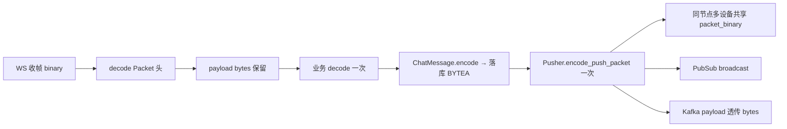

# 设计说明：消息投递少拷贝管线

| 项 | 内容 |
|------|------|
| 状态 | **已确认** |
| 决策编号 | DD-032 |
| 规范定义 | 本文档 |
| 行为约定 | 本文档 |
| 索引 | [`design-decisions.md`](../design-decisions.md) |
| 实现文档 | [implementation/elixir/zero-copy-delivery.md](../implementation/elixir/zero-copy-delivery.md) |
| 相关 | [transport.md](transport.md)、[message-send-ack.md](message-send-ack.md)、[kafka-event-bus.md](kafka-event-bus.md) |

---

## 1. 要解决什么问题

百万在线、高 QPS 下，单条消息在网关 → 业务 → 落库 → 扇出 → Kafka → WebSocket 路径上若反复 **decode → 结构体 → encode**，会带来：

- CPU 浪费（Protobuf / JSON 编解码）
- 堆内存分配与 **多次二进制拷贝**
- GC 压力与延迟抖动

目标：**在正确性不变的前提下，热路径上每种序列化形态只产生一次，其余环节传递 `bytes` 引用**。

---

## 2. 决策摘要（已确认）

| # | 决策 |
| --- | --- |
| 1 | 热路径以 **`binary` / `bytes` 透传** 为主，按需 decode |
| 2 | **下行 PUSH：整包 `Packet` 只编码一次**，扇出传递同一份 `packet_binary` |
| 3 | **Kafka EventBus：`payload` 透传 `Packet.payload`**，不 PB→map→JSON |
| 4 | **上行**：网关解码 `Packet` 头后，内层 `payload` 仅在业务需要时 decode 一次 |
| 5 | **落库 `content`**：存 PB `bytes`；扇出优先复用已编码 bytes，避免「库读出再编」 |
| 6 | **禁止**热路径 `Jason.encode` / `base64` 包裹 PB（仅开发调试例外） |
| 7 | 跨节点分发 unavoidable 拷贝一次；同节点多设备 **共享 ref-counted binary** |

---

## 完整流程



---

## 3. 理想管线（单条下行）

```text
WS 收帧 (binary)
  → decode Packet 头 + 保留 payload :: bytes          [decode 内层 1 次，若需校验]
  → 业务 enrich → ChatMessage.encode → content bytes   [encode 内层 1 次]
  → 落库 BYTEA(content)
  → Pusher.encode_push_packet → packet_binary          [encode 外层 1 次]
       ├─ 同节点 N 设备：send(pid, {:push_binary, packet_binary})   [共享引用]
       ├─ PubSub 聊天室：broadcast {:room_push, packet_binary}      [共享引用]
       ├─ 跨节点：:erlang.send({pid, node}, …)                      [每目标节点 1 次拷贝]
       └─ Kafka cast：UpstreamEvent{payload: packet.payload}         [payload 透传，信封 1 次 encode]
```

**编码次数上限（单聊/群聊一条消息）**：

| 层级 | 次数 |
|------|------|
| `ChatMessage`（内层 payload） | **1** |
| 完整 `Packet`（WS 下行帧） | **1** |
| Kafka `UpstreamEvent` / `DownstreamEvent` 信封 | **1**（旁路，异步） |

---

## 4. 分阶段规则

### 4.1 网关收包

| 做 | 不做 |
|----|------|
| 一次 `Codec.decode/1` 得到 `%Packet{payload: bin}` | 为每个 Hook 重复 decode |
| 校验 `ver` / `cmd` / 长度 | 把 payload 转成 map 再转回 PB |
| 需要字段时 `MsgSendReq.decode(payload)` **一次** | 在日志里 `inspect` 整条消息体 |

### 4.2 落库

| 做 | 不做 |
|----|------|
| `content` 字段存 **PB bytes** | 存 JSON 再 `Jason.decode` 推送 |
| 幂等命中直接返回，**不重复扇出** | 每次 SEND 重新 encode 全链路 |

### 4.3 下行扇出（见 [message-send-ack.md](message-send-ack.md)）

| 做 | 不做 |
|----|------|
| `encode_push_packet/1` → `packet_binary` | 每设备 `Packet.encode` |
| 进程消息携带 `packet_binary` | 携带 `%ChatMessage{}` 到 Socket 再 encode |
| 大群树状扇出：**子树共享**同一份 `packet_binary` | 每批重新编码 |

### 4.4 Kafka 旁路

与 [kafka-event-bus.md](kafka-event-bus.md) §2.10.3 一致：

```text
Event = { meta…, payload = packet.payload }  // 不 decode 内层
→ UpstreamEvent.encode() 一次
```

`im.push` 的 `PushDisplay` 可在业务 enrich 时**顺带**生成，避免为推送再 decode `content`。

### 4.5 离线拉取

| 做 | 不做 |
|----|------|
| DB 读出 `content` bytes → 组装 `Packet` → encode **一次** | 读出后转 map 再 encode |
| 分页批量：可 `PUSH_BATCH` 一次 encode 多行 | 每行单独 encode 外层 Packet |

---

## 5. 不可避免的拷贝

| 场景 | 说明 |
|------|------|
| **跨 Erlang 节点** | `:erlang.send/2` 到远程节点会复制 binary（BEAM 语义） |
| **写入 PostgreSQL** | `BYTEA` 入库一次拷贝 |
| **WebSocket 写出** | 驱动层最终拷贝到 port（可用 iodata 减少中间拼接） |
| **Kafka produce** | 客户端 buffer 通常再拷贝一次 |

优化方向：**减少 encode 次数与中间结构体**，而非消除上述系统边界拷贝。

---

## 6. 反模式（热路径禁止）

| 反模式 | 后果 |
|--------|------|
| 每设备 `ChatMessage.decode → encode` | O(N) CPU |
| Kafka value 用 JSON 包 base64(PB) | 体积 +33%，双重编解码 |
| Hook 内 `Jason.encode!(message)` | 分配 + 字符串拷贝 |
| `Enum.map` 构建大 `<> ` 拼接二进制 | 多次中间 binary |
| 扇出时复制 `%ChatMessage{}` 大 map | 堆分配 |
| 日志打印完整 `payload` | 隐式拷贝与 IO |

---

## 7. 验收（实现阶段）

| 检查项 | 方法 |
|--------|------|
| 群 1000 人推送 | 编码计数器 / 测试 mock 仅调用 1 次 `Packet.encode` |
| Kafka 旁路 | `payload` 与 `packet.payload` **引用相等**（同节点）或 `byte_size` 一致 |
| 内存 | 压测下 `:erlang.memory(:binary)` 与 QPS 线性可控 |
| Profile | `:eprof` / `fprof` 热路径无 `Jason` / 重复 `decode` |

---

## 8. 刻意不做

| 不做 | 原因 |
|------|------|
| 内核级 true zero-copy（sendfile 等） | BEAM + WS 栈收益有限，复杂度高 |
| 全链路只传 `iodata` 不落地 struct | 业务校验仍需部分 decode |
| 为省拷贝跳过鉴权/校验 decode | 安全与正确性优先 |

---
