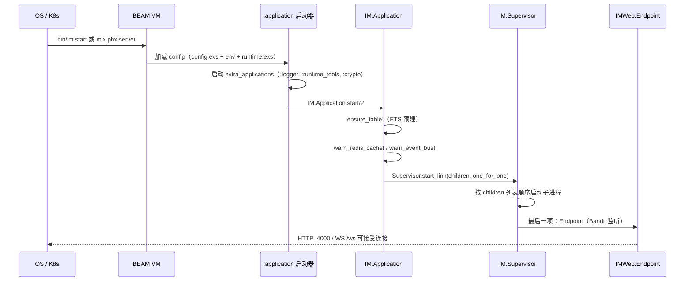
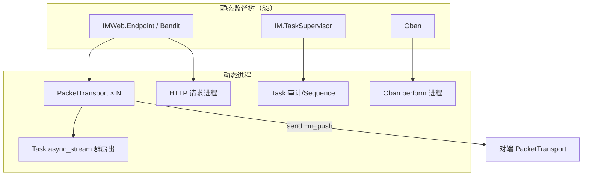
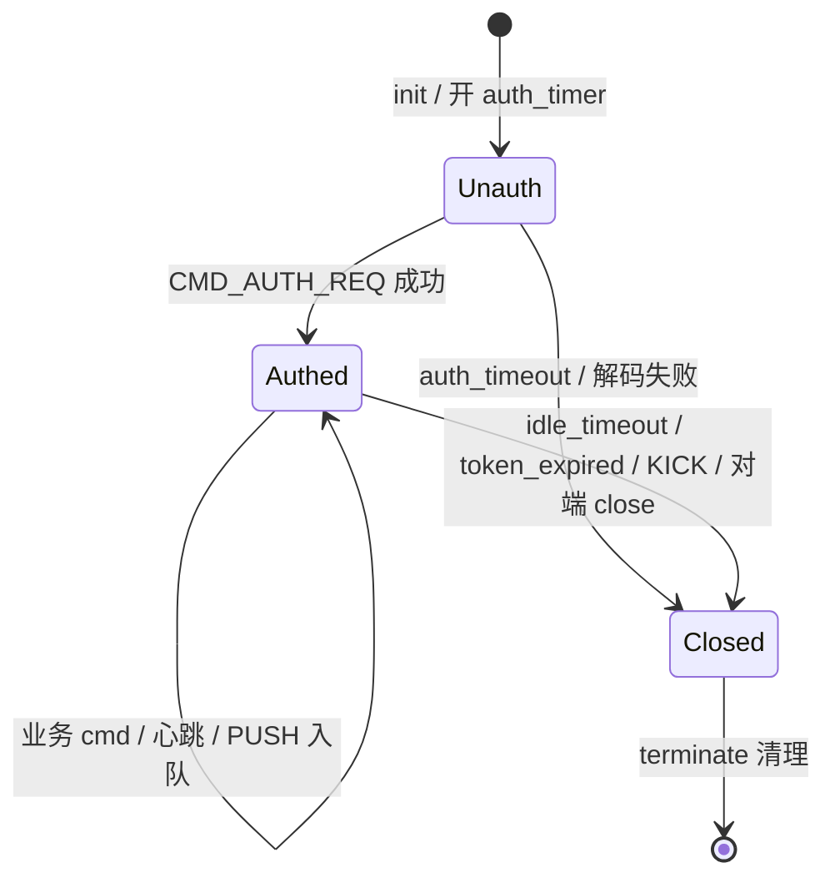
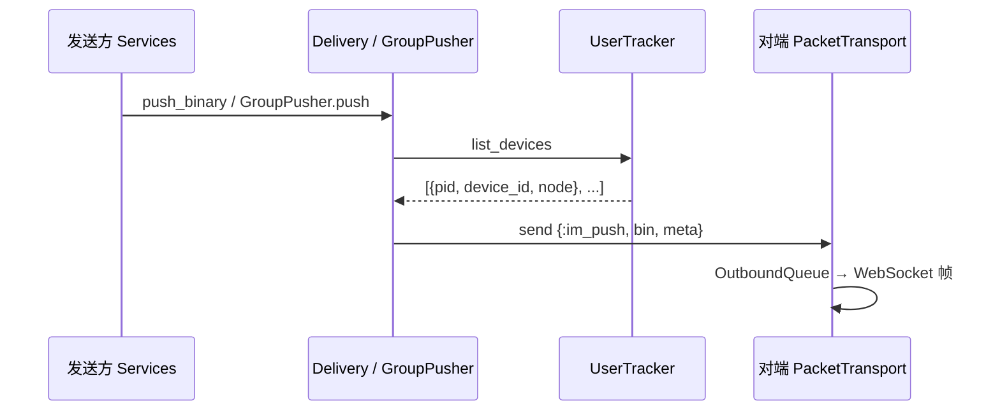

# IM 应用启动与 OTP 监督树

| 项 | 内容 |
| --- | --- |
| 状态 | **权威**（Elixir 侧启动顺序与监督树；架构角色见 [architecture-overview.md](../../design/architecture-overview.md)） |
| 代码入口 | [`apps/elixir/im/lib/im/application.ex`](../../../apps/elixir/im/lib/im/application.ex) |
| 配置 | 编译期 [`config/config.exs`](../../../apps/elixir/im/config/config.exs) + 环境 [`config/dev.exs`](../../../apps/elixir/im/config/dev.exs) / [`config/runtime.exs`](../../../apps/elixir/im/config/runtime.exs) |
| 部署 | [release-deploy-test.md](release-deploy-test.md) · [deploy-guide.md](deploy-guide.md) |

本文描述 **`:im` OTP 应用**从进程启动到可对外提供 HTTP/WebSocket 服务的完整路径，以及 **`IM.Supervisor` 顶层监督树** 与各常驻子进程职责。§3 覆盖静态 child；§4 以同样粒度展开 **动态进程**（WS 连接、HTTP 请求、Task、Oban 执行等）。业务请求路径见 [dual-channel-api.md](dual-channel-api.md) 与 [project-structure.md](project-structure.md)。

---

## 1. 启动入口

IM 是 Mix 项目 `:im`，在 [`mix.exs`](../../../apps/elixir/im/mix.exs) 中注册：

```elixir
mod: {IM.Application, []}
```

常见启动方式：

| 场景 | 命令 | 说明 |
| --- | --- | --- |
| 本地开发 | `mise run im:server`（=`mix phx.server`） | `config/dev.exs` 已设 `IMWeb.Endpoint server: true`，直接监听 `:4000` |
| Release / K8s | `bin/im start` | 须设 `PHX_SERVER=true`（见 K8s ConfigMap）；`runtime.exs` 才打开 Endpoint 监听 |
| 仅迁移 | `bin/migrate` / `bin/im eval "IM.Release.migrate()"` | **不**启动完整监督树，只 `Application.load(:im)` 后跑 Ecto 迁移 |
| ExUnit | `mix test` | `:test` 环境；Endpoint 通常不监听（见 `config/test.exs`） |

Release 启动前还会 `source rel/env.sh.eex`（由 `bin/im` 自动执行）：多副本时按 `POD_IP` 构造 `RELEASE_NODE=im@<ip>`；可选 `IM_PERF_FLAMEGRAPH=true` 注入 `+JPperf true`。

---

## 2. 启动时序（自外向内）



### 2.1 配置加载

1. **编译期**：`config/config.exs` 写入 Release（默认值、Oban、Endpoint adapter 等）。
2. **环境文件**：`import_config "#{config_env()}.exs"`（dev/test/prod）。
3. **运行时**：`config/runtime.exs` 在 **每次启动** 求值——Release 中读取 `DATABASE_URL`、`SECRET_KEY_BASE`、`PHX_HOST`、`REDIS_URL`、`CLUSTER_STRATEGY`、`KAFKA_BROKERS` 等。

生产关键开关：

- `PHX_SERVER=true` → `config :im, IMWeb.Endpoint, server: true`（否则 BEAM 起来但不监听端口）。
- `CLUSTER_STRATEGY=kubernetes|epmd` → 写入 `cluster_topologies`，启用 libcluster。
- `REDIS_URL` 非空 → 挂载 `Redix` 连接进程，Cache 走 Redis 实现。
- `EVENT_BUS_PRODUCER=brod` 且 `KAFKA_BROKERS` 非空 → 挂载 `IM.EventBus.Producer.Brod.Client`。

### 2.2 `IM.Application.start/2` 内两步

**（A）ETS 预建**（在监督树启动 **之前** 同步执行，避免子进程竞态）：

| 调用 | 用途 |
| --- | --- |
| `IM.Channel.RateLimiter.ensure_table/0` | App Channel 发布限流 |
| `IM.Stores.AppConfigStore.ensure_table/0` | 应用配置 L1 缓存 |
| `IM.Cache.Memory.ensure_table!/0` | 进程内通用缓存（无 Redis 时） |
| `IM.Permission.L1.ensure_table!/0` | 权限 L1 缓存 |
| `IM.EventBus.Producer.Memory.ensure_table!/0` | Memory Producer 环形缓冲 |

**（B）启动 `IM.Supervisor`**：`strategy: :one_for_one`——任一子进程崩溃仅重启该子进程，不影响兄弟节点。

启动后还会执行生产环境告警（不阻断启动）：

- 多节点 + 无 `REDIS_URL` → `:startup_redis_missing_cluster`
- 生产无 Redis 且 Cache 为 Memory → `:startup_redis_cache_memory`
- Event Bus 已开但 Kafka brokers 为空 → `:startup_event_bus_brokers_missing`

---

## 3. 顶层监督树 `IM.Supervisor`

源码：[`lib/im/application.ex`](../../../apps/elixir/im/lib/im/application.ex) 的 `children/0` 列表。


### 3.1 子进程一览（启动顺序）

| # | 子进程 | 类型 | 何时挂载 | 一句话 |
| --- | --- | --- | --- | --- |
| 0 | `Cluster.Supervisor` | Supervisor | topology 非空 | libcluster 节点发现 |
| 1 | `IM.Repo` | Ecto.Repo | 始终 | PostgreSQL 连接池 |
| 2 | `Phoenix.PubSub` | PubSub | 始终 | 集群广播总线 |
| 3–4 | 两个 `Registry` | Registry | 始终 | 本节点 WS 连接索引 |
| 5 | `Redix` | 连接 | `REDIS_URL` 非空 | Redis 长连接 |
| 6 | `EventBus.Producer.Brod.Client` | GenServer | Brod + brokers | Kafka client |
| 7 | `IM.UserTracker` | Phoenix.Tracker | 始终 | 集群在线 CRDT |
| 8–18 | 各 GenServer / Supervisor | 见 §3.3 | 始终 | 发号、旁路、缓存失效等 |
| 19 | `IM.Telemetry.Supervisor` | Supervisor | 始终 | 指标 poller |
| 20 | `IMWeb.Endpoint` | Phoenix.Endpoint | 始终 | HTTP/WS 入口 |

> **顺序含义**：Repo、PubSub、Registry 必须先于依赖它们的 GenServer；Endpoint  intentionally 放在最后，避免 HTTP 已就绪而 DB/Redis 尚未连接。

各 child 的 init 行为、API、依赖与崩溃影响见 **§3.3**。

---

### 3.3 各 child 详解

下列顺序与 [`application.ex`](../../../apps/elixir/im/lib/im/application.ex) 中 `children/0` **完全一致**。

#### 0. `Cluster.Supervisor`（可选）

| 项 | 说明 |
| --- | --- |
| **注册名** | `IM.ClusterSupervisor` |
| **挂载条件** | `IM.Cluster.topologies/0` 非空（`runtime.exs` 写入 `cluster_topologies`） |
| **配置** | `CLUSTER_STRATEGY=kubernetes` → DNS 查 `im-headless`；`epmd` → `CLUSTER_HOSTS` 静态列表 |
| **init** | libcluster 按 strategy 启动子进程（如 K8s DNS 轮询、EPMD 连接） |
| **职责** | 自动发现 peer BEAM 节点并 `:net_kernel` 互联，使 `Node.list/0` 含对端 |
| **调用方** | 不直接调用；`Phoenix.PubSub`、`Phoenix.Tracker`、`:rpc` 扇出依赖已组网 |
| **崩溃影响** | 重启后可能短暂 `Node.list()` 为空；已连 WS 不断，跨节点 PUSH 可能失败直至重连 |
| **文档** | [apps/elixir/im/README.md §集群](../../../apps/elixir/im/README.md) |

---

#### 1. `IM.Repo`

| 项 | 说明 |
| --- | --- |
| **类型** | `Ecto.Repo`（`Ecto.Adapters.Postgres`） |
| **配置** | dev：`PGHOST`/`PGPORT`；prod：`DATABASE_URL`、`POOL_SIZE`（默认 10） |
| **init** | 启动 DBConnection 连接池，按 `ecto_repos: [IM.Repo]` 注册 |
| **职责** | 全部持久化：消息、会话、群成员、审计、Oban Job 表、Snowflake PG 兜底等 |
| **调用方** | `IM.Stores.*`、`IM.Services.*`、Oban、就绪探针 `IM.Health.RepoChecker` |
| **崩溃影响** | `:one_for_one` 重启 Repo；进行中事务失败；就绪探针 503 |
| **源码** | [`lib/im/repo.ex`](../../../apps/elixir/im/lib/im/repo.ex) |
| **文档** | [database.md](database.md) · [database-design.md](../../design/database/database-design.md) |

---

#### 2. `Phoenix.PubSub`（`IM.PubSub`）

| 项 | 说明 |
| --- | --- |
| **类型** | `Phoenix.PubSub`（默认 PG2 适配器，集群节点互联后跨节点广播） |
| **init** | 启动 PubSub 监督子树 |
| **职责** | 本进程订阅/广播；Tracker CRDT 同步、权限/AppConfig 失效通知 |
| **Topic 示例** | `im:permission:invalidate`、`im:app_config:invalidate`；Tracker 内部 topic |
| **调用方** | `IM.Permission.Invalidator`、`IM.AppConfig.Invalidator`、`IM.UserTracker` |
| **崩溃影响** | 重启后 Invalidator 重新 subscribe；Tracker 状态由 CRDT 重建 |
| **配置** | `IMWeb.Endpoint` 的 `pubsub_server: IM.PubSub` |

---

#### 3. `Registry` — `IM.Connection.DeviceRegistry`

| 项 | 说明 |
| --- | --- |
| **键模式** | `keys: :unique` |
| **Registry 键** | `{app_key, user_id, device_id}` → 连接进程 pid + meta |
| **登记 API** | `IM.Connection.Registry.register/4`（WS 鉴权成功后） |
| **查询 API** | `lookup_device/3`、`send_device/4` |
| **职责** | **本节点**按设备唯一定位 WS 进程；同设备重连覆盖旧 pid |
| **调用方** | `Commands.Auth`、设备踢人、`IM.Delivery.Router`（Tracker  miss 时回退） |
| **崩溃影响** | 重启后 Registry 空，直至客户端重连或重新 AUTH；不影响其他节点 |
| **源码** | [`lib/im/connection/registry.ex`](../../../apps/elixir/im/lib/im/connection/registry.ex) |

---

#### 4. `Registry` — `IM.Connection.UserRegistry`

| 项 | 说明 |
| --- | --- |
| **键模式** | `keys: :duplicate`（同一用户可多设备多条目） |
| **Registry 键** | `{app_key, user_id}` → 多个 `{pid, meta}` |
| **职责** | 枚举用户在本节点的全部在线设备 pid |
| **调用方** | `IM.Connection.Registry.list_user_devices/2`、`Registry.count`（连接数指标） |
| **与 Tracker 区别** | Registry **仅本节点**；`UserTracker` **集群 CRDT**，跨节点 `list_devices` |

---

#### 5. `Redix`（可选）— `IM.Cache.Redis.Conn`

| 项 | 说明 |
| --- | --- |
| **挂载** | `Application.get_env(:im, :redis_url)` 为非空字符串 |
| **child spec** | `{Redix, {url, [name: IM.Cache.Redis.Conn]}}` |
| **init** | 与 Redis 建立 TCP 长连接（Redix 单连接进程） |
| **职责** | `IM.Cache.Redis` 实现的后端：`INCR` 序列号、未读 pending、Snowflake worker 租约、通用 KV |
| **调用方** | `IM.Cache`、`IM.Services.Sequence`、`IM.Services.MsgId.Lease`、未读模块 |
| **崩溃影响** | Redix 重启；热路径可能短暂走 PG 兜底或发号降级 |
| **生产** | 多副本 **必须**；缺失时启动告警 `:startup_redis_cache_memory` |
| **文档** | [deploy-guide.md](deploy-guide.md) · [unread-count.md](unread-count.md) |

---

#### 6. `IM.EventBus.Producer.Brod.Client`（可选）

| 项 | 说明 |
| --- | --- |
| **挂载** | `event_bus_producer == IM.EventBus.Producer.Brod` 且 `KAFKA_BROKERS` 非空 |
| **init** | `:brod.start_client/3`，`auto_start_producers: true` |
| **terminate** | `:brod.stop_client/1` 清理 |
| **职责** | 监督树内持有 brod client 生命周期；Producer 模块通过 client_id 发 Kafka |
| **失败** | brokers 为空 → `{:stop, :kafka_not_configured}`，**不**挂载此 child |
| **配置** | `EVENT_BUS_PRODUCER=brod`、`KAFKA_BROKERS`、`KAFKA_CLIENT_ID` |
| **文档** | [kafka-event-bus.md](kafka-event-bus.md) |
| **源码** | [`lib/im/event_bus/producer/brod/client.ex`](../../../apps/elixir/im/lib/im/event_bus/producer/brod/client.ex) |

---

#### 7. `IM.UserTracker`

| 项 | 说明 |
| --- | --- |
| **类型** | `Phoenix.Tracker` |
| **PubSub** | `pubsub_server: IM.PubSub` |
| **Tracker 参数** | `broadcast_period: 500`、`max_silent_periods: 10`、`pool_size: 1` |
| **topic** | `"user:{app_key}:{user_id}"`；key = `device_id` |
| **meta** | `device_id`、`platform`、`node`（BEAM 节点名）、`connected_at` |
| **API** | `track/4`、`list_devices/2` |
| **职责** | 集群在线表；`Delivery.Router` 优先用 Tracker pid 跨节点 `send/2` |
| **调用方** | `Commands.Auth`（鉴权后 track）、`IM.Cluster.GroupPusher`、投递层 |
| **崩溃影响** | Tracker 重启；CRDT 从 PubSub 副本恢复；短暂可能误判离线 |
| **文档** | [multi-device.md](multi-device.md) · [architecture-overview.md](../../design/architecture-overview.md) |
| **源码** | [`lib/im/user_tracker.ex`](../../../apps/elixir/im/lib/im/user_tracker.ex) |

---

#### 8. `IM.Cluster.SlowNode`

| 项 | 说明 |
| --- | --- |
| **状态** | 公共 ETS `:im_tree_slow_nodes`（`:named_table, :public, :set`） |
| **init** | 若表不存在则 `:ets.new/2` |
| **API** | `mark/2`（写入隔离截止时间）、`isolated?/1` |
| **职责** | 群聊 **树状扇出** RPC 超时时标记慢节点，后续 fanout 跳过该节点 |
| **调用方** | `IM.Cluster.GroupPusher`（超时 → `mark`，选节点 → `reject isolated?`） |
| **配置** | `group_fanout.slow_node_ms`、`slow_isolate_sec`（默认 500ms / 30s） |
| **崩溃影响** | ETS 表保留（public named）；进程重启后表仍在，隔离状态不丢 |
| **源码** | [`lib/im/cluster/slow_node.ex`](../../../apps/elixir/im/lib/im/cluster/slow_node.ex) |

---

#### 9. `Task.Supervisor` — `IM.TaskSupervisor`

| 项 | 说明 |
| --- | --- |
| **策略** | Task.Supervisor 默认 `:temporary` 子 Task（完成即退出） |
| **职责** |  fire-and-forget，**不阻塞** WS ACK / 发消息热路径 |
| **典型用途** | `IM.Audit.record/2` 异步写审计表；`IM.Services.Sequence` Redis→PG 水位异步对齐 |
| **调用方** | [`lib/im/audit.ex`](../../../apps/elixir/im/lib/im/audit.ex)、[`lib/im/services/sequence.ex`](../../../apps/elixir/im/lib/im/services/sequence.ex) |
| **崩溃影响** | Supervisor 重启；进行中的 Task 被终止（审计/对齐可丢，主路径已返回） |
| **注意** | 不在此跑 Oban Job；Oban 自有执行进程 |

---

#### 10. `IM.Delivery.MobilePush`

| 项 | 说明 |
| --- | --- |
| **状态** | GenServer 内 `:queue` + `size` 计数 |
| **API** | `maybe_enqueue/4`（cast 入队）、`drain/0`（测试） |
| **职责** | 用户 **无在线连接** 且有 `push_token` 时：进程内队列 + EventBus `im.push` 批量旁路 |
| **调用方** | `IM.Delivery.Router`（扇出后 `maybe_enqueue_mobile_push`） |
| **Telemetry** | `[:im, :mobile_push, :enqueue]` |
| **崩溃影响** | 队列丢失（内存）；旁路 Kafka 可能已写入；生产推送由下游 `im.push` 消费 |
| **文档** | [mobile-push.md](mobile-push.md) · [design/mobile-push.md](../../design/mobile-push.md) |
| **源码** | [`lib/im/delivery/mobile_push.ex`](../../../apps/elixir/im/lib/im/delivery/mobile_push.ex) |

---

#### 11. `IM.Permission.Invalidator`

| 项 | 说明 |
| --- | --- |
| **依赖** | 必须在 `IM.PubSub` 之后启动 |
| **init** | `PubSub.subscribe("im:permission:invalidate")` + `L1.ensure_table!()` |
| **API** | `broadcast/1` — 本节点先 `L1.invalidate`，再 PubSub 广播 |
| **handle_info** | 收到 `{:permission_invalidate, event}` → 清 L1 ETS |
| **职责** | 拉黑/禁言/封禁变更后，集群各节点 L1 热缓存一致失效 |
| **L1 表** | 启动前已由 `Application` 调用 `Permission.L1.ensure_table!()` |
| **文档** | [permission-cache.md](permission-cache.md) |
| **源码** | [`lib/im/permission/invalidator.ex`](../../../apps/elixir/im/lib/im/permission/invalidator.ex) |

---

#### 12. `IM.AppConfig.Invalidator`

| 项 | 说明 |
| --- | --- |
| **Topic** | `"im:app_config:invalidate"` |
| **init** | subscribe + `AppConfigStore.ensure_table()` |
| **API** | `broadcast/3`（app_key, category, key） |
| **职责** | 应用级配置（如「须好友才能发消息」）变更后，清各节点 `AppConfigStore` ETS |
| **与 Permission 对比** | 同模式不同 topic / Store；REST 管理端更新配置后 broadcast |
| **源码** | [`lib/im/app_config/invalidator.ex`](../../../apps/elixir/im/lib/im/app_config/invalidator.ex) |

---

#### 13. `Oban`

| 项 | 说明 |
| --- | --- |
| **Repo** | 共用 `IM.Repo`（Job 持久化在 PostgreSQL `oban_jobs`） |
| **静态队列** | `inbox_fanout: 10`、`message_burn: 10`、`ttl_purge: 1`（并发度） |
| **Cron 插件** | `runtime.exs` 按 env 注入，默认 **关** |

**Worker 与队列：**

| Worker | 队列 | 触发 | 作用 |
| --- | --- | --- | --- |
| `IM.Workers.GroupInboxFanout` | `:inbox_fanout` | 大群发消息异步写扩散 | 批量写 `user_inbox` |
| `IM.Workers.MessageBurn` | `:message_burn` | 阅后即焚到期 | 执行 burn 逻辑 |
| `IM.Workers.TtlPurge` | `:ttl_purge` | `TTL_PURGE_AUTO=true` Cron | 过期消息清理 |
| `IM.Workers.UnreadFlush` | `:ttl_purge` | `UNREAD_FLUSH_AUTO=true` Cron | Redis 未读 pending → PG |
| `IM.Workers.PermissionReconcile` | `:ttl_purge` | `PERMISSION_RECONCILE_AUTO=true` Cron | L1 与 DB 对账 |

**Oban 内部子树（非 `IM.Application` 直接列出）**：Notifier、Staging、各 Queue 的 Producer/Consumer；dequeue 时为每个 Job 起临时执行进程。

**崩溃影响**：Oban 监督树重启；未完成 Job 按 Oban 重试策略恢复。

**文档**：[group.md](group.md) · [burn-after-read.md](burn-after-read.md) · [unread-count.md](unread-count.md)

---

#### 14. `IM.Services.MsgId`

| 项 | 说明 |
| --- | --- |
| **API** | `next/1` → 十进制字符串 `msg_id`；`worker_id/0`（测试） |
| **init** | `Lease.acquire/0` 占 Redis/PG `worker_id`（0..1023）；成功则定时 `:renew_lease` |
| **Snowflake** | 41bit 时间 + 10bit worker + 12bit 序号；epoch `1704067200000` |
| **降级** | 无租约 / 时钟回拨 >5ms → `Sequence.next(..., "msg_id_fallback", ...)`（PG/Redis 计数，T=1 标记） |
| **terminate** | `Lease.release/2` 释放 worker |
| **配置** | `:msg_id_mode`（测试可 `:pg_fallback`） |
| **调用方** | `IM.Services.Message` 发消息路径 |
| **崩溃影响** | 重启重新 acquire worker；极端情况下短暂 id 冲突风险由 fallback 与 DB 唯一约束兜底 |
| **文档** | DD-039 · [message-model.md](message-model.md) |
| **源码** | [`lib/im/services/msg_id.ex`](../../../apps/elixir/im/lib/im/services/msg_id.ex) |

---

#### 15. `IM.Services.StreamManager`

| 项 | 说明 |
| --- | --- |
| **状态** | GenServer `%{{app_key, stream_id} => entry}`（内存，非持久化） |
| **API** | `track_chunk/3`、`assembled_text/2`、`reset/0`（测试） |
| **职责** | MSG_STREAM 分块序号校验、chunk 拼装；**落库仍走** `IM.Services.Message` |
| **校验** | 序号单调、流关闭后拒绝 ONGOING、空 `stream_id` 拒绝 |
| **调用方** | 流式消息 WS/REST 命令 |
| **崩溃影响** | **内存状态全丢**；客户端重传 chunk 或重新开流 |
| **文档** | [stream-message.md](stream-message.md) |
| **源码** | [`lib/im/services/stream_manager.ex`](../../../apps/elixir/im/lib/im/services/stream_manager.ex) |

---

#### 16. `IM.Gateway.CidDedup`

| 项 | 说明 |
| --- | --- |
| **ETS** | `:im_cid_dedup`，键 `{conn_id, cid}` → 过期 monotonic ms |
| **TTL** | 5 分钟；每 60s `:sweep` 清理过期键 |
| **API** | `check/2` → `:ok` \| `:duplicate`；空 cid 直接 `:ok` |
| **职责** | **传输层**同连接 `Packet.cid` 短窗去重；与业务 `client_msg_id` 幂等 **分层** |
| **conn_id** | 通常 WS 会话标识（鉴权前后可用连接级 id） |
| **调用方** | `IM.Services.Message` 发消息路径（`conn_id` + `cid`） |
| **崩溃影响** | ETS 为 `:public :named_table`，表在进程重启后仍存在；仅 sweep 定时器丢失直至重启 |
| **源码** | [`lib/im/gateway/cid_dedup.ex`](../../../apps/elixir/im/lib/im/gateway/cid_dedup.ex) |

---

#### 17. `IM.EventBus.Buffer`

| 项 | 说明 |
| --- | --- |
| **状态** | `:queue` + `len` + `max`（默认 10_000，`event_bus_buffer_max`） |
| **API** | `enqueue/2`（cast）、`flush_to_producer/1`、`enqueue_and_flush/3` |
| **职责** | 主路径 **cast 入队**不阻塞；call flush 时 `Kafka.encode_and_produce/2` → Memory 或 Brod Producer |
| **背压** | 超 `max` 丢弃最旧条目 + `[:im, :event_bus, :drop]` |
| **与 Brod Client** | Buffer 始终挂载；无 Kafka 时 Producer 为 Memory，仍走同一 drain 路径 |
| **文档** | [kafka-event-bus.md](kafka-event-bus.md) |
| **源码** | [`lib/im/event_bus/buffer.ex`](../../../apps/elixir/im/lib/im/event_bus/buffer.ex) |

---

#### 18. `IM.Log.RateLimit`

| 项 | 说明 |
| --- | --- |
| **窗口** | 60_000 ms |
| **键** | `{bucket, app_key, remote_ip \| user_id \| :global}` |
| **API** | `allow?/2` — GenServer.call 200ms 超时；超时 **放行**（fail-open） |
| **职责** | 高频 `:warning` 日志采样（如重复 auth 失败），防日志风暴 |
| **状态** | GenServer map（非 ETS）；`reset!/0` 测试用 |
| **调用方** | `IM.Log` 内部 |
| **崩溃影响** | 重启后采样状态清空；短暂可能多打几条日志 |
| **文档** | [observability.md](observability.md) §2.6.7 |
| **源码** | [`lib/im/log/rate_limit.ex`](../../../apps/elixir/im/lib/im/log/rate_limit.ex) |

---

#### 19. `IM.Telemetry.Supervisor`

见 §3.4（含两个子 child 详解）。

---

#### 20. `IMWeb.Endpoint`

见 §3.5（含 Bandit 与 Plug 链）。

---

### 3.4 嵌套监督树：`IM.Telemetry.Supervisor`

**注册名**：`IM.Telemetry.Supervisor` · **策略**：`:one_for_one`

| 子 child | 类型 | 说明 |
| --- | --- | --- |
| `:telemetry_poller` | poller | 周期 **10s**：`refresh_gauges/0`、`:memory`、`:total_run_queue_lengths` |
| `TelemetryMetricsPrometheus.Core` | registry | 名 `:im_prometheus_metrics`；`start_async: false` 同步启动 |

**`refresh_gauges/0`**：`Registry.count(DeviceRegistry)` → `[:im, :connection, :stats]`；刷新 VM 内存与 run queue gauge。

**`scrape/0`**：`GET /metrics` 前强制 `refresh_gauges`，避免 last_value 首次为空。

**指标定义**：[`IM.Telemetry.Metrics`](../../../apps/elixir/im/lib/im/telemetry/metrics.ex) — packet 计数/字节、handler 耗时、投递、EventBus、群扇出等；**禁止**高基数标签（`user_id` 等）。

**文档**：[observability.md](observability.md)

---

### 3.5 嵌套监督树：`IMWeb.Endpoint`

**类型**：`Phoenix.Endpoint`（自身为 Supervisor）· **adapter**：`Bandit.PhoenixAdapter`

| 子进程（典型） | 说明 |
| --- | --- |
| Bandit listener | `server: true` 时监听 `http: [ip, port]`；处理 HTTP + WebSocket upgrade |
| Phoenix 代码重载 | 仅 dev |
| PubSub 订阅者 | Endpoint 内部 telemetry / socket 相关 |

**Plug 链**（自上而下）：

1. `Plug.RequestId`
2. `Plug.Telemetry`（`[:phoenix, :endpoint]`）
3. `Plug.Parsers`（urlencoded / multipart / json）
4. `Plug.MethodOverride` / `Plug.Head`
5. `IMWeb.Router`

**对外路由**（[`router.ex`](../../../apps/elixir/im/lib/im_web/router.ex)）：

| 路径 | 处理 |
| --- | --- |
| `GET /health/live` · `/health` | Liveness |
| `GET /health/ready` | Readiness（查 Repo） |
| `GET /metrics` | Prometheus text |
| `GET /ws` | `WsController` → `WebSockAdapter.upgrade(IMWeb.PacketTransport)` |
| `/api/v1/*` | REST 双通道（ traced / auth / internal pipeline） |

**配置热更新**：`IM.Application.config_change/3` → `Endpoint.config_change/2`。

**`server: false`**：Endpoint 进程仍启动，但 **不** 开 Bandit 监听（部分 test、未设 `PHX_SERVER` 的 Release）。

---

### 3.6 启动前 ETS 预建（非 child，但与 child 强相关）

在 `Supervisor.start_link` **之前**同步执行，避免多进程竞态 `:ets.new`：

| 调用 | 关联 child / 模块 |
| --- | --- |
| `IM.Channel.RateLimiter.ensure_table/0` | App Channel 发布（连接进程内调用） |
| `IM.Stores.AppConfigStore.ensure_table/0` | AppConfig Invalidator + Store 读路径 |
| `IM.Cache.Memory.ensure_table!/0` | 无 Redis 时 Cache / Sequence 兜底 |
| `IM.Permission.L1.ensure_table!/0` | Permission Invalidator + 鉴权热路径 |
| `IM.EventBus.Producer.Memory.ensure_table!/0` | EventBus Buffer drain → Memory Producer |

---

### 3.7 嵌套监督树：`Oban` 与 `Phoenix.Tracker`（摘要）

**Oban**（child #13 展开）：除 §3.3 表格外，内部还有 Notifier（PG 通知）、Staging、每队列 DynamicSupervisor。Job **持久化在 PG**，进程重启不丢 Job。

**`IM.UserTracker`**（child #7 展开）：`pool_size: 1` 时内部结构为：

```text
IM.UserTracker (Supervisor)
└── Phoenix.Tracker.Shard (GenServer)  × pool_size
```

Shard 经 `IM.PubSub` 同步 CRDT；`handle_diff/2` 当前为 no-op（仅状态同步，不额外副作用）。

---

## 4. 不在静态监督树中的进程

以下进程 **按需创建、用完即退或随连接生命周期结束**，不计入 `IM.Application` 的 `children`。理解它们才能拼完整运行时拓扑。

### 4.0 动态进程总览

| 类型 | 创建者 | 生命周期 | 监督关系 |
| --- | --- | --- | --- |
| `IMWeb.PacketTransport` | Bandit WebSock 升级 | 与 WS 连接同寿 | Bandit 连接监督（非 `IM.Supervisor`） |
| Bandit HTTP 请求 handler | Bandit accept | 单请求 | Bandit 内部 |
| `Task`（`IM.TaskSupervisor`） | Audit / Sequence | 插入完成即退出 | `IM.TaskSupervisor`（§3.3 #9） |
| `Task`（`Task.async_stream`） | `GroupPusher` 树状扇出 | 扇出结束即退出 | **无**独立 Supervisor；在**调用进程**内 spawn |
| Oban Job 执行进程 | Oban Queue Consumer | 单次 `perform/1` | Oban 内部 DynamicSupervisor |
| `:erpc` 远程执行 | `Cluster.Router` / `GroupPusher` | 单次 RPC | 远程节点临时进程 |



---

### 4.1 WebSocket 连接：`IMWeb.PacketTransport`

| 项 | 说明 |
| --- | --- |
| **Behaviour** | `WebSock`（[`packet_transport.ex`](../../../apps/elixir/im/lib/im_web/packet_transport.ex)） |
| **创建路径** | `GET /ws` → [`WsController.upgrade/2`](../../../apps/elixir/im/lib/im_web/controllers/ws_controller.ex) → `WebSockAdapter.upgrade(IMWeb.PacketTransport, %{}, timeout: 90_000)` → Bandit spawn |
| **数量** | 每个 WebSocket **一进程**；百万在线 = 百万 `PacketTransport`（水平分片到多 Pod） |
| **注册名** | 无（匿名 pid）；鉴权后写入 `Registry` / `UserTracker` |
| **文档** | [auth.md](auth.md) · [reconnect.md](reconnect.md) · [message-send-ack.md](message-send-ack.md) §出站 WFQ |

#### 进程 state 结构

```elixir
%{
  conn: %ConnectionState{},      # 鉴权状态机（§4.2）
  auth_timer: reference() | nil,
  idle_timer: reference() | nil,
  token_timer: reference() | nil,
  outbound: %OutboundQueue{}      # 出站 WFQ（§4.2）
}
```

#### 生命周期



| 阶段 | 行为 |
| --- | --- |
| **init** | `ConnectionState.new()`；`auth_timeout_ms`（默认 10s）内必须 AUTH；`IM.Telemetry.Connection.opened/0` |
| **未鉴权** | 仅允许 `CMD_AUTH_REQ`；其他 cmd → `ConnectionState.allow?` → `:silent_close` |
| **鉴权成功** | 见 §4.1.1；取消 auth_timer；启动 idle / token 定时器 |
| **terminate** | 已鉴权时：设备离线、退订 Channel、EventBus logout、审计 logout（见 §4.1.3） |

#### 4.1.1 鉴权后副作用（`Commands.Auth`）

在 **同一 PacketTransport 进程** 内同步完成（[`auth.ex`](../../../apps/elixir/im/lib/im/websocket/commands/auth.ex)）：

1. `IM.Connection.Registry.register/4` — 本节点 Device/User Registry
2. `IM.UserTracker.track/4` — 集群 CRDT 在线
3. `UserDeviceStore.set_online(..., true)`
4. `IM.EventBus.Session.login/1`
5. `ConnectionState.authenticate/3` — 写入 `MessageContext`、压缩协商、token 过期时间
6. `IM.Audit.record(:auth_login, ...)` — 异步 Task（§4.4）

多端踢人：`device_limit` 策略触发 `Kick.kick_device/4` → `Registry.send_device(..., {:im_kick, packet})`。

#### 4.1.2 入站：`handle_in` 二进制帧

| 步骤 | 模块 |
| --- | --- |
| Protobuf 解码 | `IM.Protocol.Codec.decode/1` |
| 状态机门禁 | `ConnectionState.allow?/2` |
| cmd 路由 | `IM.Protocol.Router` → `IM.WebSocket.Commands.*` |
| 业务 | `Commands.*` → `Cluster.Router.call/4` 或 `Dispatch` → `IM.Services.*` |
| 回复 | `Handler` 构造 `{:reply, bin, conn}` 等 → WebSock push |

**大群发送注意**：`Commands.MsgSend` 在 **发送方连接进程** 内调用 `GroupPusher.push/4`，其内部 `Task.async_stream` 也在 **该进程** 中运行（§4.5），会占用发送方 WS 进程时间片直至扇出完成（ACK 已先回复客户端）。

#### 4.1.3 入站：`handle_info` 消息表

| 消息 | 来源 | 行为 |
| --- | --- | --- |
| `:auth_timeout` | 定时器 | 未鉴权则关闭连接 |
| `:idle_timeout` | 定时器 | 已鉴权无活动超过 `idle_timeout_ms`（默认 90s）关闭 |
| `:token_expired` | 定时器 | `TokenExpiry.kick_expired!/1` → `CMD_KICK` |
| `{:im_kick, packet}` | `Kick` / Registry | 编码后 close 1000 |
| `{:im_push, bin}` / `{:im_push, bin, meta}` | `Delivery.Router` / `FanoutBatcher` | 入 `OutboundQueue` 或 HIGH 直写 |
| `{:im_room_push, bin, meta}` | `Room.PubSub` 广播 | 按 meta 过滤后入队（§4.3） |
| `{:channel_push, bin}` | `ChannelRouter` PubSub | LOW 优先级入队（可丢） |

#### 4.1.4 出站：`OutboundQueue` 与写 socket

- 入队：`push_via_queue/3` — 带 `priority`（`:high` \| `:normal` \| `:low`）、`inbox_seq`
- **HIGH 优化**：队列空时 HIGH 帧 **直 push**，跳过 WFQ 延迟
- 出队：`OutboundQueue.drain/2`，burst 上限 `priority_max_burst`（默认 16）
- 背压：超 `outbound_max_depth` 丢弃最旧 LOW（见 [`outbound_queue.ex`](../../../apps/elixir/im/lib/im/delivery/outbound_queue.ex)）
- Telemetry：`IM.Telemetry.Outbound.depth/1`

#### 4.1.5 `terminate/2` 清理

| 条件 | 动作 |
| --- | --- |
| 已鉴权断开 | `UserDeviceStore.set_online(..., false)` |
| 已订阅 Channel | `ChannelRouter.unsubscribe/2` 逐个 |
| 任意 | `EventBus.Session.logout/2`（reason=`ws_disconnect`） |
| 已鉴权 | `Audit.record(:auth_logout, ...)` |

Tracker 条目随进程退出由 Phoenix.Tracker 检测 pid DOWN 自动清理（无需显式 untrack）。

#### 4.1.6 崩溃与重连

| 项 | 说明 |
| --- | --- |
| **监督** | 由 Bandit 管理；崩溃关闭 WS，**不**重启同一连接 |
| **客户端** | 须重连 `/ws` + 重新 `CMD_AUTH_REQ` + 可选 `OFFLINE_PULL` |
| **Registry** | pid 消失后 lookup 失败；Tracker 同步移除 |
| **OutboundQueue** | 随进程销毁，未发送 PUSH **丢失**（协议 QoS：客户端 ACK + 离线拉取补偿） |

---

### 4.2 连接内嵌状态（非独立进程）

挂在 `PacketTransport` state 内，**不是** OTP child，但占连接内存。

#### `IM.WebSocket.ConnectionState`

| 项 | 说明 |
| --- | --- |
| **源码** | [`connection_state.ex`](../../../apps/elixir/im/lib/im/websocket/connection_state.ex) |
| **状态** | `:unauthenticated` → `:authenticated` → `:closing` |
| **字段** | `context`（`MessageContext`）、`token_expires_at`、`compression`、`rooms` / `channels`（`MapSet`） |
| **门禁** | 未鉴权仅 `CMD_AUTH_REQ`；已鉴权拒绝重复 AUTH；`:closing` 静默关 |
| **副作用** | `join_room/2`、`join_channel/2` 仅改 state；Room/Channel **PubSub subscribe** 在对应 Commands 里执行 |

#### `IM.Delivery.OutboundQueue`

| 项 | 说明 |
| --- | --- |
| **源码** | [`outbound_queue.ex`](../../../apps/elixir/im/lib/im/delivery/outbound_queue.ex) |
| **模型** | 三带 WFQ（high / normal / low）+ aging + coalesce + burst |
| **配置** | `priority_weight_*`、`priority_aging_*`、`outbound_max_depth` 等（`config.exs`） |
| **纯函数** | 无 GenServer；`enqueue/2`、`drain/2` 在连接进程内调用 |

---

### 4.3 PubSub 下行：仍投递到连接进程

Room / App Channel **不** spawn 新常驻进程；`Phoenix.PubSub.broadcast` 把消息发给 **已 subscribe 的连接 pid**（即 `PacketTransport`）。

#### 聊天室 — `IM.Room.PubSub`

| 项 | 说明 |
| --- | --- |
| **Topic** | `room:{app_key}:{room_id}` |
| **订阅** | 用户 `CMD_ROOM_JOIN` 成功 → 当前 WS 进程 `Room.PubSub.subscribe/2` |
| **广播** | `Room.PubSub.broadcast/4` → `{:im_room_push, bin, meta}` |
| **过滤** | `PacketTransport.room_deliver?/2`：排除发送设备、按 `target_users` 过滤 |
| **文档** | [room.md](room.md) |

#### App Channel — `IM.Delivery.ChannelRouter`

| 项 | 说明 |
| --- | --- |
| **Topic** | `channel:{app_key}:{channel_id}` |
| **订阅** | `CMD_CHANNEL_SUBSCRIBE` → 连接进程 subscribe |
| **广播** | `broadcast/3` → `{:channel_push, bin}` → **LOW** 带，可背压丢弃 |
| **文档** | [app-channel.md](app-channel.md) |

#### 单聊 / 群聊 PUSH — `IM.Delivery.Router` + `GroupPusher`

| 路径 | 投递方式 |
| --- | --- |
| 单聊 | `UserTracker.list_devices` → `send(pid, {:im_push, bin, meta})`；miss 时 `Registry` 回退 |
| 小群 | `GroupPusher` 直推 / 单层 RPC |
| 大群 | 树状 `:erpc` + `FanoutBatcher.deliver_encoded/2` → `send(pid, ...)` |
| 跨节点 | Tracker 中 pid 可能在 remote node；BEAM `send/2` 跨节点透明 |



---

### 4.4 HTTP 请求进程（Bandit / Plug）

| 项 | 说明 |
| --- | --- |
| **创建** | Bandit 每 accept 一个连接；每个 HTTP 请求在连接 handler 内处理（短生命周期，非 `IM.Supervisor` child） |
| **入口** | [`IMWeb.Endpoint`](../../../apps/elixir/im/lib/im_web/endpoint.ex) Plug 链 → [`Router`](../../../apps/elixir/im/lib/im_web/router.ex) |
| **Pipeline** | `:api` / `:api_traced` / `:api_auth` / `:internal` — 见 router 中 `plug` |
| **业务路径** | Controller → [`IM.Ingress.Http.dispatch/3`](../../../apps/elixir/im/lib/im/ingress/http.ex) → [`IM.Application.Dispatch.execute/3`](../../../apps/elixir/im/lib/im/application/dispatch.ex) → `IM.Services.*` |
| **与 WS 关系** | **共用 Services 层**；REST 无 `ConnectionState`，由 `BearerAuth` Plug 构造 `MessageContext` |
| **登录例外** | `POST /api/v1/sessions` 无 Bearer，Controller 直接调 `IM.Services.Auth` |
| **文档** | [dual-channel-api.md](dual-channel-api.md) · [http-api-reference.md](http-api-reference.md) |

| 端点类型 | 典型 Controller | 是否查库（就绪无关） |
| --- | --- | --- |
| Liveness / Metrics | `HealthController`, `MetricsController` | Metrics 不查库 |
| REST 业务 | `Api.V1.*Controller` | 按接口查 Repo / Redis |
| WS 升级 | `WsController` | 升级本身不查库；后续 AUTH 查 |

**崩溃影响**：单请求失败返回 5xx；Bandit 不受影响。无连接态可恢复问题（REST 无状态）。

---

### 4.5 `IM.TaskSupervisor` 子 Task

| 项 | 说明 |
| --- | --- |
| **API** | `Task.Supervisor.start_child(IM.TaskSupervisor, fn -> ... end)` |
| **Restart** | Task 为 `:temporary` — **不**自动重启 |
| **调用方返回** | 主路径立即 `:ok`（fire-and-forget） |

#### 4.5.1 `IM.Audit.record/2`

| 项 | 说明 |
| --- | --- |
| **源码** | [`audit.ex`](../../../apps/elixir/im/lib/im/audit.ex) |
| **触发** | 鉴权成功/失败、登出、部分安全事件 |
| **Task 内** | `Repo.insert` → `audit_logs` 表 |
| **同步模式** | `Application.get_env(:im, :audit_sync, false)` 为 `true` 时跳过 Task，直接 insert（测试用） |
| **失败** | Task 内 insert 失败打 `:internal_error` 日志；**不影响** WS ACK |

#### 4.5.2 `IM.Services.Sequence` PG 水位对齐

| 项 | 说明 |
| --- | --- |
| **源码** | [`sequence.ex`](../../../apps/elixir/im/lib/im/services/sequence.ex) `sync_postgres_async/4` |
| **触发** | Redis `INCR` 成功后异步 upsert `msg_sequences` |
| **开关** | `sequence_pg_sync`（默认 `true`） |
| **失败** | PG 对齐延迟；Redis 仍为权威序号，重启后可 seed |

---

### 4.6 群扇出临时 Task：`Task.async_stream`（非 TaskSupervisor）

| 项 | 说明 |
| --- | --- |
| **源码** | [`group_pusher.ex`](../../../apps/elixir/im/lib/im/cluster/group_pusher.ex) `fanout_nodes/6` |
| **触发** | 大群 `GroupPusher.push/4` 走树状扇出 |
| **调用上下文** | 通常在 **发送方 `PacketTransport`** 内（`MsgSend.handle/2` 路径） |
| **行为** | 对节点列表 `Task.async_stream` 并发 `:erpc` / 本地 `direct_push` |
| **参数** | `max_concurrency: coordinator_parallelism`（默认 8）、`timeout: rpc_timeout_ms + slack` |
| **监督** | **不属于** `IM.TaskSupervisor`；async Task 链接到调用进程 |
| **风险** | 超大群扇出占用发送连接进程；慢 RPC 可能拖长该 WS 进程调度（ACK 已发出，仅影响同连接后续帧） |

**`:erpc.call/5` 远程执行**（`Cluster.Router.call/4`、`GroupPusher.rpc_deliver/3`）在目标节点上由 Erlang **临时调度**执行 MFA，不进入 `IM.Supervisor`；超时见 `cluster_rpc_timeout_ms` / `group_fanout.rpc_timeout_ms`。

---

### 4.7 Oban Job 执行进程

Oban 为 child #13，但 **每次执行** `perform/1` 会起独立进程（Oban 2.x 默认架构）。

#### 4.7.1 Oban 内部常驻子树（Oban 应用下）

| 组件 | 职责 |
| --- | --- |
| `Oban.Notifier` | 监听 PG `NOTIFY`，跨节点 Job 唤醒 |
| `Oban.Stager` | 定时/scheduled Job 入队 |
| `Oban.Queue.Producer` | 每队列一个，从 DB 取 Job |
| `Oban.Queue.Consumer` | 并发度 = `queues` 配置中的数字 |
| **执行 Task/GenServer** | 调用 `Worker.perform/1` |

#### 4.7.2 本仓库 Worker 一览

| Worker | 队列 | 并发 | 触发 | perform 做什么 |
| --- | --- | --- | --- | --- |
| `IM.Workers.GroupInboxFanout` | `:inbox_fanout` | 10 | `GroupInboxFanout.enqueue/2` 大群写扩散 | `MessageStore.insert_inbox_rows/2` |
| `IM.Workers.MessageBurn` | `:message_burn` | 10 | `MessageBurn.schedule/4` 阅后即焚 | 销毁消息 + PUSH burn 通知 |
| `IM.Workers.TtlPurge` | `:ttl_purge` | 1 | Cron `TTL_PURGE_AUTO` | 过期消息清理 |
| `IM.Workers.UnreadFlush` | `:ttl_purge` | 1 | Cron `UNREAD_FLUSH_AUTO` | Redis pending 未读 → PG |
| `IM.Workers.PermissionReconcile` | `:ttl_purge` | 1 | Cron `PERMISSION_RECONCILE_AUTO` | L1 与 DB 对账 |

**入队失败降级**：如 `GroupInboxFanout.enqueue/2`、`MessageBurn.schedule/4` 在 `Oban.insert` 失败时会 **同步** `run/execute`（不丢业务，可能阻塞调用方）。

#### 4.7.3 与连接进程的关系

Oban Worker **不**持有 WS 状态；burn / fanout 完成后若需 PUSH，仍经 `Delivery.Router` → `send` 到 `PacketTransport`。

**崩溃影响**：单次 perform 失败按 `max_attempts` 重试；Job 持久化在 PG，Oban 重启后继续。

---

### 4.8 其他短暂执行上下文

| 场景 | 说明 |
| --- | --- |
| **`Cluster.Router.call/4`** | access 节点 WS 发消息时，若 `route_key` owner 为 remote message 节点 → `:erpc.call` 远程跑 `Message.send/3` |
| **`Kick.kick_device/4`** | 不 spawn；`Registry.send_device` → 目标 `PacketTransport` `handle_info` |
| **`FanoutBatcher.deliver_messages/3`** | 向 **单个 pid** 批量 OFFLINE 风格 PUSH（测试为主；生产离线拉取走 RESP 帧，见 `OfflinePull`） |
| **ExUnit / RPC 测试** | `:peer` 第二 BEAM 不在此文档范围；见 [project-structure.md](project-structure.md) §测试代码落位 |

---

### 4.9 动态 vs 静态对照（速查）

| 需要定位「某用户 WS 在哪」 | 查 `UserTracker.list_devices/2` 或本节点 `Registry.lookup_device/3` |
| 需要定位「发号 / 旁路 / 指标」 | 静态 GenServer（§3.3） |
| 连接断开 PUSH 丢失 | 正常；客户端 OFFLINE_PULL + QoS ACK |
| 审计丢失 | Task 崩溃可能丢单行 audit；主业务已 success |
| 群 inbox 未写完 | 查 Oban `oban_jobs` 队列 `:inbox_fanout` |

---

## 5. 启动完成后的「就绪」语义

| 检查 | 端点 | 含义 |
| --- | --- | --- |
| Liveness | `GET /health/live` | BEAM + HTTP 栈能响应；**不查库** |
| Readiness | `GET /health/ready` | `IM.Health.RepoChecker` 对主库 `SELECT 1` 成功 |
| 指标 | `GET /metrics` | Telemetry 已注册（连接数等在首次 poller tick 后才有值） |

实现见 [`IM.Health`](../../../apps/elixir/im/lib/im/health.ex) 与 [`HealthController`](../../../apps/elixir/im/lib/im_web/controllers/health_controller.ex)。

---

## 6. 配置热更新

`IM.Application.config_change/3` 将 Phoenix 配置变更转发给 Endpoint：

```elixir
IMWeb.Endpoint.config_change(changed, removed)
```

Release 滚动升级时，Endpoint 可热更新部分配置而不重启整个 VM（具体字段以 Phoenix 文档为准）。

---

## 7. 环境差异速查

| 项 | dev (`mix phx.server`) | prod Release |
| --- | --- | --- |
| Endpoint `server` | `dev.exs` 固定 `true` | 须 `PHX_SERVER=true` |
| 数据库 | `PGHOST`/`PGPORT` 或默认 `5432` | `DATABASE_URL` **必填** |
| Redis | 通常不配（Memory Cache） | 多副本 **必须** `REDIS_URL` |
| libcluster | 默认关闭 | `CLUSTER_STRATEGY=kubernetes` 开启 |
| Logger 级别 | `:debug` | 默认 `:warning`（见 observability 设计） |
| 迁移 | `mix ecto.migrate` | `bin/migrate`（独立 Job，非启动链一部分） |

---

## 8. 相关文档

| 文档 | 关联 |
| --- | --- |
| [architecture-overview.md](../../design/architecture-overview.md) | 系统模块与数据流 |
| [project-structure.md](project-structure.md) | `lib/` 目录与请求路径 |
| [modular-architecture.md](modular-architecture.md) | Services / Delivery 分层 |
| [dual-channel-api.md](dual-channel-api.md) | WS + REST 双通道与 Dispatch |
| [auth.md](auth.md) | 连接状态机与鉴权 |
| [message-send-ack.md](message-send-ack.md) | 发消息与出站 WFQ |
| [group.md](group.md) | 群扇出与 GroupPusher |
| [observability.md](observability.md) | Telemetry 指标与日志 |
| [kafka-event-bus.md](kafka-event-bus.md) | EventBus Buffer / Brod Client |
| [permission-cache.md](permission-cache.md) | L1 ETS + Invalidator |
| [release-deploy-test.md](release-deploy-test.md) | Release 验收与环境变量 |
| [apps/elixir/im/README.md](../../../apps/elixir/im/README.md) | 本地启动与集群部署命令 |
