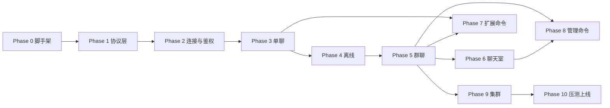

# IM 服务端实施路线图

本文档定义从 **零代码** 到 **可上线** 的分阶段实施计划。AI 或协作者按阶段推进；每阶段有明确依赖、产出与验收标准。

> **优先级**：`proto/` + [`protocol.md`](../design/protocol/protocol.md) > [`agent.md`](../../agent.md) > 本路线图。路线图与协议冲突时以协议为准并更新本文档。

> **进度追踪**：实时状态见 [`PROGRESS.md`](PROGRESS.md)。每完成一项任务必须更新该文件。

---

## 使用方式

1. 打开 [`PROGRESS.md`](PROGRESS.md)，找到第一个 `pending` 且依赖已满足的任务。
2. 阅读本路线图对应 Phase 的「参考文档」与「验收标准」。
3. 按 [`.agents/skills/im-implementation/SKILL.md`](../../.agents/skills/im-implementation/SKILL.md) 执行一轮开发。
4. 验收通过后，将任务标为 `done`，继续下一项。

**原则**：每轮只推进 **一个可独立验收** 的小任务；不要跨 Phase 大块实现。

**文档**：系统级变更（协议能力、分层、数据流、模块边界等）须同步更新 [`architecture-overview.md`](../design/architecture-overview.md)（见 [`agent.md`](../../agent.md)）。

**双通道原则**（已确认）：客户端业务能力须 **WebSocket + REST** 双入口，共用 `IM.Application.Dispatch` → `IM.Services.*`。见 [dual-channel-api.md](dual-channel-api.md)、`agent.md`。各 Phase 实现 WS Handler 时 **同任务** 交付对应 REST 路由与双通道测试（P2-10/11 起建立基础设施）。

**验收黄金路径**（P0-10 完成后，**Phase 2 起强制执行**）：`mise run im:test` → `docker build -f deploy/elixir/im/Dockerfile -t im:local .` → `kubectl apply -k deploy/elixir/im/k8s/overlays/local/` → 冒烟/协议测试。详见 [`release-deploy-test.md`](release-deploy-test.md)。**禁止**仅用 `mix phx.server` 标功能 `done`。

---

## 阶段总览

| Phase | 名称 | 依赖 | 核心产出 | 任务数 |
| --- | --- | --- | --- | --- |
| 0 | 工程脚手架 | — | `apps/elixir/im`、Release、K8s 本地栈 | 10 |
| 1 | 协议适配层 | 0 | `Codec` / `Router` / `Reply` / `Push` | 5 |
| 2 | WebSocket 与连接生命周期 | 1 | HTTP 登录、WS 鉴权、心跳、踢人/封禁 | 14 |
| 3 | 单聊消息主路径 | 2 | `CMD_MSG_SEND` 同步 ACK + 持久化 | 12 |
| 4 | 离线同步与收件箱 | 3 | `OFFLINE_PULL`、游标 | 5 |
| 5 | 群聊与扇出 | 4 | Tracker、树状扇出、大群写优化、移动推送分流 | 12 |
| 6 | 聊天室 PubSub | 5 | Room join、广播 | 6 |
| 7 | ACK 批量 / 已读 / 撤回 / 编辑 / 阅后即焚 / 透传 | 3+ | 200–599 扩展命令 | 8（1 deferred） |
| 8 | 群组 / 聊天室 / 好友管理 | 5–6 | CMD 600–822 | 8（1 deferred） |
| 9 | 集群、旁路与可观测性 | 5+ | libcluster、Kafka、Telemetry | 9 |
| 10 | 压测与上线准备 | 9 | loadtest、部署指南、回归 | 5 |
| 11 | 应用通道 | 2,6,9 | App Channel、Kafka `im.app_events` | 5 |
| 12 | Web 演示控制台 | 2–11（随 IM 增量） | `apps/web/im-console` 协议全覆盖 SPA | 16 |

### 里程碑（对外沟通用）

| 里程碑 | 完成 Phase | 可演示能力 |
| --- | --- | --- |
| **M0** 可部署 | P0 | Release 镜像 + K8s 全栈 rollout |
| **M1** 协议可用 | P1 | 任意 `Packet` 编解码与 Reply |
| **M2** 可登录建连 | P2 | HTTP 登录 → WS AUTH → 心跳；踢人/封禁 |
| **M3** 单聊可用 | P3–4 | 发消息双 ACK + 离线拉取 |
| **M4** 群与室 | P5–6 | 群消息扇出 + 聊天室广播 |
| **M5** 功能完整 | P7–8 | 撤回/编辑/阅后即焚/好友等管理命令 |
| **M6** 生产就绪 | P9–10 | 多节点 + 压测 + 上线 checklist |

---

## 实现范围与 defer 决策

> `proto/` 与 [`design-decisions.md`](../../design-decisions.md) 中 **已确认** 的模块，须在本节标明 **纳入路线图** 或 **`deferred`** 及原因，避免协议与实现长期不一致。变更 defer 状态须同步更新 [`PROGRESS.md`](PROGRESS.md)。

### 流式消息（[`stream-message.md`](../../design/stream-message.md)）

设计为 **透传模式** 与 **消息模式** 双路径；v1 分阶段交付：

| 范围 | 决策 | 任务 | 说明 |
| --- | --- | --- | --- |
| 透传模式：`CMD_PASSTHROUGH` + start/chunk/end 信令 | **纳入** | P7-07 | Phase 7，依赖 P7-05；覆盖 AI 对话等实时场景（设计推荐默认路径） |
| 消息模式：`MsgType.MSG_STREAM` 落库 + 离线拉取 + `StreamManager` | **`deferred`** | P7-08 | v1 不实现；原因：与 Phase 3/4 持久化强耦合、复杂度高，MVP 透传已覆盖主场景；**proto 保留不删** |

### 好友系统（[`friend.proto`](../../proto/friend.proto) / CMD 800–822）

| 范围 | 决策 | 任务 | 说明 |
| --- | --- | --- | --- |
| 关系状态机 + CMD 800–822（增删拉黑、列表、备注） | **纳入** | P8-05–P8-07 | Phase 8；`friend.proto` / design 已确认 |
| 拉黑后发消息拦截（[`friend.md`](../../design/friend.md) §7.2） | **纳入** | P8-08 | 接入 `CMD_MSG_SEND`；实现拉黑双向校验 |
| 租户级「须为好友才能单聊」 | **`deferred`** | P8-09 | v1 **默认关闭**（陌生人可单聊）；待租户配置 / Hook 能力（Phase 9+）再实现 |

**与 Phase 3 的关系**：单聊主路径（Phase 3）**不依赖**好友模块即可验收；拉黑拦截在 P8-08 完成后叠加，不回溯改写 Phase 3 DoD。

### 客户端登录与 token（[`auth.md`](../design/auth.md) §9）

| 范围 | 决策 | 任务 | 说明 |
| --- | --- | --- | --- |
| HTTP `POST /api/v1/sessions` 账密登录 + `access_token` | **纳入** | P2-12 | 密码仅 HTTPS；WS 只接受 HTTP 签发的 token |
| `access_tokens` 表 + `user_devices` 首批 migration | **纳入** | P2-12 | 与 [database-design.md](../design/database/database-design.md) 一致 |
| WS `CMD_AUTH_REQ` / `AuthResp`（含 `clear_local_data`） | **纳入** | P2-03 | 校验 token、设备封禁、pending 清数据标志 |
| 设备封禁、踢人、`clear_local_data`（在线 KICK + 离线 pending + ACK） | **纳入** | P2-13 | design auth §9.6、§9.8；`KickNotify` / `AuthResp` 字段 |
| Refresh token / 连接内续期 | **`deferred`** | — | v1 过期后重新 HTTP 登录；见 auth §9.5 |

---

## Phase 0：工程脚手架

**目标**：可编译、可测试、可构建 Release 的 Elixir 项目骨架，工具链与文档一致。

| 项 | 说明 |
| --- | --- |
| **依赖** | 无（仓库仅有 proto / docs） |
| **参考** | [monorepo-layout.md](../monorepo-layout.md)、[project-structure.md](project-structure.md)、[release-deploy-test.md](release-deploy-test.md)、[deploy/elixir/im/k8s/README.md](../../../deploy/elixir/im/k8s/README.md) |
| **产出** | `apps/elixir/im/`（mix 项目）、`mise.toml`、`deploy/elixir/im/`、`apps/elixir/im/lib/im/` 骨架 |

### 任务清单

| ID | 任务 | 验收 |
| --- | --- | --- |
| P0-01 | 在 `apps/elixir/im/` 执行 `mix new im --sup` | 该目录下 `mix compile` 通过 |
| P0-02 | 根目录 `mise.toml`（erlang 28、elixir 1.19.5-otp-28、protoc 29.3） | `mise run proto-check` 通过 |
| P0-03 | `deploy/elixir/im/Dockerfile` 多阶段 Release 构建 | `docker build -f deploy/elixir/im/Dockerfile -t im:local .` 成功（依赖 P0-01） |
| P0-04 | 在 `apps/elixir/im` 引入 `protobuf_elixir` 与 proto 编译任务 | 能生成/加载 `Packet` 等 message |
| P0-05 | 按 [`project-structure.md`](project-structure.md) 在 `apps/elixir/im/lib/` 建骨架 | 含 `/health` 路由 |
| P0-06 | `apps/elixir/im` 配置 ExUnit、`mix test` 空套件绿 | CI 检测 `apps/elixir/im/mix.exs` |
| P0-07 | 更新根 `README.md`：mise、Release、K8s 验收路径 | 见 `release-deploy-test.md` |
| P0-08 | `deploy/elixir/im/k8s/base` 本地依赖栈（OrbStack） | `kubectl apply -k deploy/elixir/im/k8s/base` 后 redis/postgres Running |
| P0-09 | `deploy/elixir/im/k8s/im` + `overlays/local` IM Release 清单 | `kubectl apply -k deploy/elixir/im/k8s/overlays/local/` 可创建 im Deployment |
| P0-10 | `deploy/elixir/im/scripts/release-deploy-local.sh` + `release-deploy-test.md` | 脚本可 build + deploy + rollout |

### Phase 0 完成定义

- [ ] `cd apps/elixir/im && mix compile && mix test` 绿
- [ ] `protoc -I proto --descriptor_set_out=/dev/null proto/*.proto` 绿
- [ ] `./deploy/elixir/im/scripts/release-deploy-local.sh` 全链路通过
- [ ] `PROGRESS.md` 中 P0 全部 `done`

---

## Phase 1：协议适配层

**目标**：`Packet` 二进制编解码、按 `cmd` 路由、统一成功/失败/推送构造。

| 项 | 说明 |
| --- | --- |
| **依赖** | Phase 0 |
| **参考** | [protocol.md](../design/protocol/protocol.md) §3–4；[design/packet.md](../design/packet.md)；[project-structure.md](project-structure.md) `protocol/` |
| **产出** | `IM.Protocol.Codec` / `Router` / `Reply` / `Push` |

### 任务清单

| ID | 任务 | 验收 |
| --- | --- | --- |
| P1-01 | `Codec`：`Packet` 编解码，含 `ver` 校验 | 单元测试：合法包 round-trip；错误 `ver` 可识别 |
| P1-02 | `Reply`：成功响应（回传 `seq`）、`CMD_ERROR` + `ErrorBody` | 测试覆盖 `ref_cmd` / `ref_cid` |
| P1-03 | `Push`：`CMD_MSG_PUSH` / `CMD_MSG_PUSH_BATCH`，`seq=0` | 测试断言推送包信封字段 |
| P1-04 | `IM.Protocol.Router`：按 `CmdType` 分发到 `Commands.*`（协议层，无业务） | 未注册 cmd 返回合理错误；见 [modular-architecture.md](../../design/modular-architecture.md) §1.3 |
| P1-05 | 错误码与 `proto/common.proto` 枚举一致；`AuthResp` / `KickNotify` 新字段与 `auth.proto` 对齐 | 文档/注释与 proto 一致 |

### Phase 1 完成定义

- [ ] 不依赖 WebSocket 即可对任意 `Packet` 做编解码与 Reply 构造
- [ ] 协议层测试覆盖主路径
- [ ] （P0-10 后）变更合入前 `mix test` 绿；涉及运行时行为时在 Release+K8s 复测

---

## Phase 2：WebSocket 接入与连接生命周期

**目标**：HTTP 登录 → 二进制 WebSocket → 连接状态机 → 鉴权 → 心跳 → 踢人/封禁/清本地数据。

| 项 | 说明 |
| --- | --- |
| **依赖** | Phase 1 |
| **参考** | [protocol.md](../design/protocol/protocol.md) §5–6；[auth.md](auth.md)、[auth-module.md](auth-module.md)、[heartbeat.md](heartbeat.md)、[dual-channel-api.md](dual-channel-api.md)；[design/auth.md](../design/auth.md) §9 |
| **产出** | `UserSocket`、`Handler`、Session/Auth/Kick/DeviceBan、`Dispatch`、REST `:api` |

### 建议实施顺序

部分任务可并行，但 **依赖** 须满足。推荐：

| 顺序 | 任务 | 说明 |
| --- | --- | --- |
| 1 | P2-10、P2-11 | Dispatch + REST 管道（后续登录/业务均经此路径） |
| 2 | P2-01、P2-02 | WebSocket + 状态机 |
| 3 | P2-12 | Ecto + `access_tokens` / `user_devices` migration + HTTP 登录 |
| 4 | P2-03、P2-04 | WS 鉴权（校验 P2-12 签发的 token） |
| 5 | P2-05、P2-06、P2-13 | 心跳、KICK、封禁/踢人/清数据 |
| 6 | P2-07、P2-07b | Registry、设备数限制 |
| 7 | P2-08、P2-09 | Telemetry、结构化日志 |

### 任务清单

| ID | 任务 | 验收 |
| --- | --- | --- |
| P2-01 | WebSocket Endpoint，仅处理 **二进制帧** | 集成测试：建连收发包 |
| P2-02 | 连接状态机：`未鉴权` → `已鉴权`；**已鉴权禁止再 AUTH**；非法 cmd 断开 | 见 [auth.md](auth.md) §7；含重复 AUTH、未鉴权业务包 |
| P2-03 | `CMD_AUTH_REQ` / `CMD_AUTH_RESP`；`AuthResp.clear_local_data`；失败 `CMD_ERROR` 后关连接 | 符合 `auth.proto`、protocol §5、[design/auth.md](../design/auth.md) §9.3 |
| P2-04 | Token 校验（`IM.Services.Auth` + Behaviour，可 Mock） | 校验 `access_tokens` hash、`revoked_at`、`expires_at`、设备封禁 |
| P2-05 | `CMD_HEARTBEAT_REQ` / `CMD_HEARTBEAT_RESP`；业务包重置空闲计时 | protocol §6；见 [heartbeat.md](heartbeat.md) |
| P2-06 | `CMD_KICK` 下发与连接关闭；`KickNotify.clear_local_data` | 测试 payload 含 `reason` / `kicker` / `clear_local_data` |
| P2-07 | 本节点 `Registry` 注册连接（为后续 Tracker 做准备） | 可按 `user_id` 查本节点 pid |
| P2-07b | 按平台在线设备数限制 | `app_configs` + `DeviceLimit`；1004 / `device_limit`；见 [auth.md](auth.md) §8 |
| P2-08 | WebSocket 上下行 **计数 + 包大小 histogram** + Handler **耗时**；标签含 `host`、`msg_type`、`direction`（见 [observability.md](observability.md)） |
| P2-09 | 生产 `level: :warning`；`IM.Log` + 白名单 + 采样；**单行 JSON 统一格式**（§2.6.0） | 见 [observability.md](observability.md) §2.6；成功路径零日志 |
| P2-10 | `IM.Application.Dispatch` 统一 cmd → `IM.Services.*` | WS `Commands.*` / REST Controller 仅适配；见 [dual-channel-api.md](dual-channel-api.md) §4.1 |
| P2-11 | REST 基础设施：`:api` pipeline、Bearer、`FallbackController` | 健康检查外首个 REST 经 Dispatch；Bearer 与 WS token 同源 |
| P2-12 | HTTP 登录：`POST /api/v1/sessions`、`DELETE .../sessions/current`；Ecto + `access_tokens` / `user_devices` migration | 返回 `access_token`、`expires_at`、`connection`、`config`；见 [design/auth.md](../design/auth.md) §9.2、[auth-module.md](auth-module.md) |
| P2-13 | 设备封禁 / 踢人 / **清除本地数据** | `DeviceBan` + `Kick`；在线 `CMD_KICK`；离线 `clear_local_data_pending`；`POST .../local-data-cleared` ACK；见 §9.6/§9.8 |

### Phase 2 完成定义

- [ ] **黄金路径**：`POST /api/v1/sessions` → 建 WS → `AUTH` → `HEARTBEAT` → 保持连接
- [ ] 鉴权失败必关连接；未鉴权发业务包可断开
- [ ] 踢人带 `clear_local_data` 时：在线 KICK 下发；离线后登录/`AuthResp` 仍返回 pending；ACK 后清除
- [ ] 封禁设备：HTTP `403`、在线 `device_banned` KICK、token 吊销
- [ ] **Dispatch 已接入** WS 鉴权/心跳路径；REST 管道可鉴权并调用 Dispatch
- [ ] **Release + K8s**：`./deploy/elixir/im/scripts/release-deploy-local.sh` 后登录 + WebSocket AUTH 集成测试通过

---

## Phase 3：单聊消息主路径

**目标**：`CMD_MSG_SEND` 同步路径、双阶段 ACK、单聊持久化与推送。

| 项 | 说明 |
| --- | --- |
| **依赖** | Phase 2 |
| **参考** | [protocol.md](../design/protocol/protocol.md) §7–9；[message-send-ack.md](message-send-ack.md)、[modular-architecture.md](modular-architecture.md)、[dual-channel-api.md](dual-channel-api.md)；[design/message-send-ack.md](../design/message-send-ack.md)、[design/message-model.md](../design/message-model.md)、[msg-id-snowflake.md](../design/msg-id-snowflake.md) |
| **产出** | `Message` Service、MessageStore、Send/Ack Handler |

### 任务清单

| ID | 任务 | 验收 |
| --- | --- | --- |
| P3-01 | `MsgSendReq` 校验：`conv_id`、`chat_type=CHAT_PRIVATE` | 非法包 `CODE_MSG_INVALID` |
| P3-02 | 发送幂等：`(app_key, from, client_msg_id)` | 重复发送返回同一 `msg_id`，不重复落库 |
| P3-03 | `Packet.cid` 网关层去重（与消息幂等分层） | 文档与测试体现双层幂等 |
| P3-04 | 落库 `ChatMessage`（存业务体，不存 Packet） | Ecto migration + Store Behaviour |
| P3-05 | 同步 `ACK_DOWN(SERVER_RECEIVED)` 后 `CMD_MSG_PUSH` 接收方 | 时序符合 protocol |
| P3-06 | 发送方**其他设备**收 PUSH，发送设备不收 | 多端场景测试 |
| P3-07 | `CMD_MSG_ACK_UP` → `ACK_DOWN(CLIENT_RECEIVED)` 至发送方 | 双阶段 ACK 完整 |
| P3-08 | Pre-Hooks 接口（同步），默认 no-op | 不阻塞 SEND 主路径 |
| P3-09 | `conv_seq` 服务端分配；与 `priority` 分离；出站 WFQ + 老化防饿死 | 字段语义与 protocol 一致；见 [message-send-ack.md](message-send-ack.md) §7 |
| P3-10 | ACK 阶段延迟：`send_to_server_ack`、`send_to_push` histogram（标签 `host`、`msg_type`） | 见 [observability.md](observability.md) |
| P3-11 | REST `POST /api/v1/messages` 与 WS `CMD_MSG_SEND` 同 Service 路径 | 经 `Dispatch`；请求/响应字段与 proto 对齐；双通道集成测试 |
| P3-12 | `IM.Services.MsgId` Snowflake + PG 兜底 + worker 租约 | 见 [msg-id-snowflake.md](../design/msg-id-snowflake.md)；`next/1` 可测；Oban 对账骨架 |

### Phase 3 完成定义

- [ ] 两用户单聊：发消息 → SERVER_RECEIVED → PUSH → CLIENT_RECEIVED 全链路通
- [ ] `CMD_MSG_SEND` 路径无 async 挂起等待
- [ ] REST 与 WS 发消息行为一致（同一 `IM.Services.Message`）

---

## Phase 4：离线同步与收件箱

**目标**：`CMD_OFFLINE_PULL`、游标、`inbox_seq`、重连后拉取。

| 项 | 说明 |
| --- | --- |
| **依赖** | Phase 3 |
| **参考** | [protocol.md](../design/protocol/protocol.md) §10；`sync.proto`；[offline-pull.md](offline-pull.md)、[database.md](database.md) |
| **产出** | `IM.Services.Offline`、拉取 Handler |

### 任务清单

| ID | 任务 | 验收 |
| --- | --- | --- |
| P4-01 | `CMD_OFFLINE_PULL_REQ` / `RESP`；`has_more` 分页 | 默认 limit 50，硬上限 200 |
| P4-02 | 全量收件箱：`inbox_seq` 游标增量 | 离线消息可拉全 |
| P4-03 | 按 `conv_id` 会话内 `conv_seq` 拉取 | 与 protocol 游标语义一致 |
| P4-04 | AUTH 成功后客户端拉取流程（状态机衔接） | 重连：AUTH → OFFLINE_PULL → 实时 PUSH |
| P4-05 | 写扩散：消息按 `(app_key, user_id)` 分片键设计 | Schema/Store 体现分片键 |

### Phase 4 完成定义

- [ ] 离线用户上线后可拉取历史单聊消息
- [ ] 游标单调、不丢不重（至少一次 + 客户端去重）

---

## Phase 5：群聊与扇出

**目标**：群消息、小群直推、大群树状扇出 + 批次并行。

| 项 | 说明 |
| --- | --- |
| **依赖** | Phase 4 |
| **参考** | [group.md](group.md)、[modular-architecture.md](modular-architecture.md)；[protocol.md](../design/protocol/protocol.md) §7、`target_users`；[design/group.md](../design/group.md) |
| **产出** | `Group` Service、`UserTracker`、`Fanout*` 模块 |

### 任务清单

| ID | 任务 | 验收 |
| --- | --- | --- |
| P5-01 | `CHAT_GROUP` 发消息与 `conv_id=g:{group_id}` | 群成员收 PUSH |
| P5-02 | 单聊/群聊：`message_bodies` + `user_inbox` 写扩散 | 离线统一 `JOIN` 拉取；见 [database-design.md](../design/database/database-design.md) §3 |
| P5-03 | `Phoenix.Tracker` 跨节点定位连接 | 两节点部署可互推 |
| P5-04 | 推送前预编码 `Packet`（§17） | 同一条消息只编码一次/批次 |
| P5-05 | 小群（<500）：Tracker 直推 | 集成测试 |
| P5-06 | 大群：树状扇出 + `FanoutBatcher` 批次并行 | 见 [`modular-architecture.md`](modular-architecture.md)、[`design/group.md`](../design/group.md) |
| P5-07 | `target_users` 定向群消息；含发送方其他设备 | 非目标成员不收 PUSH |
| P5-08 | `CMD_MSG_PUSH_BATCH` 批量下行 ≤50 | `push_batch_max` 可配置 |
| P5-09 | `IM.Delivery.Router`：在线走 WS、离线 enqueue 移动推送 | 设备离线且有 `push_token` 时进入推送队列；Kafka 写入见 P9-03c；见 [mobile-push.md](mobile-push.md) |
| P5-10 | 群 `user_inbox`：`insert_all` 分批 + Redis 发号 | 见 [group.md](../design/group.md) §6.1 |
| P5-11 | ACK 与写扩散解耦：`GroupInboxFanout` Oban Job + `conv_seq` 离线补拉 | 见 [group.md](../design/group.md) §6.2 |
| P5-12 | 大群读扩散：`read_fanout` + `group_read_cursors` + `OFFLINE_PULL` conv_seq 路径 | 见 [group.md](../design/group.md) §6.3、§6.3.1；`IM.Group.FanoutPolicy` + threshold 默认 500 |

### Phase 5 完成定义

- [ ] 500+ 人群消息走树状扇出，无单节点 O(N) 推送
- [ ] 定向群消息行为符合 protocol
- [ ] 5000 人群：`read_fanout` 仅写 `message_bodies`；小群 `insert_all` 分批写扩散（P5-10/12）
- [ ] 压测发消息 P99 目标见 P10-02（<200ms）

---

## Phase 6：聊天室（PubSub 广播）

**目标**：聊天室加入/离开、PubSub 实时广播、仅 SERVER_RECEIVED 必达。

| 项 | 说明 |
| --- | --- |
| **依赖** | Phase 5（Tracker/PubSub 基础设施） |
| **参考** | [room.md](room.md)；[design/room.md](../design/room.md)；[protocol.md](../design/protocol/protocol.md) 聊天室 ACK 差异 |
| **产出** | Room join 逻辑、PubSub topic、`CHAT_ROOM` 发送路径 |

### 任务清单

| ID | 任务 | 验收 |
| --- | --- | --- |
| P6-01 | `CMD_ROOM_JOIN_REQ` 后 Socket subscribe `room:{app_key}:{room_id}` | 加入后可收广播 |
| P6-02 | 聊天室消息：Message 节点一次 PubSub broadcast | 多 Access 节点均收到 |
| P6-03 | 排除发送设备；含发送方其他设备 | 与单聊/群规则一致 |
| P6-04 | 聊天室默认不落离线收件箱（或仅短时 TTL 缓存） | 不进 OFFLINE_PULL 主路径 |
| P6-05 | 聊天室仅 `SERVER_RECEIVED` ACK 必达 | 无 CLIENT_RECEIVED 强制要求 |
| P6-06 | `target_users` 定向聊天室消息 | 仅目标用户收 PUSH |

### Phase 6 完成定义

- [ ] 聊天室万人广播走 PubSub，非逐用户 Tracker 查询
- [ ] 离线拉取不包含聊天室历史（除非后续协议变更）

---

## Phase 7：ACK 批量、已读、撤回、编辑、阅后即焚、透传

**目标**：补齐消息类扩展命令。

| 项 | 说明 |
| --- | --- |
| **依赖** | Phase 3–6 至少单聊+群可用 |
| **参考** | [protocol.md](../design/protocol/protocol.md) 相关节；[project-structure.md](project-structure.md) `websocket/commands/`；`message.proto` |
| **产出** | 各 cmd 对应 Handler |

### 任务清单

| ID | 任务 | 验收 |
| --- | --- | --- |
| P7-01 | `CMD_MSG_ACK_BATCH_UP` / `CMD_MSG_ACK_BATCH_DOWN` | 批量 ACK 测试 |
| P7-02 | `CMD_MSG_READ` 已读回执与多设备同步 | `design/multi-device.md` |
| P7-03 | `CMD_MSG_RECALL_REQ` / `PUSH`；`recall_window_sec` | 超窗拒绝 |
| P7-04 | `CMD_MSG_EDIT_REQ` / `PUSH`；`edit_window_sec` | `edit_version` 递增 |
| P7-09 | 阅后即焚：`burn_after_read` + `CMD_MSG_BURN_PUSH`；`BurnScheduler` + Oban | 见 [burn-after-read.md](../design/burn-after-read.md)；依赖 P7-02 |
| P7-05 | `CMD_PASSTHROUGH`；`persist=true` 时存 `Passthrough` | 登录后 PUSH，不走 OFFLINE_PULL |
| P7-06 | Handler 骨架与 [`project-structure.md`](project-structure.md) 一致 | 一 cmd 一模块于 `lib/im/websocket/commands/` |
| P7-07 | 流式消息 **透传模式**（`CMD_PASSTHROUGH` + start/chunk/end） | 见 [stream-message.md](stream-message.md)；不含 `MSG_STREAM` 落库 |
| P7-08 | ~~流式消息 **消息模式**（`MSG_STREAM` 持久化 + 离线）~~ | **`deferred`**：见上文「实现范围与 defer 决策」 |

### Phase 7 完成定义

- [ ] protocol 中 200–599 区间命令均有实现或 **`deferred` 并注明原因**
- [ ] 流式透传模式（P7-07）可验收；消息模式（P7-08）明确 defer，proto 不变

---

## Phase 8：群组、聊天室与好友管理

**目标**：`CMD_GROUP_*` / `CMD_ROOM_*` / `CMD_FRIEND_*` 管理命令。

| 项 | 说明 |
| --- | --- |
| **依赖** | Phase 5–6（好友仅依赖 Phase 2+，可与群/室管理并行） |
| **参考** | `group.proto`、`room.proto`、`friend.proto`；[protocol.md](../design/protocol/protocol.md) §12+、§25 |
| **产出** | `IM.Services.Group`、`IM.Services.Room`、`IM.Services.Friend` |

### 任务清单

| ID | 任务 | 验收 |
| --- | --- | --- |
| P8-01 | 群：创建/解散/加入/退群/踢人/邀请 | REQ+RESP/PUSH 成对 |
| P8-02 | 群：管理员、转让、更新群信息 | 权限校验 |
| P8-03 | 聊天室：创建/解散/加入/离开/踢人/更新 | 与 PubSub 生命周期联动 |
| P8-04 | 成员变更推送至在线成员 | PUSH 通知 |
| P8-05 | 好友：添加/接受/拒绝 + PUSH | CMD 800–808；含 `FriendRequestNotify` |
| P8-06 | 好友：删除/拉黑/取消拉黑 + PUSH | CMD 809–816 |
| P8-07 | 好友：备注/列表/请求列表 | CMD 817–822 |
| P8-08 | 拉黑后发消息拦截 | `CMD_MSG_SEND` 校验 `FriendStore` 拉黑状态；见 `friend.md` §7.2 |
| P8-09 | ~~租户级「须为好友才能单聊」~~ | **`deferred`**：见上文「实现范围与 defer 决策」 |

### Phase 8 完成定义

- [ ] 600–822 命令字均有实现或 **`deferred` 并注明原因**（P8-09 除外，属产品策略）
- [ ] P8-08 拉黑拦截有集成测试

---

## Phase 9：集群、旁路与可观测性

**目标**：多节点生产部署能力；Kafka 旁路不阻塞主路径。

| 项 | 说明 |
| --- | --- |
| **依赖** | Phase 5+ |
| **参考** | [`observability.md`](observability.md)、[`kafka-event-bus.md`](kafka-event-bus.md)、[`dependency-abstraction.md`](dependency-abstraction.md)；[`design/observability.md`](../design/observability.md)；`agent.md` 规模前提 |
| **产出** | libcluster、Redis Cluster 客户端、Kafka Broadway、Telemetry |

### 任务清单

| ID | 任务 | 验收 |
| --- | --- | --- |
| P9-01 | `libcluster` 节点发现与组网 | 本地多节点可互连 |
| P9-01b | `deploy/elixir/im/k8s/im/` 多副本 Deployment（OrbStack） | `kubectl scale` 后跨 Pod 推送联调通过 |
| P9-02 | Redis：序列号、`conv_seq`/`inbox_seq`、限流 | 热路径无单点 PG 锁 |
| P9-03 | Kafka 核心三 Topic 旁路：`im.upstream` / `im.session` / `im.downstream` | 五 Topic 见 [kafka-event-bus.md](../design/kafka-event-bus.md)；`im.push`→P9-03c、`im.app_events`→P11-04；异步不阻塞 SEND |
| P9-03b | 大群/聊天室下行 aggregated 减量 + 心跳采样 | 5000 人群仅 1 条 downstream；Kafka 宕机 IM 正常 |
| P9-03c | 离线设备写 `im.push`（`PushNotificationBatchEvent`） | 见 [mobile-push.md](mobile-push.md)；按 `msg_id` 聚合 `targets`，超 500 分块 |
| P9-04 | Hook 同步执行；失败策略可配置 | 见 [`design/modular-architecture.md`](../design/modular-architecture.md) §9 |
| P9-05 | Telemetry metrics + Prometheus `/metrics` + 结构化 JSON 日志（`trace_id`） | 见 [observability.md](observability.md)；指标 + `event` 日志可关联排障 |
| P9-06 | `route_key` 一致性哈希至 Message 节点 | Message 无本地连接状态 |

### Phase 9 完成定义

- [ ] 2+ Access + 2+ Message 节点联调通过
- [ ] 百万在线架构要点在代码与配置中可体现（非单机玩具）

---

## Phase 10：压测与上线准备

**目标**：验证规模前提，补齐运维文档。

| 项 | 说明 |
| --- | --- |
| **依赖** | Phase 9 |
| **参考** | [monorepo-layout.md](../monorepo-layout.md)（`apps/elixir/loadtest`）、[test-client.md](test-client.md)、`agent.md` 规模自检 |
| **产出** | `apps/elixir/loadtest/`、`deploy/elixir/loadtest/`、压测报告、部署指南 |

### 任务清单

| ID | 任务 | 验收 |
| --- | --- | --- |
| P10-01 | 在 `apps/elixir/loadtest/` 实现连接压测（单节点 3–5 万连接目标） | 有报告与瓶颈说明 |
| P10-02 | 消息 QPS / 扇出压测（调用集群内 `svc/im`） | 大群 <200ms 目标 |
| P10-03 | `docs/implementation/` 部署指南 | Release + OrbStack/K8s 示例（见 `deploy/elixir/im/k8s/`） |
| P10-04 | 故障演练：节点宕机、Redis 超时 | 文档化预期行为 |
| P10-05 | 全量回归：protocol 主路径 checklist | 全部勾选 |

### Phase 10 完成定义

- [ ] 具备可重复的压测与上线 checklist
- [ ] `PROGRESS.md` 全部任务 `done` 或明确 `deferred` 并注明原因

---

## Phase 11：应用通道（App Channel）

**目标**：业务事件发布/订阅；后端广播 + 客户端上报 Kafka；尽力而为、无离线。

| 项 | 说明 |
| --- | --- |
| **依赖** | Phase 2（鉴权）、Phase 6（PubSub）、Phase 9（Kafka） |
| **参考** | [app-channel.md](../../design/app-channel.md)、[kafka-event-bus.md](../../design/kafka-event-bus.md) §2.12 |
| **产出** | `CMD_CHANNEL_*`、`im.app_events`、`/internal/v1/channels/*/publish` |

### 任务清单

| ID | 任务 | 验收 |
| --- | --- | --- |
| P11-01 | `proto/channel.proto` + `common.proto` cmd 900–906、ErrorCode 6001–6003 | `proto-check` 绿；与 protocol §27 一致 |
| P11-02 | `IM.Services.Channel`：订阅/取消、ACL、连接 1/s 限速 | 单元测试：超限速静默丢 |
| P11-03 | `ChannelRouter` PubSub 下行 + `POST /internal/v1/channels/{id}/publish` | 多客户端在线收 `CMD_CHANNEL_PUSH` |
| P11-04 | 上行 `CMD_CHANNEL_PUBLISH` + `AppEvent` → `im.app_events` | Kafka 消费端收到 UP/DOWN |
| P11-05 | 10 万订阅压测报告 | P99、丢包率、Kafka 吞吐 |

### Phase 11 完成定义

- [ ] 后端 internal publish → 在线订阅者收 PUSH
- [ ] 客户端 publish ≤1/s → `im.app_events` 有记录
- [ ] 无离线补发、无 `ChatMessage` 污染
- [ ] `PROGRESS.md` P11 全部 `done`

### 实现范围（roadmap 决策）

| 范围 | 决策 | 任务 |
| --- | --- | --- |
| App Channel 全功能 | **纳入** | P11-01–P11-05 |
| 客户端互广播 | **禁止** | 仅后端下行 |
| 离线补发 | **禁止** | 产品约束 |

---

## Phase 12：Web 演示控制台（独立前端）

**目标**：浏览器 SPA，供研发 **全协议能力** 联调与演示；**非**生产 SDK、**不打进** IM Release。

| 项 | 说明 |
| --- | --- |
| **依赖** | 随 IM Phase 2→11 增量；**完成定义**见 [web-console.md](../../design/web-console.md) §3（协议能力矩阵全覆盖） |
| **参考** | [web-console.md](../../design/web-console.md)、[implementation/web/web-console.md](../web/web-console.md) |
| **产出** | `apps/web/im-console/`（TypeScript + Vite + React）、可选 `deploy/web/im-console/` |

### 任务清单

| ID | 任务 | 验收 |
| --- | --- | --- |
| P12-01 | 创建 `apps/web/im-console`（Vite + React + TS） | `npm ci && npm run build` 通过 |
| P12-02 | `proto/` → TypeScript + `Packet` Codec（全 `CmdType`） | 与 `im` codec 向量 round-trip 一致 |
| P12-03 | 登录页 + REST `POST /api/v1/sessions` | token、`websocket_urls`、`device_id` |
| P12-04 | WS 生命周期：`AUTH` / 心跳 / 重连 / `CMD_KICK` / `CMD_ERROR` | Debug 可见连接态与原始包 |
| P12-05 | 消息核心：SEND / PUSH / PUSH_BATCH / ACK / ACK_BATCH | 双 Profile 单聊；展示 `msg_id` / `conv_seq` |
| P12-06 | `mise run web:dev` + proxy；**Coverage** + Debug 页骨架 | Coverage 矩阵项可标记状态 |
| P12-07 | 全 `MsgType` 发送 UI + 双通道发消息（WS + REST） | TEXT…CUSTOM 均可发；REST 与 WS 结果一致 |
| P12-08 | OFFLINE_PULL / 重连 / 多端（IM P4） | 游标补拉、多 Tab 同步 |
| P12-09 | 已读 / 未读（IM P7） | `CMD_MSG_READ` + 未读角标 |
| P12-10 | 撤回 / 编辑 / 阅后即焚 / 透传（IM P7） | 对应 cmd + REST；`BURN_PUSH` 可见 |
| P12-11 | 群聊消息 + 全部 `CMD_GROUP_*`（IM P5–P8） | 群管理 UI + 室内 SEND |
| P12-12 | 聊天室 + 全部 `CMD_ROOM_*`（IM P6） | 室管理 + 广播消息 |
| P12-13 | 全部 `CMD_FRIEND_*`（IM P8） | 好友/请求/拉黑/备注 |
| P12-14 | 全部 `CMD_CHANNEL_*`（IM P11） | 订阅、publish、收 PUSH |
| P12-15 | 各域 REST 与 WS 并列入口（dual-channel） | dual-channel-api 能力表可逐项人工对照 |
| P12-16 | Coverage 全绿验收（仅「待 IM」例外） | 设计文档 §3.2 已实现项均为「可演示」 |

### Phase 12 完成定义

- [ ] **Coverage 页**与设计文档 §3.2 能力矩阵 1:1；IM 已上线能力均为「可演示」
- [ ] 与 `im_client` 职责边界清晰（见 DD-037）：Console 人工全协议走查，非压测/CI 主路径
- [ ] `PROGRESS.md` P12-01–P12-16 按 IM Phase 依赖逐项 `done`

---

## 人工确认门禁

以下事项 **必须** 由人确认后再实现或合并，AI 不得擅自拍板：

| 主题 | 说明 |
| --- | --- |
| **协议变更（任何语义修改）** | 含 `proto/`、`protocol.md`、已确认 `design/*.md` 中的 cmd/字段/时序/错误码；**须先人工确认**，再按 `agent.md`「修改协议工作流」改文档，**最后**改代码。禁止「先改代码再补协议」 |
| 数据库 Schema 大改 | 分片策略、索引、迁移不可逆操作 |
| 生产密钥与租户配置 | 不写入仓库 |
| 压测达标与否 | 需人审报告 |
| 第三方云服务选型 | SMS、对象存储等若引入 |
| 好友 / 流式消息 defer 范围 | 见上文「实现范围与 defer 决策」；扩大纳入或推迟须更新 roadmap + PROGRESS |

**开发通则**：未列入上表的功能实现，仍须 **严格按现有协议** 编码；发现协议缺口或矛盾时 **停止实现**，提请人工确认是否走协议变更流程。

---

## 相关文档

### 实施与进度

| 文档 | 用途 |
| --- | --- |
| [`PROGRESS.md`](PROGRESS.md) | 任务状态看板 |
| [`monorepo-layout.md`](../monorepo-layout.md) | 单仓 `apps/` + `deploy/` 布局 |
| [`agent.md`](../../agent.md) | AI 全局约束 |
| [`.agents/skills/im-implementation/SKILL.md`](../../.agents/skills/im-implementation/SKILL.md) | 每轮开发流程 |
| [`release-deploy-test.md`](release-deploy-test.md) | Release → K8s → Test 黄金路径 |
| [`deploy/elixir/im/k8s/README.md`](../../../deploy/elixir/im/k8s/README.md) | OrbStack + kubectl 操作 |

### Phase → 实现文档（按需深读）

| Phase | 核心实现文档 |
| --- | --- |
| 0 | [project-structure.md](project-structure.md)、[release-deploy-test.md](release-deploy-test.md) |
| 1 | [project-structure.md](project-structure.md) `protocol/` |
| 2 | [auth.md](auth.md)、[auth-module.md](auth-module.md)、[heartbeat.md](heartbeat.md)、[dual-channel-api.md](dual-channel-api.md)、[database.md](database.md) |
| 3 | [message-send-ack.md](message-send-ack.md)、[message-model.md](message-model.md)、[modular-architecture.md](modular-architecture.md) |
| 4 | [offline-pull.md](offline-pull.md)、[reconnect.md](reconnect.md) |
| 5 | [group.md](group.md)、[zero-copy-delivery.md](zero-copy-delivery.md)、[mobile-push.md](mobile-push.md) |
| 6 | [room.md](room.md) |
| 7 | [read-receipt.md](read-receipt.md)、[recall.md](recall.md)、[edit.md](edit.md)、[burn-after-read.md](burn-after-read.md)、[passthrough.md](passthrough.md)、[stream-message.md](stream-message.md) |
| 8 | [group.md](group.md)、[room.md](room.md)、[friend.md](friend.md) |
| 9 | [observability.md](observability.md)、[kafka-event-bus.md](kafka-event-bus.md)、[dependency-abstraction.md](dependency-abstraction.md) |
| 10 | [test-client.md](test-client.md)、[monorepo-layout.md](../monorepo-layout.md) `loadtest` |
| 11 | [app-channel.md](../../design/app-channel.md)、[kafka-event-bus.md](kafka-event-bus.md) §2.12 |
| 12 | [web-console.md](../web/web-console.md)、[web-console.md](../../design/web-console.md) |
